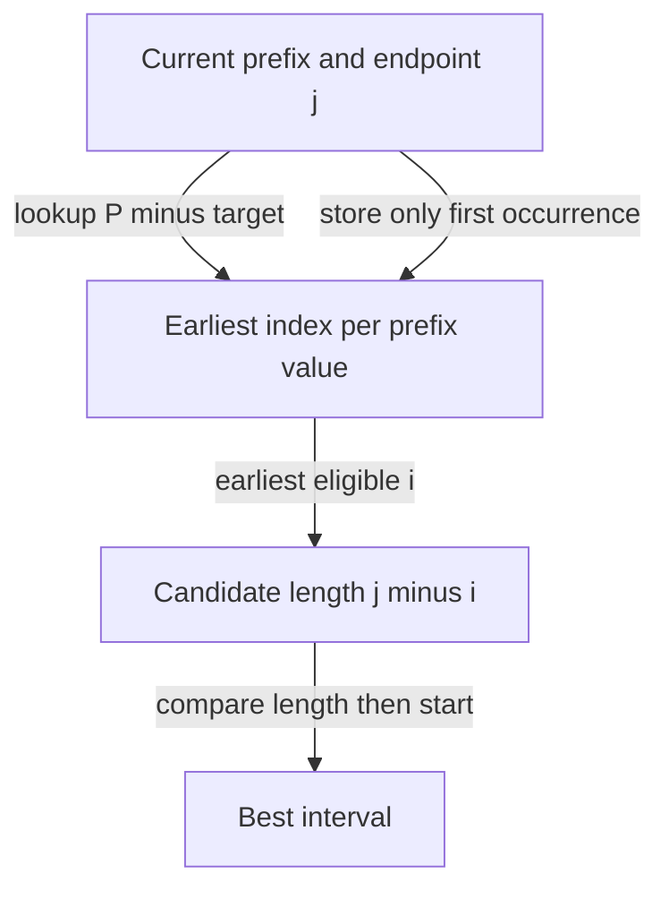

# Count target-sum subarrays: differences of prefixes

[Curriculum](../../../../README.md) · [Choose data structures and reason about algorithms](../../README.md) · [All coding problems](../../../../../indexes/coding.md)

Constructed practice problem; no company attribution. Prerequisites: [two sum](../01-two-sum/README.md) and [prefix sums](../../lessons/03-prefix.md).

## Candidate brief

> A ledger contains signed daily adjustments. Count every nonempty contiguous date range whose total equals a target. Refunds create negative values, and zero-value days still count. Can a window that is too large always be repaired by removing its leftmost entry?

| Contract | Decision |
|---|---|
| Input | List/tuple of integers and integer target; booleans excluded |
| Output | Integer count of nonempty index ranges with the target sum |
| Boundaries | Empty input gives 0; different ranges count separately; no mutation |
| Invalid input | Invalid container, element, or target raises `ValueError` |
| Excluded | Empty subarrays, noncontiguous selections, fixed-width overflow |

## The tool before the challenge

A prefix sum is the total of everything seen up to this point. Two prefix totals differ by the sum of the contiguous items *between* them:
```python
prefix_counts = {0: 1}  # empty prefix, before any item
prefix = 0
prefix += 1
print(prefix_counts.get(prefix - 1, 0))  # 1 starting position
```
For `[1,-1,1]`, target 1, the answer is 3 ranges, not 2. [See the three exact ranges](../../lessons/03-prefix.md).

### A design choice worth saying aloud

`prefix_counts` tracks how often each prefix total has appeared. `{0: 1}` counts the empty prefix so a range beginning at index 0 is not lost. Query `prefix - target` **before** incrementing the current prefix, or a zero target could accidentally count an empty range.

<!-- interview-rehearsal:start -->

## What the interviewer expects

The interviewer gives you the scenario and the contract above. Explain what a
successful call returns, walk through one example below, and name what your
state means *before* choosing a data structure.

**Done means:** Integer count of nonempty index ranges with the target sum.

Now predict each output before looking at the reference; invalid input should
leave any existing state unchanged unless the contract says otherwise.

### Test-case scenarios to settle before coding

| Case | Exact input or state | Expected result | What it is testing |
|---|---|---|---|
| Representative | `[1,-1,0]`, target `0` | `3` | Overlapping ranges count separately. |
| All zeros | `[0,0]`, target `0` | `3` | Repeated prefix sums contribute multiplicity. |
| Empty | `[]`, target `0` | `0` | The empty subarray is excluded. |
| Negative values | `[3,-2,-1]`, target `0` | `1` | Sliding-window monotonicity is unavailable. |
| No match | `[1,2]`, target `9` | `0` | The result is a count, never `None`. |
| Invalid/atomic | boolean element or target | `ValueError`; input unchanged | Exact integer validation matters. |

For each case, show which branch or state change produces that result.

<!-- interview-rehearsal:end -->

`subarray_sum_count([1, -1, 0], 0) == 3`: ranges `[0, 2)`, `[0, 3)`, `[2, 3)`.
`subarray_sum_count([0, 0], 0) == 3`; `subarray_sum_count([], 0) == 0`.
`subarray_sum_count([1.5], 1)` raises `ValueError`.

Before opening the explanation, restate the contract, trace the smallest useful
example, implement a baseline, and identify the repeated work. Then implement
your improvement independently and derive tests from the contract. Say what
your state means before saying which data structure stores it.

<details>
<summary>Worked lesson, changed requirements, and reference</summary>

### Turn a range question into a historical lookup

A correct baseline starts a running sum at each left endpoint and extends right,
counting matches. This costs O(n²) time and O(1) auxiliary space. A sliding window
is not generally valid: removing a negative value increases the sum, and adding
a negative can repair a sum that was too large. Instead define prefix `P[j]`
as the sum of the first `j` values, with `P[0] = 0`. Subtracting cancels the
shared prefix: the sum over `[i, j)` is `P[j] - P[i]`.

| Prefix position j | P[j] for `[1, -1, 0]` | Need earlier P[i] | Earlier frequency | Total count |
|---:|---:|---:|---:|---:|
| 0 | 0 | initialization only | seed `{0: 1}` | 0 |
| 1 | 1 | 1 | 0 | 0 |
| 2 | 0 | 0 | 1 | 1 |
| 3 | 0 | 0 | 2 | 3 |

Rearrange the desired equality to `P[i] = P[j] - target`. A frequency map,
not a set, records how many earlier endpoints qualify. Before processing prefix
`j`, the map counts exactly positions `0` through `j-1`, and the answer counts
all matches ending before `j`. Add the matching frequency, then insert the new
prefix. Inserting first would count an empty range whenever the target is zero.
The seeded zero represents a legitimate range beginning at input position zero;
it is not an arbitrary special case.

Each range has one unique right endpoint, so this procedure counts every valid
range exactly once. Expected time is O(n), auxiliary space O(n) for distinct
prefix sums, and output O(1) integers. Python integers avoid fixed-width overflow;
these bounds count arithmetic operations rather than bit-level cost on enormous
integers. The answer itself can be `n(n+1)/2`, as an all-zero input demonstrates.

### Follow-up 1: count only ranges of length at most two

Predict which prefix frequencies must expire. At endpoint `j`, allowable starts
are `max(0, j-2)` through `j-1`; a permanent map overcounts long ranges.

| j for `[0, 0, 0]` | Eligible prefix positions | New matches | Running total |
|---:|---|---:|---:|
| 1 | 0 | 1 | 1 |
| 2 | 0, 1 | 2 | 3 |
| 3 | 1, 2 | 2 | 5 |

Keep a queue of eligible prefix sums, decrementing frequencies as old positions
expire. Delete zero counts. This yields expected O(n) time and O(min(n, limit))
state. Expiring a value entirely when only one of several copies leaves is wrong.

### Follow-up 2: find a longest matching range



Now frequency is the wrong return information: only the earliest equal prefix
maximizes length for the current endpoint. A senior candidate derives the
equation and changes map values to match the requested output. A lead candidate
defines integer limits, retention, and whether late ledger corrections require
recomputing historical answers; this append-only method does not support edits.

### Run and check

From the repository root:

```bash
cd curriculum/01-code/02-data-structures-algorithms/problems/06-subarray-sum-count
python -m unittest -v test_solution.py
```

[Reference implementation](solution.py) · [Contract and oracle tests](test_solution.py).
Read the tests after your attempt. A green reference suite verifies the supplied
implementation; it does not demonstrate independent transfer. Reimplement one
follow-up with the reference closed and explain which old invariant no longer holds.

</details>

[Ordered foundation route](../foundations-index.md) · [Coding home](../../practice-sequence.md)
