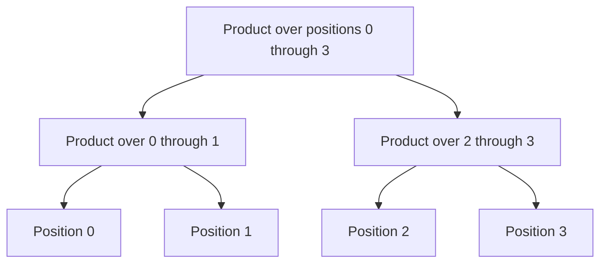

# Product except self: combine independent summaries

[Curriculum](../../../../README.md) · [Data structures and algorithms](../../README.md) · [All coding problems](../../../../../indexes/coding.md)

Constructed practice problem; no company attribution. Prerequisites: [prefix summaries](../06-subarray-sum-count/README.md).

## Candidate brief

> An analysis routine needs, at every position, the product of all other entries. Division is forbidden because zero is valid. Return a fresh list while using constant extra working storage beyond that output. What should one empty side contribute?

| Contract | Decision |
|---|---|
| Input | Integer list/tuple; booleans excluded; negatives and zeros allowed |
| Output | New list where output i is the product over every position except i |
| Boundaries | Empty gives `[]`; singleton gives `[1]`; input remains unchanged |
| Invalid input | Invalid container or element raises `ValueError` |
| Excluded | Division, floating-point stability, fixed-width integer arithmetic |

## The tool before the challenge

The answer at position `i` is everything *before* it multiplied by everything *after* it. Two independent passes avoid division, which breaks on zeros:
```python
nums = [2, 3, 4]
left_product = [1, 2, 6]  # product strictly before each position
right_product = [12, 4, 1]  # product strictly after each position
print([a*b for a,b in zip(left_product,right_product)])  # [12, 8, 6]
```
At index 1, neither side includes its own 3. Predict the result with one zero and with two zeros before reading the solution.

<!-- interview-rehearsal:start -->

## What the interviewer expects

The interviewer gives you the scenario and the contract above. Explain what a
successful call returns, walk one row from the table below, and name what your
state means *before* choosing a data structure.

**Done means:** New list where output i is the product over every position except i.

Now predict each output before looking at the reference; invalid input should
leave any existing state unchanged unless the contract says otherwise.

### Test-case scenarios to settle before coding

| Case | Exact input or state | Expected result | What it is testing |
|---|---|---|---|
| Representative | `[2,3,4]` | `[12,8,6]` | Each answer combines strict prefix and suffix. |
| Singleton | `[7]` | `[1]` | The product of no other values is the multiplicative identity. |
| One zero | `[0,3,4]` | `[12,0,0]` | Only the zero position sees the nonzero product. |
| Two zeros | `[0,0,4]` | `[0,0,0]` | Every exclusion still contains a zero. |
| Negative values | `[-1,2,-3]` | `[-6,3,-2]` | Signs follow ordinary integer multiplication. |
| Invalid/atomic | `[1,False]` | `ValueError`; input unchanged | No division or silent boolean coercion. |

For each row, show which branch or state change produces that result.

<!-- interview-rehearsal:end -->

`product_except_self([2, 3, 4]) == [12, 8, 6]`.
`product_except_self([0, 3, 4]) == [12, 0, 0]`; `[0, 0, 4]` gives `[0, 0, 0]`.
`product_except_self([7]) == [1]`; `product_except_self([False])` raises `ValueError`.

Before opening the explanation, restate the contract, trace the smallest useful
example, implement a baseline, and identify the repeated work. Then implement
your improvement independently and derive tests from the contract. Say what
your state means before saying which data structure stores it.

<details>
<summary>Worked lesson, changed requirements, and reference</summary>

### Split the excluded position out of the computation

The baseline multiplies every other element separately for each index: O(n²)
multiplications and O(1) working space beyond output. Computing one total and
dividing by the current element appears cheaper but violates the requirement
and fails at zero. Ask instead which two disjoint pieces remain when position
`i` is removed: everything strictly before it and everything strictly after it.
Their products can be computed independently and combined.

| i in `[2, 3, 4]` | Product strictly left | Product strictly right | Output |
|---:|---:|---:|---:|
| 0 | 1 | 12 | 12 |
| 1 | 2 | 4 | 8 |
| 2 | 6 | 1 | 6 |

The empty product is one because multiplying by one leaves the other side
unchanged. It also explains the singleton result without a special mathematical
exception. A first implementation can build separate prefix and suffix arrays,
giving O(n) time and O(n) auxiliary storage. To meet the memory goal, write
exclusive prefixes directly into the output, then walk backward with one suffix
accumulator and multiply each output entry by that suffix.

In the forward pass, before index `i`, `prefix` is the product of `nums[:i]`;
store it before multiplying by `nums[i]`. In the backward pass, before index
`i`, `suffix` is the product of `nums[i+1:]`; combine it before incorporating
`nums[i]`. These exclusive bounds prevent accidentally including the excluded
element. The result takes O(n) arithmetic operations, O(1) auxiliary integer
variables beyond the O(n) output. Python large integers occupy more than a
machine word, so the strict bit-space/time cost grows with product magnitude.

### Follow-up 1: work modulo a positive integer

Predict whether zero or a composite modulus breaks the two-pass method. Apply
`% modulus` after every multiplication; associativity still holds, and no
modular inverse is required.

| Input `[2, 3, 4]`, modulus 6 | Ordinary output | Modular output |
|---|---:|---:|
| exclude 2 | 12 | 0 |
| exclude 3 | 8 | 2 |
| exclude 4 | 6 | 0 |

Require a positive integer modulus and define modulus 1 as all zeros, including
the singleton empty product. An approach based on division or inverses would
fail for non-invertible entries even though the prefix/suffix method still works.

### Follow-up 2: updates and repeated exclusion queries

The precomputed output becomes stale after a point update. For an associative
operation, a segment tree stores interval products and updates only ancestors.



To exclude position 1, combine the query for `[0, 1)` with `[2, 4)`; the root
alone cannot answer it. Updates and one exclusion query cost O(log n), with
O(n) stored state. Returning every exclusion result still costs at least O(n).
A senior candidate distinguishes working space from output and derives both
exclusive invariants. A lead candidate chooses between batch recomputation and
an update-friendly structure using actual query/update ratios and numeric bounds.

### Run and check

From the repository root:

```bash
cd curriculum/01-code/02-data-structures-algorithms/problems/07-product-except-self
python -m unittest -v test_solution.py
```

[Reference implementation](solution.py) · [Contract and oracle tests](test_solution.py).
Read the tests after your attempt. A green reference suite verifies the supplied
implementation; it does not demonstrate independent transfer. Reimplement one
follow-up with the reference closed and explain which old invariant no longer holds.

</details>

[Ordered foundation route](../foundations-index.md) · [Coding home](../../practice-sequence.md)
