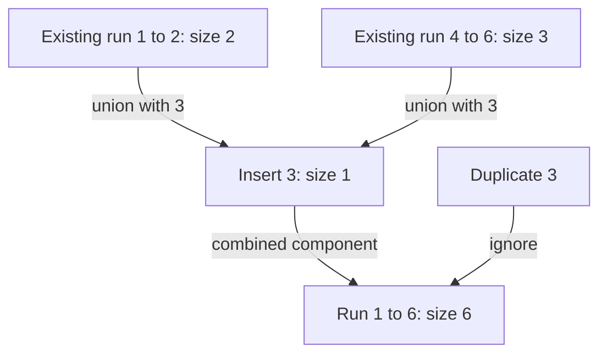

# Longest consecutive run: expand only from starts

[Curriculum](../../../../README.md) · [Data structures and algorithms](../../README.md) · [All coding problems](../../../../../indexes/coding.md)

Constructed practice problem; no company attribution. Prerequisites: [map/set membership](../01-two-sum/README.md).

## Candidate brief

> An importer receives integer record numbers in arbitrary order, with duplicates. Report the length of the longest gap-free run of distinct numbers. Adjacent input positions do not matter. Can you avoid sorting without repeatedly walking the same run?

| Contract | Decision |
|---|---|
| Input | Integer list/tuple; booleans excluded |
| Output | Length of longest set of values `a, a+1, ..., b` |
| Boundaries | Empty gives 0; duplicates do not extend runs; negative values allowed |
| Invalid input | Invalid container or element raises `ValueError` |
| Excluded | Returning all runs, requiring input adjacency, or mutating input |

## The tool before the challenge

A set answers membership questions but does not order numbers. Count a consecutive run only from a value whose predecessor is absent:
```python
values = {1, 2, 3, 8}
print(1 - 1 not in values)  # True: start a run
print(2 - 1 not in values)  # False: already inside one
```
For `[3,2,1,8,2]`, the longest run has length 3, despite unsorted input and duplicate 2. Define whether duplicates count as separate run positions.

### A design choice worth saying aloud

The `values` set gives membership without storing duplicates or ordering. Starting a run only when `value - 1` is absent prevents walking the same run from every member. A sort-based baseline is simpler but costs O(n log n); say which guarantee the set trades space for.

<!-- interview-rehearsal:start -->

## What the interviewer expects

The interviewer gives you the scenario and the contract above. Explain what a
successful call returns, walk one row from the table below, and name what your
state means *before* choosing a data structure.

**Done means:** Length of longest set of values `a, a+1, ..., b`.

Now predict each output before looking at the reference; invalid input should
leave any existing state unchanged unless the contract says otherwise.

### Test-case scenarios to settle before coding

| Case | Exact input or state | Expected result | What it is testing |
|---|---|---|---|
| Representative | `[100,4,200,1,3,2,2]` | `4` | Duplicates do not lengthen the run 1..4. |
| Empty | `[]` | `0` | No run exists. |
| Negative bridge | `[-1,1,0]` | `3` | The ordering crosses zero normally. |
| Duplicates only | `[5,5,5]` | `1` | Distinct values define run length. |
| Separated values | `[1,3,5]` | `1` | Input adjacency is irrelevant. |
| Invalid/atomic | noninteger or boolean element | `ValueError`; input unchanged | Validate before building the set. |

For each row, show which branch or state change produces that result.

<!-- interview-rehearsal:end -->

`longest_consecutive([100, 4, 200, 1, 3, 2, 2]) == 4`, for values 1 through 4.
`longest_consecutive([-1, 1, 0]) == 3`; `longest_consecutive([]) == 0`.
`longest_consecutive(["1"])` raises `ValueError`.

Before opening the explanation, restate the contract, trace the smallest useful
example, implement a baseline, and identify the repeated work. Then implement
your improvement independently and derive tests from the contract. Say what
your state means before saying which data structure stores it.

<details>
<summary>Worked lesson, changed requirements, and reference</summary>

### Account for which starts are redundant

Sort a copy, ignore duplicates, and count stretches with difference one. That
baseline is straightforward O(n log n) time and O(n) auxiliary space in Python.
A set supplies expected constant-time existence checks, but starting a forward
walk at every value is still quadratic for `[1, 2, ..., n]`. Changing the
container alone does not remove repeated work. Identify which values can be
genuine starts: precisely those whose predecessor is absent.

| Distinct value | Predecessor present? | Work allowed |
|---:|---|---|
| 1 | no | walk 1, 2, 3, 4 |
| 2 | yes, 1 | skip |
| 3 | yes, 2 | skip |
| 4 | yes, 3 | skip |
| 100 | no | walk 100 |
| 200 | no | walk 200 |

For each start, increment an endpoint while the next consecutive value exists.
Every finite maximal run has exactly one smallest element, whose predecessor
is missing, so every run is considered. During a walk, every value from start
up to but excluding the endpoint is present. The first absent endpoint proves
the run is maximal. Non-starts cannot produce a longer answer than their own
run's start, so skipping them preserves correctness.

The outer loop touches `u` distinct values. Across all inner loops, each distinct
value is walked once, plus one failed lookup per run. That aggregate argument,
not the number of nested loops, establishes expected O(n) time and O(u)
auxiliary space. Iterate over the set, not the original list: repeated copies of
the same start could otherwise retraverse a long run. Input order and set
iteration order do not affect the maximum length.

### Follow-up 1: return the run with the smallest start on ties

Predict the additional state: retain `(start, length)` rather than only length,
and compare length first, then start. Never rely on set iteration order.

| Completed run | Candidate | Comparison result |
|---|---|---|
| 8, 9 | `(8, 2)` | initial best |
| 1, 2 | `(1, 2)` | replace: same length, smaller start |
| 20 | `(20, 1)` | retain `(1, 2)` |

Returning just endpoints stays O(1) output. Materializing all values in the best
run adds O(length) output, though it does not change the O(n) total bound.

### Follow-up 2: answer after every insertion

Rebuilding the set and rescanning after every arrival costs quadratic total work.
Use disjoint-set union: each new distinct value starts as a singleton component,
then unions with existing immediate neighbors; component size is run length.



Path compression and union by size give near-constant amortized insertion, but
deleting an interior value can split a run and needs a different design. A senior
candidate proves the aggregate bound and tests duplicate starts. A lead candidate
specifies insertion/deletion semantics and whether integer adjacency is meaningful
across shards before adopting a dynamic connectivity representation.

### Run and check

From the repository root:

```bash
cd curriculum/01-code/02-data-structures-algorithms/problems/08-longest-consecutive
python -m unittest -v test_solution.py
```

[Reference implementation](solution.py) · [Contract and oracle tests](test_solution.py).
Read the tests after your attempt. A green reference suite verifies the supplied
implementation; it does not demonstrate independent transfer. Reimplement one
follow-up with the reference closed and explain which old invariant no longer holds.

</details>

[Ordered foundation route](../foundations-index.md) · [Coding home](../../practice-sequence.md)
