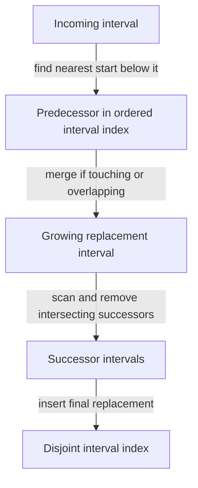

# Merge intervals: preserve the covered set

[Curriculum](../../../../README.md) · [Choose data structures and reason about algorithms](../../README.md) · [All coding problems](../../../../../indexes/coding.md)

Constructed practice problem; no company attribution. Prerequisites: [ordered data](../../lessons/04-order.md).

## Candidate brief

> A calendar service receives busy time intervals out of order. Return the same covered time as a sorted list of disjoint intervals, combining touching blocks as well as overlaps. Clarify whether endpoints are included before choosing your comparison.

| Contract | Decision |
|---|---|
| Input | List/tuple of pairs of integer endpoints; every pair has `start < end` |
| Output | New sorted list of `(start, end)` half-open intervals; touching intervals merge |
| Boundaries | Empty gives `[]`; duplicates/nesting allowed; input remains unchanged |
| Invalid input | Malformed pairs, bool/noninteger endpoints, or `start >= end` raise `ValueError` |
| Excluded | Time zones, recurring events, and preserving event identities |

## The tool before the challenge

An interval has two endpoints. This problem uses **half-open** intervals: `[1,3)` excludes 3 and `[3,4)` includes it. They do not overlap, but their union has no gap, so this contract explicitly merges touching ranges. Sorting by start gives one current merged boundary:
```python
intervals = [[3, 4], [1, 3]]
print(sorted(intervals))  # [[1, 3], [3, 4]]
```
Compare the next start with the current end; extending with `max` matters for a fully nested interval. A reservation system may choose to preserve separate touching meetings even though their covered time is contiguous.

### A design choice worth saying aloud

Make a sorted **copy** of the intervals if the caller retains ownership of its input; sorting the received list in place would be an observable side effect. The active merged interval stores the covered end, so use `max(current_end, next_end)` for nesting. State half-open endpoint semantics and the separate merge-touching policy before choosing the comparison.

<!-- interview-rehearsal:start -->

## What the interviewer expects

The interviewer gives you the scenario and the contract above. Explain what a
successful call returns, walk through one example below, and name what your
state means *before* choosing a data structure.

**Done means:** New sorted list of `(start, end)` half-open intervals; touching intervals merge.

Now predict each output before looking at the reference; invalid input should
leave any existing state unchanged unless the contract says otherwise.

### Test-case scenarios to settle before coding

| Case | Exact input or state | Expected result | What it is testing |
|---|---|---|---|
| Representative | `[(5,7),(1,3),(3,6)]` | `[(1,7)]` | Sorting exposes one unresolved covered range. |
| Empty | `[]` | `[]` | No placeholder interval is returned. |
| Disjoint | `[(1,2),(3,4)]` | both intervals in sorted order | A real gap stays visible. |
| Touching | `[(1,3),(3,5)]` | `[(1,5)]` | This contract merges half-open boundaries that touch. |
| Nested/duplicate | `[(1,10),(2,3),(1,10)]` | `[(1,10)]` | Contained coverage adds no new range. |
| Invalid/atomic | `[(3,3)]` or malformed pair | `ValueError`; input unchanged | Reject zero duration and bad structure. |

For each case, show which branch or state change produces that result.

<!-- interview-rehearsal:end -->

`merge_intervals([(5, 7), (1, 3), (3, 6)]) == [(1, 7)]`.
`merge_intervals([(1, 2), (3, 4)]) == [(1, 2), (3, 4)]`.
`merge_intervals([(2, 2)])` raises `ValueError`: zero-duration events are excluded.

Before opening the explanation, restate the contract, trace the smallest useful
example, implement a baseline, and identify the repeated work. Then implement
your improvement independently and derive tests from the contract. Say what
your state means before saying which data structure stores it.

<details>
<summary>Worked lesson, changed requirements, and reference</summary>

### Sort so only one unresolved boundary remains

A baseline repeatedly finds an overlapping or touching pair and replaces it
with its union until none remain. It is correct but awkward to order, and a
naive full rescan after each merge can take O(n³) time. Sorting by start gives
a simpler baseline improvement: all future starts are at least the current
start, so only the last output interval can still grow.

| Sorted input interval | Output before | Boundary test | Output after |
|---|---|---|---|
| `[1, 3)` | empty | first interval | `[1, 3)` |
| `[3, 6)` | `[1, 3)` | 3 ≤ 3: touching | `[1, 6)` |
| `[5, 7)` | `[1, 6)` | 5 ≤ 6: overlap | `[1, 7)` |

After a processed prefix, output is sorted, represents exactly its covered set,
and has strict gaps between intervals. If the next start is greater than the
last end, it cannot meet any earlier output interval either, so append. Otherwise
extend the last end to the maximum of both ends. The maximum matters for nesting:
merging `[1, 10)` with `[2, 3)` must not shrink covered time. Earlier output
intervals remain final because future starts cannot move backward across a gap.

Half-open means the start is included and end excluded. `[1, 3)` and `[3, 6)`
do not overlap, yet their union is exactly `[1, 6)` with no gap, so the explicit
touching policy permits merging. Sorting a copy plus scanning costs O(n log n)
time and O(n) auxiliary space in Python, with O(n) possible output. Claiming O(1)
space would ignore the sorted copy and sorting workspace. No event values are
mutated, and new tuples prevent output edits from changing input pairs.

### Follow-up 1: preserve separate touching reservations

Predict the one comparison that changes. Merge only when `start < previous_end`,
so an endpoint equality starts a new result. The covered set is unchanged but
the grouping policy now communicates reservation boundaries.

| Inputs | Original: merge touching | Changed: overlap only |
|---|---|---|
| `[1, 3)`, `[3, 6)` | `[1, 6)` | `[1, 3)`, `[3, 6)` |
| `[1, 4)`, `[3, 6)` | `[1, 6)` | `[1, 6)` |

If preserving every event identity matters, merged ranges alone are insufficient;
attach provenance or return a separate mapping. “Same covered time” is weaker
than “same booking information.”

### Follow-up 2: intervals arrive in arbitrary order forever



A balanced ordered index avoids sorting the entire collection on each arrival;
an insertion must still inspect every interval it absorbs. A senior candidate
states endpoint policy and proves why only the last sorted result is mutable.
A lead candidate defines concurrent update ownership, provenance, and whether
deleting one original booking must reconstruct previously merged coverage.

### Run and check

From the repository root:

```bash
cd curriculum/01-code/02-data-structures-algorithms/problems/09-merge-intervals
python -m unittest -v test_solution.py
```

[Reference implementation](solution.py) · [Contract and oracle tests](test_solution.py).
Read the tests after your attempt. A green reference suite verifies the supplied
implementation; it does not demonstrate independent transfer. Reimplement one
follow-up with the reference closed and explain which old invariant no longer holds.

</details>

[Ordered foundation route](../foundations-index.md) · [Coding home](../../practice-sequence.md)
