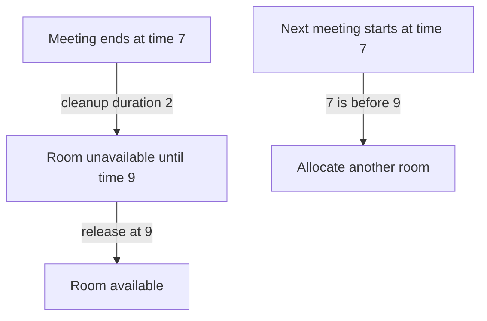

# Meeting room capacity: count simultaneous demand

[Curriculum](../../../../README.md) · [Data structures and algorithms](../../README.md) · [All coding problems](../../../../../indexes/coding.md)

Constructed practice problem; no company attribution. Prerequisites: [interval endpoints](../09-merge-intervals/README.md).

## Candidate brief

> An office scheduler needs the minimum number of interchangeable rooms for a batch of meetings. A room can be reused exactly when its previous meeting ends. Return capacity, not assignments. Why does merging busy intervals lose the quantity we need?

| Contract | Decision |
|---|---|
| Input | List/tuple of integer `(start, end)` pairs with `start < end` |
| Output | Nonnegative integer: maximum simultaneous half-open meetings |
| Boundaries | Empty gives 0; duplicate meetings count separately; touching meetings share a room |
| Invalid input | Invalid container/pair/type or nonpositive duration raises `ValueError` |
| Excluded | Room features, travel buffers, recurring meetings, or actual room IDs |

## The tool before the challenge

A meeting interval `[start,end)` occupies its start and frees the room at its end. So `[9,10)` and `[10,11)` need one room; sharing a boundary is not overlap.
```python
meetings = [(9,10), (10,11)]
print(meetings[0][1] <= meetings[1][0])  # True: reuse is legal
```
State the endpoint policy before sorting arrivals and departures. The *maximum simultaneous occupancy* sets the required room count.

### A design choice worth saying aloud

At equal timestamps, `end` frees a room before `start` occupies it. At time 10, release a `[9,10)` room **before** admitting `[10,11)`; reversing the tie order inflates capacity. State whether the output is the peak simultaneous occupancy or an actual assignment of room IDs; the latter needs more state.

<!-- interview-rehearsal:start -->

## What the interviewer expects

The interviewer gives you the scenario and the contract above. Explain what a
successful call returns, walk one row from the table below, and name what your
state means *before* choosing a data structure.

**Done means:** Nonnegative integer: maximum simultaneous half-open meetings.

Now predict each output before looking at the reference; invalid input should
leave any existing state unchanged unless the contract says otherwise.

### Test-case scenarios to settle before coding

| Case | Exact input or state | Expected result | What it is testing |
|---|---|---|---|
| Representative | `[(0,10),(5,7),(7,12)]` | `2` | End-before-start tie handling lets a room turn over at 7. |
| Empty | `[]` | `0` | No rooms are required. |
| Touching | `[(1,2),(2,3)]` | `1` | Half-open meetings share a room. |
| Duplicates | `[(1,4),(1,4)]` | `2` | Multiplicity matters even for identical intervals. |
| Nested | `[(0,10),(2,3),(4,5)]` | `2` | Peak concurrency is not number of meetings. |
| Invalid/atomic | `[(4,4)]` | `ValueError`; input unchanged | Zero-duration entries are outside the contract. |

For each row, show which branch or state change produces that result.

<!-- interview-rehearsal:end -->

`meeting_room_capacity([(0, 10), (5, 7), (7, 12)]) == 2`.
At time 7 one meeting ends and another starts, so demand stays 2.
`meeting_room_capacity([(1, 2), (2, 3)]) == 1`; `[(4, 4)]` raises `ValueError`.

Before opening the explanation, restate the contract, trace the smallest useful
example, implement a baseline, and identify the repeated work. Then implement
your improvement independently and derive tests from the contract. Say what
your state means before saying which data structure stores it.

<details>
<summary>Worked lesson, changed requirements, and reference</summary>

### Keep multiplicity instead of only union coverage

A baseline checks every meeting start and counts intervals containing that time:
`start <= time < end`. Demand can increase only at a start, so the maximum of
those counts is correct. That costs O(n²) time and constant extra state. Merging
intervals is not an improvement for this output: two identical meetings merge
to one block but still require two rooms. The representation must preserve how
many intervals are active.

Represent each meeting by two events, `(start, +1)` and `(end, -1)`, then sort
by time and delta. The delta tie-break processes departures before arrivals.

| Time | Event | Active after event | Maximum so far |
|---:|---|---:|---:|
| 0 | start `[0, 10)` | 1 | 1 |
| 5 | start `[5, 7)` | 2 | 2 |
| 7 | end `[5, 7)` | 1 | 2 |
| 7 | start `[7, 12)` | 2 | 2 |
| 10 | end `[0, 10)` | 1 | 2 |
| 12 | end `[7, 12)` | 0 | 2 |

After each event, active is the number of starts processed minus ends processed.
At a shared timestamp, intermediate departure states may be below the eventual
demand, but processing departures first cannot create a false peak. The maximum
after all arrivals at each timestamp is exactly simultaneous demand under the
half-open contract. Any schedule needs at least that many rooms. Conversely,
when a new meeting begins and fewer than that many rooms are occupied, one room
is free, so that bound suffices for interchangeable rooms.

Validation and event creation take O(n), sorting O(n log n), and scanning O(n).
Auxiliary space is O(n) for events and Python sorting workspace; output is one
integer. Explain this lower-bound-and-construction argument rather than simply
asserting that a peak is “obviously” the answer.

### Follow-up 1: return actual room assignments

Predict what the count discarded: identities and availability times. Sort meetings
by start with original indices, use a min-heap of busy `(end, room_id)` entries,
and release every room whose end is at most the next start.

| Next meeting | Rooms released first | Assigned room | Busy afterward |
|---|---|---|---|
| `[0, 10)` | none | 0 | `(10, 0)` |
| `[5, 7)` | none | 1 | `(7, 1)`, `(10, 0)` |
| `[7, 12)` | room 1 | 1 | `(10, 0)`, `(12, 1)` |

A second heap of free room IDs makes a smallest-ID tie rule deterministic.
Keep output in original input order. Assignment needs O(n) output, while the
busy/free heaps need O(capacity) state beyond sorting.

### Follow-up 2: each room needs a cleanup buffer



Extend occupancy end times by the agreed nonnegative buffer before sorting;
do not merely change `<` to `<=`, which models endpoint inclusion rather than
elapsed cleanup time. A senior candidate tests simultaneous starts/ends and
duplicate intervals. A lead candidate clarifies whether room features and
room-specific buffers invalidate interchangeability; capacity alone may then
be insufficient to prove that a feasible assignment exists.

### Run and check

From the repository root:

```bash
cd curriculum/01-code/02-data-structures-algorithms/problems/10-meeting-room-capacity
python -m unittest -v test_solution.py
```

[Reference implementation](solution.py) · [Contract and oracle tests](test_solution.py).
Read the tests after your attempt. A green reference suite verifies the supplied
implementation; it does not demonstrate independent transfer. Reimplement one
follow-up with the reference closed and explain which old invariant no longer holds.

</details>

[Ordered foundation route](../foundations-index.md) · [Coding home](../../practice-sequence.md)
