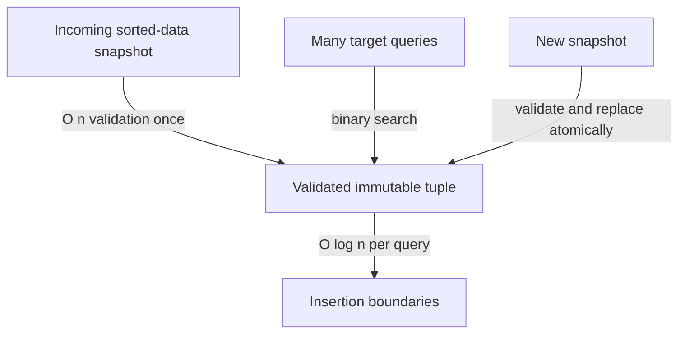

# Binary search boundary: find the first true position

[Curriculum](../../../../README.md) · [Data structures and algorithms](../../README.md) · [All coding problems](../../../../../indexes/coding.md)

Constructed practice problem; no company attribution. Prerequisites: [ordered data](../../lessons/04-order.md) and [half-open bounds](../04-longest-unique-window/README.md).

## Candidate brief

> A sorted price list may contain duplicates. Return the insertion position immediately before every price equal to a target, or before the next larger price when the target is absent. Define what you return beyond either end, then explain why each search update is safe.

| Contract | Decision |
|---|---|
| Input | Nondecreasing integer list/tuple and integer target; bool excluded |
| Output | First index whose value is at least target, or `len(nums)` if none |
| Boundaries | Empty gives 0; duplicates return their first position; no mutation |
| Invalid input | Invalid types or unsorted input raise `ValueError` after validation |
| Excluded | Concurrent mutation and automatic sorting; the checked wrapper costs O(n) |

## The tool before the challenge

Lower bound means the *first* index whose value is at least the target, including the insertion position `len(nums)` when none exists:
```python
nums = [1, 2, 2, 5]
lo, hi = 0, len(nums)  # potential answer is in [lo, hi)
mid = (lo + hi) // 2
print(mid, nums[mid])  # 2, 2; still search LEFT for the first 2
```
The answer for target 2 is index 1. [Walk the full boundary loop](../../lessons/04-order.md) and explain why `hi = mid` keeps mid eligible.

<!-- interview-rehearsal:start -->

## What the interviewer expects

The interviewer gives you the scenario and the contract above. Explain what a
successful call returns, walk one row from the table below, and name what your
state means *before* choosing a data structure.

**Done means:** First index whose value is at least target, or `len(nums)` if none.

Now predict each output before looking at the reference; invalid input should
leave any existing state unchanged unless the contract says otherwise.

### Test-case scenarios to settle before coding

| Case | Exact input or state | Expected result | What it is testing |
|---|---|---|---|
| Present duplicate | `[1,3,3,8]`, target `3` | `1` | Return the first equal position. |
| Absent middle | same list, target `4` | `3` | Return the insertion boundary. |
| Beyond right | same list, target `9` | `4` | The sentinel is `len(nums)`. |
| Empty | `[]`, target `2` | `0` | The only insertion point is zero. |
| Before left | `[2,4]`, target `1` | `0` | Nothing is proven smaller. |
| Invalid/atomic | `[3,1]`, target `2` | `ValueError`; input unchanged | Checked input must actually be sorted. |

For each row, show which branch or state change produces that result.

<!-- interview-rehearsal:end -->

`lower_bound([1, 3, 3, 8], 3) == 1`; target 4 gives 3; target 9 gives 4.
`lower_bound([], 2) == 0`; `lower_bound([3, 1], 2)` raises `ValueError`.
The returned index is an insertion boundary and need not identify an equal value.

Before opening the explanation, restate the contract, trace the smallest useful
example, implement a baseline, and identify the repeated work. Then implement
your improvement independently and derive tests from the contract. Say what
your state means before saying which data structure stores it.

<details>
<summary>Worked lesson, changed requirements, and reference</summary>

### Prove the discarded region

A linear scan for the first value at least target is an O(n)-time, O(1)-space
baseline. In a sorted array, the predicate `nums[i] >= target` changes at most
once from false to true. Binary search finds that transition without inspecting
every position. The useful invariant divides the array into three regions:

| Region | Meaning for `[1, 3, 3, 8]`, target 3 |
|---|---|
| `[0, lo)` | Proven smaller than target |
| `[lo, hi)` | Positions whose predicate may still need inspection |
| `[hi, n)` | Proven at least target |

Initialize `lo=0`, `hi=n`; both proven regions are empty. Choose a midpoint in
the unresolved interval. If its value is smaller, sortedness proves every
position through mid is also smaller, so set `lo=mid+1`. Otherwise mid itself
could be the first true position, so set `hi=mid`, preserving it as the boundary.
This distinction is the proof of the updates, not a formula to memorize.

| lo | hi | mid / value | Decision |
|---:|---:|---|---|
| 0 | 4 | 2 / 3 | hi = 2 |
| 0 | 2 | 1 / 3 | hi = 1 |
| 0 | 1 | 0 / 1 | lo = 1 |
| 1 | 1 | interval empty | return 1 |

The nonnegative interval length strictly decreases each iteration. At termination,
all positions before lo are smaller and all from lo onward are at least target,
so lo is the required boundary, including `n` if the true region is empty.
The search loop takes O(log(n+1)) comparisons and O(1) auxiliary space. The
supplied public function first validates types and sortedness in O(n), so its
**end-to-end** worst-case time is O(n). This cost is intentional: it honors the
invalid-input contract rather than claiming to validate ordering logarithmically.

### Follow-up 1: count exact target occurrences

Predict the changed predicate for the other edge: find the first value strictly
greater than target. Subtract the lower boundary from that upper boundary.

| Input | Lower predicate | Upper predicate | Count |
|---|---|---|---:|
| `[1, 3, 3, 8]`, target 3 | first `>= 3` is 1 | first `> 3` is 3 | 2 |
| same, target 4 | first `>= 4` is 3 | first `> 4` is 3 | 0 |

Do not search for equality and then scan duplicates: that loses the logarithmic
search bound when almost every value equals target.

### Follow-up 2: thousands of queries on one immutable snapshot



Move validation to snapshot construction and expose a trusted internal search;
copying to a tuple also has O(n) time and space cost. Total work becomes
O(n + q log(n+1)) for q queries, with O(n) snapshot storage. A senior candidate
states each discarded-region proof and tests all-equal arrays. A lead candidate
defines snapshot ownership so mutation cannot invalidate sortedness between
validation and search; a checked list reference alone cannot guarantee that.

### Run and check

From the repository root:

```bash
cd curriculum/01-code/02-data-structures-algorithms/problems/11-binary-search-boundary
python -m unittest -v test_solution.py
```

[Reference implementation](solution.py) · [Contract and oracle tests](test_solution.py).
Read the tests after your attempt. A green reference suite verifies the supplied
implementation; it does not demonstrate independent transfer. Reimplement one
follow-up with the reference closed and explain which old invariant no longer holds.

</details>

[Ordered foundation route](../foundations-index.md) · [Coding home](../../practice-sequence.md)
