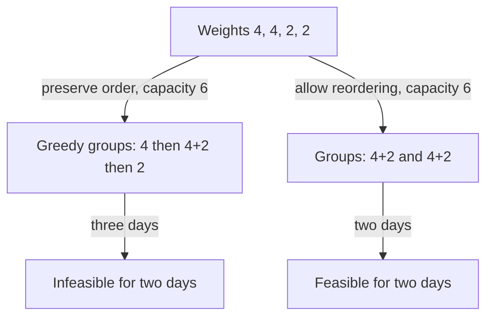

# Shipping capacity: search a feasible answer

[Curriculum](../../../../README.md) · [Data structures and algorithms](../../README.md) · [All coding problems](../../../../../indexes/coding.md)

Constructed practice problem; no company attribution. Prerequisites: [binary search boundaries](../11-binary-search-boundary/README.md).

## Candidate brief

> A warehouse must ship packages in their listed order within a fixed number of days. Each day loads the next consecutive packages up to one common capacity. Find the smallest integer capacity that works. Why can you test a proposed capacity greedily?

| Contract | Decision |
|---|---|
| Input | List/tuple of positive integer weights and positive integer `days`; bool excluded |
| Output | Smallest capacity that ships all packages in order in at most `days` |
| Boundaries | Empty shipment gives 0; unused days allowed; packages cannot split |
| Invalid input | Invalid types, nonpositive weights, or nonpositive days raise `ValueError` |
| Excluded | Reordering, per-day capacity variation, and fractional package weights |

## The tool before the challenge

Search an *answer* when larger proposed answers can never become infeasible. Here a capacity `C` is feasible if the ordered packages can be split into at most the allowed number of days without exceeding `C` on a day.
```python
weights = [3, 2, 4]
low, high = max(weights), sum(weights)  # 4 and 9
```
For two days, capacity 5 works as `[3,2] | [4]`; capacity 4 does not. Prove the feasibility test is monotone before binary searching.

### A design choice worth saying aloud

Extract a predicate named `can_ship_with_capacity(capacity)` whose only job is to count days while preserving package order. Test its boundary at 4 (false) and 5 (true) for `[3,2,4]` over two days before binary search. If the predicate cannot be shown monotone, binary search has no justification.

<!-- interview-rehearsal:start -->

## What the interviewer expects

The interviewer gives you the scenario and the contract above. Explain what a
successful call returns, walk one row from the table below, and name what your
state means *before* choosing a data structure.

**Done means:** Smallest capacity that ships all packages in order in at most `days`.

Now predict each output before looking at the reference; invalid input should
leave any existing state unchanged unless the contract says otherwise.

### Test-case scenarios to settle before coding

| Case | Exact input or state | Expected result | What it is testing |
|---|---|---|---|
| Representative | `[3,2,2,4,1,4]`, days `3` | `6` | Capacity 5 fails and 6 is feasible. |
| Empty shipment | `[]`, days `2` | `0` | No capacity is required. |
| One day | `[2,3,4]`, days `1` | `9` | Every package must fit in one ordered day. |
| Many days | `[2,3,4]`, days `10` | `4` | Unused days are allowed; largest package is the floor. |
| No splitting | `[8,1,1]`, days `2` | `8` | A package is indivisible. |
| Invalid/atomic | zero weight or nonpositive days | `ValueError`; input unchanged | Validate before feasibility search. |

For each row, show which branch or state change produces that result.

<!-- interview-rehearsal:end -->

`shipping_capacity([3, 2, 2, 4, 1, 4], 3) == 6`: days load `[3, 2]`, `[2, 4]`, `[1, 4]`.
Capacity 5 needs four days, so 6 is minimal.
`shipping_capacity([], 2) == 0`; `shipping_capacity([0, 3], 2)` raises `ValueError`.

Before opening the explanation, restate the contract, trace the smallest useful
example, implement a baseline, and identify the repeated work. Then implement
your improvement independently and derive tests from the contract. Say what
your state means before saying which data structure stores it.

<details>
<summary>Worked lesson, changed requirements, and reference</summary>

### Separate optimization from the yes/no test

A baseline tries capacities from the heaviest package through total weight,
simulating each until one works. For total `S`, maximum weight `M`, and `n`
packages, this costs O(n(S-M+1)) arithmetic operations. The repeated question is
“Can capacity C finish within D days?” If one capacity works, any larger one
also works by using the same grouping. Feasibility is monotone, so a binary
search can find its first true value.

| Capacity for `[3, 2, 2, 4, 1, 4]` | Greedy daily totals | Days needed | Feasible for D=3? |
|---:|---|---:|---|
| 5 | 5, 2, 5, 4 | 4 | no |
| 6 | 5, 6, 5 | 3 | yes |
| 8 | 7, 5, 4 | 3 | yes |

At a fixed capacity, load the next package if it fits; otherwise start a new day.
The simulation invariant is that all prior packages are assigned in order and
the current day's load never exceeds capacity. Its stronger optimality claim is
that greedy ships at least as many prefix packages after each day as any feasible
schedule at that capacity. On day one it takes the longest fitting prefix. If
it is already at least as far after day k, filling the next day cannot leave it
behind a competing schedule. Positive weights make the fitting-prefix argument
valid. Thus if greedy needs too many days, no legal grouping can rescue C.

Search the inclusive answer interval `[M, S]`: M is necessary because a package
cannot split, and S always works in one day. A feasible midpoint moves the upper
bound to mid; an infeasible midpoint moves the lower bound to mid+1. The interval
always contains the minimum feasible capacity and strictly shrinks. Time is
O(n log(S-M+2)), including validation, and O(1) auxiliary space. The loop does
not allocate the daily groups because only capacity is requested. Large integer
arithmetic has additional bit-level cost beyond this operation count.

### Follow-up 1: return a schedule with exactly D nonempty days

Predict the missing feasibility rule: for nonempty input this requires `D <= n`.
After finding capacity, greedily construct groups, but start a new group whenever
the remaining packages must each reserve one remaining day.

| Input `[2, 2, 2]`, capacity 4 | At-most-D schedule | Exactly 3 nonempty days |
|---|---|---|
| Grouping | `[2, 2]`, `[2]` | `[2]`, `[2]`, `[2]` |
| Same capacity valid? | yes | yes, by splitting groups |

Splitting a group preserves the capacity bound because all weights are positive.
Define the empty-shipment/exact-day policy separately. Output now costs O(n).

### Follow-up 2: packages may be reordered



The old test can reject a capacity that works after reordering. Monotonicity of
capacity remains, but the greedy feasibility oracle is no longer correct; exact
packing may require exponential search or a bounded-size dynamic program. A
senior candidate proves both monotonicity and oracle correctness independently.
A lead candidate negotiates order, scale, and approximation policy before
promising that binary search alone solves the changed optimization problem.

### Run and check

From the repository root:

```bash
cd curriculum/01-code/02-data-structures-algorithms/problems/13-shipping-capacity
python -m unittest -v test_solution.py
```

[Reference implementation](solution.py) · [Contract and oracle tests](test_solution.py).
Read the tests after your attempt. A green reference suite verifies the supplied
implementation; it does not demonstrate independent transfer. Reimplement one
follow-up with the reference closed and explain which old invariant no longer holds.

</details>

[Ordered foundation route](../foundations-index.md) · [Coding home](../../practice-sequence.md)
