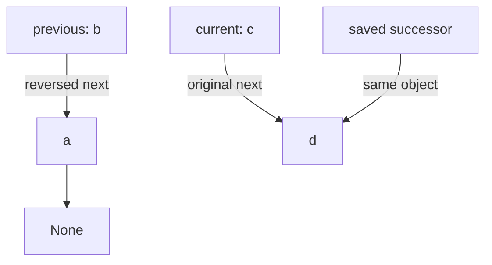
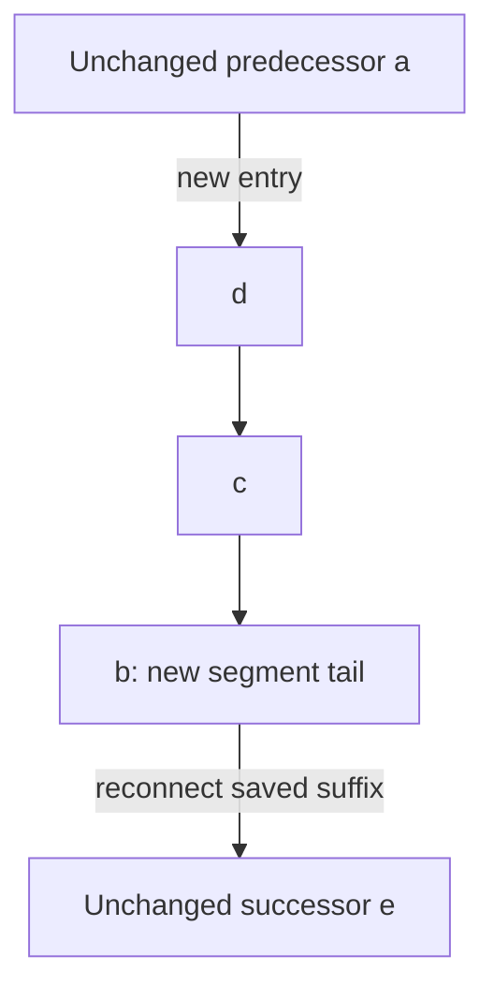

# Reverse a linked list: keep the unprocessed suffix reachable

[Curriculum](../../../../README.md) · [Data structures and algorithms](../../README.md) · [All coding problems](../../../../../indexes/coding.md)

Constructed practice problem; no company attribution. Prerequisites: [state invariants](../07-product-except-self/README.md); this page introduces node identity and pointers.

## Candidate brief

> A singly linked work queue must be reversed in place. Each node has a value and a link to the next node. Return the new head using the same node objects, with every link reversed. How will you preserve access to the remaining queue before overwriting a link?

| Contract | Decision |
|---|---|
| Input | `Node` head or `None`; each next link is a `Node` or `None`; values are opaque |
| Output | New head of the reversed chain using exactly the original node identities |
| Boundaries | Empty gives `None`; singleton is the same object; mutation is intentional |
| Invalid input | Malformed links or cycles raise `ValueError` before any mutation |
| Excluded | Shared ownership guarantees and concurrent readers/writers during reversal |

## The tool before the challenge

A linked-list node holds a value and a reference to the **next node**, not a Python list index. Reversal changes links; saving `next` first keeps the unprocessed suffix reachable:
```python
next_node = current.next
current.next = previous
previous, current = current, next_node
```
For `1 → 2 → 3 → None`, the new head must yield `3 → 2 → 1 → None`. Draw the three pointers and test the empty and one-node lists.

<!-- interview-rehearsal:start -->

## What the interviewer expects

The interviewer gives you the scenario and the contract above. Explain what a
successful call returns, walk one row from the table below, and name what your
state means *before* choosing a data structure.

**Done means:** New head of the reversed chain using exactly the original node identities.

Now predict each output before looking at the reference; invalid input should
leave any existing state unchanged unless the contract says otherwise.

### Test-case scenarios to settle before coding

| Case | Exact input or state | Expected result | What it is testing |
|---|---|---|---|
| Representative | `a → b → c → None` | same objects as `c → b → a → None` | Identity, not copied values, defines success. |
| Empty | `None` | `None` | No links are written. |
| Singleton | `a → None` | the exact object `a` | Head identity stays the same. |
| Repeated values | three distinct nodes all storing `1` | all three identities reversed | Values cannot identify nodes. |
| Cycle | `a → b → a` | `ValueError` before mutation | Validation must not partially destroy the structure. |
| Malformed link | reachable `next` is not Node/None | `ValueError` before mutation | Atomic rejection is observable behavior. |

For each row, show which branch or state change produces that result.

<!-- interview-rehearsal:end -->

For distinct objects `a → b → c → None`, return object `c` with links `c → b → a → None`.
Even if all three values are `7`, all three identities must remain.
A self-link `a.next = a` raises `ValueError` and remains unchanged.

Before opening the explanation, restate the contract, trace the smallest useful
example, implement a baseline, and identify the repeated work. Then implement
your improvement independently and derive tests from the contract. Say what
your state means before saying which data structure stores it.

<details>
<summary>Worked lesson, changed requirements, and reference</summary>

### Draw identities, not just values

A node is an object; `next` is a reference to another object, not its value.
Two nodes with equal values are still different queue entries. A baseline can
push node references onto a stack, pop them, and reconnect in reverse order:
O(n) time and O(n) auxiliary space. Copying only values into new nodes would
violate the identity contract. To remove the stack, keep three references:
the reversed prefix, the current node, and its saved successor.



At the start of each iteration, `previous` heads the already reversed prefix
and `current` heads the untouched suffix. Together they contain each original
node exactly once, with no link from the prefix into the suffix. Save
`current.next` before redirecting it to previous; then move previous to current
and current to the saved successor. Losing the successor first makes the suffix
unreachable. The two regions still partition the original nodes, and one node
moves from suffix to prefix. When current is None, the whole chain is reversed
and previous is the new head.

| Step for a → b → c | previous | current | Newly written link |
|---|---|---|---|
| initial | None | a | none |
| after a | a | b | a.next = None |
| after b | b | c | b.next = a |
| after c | c | None | c.next = b |

The reference first checks shape and uses slow/fast pointers to reject cycles,
then mutates. This extra pass preserves the “no partial mutation on invalid
input” contract while retaining O(n) total time and O(1) auxiliary space. The
output is only a reference; existing nodes are not counted as new storage.
Recursive reversal is elegant but uses O(n) call-stack space and can exceed
Python's recursion limit on a deep chain.

Watch the saved successor arrive before the link changes, then follow the two
variable references as they advance. The node objects stay in place.


[Open motion study](../../../../../assets/learning/linked-pointer-reversal.svg) ·
[Read the completed still](../../../../../assets/learning/linked-pointer-reversal-still.svg).

### Follow-up 1: reverse only an interior segment

Predict the links that must be repaired outside the reversed region. For the
inclusive node segment b through d, both attachment points matter:



Save predecessor, old segment head, and the node after the segment before
rewiring. The old segment head becomes its tail. Validate positional bounds
before mutation if failure must leave the original list intact. A dummy head
simplifies a segment that starts at position zero.

### Follow-up 2: readers retain old next-link behavior

| Ownership requirement | Can existing nodes be rewired? | Suitable representation |
|---|---|---|
| Exclusive mutable chain | yes | current in-place reversal |
| Readers need old chain concurrently | no | copied immutable chain or separately published snapshot |

The same node cannot simultaneously have its old and new `next` through one
field. Copying introduces O(n) new storage and new identities; an indirection
layer needs version semantics. A senior candidate tests identity, tail termination,
and reversing twice. A lead candidate settles mutation ownership and publication
before adding locks or promising stable readers; the local routine has no
concurrency protocol.

### Run and check

From the repository root:

```bash
cd curriculum/01-code/02-data-structures-algorithms/problems/14-reverse-linked-list
python -m unittest -v test_solution.py
```

[Reference implementation](solution.py) · [Contract and oracle tests](test_solution.py).
Read the tests after your attempt. A green reference suite verifies the supplied
implementation; it does not demonstrate independent transfer. Reimplement one
follow-up with the reference closed and explain which old invariant no longer holds.

</details>

[Ordered foundation route](../foundations-index.md) · [Coding home](../../practice-sequence.md)
