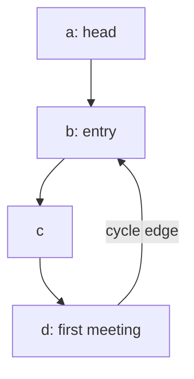
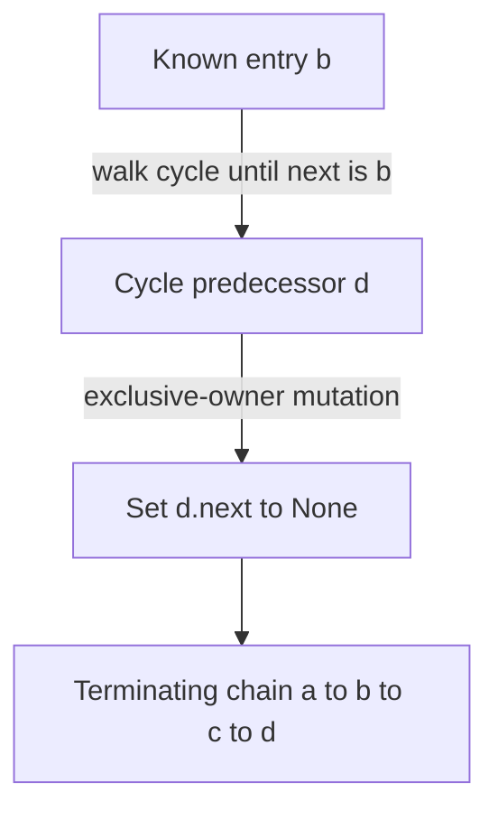

# Find where a linked list loops back on itself

[Curriculum](../../../../README.md) · [Data structures and algorithms](../../README.md) · [All coding problems](../../../../../indexes/coding.md)

Constructed practice problem. Prerequisite: [linked-list references](../14-reverse-linked-list/README.md).

## The question

Walk a linked list from `head`. If the `next` pointers eventually lead back to a node you have already visited, return **that node** — the first one the walk re-enters. If the list simply ends, return `None`.

**Write this:**

```python
@dataclass(eq=False)
class Node:
    value: object
    next: "Node | None" = None

def cycle_entry(head):
    ...
```

**Examples**

| Given | Return |
|---|---|
| `a → b → None` | `None` |
| `a → a` | `a` |
| `a → b → c → b` | `b` |
| `a → b → c → None`, all three holding `7` | `None` |

**Rules**

- **Constant extra space.** Keeping a set of nodes you have seen is the easy answer, and it is not this one.
- **Do not modify the list.** Detection is observational.
- **Compare by identity, not value.** Two nodes both holding `7` are still two nodes.
- A `head` that is not a `Node`, or a reachable `next` that is neither a `Node` nor `None`, raises `ValueError`.

Once it works, answer this: the two-pointer walk meets somewhere inside the loop, but that meeting point is usually *not* the entry. Why, and what do you do about it?

## The tool before the challenge

A cycle is about **node identity**, not equal node values. Two nodes holding 7 are not automatically the same node:
```python
slow = head
fast = head
if fast is not None and fast.next is not None:
    fast = fast.next.next
    slow = slow.next
    print(slow is fast)  # compare object identity
```
For `A → B → C → B` the entry is the *B object*; for `A → B → None` there is no entry. Trace when the fast pointer stops before dereferencing.

### A design choice worth saying aloud

Use object identity (`is`) for the meeting and entry checks: two different nodes can have equal `value` fields. Check `fast` and `fast.next` before a two-link advance. Ask whether inputs can contain malformed `next` fields; that is a validation decision, separate from cycle detection and its O(1) extra-space claim.

<!-- interview-rehearsal:start -->

## What the interviewer expects

The interviewer gives you the scenario and the contract above. Explain what a
successful call returns, walk through one example below, and name what your
state means *before* choosing a data structure.

**Done means:** Entry node by object identity, or `None` if acyclic.

Now predict each output before looking at the reference; invalid input should
leave any existing state unchanged unless the contract says otherwise.

### Test-case scenarios to settle before coding

| Case | Exact input or state | Expected result | What it is testing |
|---|---|---|---|
| Acyclic | `a → b → None` | `None` | Equal values would not create a cycle. |
| Self-cycle | `a.next = a` | the exact object `a` | The smallest cycle must terminate. |
| Tail into cycle | `a → b → c → b` | the exact object `b` | Meeting point and entry are different concepts. |
| Repeated values | acyclic nodes sharing a value | `None` | Use object identity. |
| No mutation | any valid chain | every original link unchanged | Detection is observational. |
| Malformed link | reachable non-node `next` | `ValueError` | Reject invalid topology explicitly. |

For each case, show which branch or state change produces that result.

<!-- interview-rehearsal:end -->

For `a → b → c → d → b`, `cycle_entry(a) is b`.
For distinct nodes `a(7) → b(7) → None`, the result is `None`.
For `a.next = a`, the result is `a`; `a.next = 42` raises `ValueError`.

Before opening the explanation, restate the contract, trace the smallest useful
example, implement a baseline, and identify the repeated work. Then implement
your improvement independently and derive tests from the contract. Say what
your state means before saying which data structure stores it.

<details>
<summary>Worked lesson, changed requirements, and reference</summary>

### Distinguish detection from locating the entry

A baseline stores visited node identities. The first already-seen node is the
entry, giving O(n) time and O(n) auxiliary space for n distinct reachable nodes.
To eliminate that set, move slow one edge and fast two. If fast reaches None,
the chain terminates. If a cycle exists, both eventually enter it, and their
relative distance changes by one modulo its length each iteration, forcing a
meeting. Compare with `is`: node values are irrelevant.



| Iteration | slow | fast |
|---:|---|---|
| 0 | a | a |
| 1 | b | c |
| 2 | c | b |
| 3 | d | d |

The first meeting is d, not entry b. Let the noncyclic prefix length be μ and
cycle length be λ. At meeting, slow has walked t edges and fast 2t, so their
distance difference t is a multiple of λ. The meeting's cycle offset is
`(t - μ) mod λ`. Reset one pointer to head and leave the other at the meeting;
move both one edge at a time. After μ steps the head pointer reaches entry,
and the cycle pointer's offset becomes t modulo λ, which is zero. They cannot
meet earlier when μ is positive because one pointer is outside the cycle.

This proves the second phase locates the first cyclic node. If μ is zero,
the reset pointer may already equal the meeting and returns immediately. Both
phases take O(μ + λ) time and O(1) auxiliary space; the acyclic case is O(n).
The reference validates link types on every pointer step, preserving the same
bound. It uses no recursion or visited set and never changes a link.

### Follow-up 1: also return cycle length

Predict the minimal added state: start at the discovered entry, walk until that
same object is reached again, and count edges. Take at least one step so a
self-cycle has length one.

| From entry b | Traversed edge | Count |
|---|---|---:|
| b | b → c | 1 |
| c | c → d | 2 |
| d | d → b | 3: stop at entry |

This adds O(λ) time and O(1) space. Returning every cycle node instead adds
O(λ) output. Define the acyclic response as `(None, 0)` before coding.

### Follow-up 2: safely break the cycle



Do not sever the entry's outgoing edge: that would make later cycle nodes
unreachable from the head. Find the predecessor whose next is entry instead.
Require exclusive mutation ownership; a concurrent writer can invalidate the
proof or create a new cycle after repair. A senior candidate derives both phases
and tests every entry position, not just a cycle at the head. A lead candidate
separates read-only diagnosis from repair authorization, reports corruption,
and defines how references held by other queue consumers remain valid.

### Run and check

From the repository root:

```bash
cd curriculum/01-code/02-data-structures-algorithms/problems/15-linked-list-cycle-entry
python -m unittest -v test_solution.py
```

[Reference implementation](solution.py) · [Contract and oracle tests](test_solution.py).
Read the tests after your attempt. A green reference suite verifies the supplied
implementation; it does not demonstrate independent transfer. Reimplement one
follow-up with the reference closed and explain which old invariant no longer holds.

</details>

[Ordered foundation route](../foundations-index.md) · [Coding home](../../practice-sequence.md)
