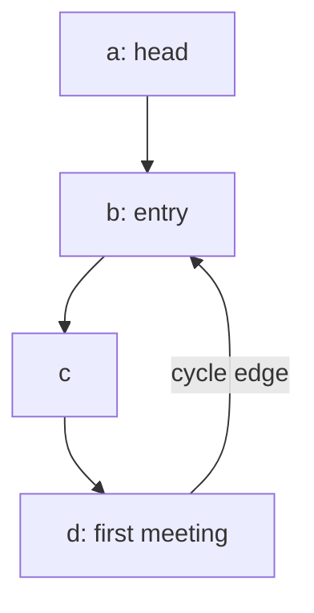
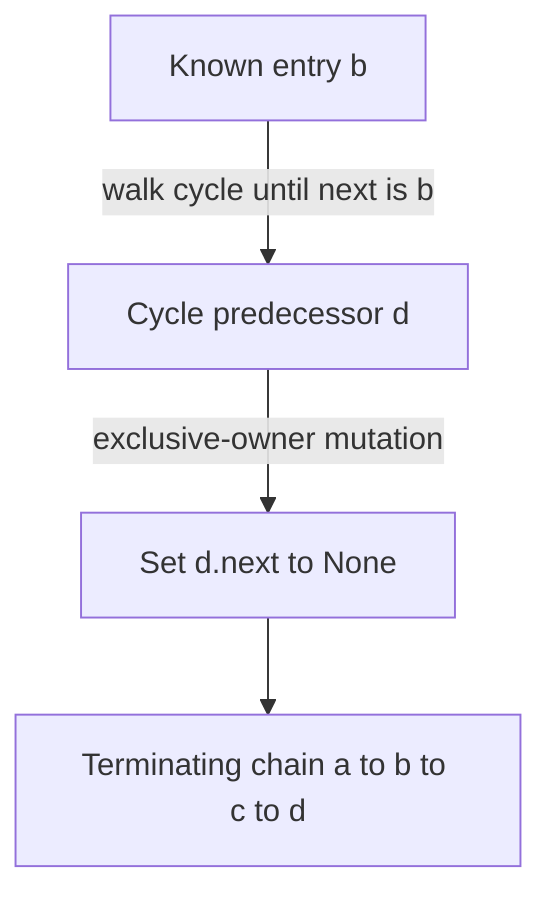

# Cycle entry: relative motion and identity

[Curriculum](../../../../README.md) · [Data structures and algorithms](../../README.md) · [All coding problems](../../../../../indexes/coding.md)

Constructed practice problem; no company attribution. Prerequisites: [linked-list references](../14-reverse-linked-list/README.md).

## Candidate brief

> A corrupted linked queue may loop forever. Return the exact node where traversal from its head first enters a cycle, or None when it terminates. Use constant working space and do not modify the queue. Why is returning the first slow/fast meeting point insufficient?

| Contract | Decision |
|---|---|
| Input | `Node` head or `None`; next links are `Node` or `None`; values opaque |
| Output | Entry node by object identity, or `None` if acyclic |
| Boundaries | Self-cycle returns its node; repeated values do not imply a cycle; no mutation |
| Invalid input | Non-node head or malformed reachable next link raises `ValueError` |
| Excluded | Concurrent link changes and detecting cycles by equal node values |

<!-- interview-rehearsal:start -->

## What the interviewer expects

The opening scenario is the product context; the table above is the callable
contract. Your job is to connect them. Before coding, say what the output means,
walk one normal case and one case that could disprove a tempting shortcut, then
name the invariant your implementation will preserve. Start with a correct
baseline, improve it deliberately, and derive time and space from actual work.

**Done means:** Entry node by object identity, or `None` if acyclic.

Passing the happy path alone is not done; your answer
must make a deliberate decision for every scenario below without mutating input
unless the contract explicitly permits it.

### Test-case scenarios to settle before coding

| Case | Exact input or state | Expected result | What it is testing |
|---|---|---|---|
| Acyclic | `a → b → None` | `None` | Equal values would not create a cycle. |
| Self-cycle | `a.next = a` | the exact object `a` | The smallest cycle must terminate. |
| Tail into cycle | `a → b → c → b` | the exact object `b` | Meeting point and entry are different concepts. |
| Repeated values | acyclic nodes sharing a value | `None` | Use object identity. |
| No mutation | any valid chain | every original link unchanged | Detection is observational. |
| Malformed link | reachable non-node `next` | `ValueError` | Reject invalid topology explicitly. |

Do not merely list these cases in an interview. For each one, point to the branch,
state transition, or invariant that makes the expected result inevitable. If your
design cannot explain a row, the design is not finished yet.

<!-- interview-rehearsal:end -->

For `a → b → c → d → b`, `cycle_entry(a) is b`.
For distinct nodes `a(7) → b(7) → None`, the result is `None`.
For `a.next = a`, the result is `a`; `a.next = 42` raises `ValueError`.

Before opening the explanation, restate the contract, trace the smallest useful
example, implement a baseline, and identify the repeated work. Then implement
your improvement independently and derive tests from the contract. Say what
your state means before saying which data structure stores it.

<details>
<summary>Worked lesson, changed requirements, and reference</summary>

### Distinguish detection from locating the entry

A baseline stores visited node identities. The first already-seen node is the
entry, giving O(n) time and O(n) auxiliary space for n distinct reachable nodes.
To eliminate that set, move slow one edge and fast two. If fast reaches None,
the chain terminates. If a cycle exists, both eventually enter it, and their
relative distance changes by one modulo its length each iteration, forcing a
meeting. Compare with `is`: node values are irrelevant.



| Iteration | slow | fast |
|---:|---|---|
| 0 | a | a |
| 1 | b | c |
| 2 | c | b |
| 3 | d | d |

The first meeting is d, not entry b. Let the noncyclic prefix length be μ and
cycle length be λ. At meeting, slow has walked t edges and fast 2t, so their
distance difference t is a multiple of λ. The meeting's cycle offset is
`(t - μ) mod λ`. Reset one pointer to head and leave the other at the meeting;
move both one edge at a time. After μ steps the head pointer reaches entry,
and the cycle pointer's offset becomes t modulo λ, which is zero. They cannot
meet earlier when μ is positive because one pointer is outside the cycle.

This proves the second phase locates the first cyclic node. If μ is zero,
the reset pointer may already equal the meeting and returns immediately. Both
phases take O(μ + λ) time and O(1) auxiliary space; the acyclic case is O(n).
The reference validates link types on every pointer step, preserving the same
bound. It uses no recursion or visited set and never changes a link.

### Follow-up 1: also return cycle length

Predict the minimal added state: start at the discovered entry, walk until that
same object is reached again, and count edges. Take at least one step so a
self-cycle has length one.

| From entry b | Traversed edge | Count |
|---|---|---:|
| b | b → c | 1 |
| c | c → d | 2 |
| d | d → b | 3: stop at entry |

This adds O(λ) time and O(1) space. Returning every cycle node instead adds
O(λ) output. Define the acyclic response as `(None, 0)` before coding.

### Follow-up 2: safely break the cycle



Do not sever the entry's outgoing edge: that would make later cycle nodes
unreachable from the head. Find the predecessor whose next is entry instead.
Require exclusive mutation ownership; a concurrent writer can invalidate the
proof or create a new cycle after repair. A senior candidate derives both phases
and tests every entry position, not just a cycle at the head. A lead candidate
separates read-only diagnosis from repair authorization, reports corruption,
and defines how references held by other queue consumers remain valid.

### Run and check

From the repository root:

```bash
cd curriculum/01-code/02-data-structures-algorithms/problems/15-linked-list-cycle-entry
python -m unittest -v test_solution.py
```

[Reference implementation](solution.py) · [Contract and oracle tests](test_solution.py).
Read the tests after your attempt. A green reference suite verifies the supplied
implementation; it does not demonstrate independent transfer. Reimplement one
follow-up with the reference closed and explain which old invariant no longer holds.

</details>

[Ordered foundation route](../foundations-index.md) · [Coding home](../../practice-sequence.md)
