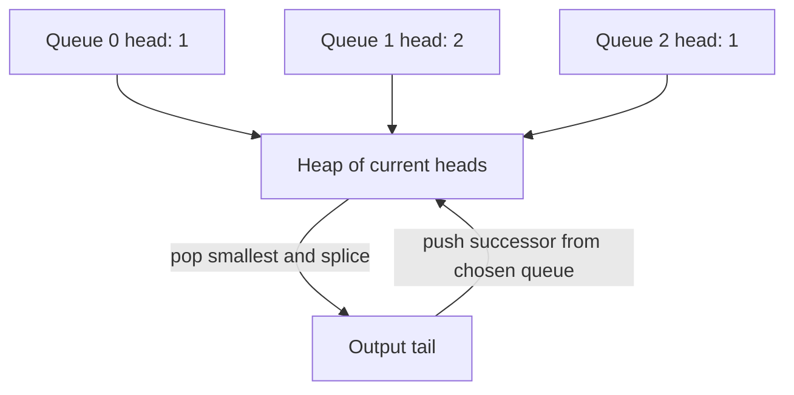

# Merge sorted lists: splice only a safe frontier

[Curriculum](../../../../README.md) · [Data structures and algorithms](../../README.md) · [All coding problems](../../../../../indexes/coding.md)

Constructed practice problem; no company attribution. Prerequisites: [reversing node links](../14-reverse-linked-list/README.md) and [cycle detection](../15-linked-list-cycle-entry/README.md).

## Candidate brief

> Two independently owned task queues are sorted by integer priority. Merge them into one sorted queue using the existing nodes. Preserve order inside each input, and prefer the first queue on equal priorities. What happens if the two inputs unexpectedly share a tail?

| Contract | Decision |
|---|---|
| Input | Two acyclic, node-disjoint `Node` chains with nondecreasing integer values; bool excluded |
| Output | Head of one merged chain using exactly all original node identities |
| Boundaries | Empty chains allowed; ties take first-chain nodes first; links intentionally mutate |
| Invalid input | Malformed links, cycles, unsorted/noninteger values, or shared nodes raise `ValueError` before mutation |
| Excluded | Persistent input chains and concurrent access during splicing |

For identities `a1(1) → a2(3)` and `b1(1) → b2(2)`, return
`a1 → b1 → b2 → a2 → None`.
`merge_sorted_lists(None, b1) is b1` when that chain is valid.
Supplying the same nonempty head twice raises `ValueError`.

Before opening the explanation, restate the contract, trace the smallest useful
example, implement a baseline, and identify the repeated work. Then implement
your improvement independently and derive tests from the contract. Say what
your state means before saying which data structure stores it.

<details>
<summary>Worked lesson, changed requirements, and reference</summary>

### Define which links are final and which remain a frontier

A baseline collects node references from both chains, stably sorts by value,
then reconnects them: O((n+m) log(n+m)) time and O(n+m) auxiliary space. Reading
all first-chain nodes before second-chain nodes makes a stable sort honor the
tie policy. But both inputs already expose their smallest remaining value at
the head, so a two-way merge can avoid sorting and reference storage.

| Remaining A | Remaining B | Choose | Logical output prefix |
|---|---|---|---|
| a1(1), a2(3) | b1(1), b2(2) | a1: first-chain tie | a1 |
| a2(3) | b1(1), b2(2) | b1 | a1, b1 |
| a2(3) | b2(2) | b2 | a1, b1, b2 |
| a2(3) | empty | append A suffix | a1, b1, b2, a2 |

Maintain a dummy node and tail of the chosen prefix. Every chosen node is in
sorted stable order; both input references head sorted unconsumed suffixes; tail
is the only output position whose next link is not final. Its next may still
point into an old suffix until the next splice, so do not claim the physical
prefix is already None-terminated. Compare current heads, save/advance the chosen
input reference, attach that node after tail, and advance tail. The smaller head
cannot have a larger unconsumed predecessor, establishing the next output value.
When one input empties, the other suffix is already in order and can be attached
whole. The dummy is not part of the returned chain.

Before mutation, validate each chain with cycle detection and a sortedness pass.
Two nonempty acyclic singly linked chains share any node exactly when their final
node is the same object: after an intersection their next links are identical.
Comparing tails therefore rejects aliasing with constant space. Without this
check, splicing shared nodes can create a self-cycle. Validation plus merge takes
O(n+m) time and O(1) auxiliary space; output reuses existing nodes. Node equality
is identity-based, and values never decide whether objects are shared.

### Follow-up 1: merge k sorted queues

Predict what replaces a two-head comparison. Keep one entry per nonempty queue
in a min-heap, keyed by `(value, queue_index)` for deterministic cross-queue ties.



For N total nodes, merging costs O(N log k) time and O(k) frontier space, after
validation. Cross-queue alias detection also needs a stated method; checking all
tail pairs is quadratic in k, while a tail-identity set uses O(k) space.

### Follow-up 2: consumers retain the original queues

| Required observation | In-place splice effect | Changed approach |
|---|---|---|
| A reader follows a1.next expecting a2 | merge changes it to b1 | allocate new nodes or return an iterator of values |
| Caller requires old node identities in a new persistent chain | one next field cannot encode two chains | add separate link records or versioned indirection |

A senior candidate tests tie stability by identity and catches shared-tail input
before writes. A lead candidate defines transfer of ownership and whether readers
need original identities, values, or snapshot order; that choice determines
whether copying is a correct API migration or a broken contract.

### Run and check

From the repository root:

```bash
cd curriculum/01-code/02-data-structures-algorithms/problems/16-merge-sorted-lists
python -m unittest -v test_solution.py
```

[Reference implementation](solution.py) · [Contract and oracle tests](test_solution.py).
Read the tests after your attempt. A green reference suite verifies the supplied
implementation; it does not demonstrate independent transfer. Reimplement one
follow-up with the reference closed and explain which old invariant no longer holds.

</details>

[Ordered foundation route](../foundations-index.md) · [Coding home](../../practice-sequence.md)
