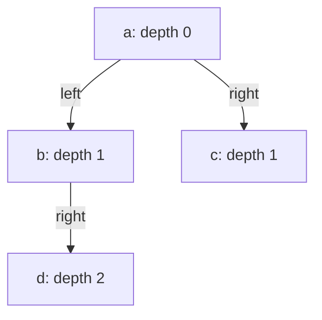
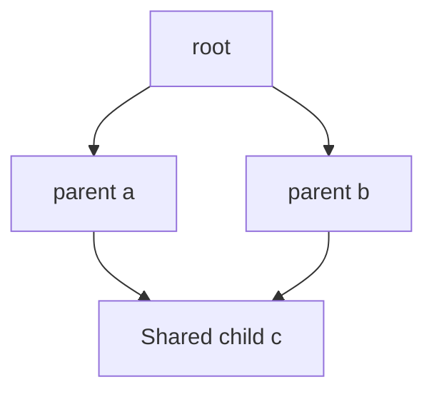

# Tree level order: keep the next frontier separate

[Curriculum](../../../../README.md) · [Data structures and algorithms](../../README.md) · [All coding problems](../../../../../indexes/coding.md)

Constructed practice problem; no company attribution. Prerequisites: [node identity](../14-reverse-linked-list/README.md); this page introduces binary trees and traversal depth.

## Candidate brief

> A dependency inspector displays a binary tree one depth at a time, left child before right child. Return one list of values per depth. Equal labels may identify different nodes. How will you avoid mixing children discovered during a level into that same level?

| Contract | Decision |
|---|---|
| Input | `Node` root or `None`; each node has opaque value and left/right child references |
| Output | Lists of values by depth, in left-to-right order; root is depth 0 |
| Boundaries | Empty gives `[]`; duplicate values remain separate entries; no mutation |
| Invalid input | Malformed child links, cycles, or a child shared by multiple parents raise `ValueError` |
| Excluded | DAG traversal and concurrent topology changes; output stores value references |

## The tool before the challenge

Breadth-first traversal uses a FIFO queue so every node at depth `d` is visited before nodes at `d+1`. Freeze the current queue length before processing one level:
```python
from collections import deque
queue = deque([root])
level_size = len(queue)  # children appended later belong to next level
```
For root 1 with children 2 and 3, return `[[1], [2,3]]`. An empty tree returns `[]`, not a list containing an empty level.

### A design choice worth saying aloud

The queue contains nodes still to be visited, not completed values. Capture `level_size` before appending children: without that boundary, the first pass swallows the next level. If the input graph can share a node or contain a cycle, define whether traversal is a tree-only contract or add identity-based visited tracking.

<!-- interview-rehearsal:start -->

## What the interviewer expects

The interviewer gives you the scenario and the contract above. Explain what a
successful call returns, walk through one example below, and name what your
state means *before* choosing a data structure.

**Done means:** Lists of values by depth, in left-to-right order; root is depth 0.

Now predict each output before looking at the reference; invalid input should
leave any existing state unchanged unless the contract says otherwise.

### Test-case scenarios to settle before coding

| Case | Exact input or state | Expected result | What it is testing |
|---|---|---|---|
| Representative | root a; children b,c; b has d | `[[a],[b,c],[d]]` by value | Queue boundaries preserve levels. |
| Empty | `None` | `[]` | No empty level is emitted. |
| Singleton | one node | one one-element level | Depth zero is represented. |
| Duplicate values | distinct nodes with equal values | both values appear | Topology, not a value set, controls visitation. |
| Shared child | left and right reference same node | `ValueError` | The input must be a tree, not a DAG. |
| Cycle/malformed | child returns to ancestor or invalid object | `ValueError`; no mutation | Traversal must terminate safely. |

For each case, show which branch or state change produces that result.

<!-- interview-rehearsal:end -->

A root `a`, children `b, c`, and `b.right = d` gives
`tree_level_order(a) == [["a"], ["b", "c"], ["d"]]`.
Two distinct children both valued `"x"` produce `["x", "x"]`.
Pointing both root children at the same node raises `ValueError`.

Before opening the explanation, restate the contract, trace the smallest useful
example, implement a baseline, and identify the repeated work. Then implement
your improvement independently and derive tests from the contract. Say what
your state means before saying which data structure stores it.

<details>
<summary>Worked lesson, changed requirements, and reference</summary>

### Define a tree before choosing a traversal

A binary tree has at most two ordered children per node, one parent per nonroot
node, and no cycles. Depth counts edges from the root. Node **identity** determines
whether a node repeats; equal values do not. A simple baseline first finds tree
height, then walks from the root separately for each depth. It revisits upper
nodes and can take O(nh) time, including O(n²) on a chain of height n. Retaining
the next frontier avoids those repeated walks.



Use a first-in, first-out queue, which removes the oldest enqueued node. At the
start of an outer iteration, the queue contains exactly one level in left-to-right
order. Snapshot its current length and pop exactly that many nodes, appending
their values to the current output list and enqueueing left then right children.
New children remain queued for the next iteration; looping until the queue is
empty inside a level would mix every depth together.

| Level start queue | Frozen pop count | Values emitted | Queue afterward |
|---|---:|---|---|
| a | 1 | `[a]` | b, c |
| b, c | 2 | `[b, c]` | d |
| d | 1 | `[d]` | empty |

Every node is enqueued once, and every child is one edge deeper than its parent,
so the invariant advances to the next level. The reference uses `deque.popleft`;
removing index zero from a Python list repeatedly shifts its remaining elements.
It also records node identities when enqueuing and rejects repeats, covering
both cycles and shared-child DAGs. Total time is O(n). The BFS frontier costs
O(w), where w is maximum level width (the queue may contain parts of two levels,
still O(w)); structural validation adds O(n) auxiliary identity storage. Returned
values and nested lists cost O(n) output. For a guaranteed valid tree, omitting
the seen set recovers O(w) auxiliary space but weakens the checked contract.

### Follow-up 1: return zigzag levels

Predict which ordering must change. Keep traversal order ordinary so child
discovery remains simple; reverse the values of every odd-numbered output level.

| Depth | Queue traversal order | Display order |
|---:|---|---|
| 0 | a | a |
| 1 | b, c | c, b |
| 2 | d | d |

Do not reverse child enqueue order opportunistically: it changes later frontiers
and is harder to prove. Reversing complete level lists adds O(n) total work.

### Follow-up 2: the input becomes a DAG



The original API rejects this shape. A changed contract could emit each identity
once at its shortest distance from root, marking visited on enqueue; BFS still
establishes shortest unweighted distance. Alternatively, displaying every path
can duplicate c and may have exponentially many entries. Explicit cycle policy
is then necessary. A senior candidate names frontier and identity invariants
and handles a deep chain iteratively. A lead candidate chooses whether the UI
shows unique entities or containment paths and budgets output size accordingly.

### Run and check

From the repository root:

```bash
cd curriculum/01-code/02-data-structures-algorithms/problems/17-tree-level-order
python -m unittest -v test_solution.py
```

[Reference implementation](solution.py) · [Contract and oracle tests](test_solution.py).
Read the tests after your attempt. A green reference suite verifies the supplied
implementation; it does not demonstrate independent transfer. Reimplement one
follow-up with the reference closed and explain which old invariant no longer holds.

</details>

[Ordered foundation route](../foundations-index.md) · [Coding home](../../practice-sequence.md)
