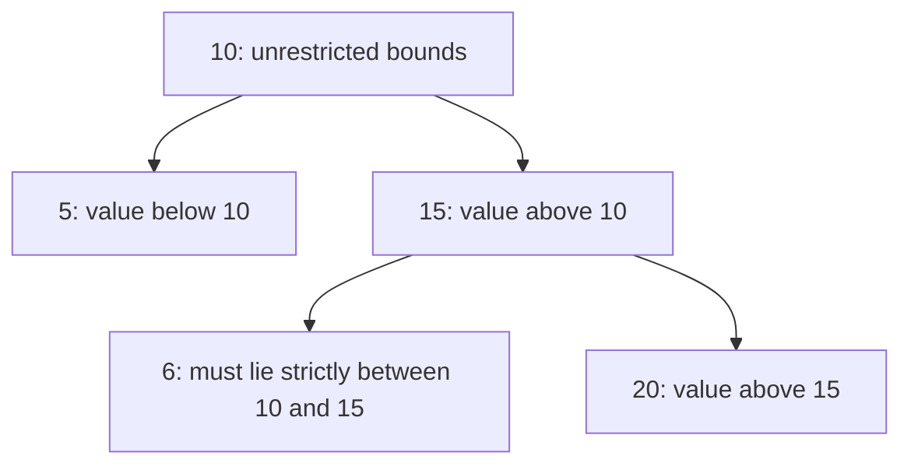
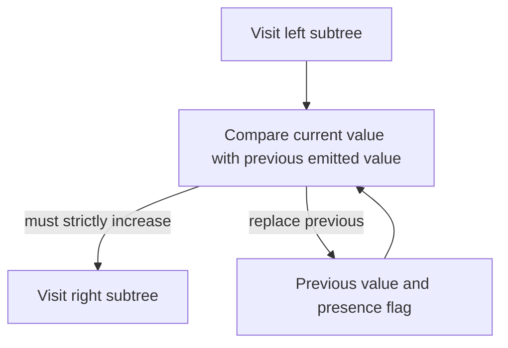

# Validate a BST: carry every ancestor constraint

[Curriculum](../../../../README.md) · [Data structures and algorithms](../../README.md) · [All coding problems](../../../../../indexes/coding.md)

Constructed practice problem; no company attribution. Prerequisites: [tree structure and identity](../17-tree-level-order/README.md) and [ordered boundaries](../11-binary-search-boundary/README.md).

## Candidate brief

> A storage index exports a binary tree and claims it is a strict binary search tree. Every value in a left subtree must be smaller than its ancestor, and every value in a right subtree larger. Validate that claim. Is checking each node against only its immediate children enough?

| Contract | Decision |
|---|---|
| Input | Binary `Node` tree with integer values, bool excluded; `None` is empty |
| Output | Boolean for strict BST ordering; equal values anywhere cannot satisfy strict ordering |
| Boundaries | Empty/singleton trees are valid; unbounded Python integers allowed; no mutation |
| Invalid input | Invalid values/links, cycles, or shared nodes raise `ValueError`; ordering violations return `False` |
| Excluded | Balancing guarantees and duplicate-placement policies |

<!-- interview-rehearsal:start -->

## What the interviewer expects

The opening scenario is the product context; the table above is the callable
contract. Your job is to connect them. Before coding, say what the output means,
walk one normal case and one case that could disprove a tempting shortcut, then
name the invariant your implementation will preserve. Start with a correct
baseline, improve it deliberately, and derive time and space from actual work.

**Done means:** Boolean for strict BST ordering; equal values anywhere cannot satisfy strict ordering.

Passing the happy path alone is not done; your answer
must make a deliberate decision for every scenario below without mutating input
unless the contract explicitly permits it.

### Test-case scenarios to settle before coding

| Case | Exact input or state | Expected result | What it is testing |
|---|---|---|---|
| Valid | 2 with children 1 and 3 | `True` | Both global bounds hold. |
| Ancestor violation | 10 → left 5 → right 12 | `False` | Checking only each parent misses the violation. |
| Duplicate | 2 with child 2 | `False` | The baseline ordering is strict. |
| Empty/singleton | `None` / one integer node | `True` / `True` | Small valid structures establish boundaries. |
| Invalid value | a node contains `True` | `ValueError` | Boolean is excluded despite integer inheritance. |
| Invalid topology | cycle or shared child | `ValueError` | Ordering failure does not hide structural corruption. |

Do not merely list these cases in an interview. For each one, point to the branch,
state transition, or invariant that makes the expected result inevitable. If your
design cannot explain a row, the design is not finished yet.

<!-- interview-rehearsal:end -->

`Node(2, Node(1), Node(3))` is valid.
`Node(10, Node(5), Node(15, Node(6), Node(20)))` is invalid: 6 is in 10's right subtree.
`Node(2, Node(2))` returns `False`; `Node(True)` raises `ValueError`.

Before opening the explanation, restate the contract, trace the smallest useful
example, implement a baseline, and identify the repeated work. Then implement
your improvement independently and derive tests from the contract. Say what
your state means before saying which data structure stores it.

<details>
<summary>Worked lesson, changed requirements, and reference</summary>

### The failure is a forgotten ancestor

A local child comparison accepts the counterexample because 6 is less than 15,
while forgetting that the entire right subtree must exceed 10. A correct baseline
checks every node against all values in its left and right subtrees. Repeated
subtree scans cost O(n²) on a skewed tree. The reusable improvement is to carry
the ancestor requirements downward instead of rediscovering them below each node.



Represent a frame as `(node, lower, upper)` with exclusive bounds; None means an
absent bound, not a numeric sentinel. On entry, the bounds summarize every
ancestor constraint. Reject ordering when `value <= lower` or `value >= upper`.
The left child inherits lower and receives current value as upper; the right
child receives current value as lower and inherits upper. If all frames pass,
each node satisfies every relevant ancestor, which is exactly the strict BST
definition. Conversely, a violated ancestor relationship excludes a node from
its carried interval, so it is detected.

| Frame | Allowed interval | Value | Ordering result |
|---|---|---:|---|
| root | unbounded | 10 | valid locally |
| root.right | `(10, unbounded)` | 15 | valid locally |
| root.right.left | `(10, 15)` | 6 | false |

The logical recursive return is a boolean: this node is in bounds **and** both
child calls return true; an empty child returns true. The reference uses explicit
stack frames to avoid Python recursion limits. It records an ordering-failure
flag but continues validating shape and value types, so a malformed branch still
raises ValueError even when another branch already violates ordering. This
distinguishes a validly represented non-BST from an invalid object graph.

Each node is visited once: O(n) time. Trusted-tree DFS needs O(h) frame space,
but the reference's identity set detects shared nodes/cycles and raises total
auxiliary space to O(n). Integer bounds avoid false failures at extreme values.
The function does not prove balance or efficient lookup merely by returning true.

### Follow-up 1: allow duplicate keys only in right subtrees

Predict how bounds must carry inclusion as well as value. A left edge adds an
exclusive upper bound; a right edge adds an inclusive lower bound.

| Structure | Strict policy | Duplicates-right policy |
|---|---|---|
| root 2, right child 2 | false | true |
| root 2, left child 2 | false | false |
| root 2, right 3 with left 2 | false | true: still in root's right subtree |

Globally replacing both comparisons with inclusive ones is wrong: it permits
duplicates on the left. This policy also interacts with rotations; a balancing
operation may require counts stored within one node instead of duplicate nodes.

### Follow-up 2: validate an inorder stream



Inorder traversal emits left, node, right, so strict increase is equivalent to
strict BST ordering for a valid tree. A stream of values alone cannot validate
the original graph shape; that must be established elsewhere. A senior candidate
explains recursive return meaning, bounds, and malformed-versus-false behavior.
A lead candidate defines duplicate and structural-validation policy at the
serialization boundary rather than silently changing it in one consumer.

### Run and check

From the repository root:

```bash
cd curriculum/01-code/02-data-structures-algorithms/problems/18-validate-bst
python -m unittest -v test_solution.py
```

[Reference implementation](solution.py) · [Contract and oracle tests](test_solution.py).
Read the tests after your attempt. A green reference suite verifies the supplied
implementation; it does not demonstrate independent transfer. Reimplement one
follow-up with the reference closed and explain which old invariant no longer holds.

</details>

[Ordered foundation route](../foundations-index.md) · [Coding home](../../practice-sequence.md)
