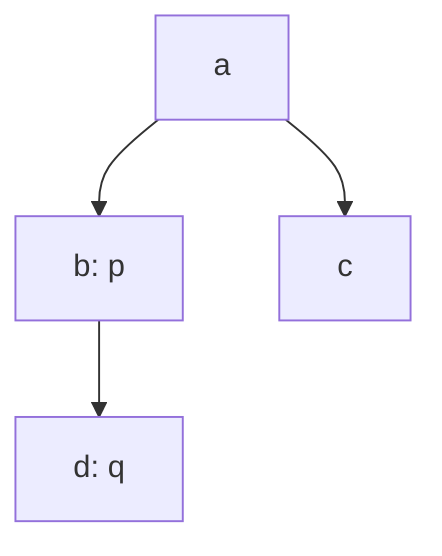
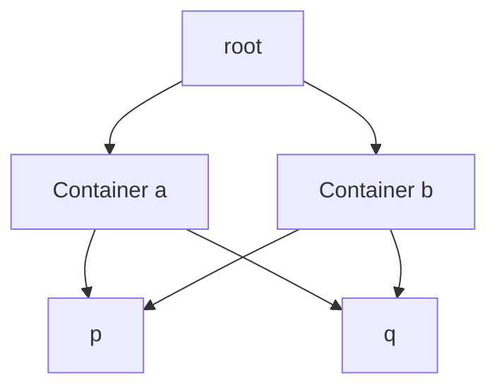

# Lowest common ancestor: return presence as well as a candidate

[Curriculum](../../../../README.md) · [Choose data structures and reason about algorithms](../../README.md) · [All coding problems](../../../../../indexes/coding.md)

Constructed practice problem; no company attribution. Prerequisites: [tree identity and depth](../17-tree-level-order/README.md) and [recursive return meaning](../18-validate-bst/README.md).

## Candidate brief

> A binary folder tree contains two selected folder objects. Return their deepest common containing folder, allowing a folder to contain itself. Either selection may have been removed from the tree. How will your traversal distinguish “found one folder” from “proved both exist”?

| Contract | Decision |
|---|---|
| Input | Binary `Node` tree root or `None`, plus two `Node` references p and q; values opaque |
| Output | Lowest common ancestor node by identity if both are reachable; otherwise `None` |
| Boundaries | p may be q; a node is its own ancestor; equal values do not imply identity |
| Invalid input | Non-node query references, malformed links, cycles, or shared-child DAGs raise `ValueError` |
| Excluded | Value/ID lookup, graph ancestor ambiguity, and concurrent mutation |

## The tool before the challenge

An ancestor is a **node object** that contains both target nodes in its subtree. Equal values do not prove identity; report absence if one queried node is missing:
```python
found_p = node is p
found_q = node is q
```
In a tree `A → {B,C}`, the lowest common ancestor of B and C is A. For B and an outside node X, the correct result is absent under this contract, not B.

### A design choice worth saying aloud

A returned candidate alone cannot prove both requested nodes exist. Carry `found_p` and `found_q` (or a two-bit presence mask) with each subtree result and return an ancestor only when both are true. Compare nodes by identity; a second object with the same value must not satisfy the request.

<!-- interview-rehearsal:start -->

## What the interviewer expects

The interviewer gives you the scenario and the contract above. Explain what a
successful call returns, walk through one example below, and name what your
state means *before* choosing a data structure.

**Done means:** Lowest common ancestor node by identity if both are reachable; otherwise `None`.

Now predict each output before looking at the reference; invalid input should
leave any existing state unchanged unless the contract says otherwise.

### Test-case scenarios to settle before coding

| Case | Exact input or state | Expected result | What it is testing |
|---|---|---|---|
| Split branches | p in left subtree, q in right | root object | The first subtree joining both presences wins. |
| Ancestor | p is an ancestor of q | the exact object p | A node is its own ancestor. |
| Same query | `p is q` and reachable | the exact p object | Presence is counted correctly once. |
| One absent | p reachable, q detached | `None` | A partial candidate is not an answer. |
| Equal values | different nodes share values | identity-based ancestor | Values cannot substitute for node identity. |
| Invalid topology | cycle/shared child/malformed query | `ValueError` | Validate even when an answer seems discoverable early. |

For each case, show which branch or state change produces that result.

<!-- interview-rehearsal:end -->

With `a.left=b`, `a.right=c`, and `b.left=d`, `lowest_common_ancestor(a, d, b) is b`.
`lowest_common_ancestor(a, d, c) is a`; querying `d` and a new absent node gives `None`.
`lowest_common_ancestor(a, d, d) is d`; passing `p=None` raises `ValueError`.

Before opening the explanation, restate the contract, trace the smallest useful
example, implement a baseline, and identify the repeated work. Then implement
your improvement independently and derive tests from the contract. Say what
your state means before saying which data structure stores it.

<details>
<summary>Worked lesson, changed requirements, and reference</summary>

### Return enough evidence for the parent to decide

A baseline finds root-to-p and root-to-q paths, then returns the last identical
node in their common prefix. Two searches cost O(n) time and O(h) path space on
a trusted tree. This is already asymptotically good; the improvement below makes
the proof compositional and visits each subtree once. Returning only “p or q
was found” is insufficient when a query can be absent: finding p alone must
not produce a valid ancestor answer.



Let each subtree return `(mask, candidate)`. Bit 1 means p occurs here; bit 2
means q occurs here. An empty subtree returns `(0, None)`. Combine the child
masks with the current node's identity matches using bitwise OR. A completed
child candidate is already lower than the current node, so preserve it. If no
child has a candidate and the combined mask is 3, the current node is the first
place both observations meet and becomes the candidate. Otherwise return None.

| Completed subtree | mask for p=b, q=d | candidate | Explanation |
|---|---:|---|---|
| d | 2 | None | only q exists here |
| b | 3 | b | own p plus child q |
| c | 0 | None | neither selection |
| a | 3 | b | preserve completed lower candidate |

When p is q, test both identity conditions independently so its node sets both
bits. At root, mask 3 proves both required references occur; otherwise return
None. Values never enter the decision. A candidate from one child cannot need
replacement by another branch in a valid tree because each query identity occurs
only once. This is precisely why the tree-versus-DAG contract matters.

The reference executes these logical recursive returns with `(node, expanded)`
stack frames: first schedule children, then combine their saved results. It
rejects repeated identities on first entry, so cycles and shared children cannot
loop or silently change semantics. Time is O(n); saved results and the identity
set use O(n) auxiliary space, plus O(h) traversal frames. A trusted recursive
version could use O(h) stack space, but Python depth limits make an explicit
stack useful for skewed input. Returned output is one existing reference.

### Follow-up 1: folders can have multiple parents

Predict why “the” lowest ancestor may no longer be unique:



Both a and b are common ancestors and neither contains the other. Choose a new
contract: return all minimal common ancestors, require a designated containment
tree, or define a deterministic policy unrelated to unique lowest depth. A DAG
solution can intersect ancestor sets and remove nonminimal members; detect or
reject cycles first. Reusing the single-candidate return state loses answers.

### Follow-up 2: answer many queries on an unchanged tree

| Node on chain r → a → b → c | Depth | 1-step ancestor | 2-step ancestor |
|---|---:|---|---|
| r | 0 | None | None |
| a | 1 | r | None |
| b | 2 | a | r |
| c | 3 | b | a |

Binary lifting stores ancestors at powers of two, aligns query depths, then
lifts both until their parents agree: O(n log n) preprocessing/space and
O(log n) per query. Membership must still be checked. A senior candidate defines
the return state, absent-node behavior, and same-node case before coding. A lead
candidate defines snapshot version and rebuild policy: reparenting a subtree
invalidates precomputed ancestry and cannot be ignored by the query API.

### Run and check

From the repository root:

```bash
cd curriculum/01-code/02-data-structures-algorithms/problems/19-lowest-common-ancestor
python -m unittest -v test_solution.py
```

[Reference implementation](solution.py) · [Contract and oracle tests](test_solution.py).
Read the tests after your attempt. A green reference suite verifies the supplied
implementation; it does not demonstrate independent transfer. Reimplement one
follow-up with the reference closed and explain which old invariant no longer holds.

</details>

[Ordered foundation route](../foundations-index.md) · [Coding home](../../practice-sequence.md)
