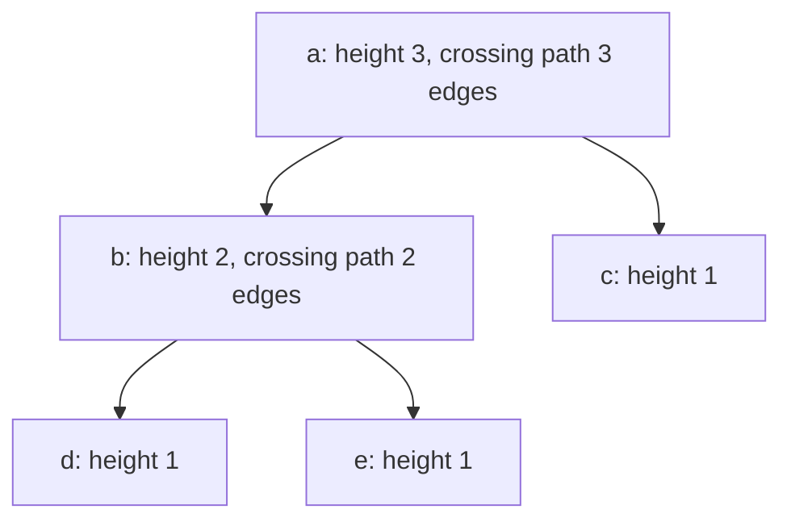
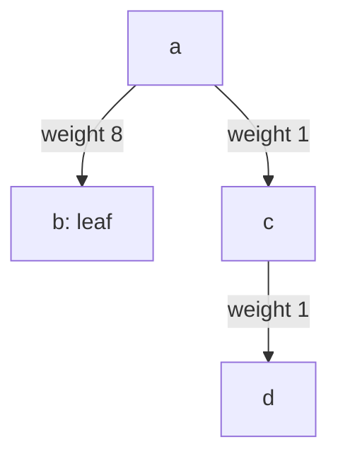

# Tree diameter: return one branch, combine two locally

[Curriculum](../../../../README.md) · [Data structures and algorithms](../../README.md) · [All coding problems](../../../../../indexes/coding.md)

Constructed practice problem; no company attribution. Prerequisites: [tree levels](../17-tree-level-order/README.md) and [postorder return state](../19-lowest-common-ancestor/README.md).

## Candidate brief

> A binary network tree needs the maximum number of edges on a simple path between any two nodes. The path may cross the root or stay entirely inside a subtree. What information can one child return that lets its parent evaluate paths crossing the parent?

| Contract | Decision |
|---|---|
| Input | Binary `Node` tree root or `None`; values opaque and irrelevant to distance |
| Output | Diameter measured in edges, as a nonnegative integer |
| Boundaries | Empty/singleton give 0; endpoints may be any nodes; no mutation |
| Invalid input | Malformed links, cycles, or shared-child DAGs raise `ValueError` |
| Excluded | Edge weights, path reconstruction, and directed reachability semantics |

For root a with children b,c and b with children d,e, `tree_diameter(a) == 3`
using d–b–a–c (or e–b–a–c). A chain of four nodes also has diameter 3.
`tree_diameter(None) == 0`; a self-child raises `ValueError`.

Before opening the explanation, restate the contract, trace the smallest useful
example, implement a baseline, and identify the repeated work. Then implement
your improvement independently and derive tests from the contract. Say what
your state means before saying which data structure stores it.

<details>
<summary>Worked lesson, changed requirements, and reference</summary>

### Separate the information returned upward from the answer here

A baseline considers every node as a possible highest point of a path and
recomputes the heights of both child subtrees. It is correct, but repeated height
walks cost O(n²) on a chain. The useful change is postorder traversal: solve
children before their parent and retain their height return values.



Define height as the number of nodes on a longest downward path from a node;
an empty child has height zero. If left and right heights are L and R, the
longest path whose highest node is current has `L + R` **edges**: each child
height counts its connecting edge to the current node plus its remaining
downward edges. The height returned to the parent is `1 + max(L, R)`, because
a path extended by a parent can continue through only one child branch.

| Completed node | Left height | Right height | Return height | Candidate diameter |
|---|---:|---:|---:|---:|
| d, e, c | 0 | 0 | 1 | 0 |
| b | 1 | 1 | 2 | 2 |
| a | 2 | 1 | 3 | 3 |

Returning `L + R + 1` as height is wrong: it would send a branching shape upward
and later count a path that visits the branch point twice. Keep a separate
maximum diameter, or return `(height, best_diameter)` with
`best=max(left_best, right_best, L+R)`. Every simple tree path has exactly one
highest node relative to the root, so checking every node's crossing candidate
covers paths entirely inside subtrees as well as those through the root.

The reference simulates recursive entry/return with an explicit expanded flag,
stores child heights, and updates one best value. It validates identities on
entry so malformed graphs cannot be treated as trees. Each node is processed
twice, giving O(n) time. Retained heights and structural identities cost O(n)
auxiliary space, plus O(h) frame space; output is O(1). A trusted recursive
variant can use O(h) auxiliary space but may exceed Python's recursion budget.
Node values and equality never affect topology or distance.

Follow each child height to its parent. Predict the returned height and local
diameter before the second return arrives; their units and purposes differ.



[Open motion study](../../../../../assets/learning/recursion-return-state.svg) ·
[Read the completed still](../../../../../assets/learning/recursion-return-state-still.svg).

### Follow-up 1: return endpoint identities as well as distance

Predict the additional return state: each downward height must also name its
deepest endpoint. When `L + R` improves the best, record the two branch endpoints,
using current itself for an empty side.

| At node b | Returned upward | Best local endpoints |
|---|---|---|
| children d and e are tied leaves | height 2 plus a deterministic choice, say d | d, e |
| caller requires actual path | endpoint pair is insufficient alone | retain parents or reconstruct afterward |

Define a tie rule using stable IDs or traversal order; comparing opaque values
cannot enforce identity ordering. A path with k edges has k+1 returned nodes.

### Follow-up 2: edges carry nonnegative weights



The edge-count diameter is three, but weighted distance b–a–c–d is ten. Each
returned branch becomes `edge_weight + child_downward_distance`; take the best
two branches locally and one upward. Empty downward distance is zero, replacing
node-count height. Allowing negative weights requires a new policy on empty
paths and endpoint distinctness before using zero as a fallback. A senior
candidate derives units and distinguishes returned height from local diameter.
A lead candidate defines weight validation, tie semantics, and snapshot ownership;
adding cross-links destroys the unique-path proof and requires a graph problem.

### Run and check

From the repository root:

```bash
cd curriculum/01-code/02-data-structures-algorithms/problems/20-tree-diameter
python -m unittest -v test_solution.py
```

[Reference implementation](solution.py) · [Contract and oracle tests](test_solution.py).
Read the tests after your attempt. A green reference suite verifies the supplied
implementation; it does not demonstrate independent transfer. Reimplement one
follow-up with the reference closed and explain which old invariant no longer holds.

</details>

[Ordered foundation route](../foundations-index.md) · [Coding home](../../practice-sequence.md)
