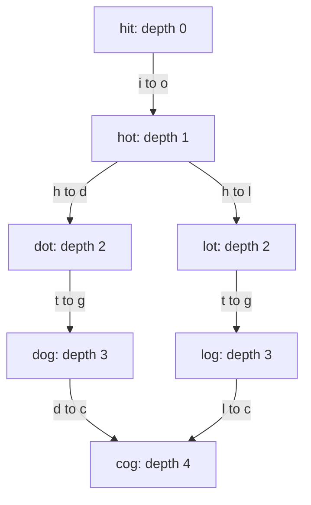
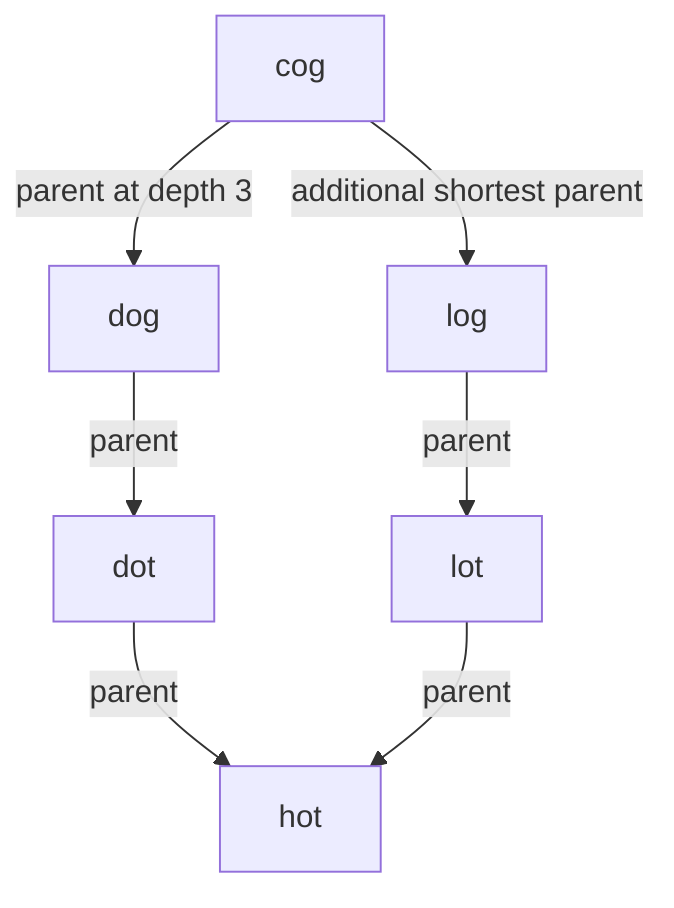

# Word ladder

[Curriculum](../../../../README.md) · [Choose data structures and reason about algorithms](../../README.md) · [All coding problems](../../../../../indexes/coding.md)

> “A word-game editor changes one letter per move. Each intermediate word must be
> in our dictionary. Players need the fewest moves between two words, including
> a path they can inspect. How would you distinguish impossible from zero moves?”

Constructed practice question. Prerequisite: [BFS](../../lessons/05-graphs.md).
A graph may be **implicit**: its edges are generated from the current word rather
than stored. Breadth-first search visits states by increasing number of moves.

| Contract | Required behavior |
|---|---|
| Input | Equal positive-length lowercase ASCII endpoints and dictionary words |
| Output | A shortest endpoint-inclusive list, or `[]` when impossible |
| Membership | Start need not be in dictionary; a different end must be |
| Boundaries | Equal endpoints return `[start]`; repeated dictionary entries collapse |
| Failure/scope | Invalid lengths/characters raise `ValueError`; no insertions or deletions |

## The tool before the challenge

A **word ladder** is a shortest-path problem: two words are adjacent only when exactly one position differs. BFS explores transformations in increasing number of changes:
```python
from collections import deque
queue = deque([("cat", 0)])
visited = {"cat"}  # mark on enqueue so a word is not queued twice
```
If the dictionary contains `cat, cot, cog, dog`, then `cat → cot → cog → dog` uses three changes. Say whether the count includes words or edges.

### A design choice worth saying aloud

The queue holds `(word, number_of_changes)` and `visited` marks words **on enqueue**, preventing two parents from scheduling the same state. This is correct because all transformations cost one change; weighted edits would require a different frontier. Define whether length means words or changes before reporting 3 for `cat → cot → cog → dog`.

<!-- interview-rehearsal:start -->

## What the interviewer expects

The interviewer gives you the scenario and the contract above. Explain what a
successful call returns, walk through one example below, and name what your
state means *before* choosing a data structure.

**Done means:** A shortest endpoint-inclusive list, or `[]` when impossible.

Now predict each output before looking at the reference; invalid input should
leave any existing state unchanged unless the contract says otherwise.

### Test-case scenarios to settle before coding

| Case | Exact input or state | Expected result | What it is testing |
|---|---|---|---|
| Representative | start `hit`, end `cog`, words `{hot,dot,dog,lot,log,cog}` | `[hit,hot,dot,dog,cog]` or the equally short path via `lot,log` | Four changes, five returned words. |
| Same endpoint | `same` to `same` | `["same"]` | Zero transformations still includes the endpoint. |
| Missing end | `hit` to `cog`, words `{hot,dot,dog}` | `[]` | A different end must be admitted. |
| Unreachable | `hit` to `cog`, words `{hot,cog}` | `[]` | Both are valid words but not connected. |
| Duplicates | dictionary repeats a word | same path semantics | Repeated entries do not create states. |
| Invalid | mixed lengths or non-lowercase ASCII | `ValueError` | Neighbor generation depends on the alphabet contract. |

For each case, show which branch or state change produces that result.

<!-- interview-rehearsal:end -->

`hit → cog` using `{hot,dot,dog,lot,log,cog}` has four moves, with answer
`[hit,hot,dot,dog,cog]`. The equally short route through lot/log is also valid.
With only `{hot,cog}`, return `[]`. Clarify whether all shortest paths are needed;
returning one predecessor per word deliberately answers only one-path queries.



Try an independent implementation. Explain when a word becomes visited and whether
two parents are allowed to enqueue it before you open the solution.

<details>
<summary>Solution, representation choice, and follow-ups</summary>

The direct baseline compares every pair of dictionary words and stores an edge
when exactly one character differs. For N words of length L this costs O(N²L),
even if the reachable component is tiny. DFS can find a route but its first route
need not be shortest: exploration order can follow a long detour first.

Instead generate each one-character replacement on demand. Check membership in a
set, mark the word discovered immediately, and save its parent. The BFS queue
contains the current distance layer followed by the next. **Invariant:** the first
discovery of a word fixes its minimum move count, because every generating parent
has the smallest unprocessed distance. Marking only on removal permits duplicate
queue entries and redundant parent assignment.

| Removed word | Newly discovered | Saved parent evidence |
|---|---|---|
| hit | hot | hot ← hit |
| hot | dot, lot | both ← hot |
| dot, lot | dog, log | dog ← dot; log ← lot |
| dog | cog | cog ← dog; reconstruct backward |

The fixed 26-letter alphabet does not make Python string creation free. Each of
26L candidates costs O(L) to construct/hash, giving O(NL²) search time in the
worst case, plus O(NL) input validation. Stored dictionary and discovered strings
use O(NL) space; parent/queue entries add O(N). The returned path uses O(PL) if its
strings are counted, with P words. No quadratic adjacency table is retained.

**Follow-up 1 — return every shortest path.** Predict what is lost when cog stores
only dog. Save *all* parents at the preceding depth, finish the entire winning
layer, and traverse the resulting parent DAG. Output may be exponential; report
output-sensitive bounds rather than promising linear total work.



**Follow-up 2 — large dictionary, one pair.** Bidirectional BFS expands the smaller
frontier from start/end and joins compatible layers. Keep separate visited/depth
maps and reconstruct both halves. It can reduce explored states but does not
remove the need to account for neighbor generation or prove the stopping rule.

Senior depth is deriving the implicit graph and proving shortestness. Lead depth
adds dictionary versioning and query-memory limits if this becomes a service.

Reference: [solution.py](solution.py); tests validate actual edges, optimal length,
unreachable endpoints, identity, duplicates, and malformed words.

```bash
python -m unittest discover -s curriculum/01-code/02-data-structures-algorithms/problems/22-word-ladder -p 'test_*.py'
```

</details>
