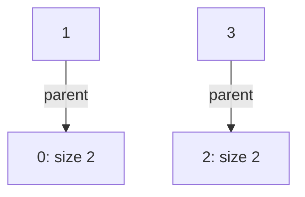
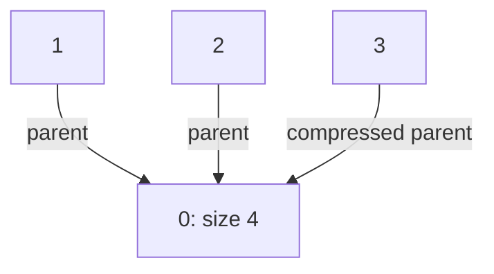

# Connectivity under added links

[Curriculum](../../../../README.md) · [Choose data structures and reason about algorithms](../../README.md) · [All coding problems](../../../../../indexes/coding.md)

> “A network simulator adds undirected links between numbered machines. After each
> addition, users ask whether two machines belong to the same connected component.
> We do not need the route itself. Can you avoid searching the network each time?”

Constructed practice question. Prerequisite: [graphs](../../lessons/05-graphs.md).
A component is a maximal set of mutually reachable vertices. A **disjoint-set**
structure stores a partition: every vertex belongs to exactly one component.

| Contract | Required behavior |
|---|---|
| Input | Fixed vertices `0..n-1`; `union(a,b)`, `connected(a,b)`, `find(a)` |
| Output | Union returns whether two components merged; connectivity returns a boolean |
| Boundaries | Self/repeated links do not change component count; n=0 is valid |
| Failure | Negative/noninteger size (including bool) raises `ValueError`; noninteger or unknown vertex raises `IndexError` |
| Scope | Links only added; no route reconstruction, removals, or concurrency |

## The tool before the challenge

A disjoint-set structure answers whether two items belong to the same connected group as new edges are added. Each group has one **representative**:
```python
parent = {"A":"A", "B":"B", "C":"C"}
parent["B"] = "A"  # union A and B in this tiny example
print(parent["A"] == parent["B"])  # True
```
A full `find` follows parent links and compresses paths; the snippet only illustrates storage. Adding B–C later must connect A and C transitively, not merely the last pair.

### A design choice worth saying aloud

`parent` is the representation, not the connectivity answer: `find(vertex)` follows parents to the representative and compresses the path. A separate `size_by_root` is meaningful only for current representatives and helps bound tree depth. If link removals are added, this structure does not undo unions; surface that limitation early.

<!-- interview-rehearsal:start -->

## What the interviewer expects

The interviewer gives you the scenario and the contract above. Explain what a
successful call returns, walk through one example below, and name what your
state means *before* choosing a data structure.

**Done means:** Union returns whether two components merged; connectivity returns a boolean.

Now predict each output before looking at the reference; invalid input should
leave any existing state unchanged unless the contract says otherwise.

### Test-case scenarios to settle before coding

| Case | Exact input or state | Expected result | What it is testing |
|---|---|---|---|
| Initial | fresh set of n vertices | `connected(a,b)` false when a≠b | Every vertex starts as its own component. |
| Merge | `union(0,3)` | `True`; now connected | A successful union reduces component count once. |
| Repeat | same union again | `False` | Idempotence avoids double accounting. |
| Self link | `union(2,2)` | `False` | A vertex already shares its own component. |
| Empty universe | `n=0` | construction succeeds; any lookup is out of range | Empty is valid, phantom vertices are not. |
| Bounds | negative or `n` index | `IndexError`; state unchanged | Python negative indexing is not allowed here. |

For each case, show which branch or state change produces that result.

<!-- interview-rehearsal:end -->

With four vertices, add `(0,1)` then `(2,3)`: there are two components and
`connected(0,3)` is false. Add `(1,2)` and it becomes true with one component.
Adding `(0,3)` again returns false. Asking about vertex 4 must fail, not silently
create a new vertex. Component representatives are implementation details.



Implement independently. First explain why parent pointers cannot form a cycle.
Then predict which metadata is valid only on roots.

<details>
<summary>Solution, forest invariants, and follow-ups</summary>

An adjacency-list baseline runs BFS for each query, O(V + E) per query. Another
baseline labels every vertex by component and rewrites all labels on a merge,
costing O(V) per successful union. Both are reasonable for small workloads, but
neither uses the addition-only contract to avoid repeated work.

Represent each component as a rooted tree. A root points to itself. `find` follows
parents to the root and then rewrites traversed parents directly to that root
(path compression). `union` finds both roots; equal roots mean no change.
Otherwise attach the smaller root under the larger root and add their sizes.

**Invariant:** following parent pointers ends at exactly one root, and two vertices
are connected exactly when those roots match. Linking *roots from different
trees* cannot create a cycle. Compression preserves the reached root, so it changes
representation without changing connectivity. Sizes are authoritative at roots
only; reading an old child's size as a component size is a bug.

| Operation | Representative of 3 | Components | Reason |
|---|---:|---:|---|
| union(0,1), union(2,3) | 2 | 2 | Two pairs |
| union(1,2) | 0 via 2 | 1 | Equal sizes; attach root 2 to 0 |
| find(3) | 0 directly | 1 | Compress path; partition unchanged |

Initialization is O(V) time/space. Union by size alone bounds depth by O(log V):
a vertex's tree at least doubles whenever its depth increases. With compression,
a sequence of M operations costs O((V + M) α(V)), where inverse Ackermann α grows
extremely slowly. This is an amortized bound, not a claim that every operation has
one step. The iterative implementation uses O(1) auxiliary space per operation.

**Follow-up 1 — inspect compression.** Predict 3's parent after `find(3)` and draw
the changed forest. Connectivity remains identical while future lookups shorten.



**Follow-up 2 — remove a link.** A parent pointer is not an original network edge;
deleting it cannot correctly split the graph. For infrequent removals, rebuild
components from retained edges. For offline additions/removals, discuss interval
processing with rollback DSU, usually avoiding compression so changes are undoable.
An online fully dynamic graph is a different problem and needs a new contract.

Senior depth includes an independent BFS/component-label oracle and careful
amortized bounds. Lead depth asks whether addition-only semantics actually fit the
product before choosing this compact representation.

Reference: [solution.py](solution.py). Tests include seeded component-label
comparison, repeat/self links, compression, and invalid vertices.

```bash
python -m unittest discover -s curriculum/01-code/02-data-structures-algorithms/problems/23-disjoint-set-connectivity -p 'test_*.py'
```

</details>
