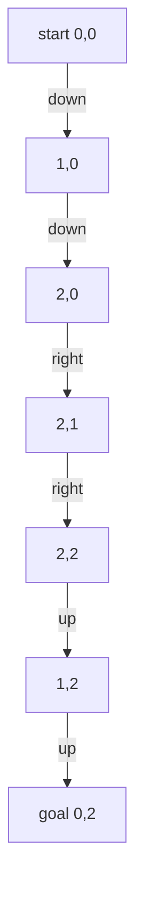
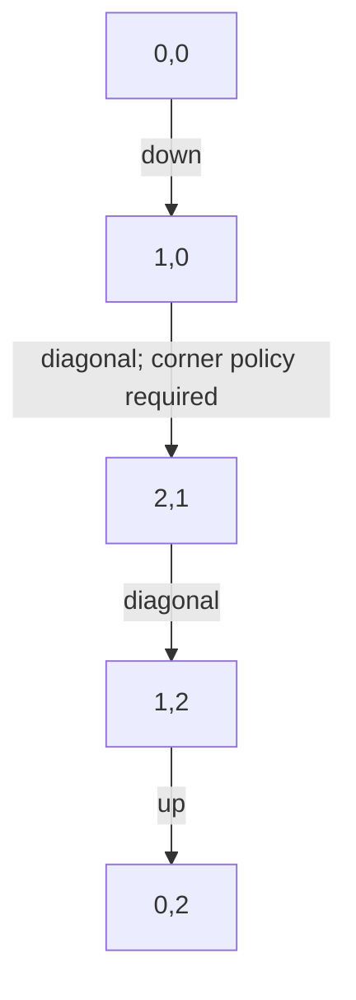

# Shortest path through a grid

[Curriculum](../../../../README.md) · [Data structures and algorithms](../../README.md) · [All coding problems](../../../../../indexes/coding.md)

> “Our warehouse viewer marks open cells and shelves. A picker moves one cell
> north, south, east, or west, with each move costing one step. Return the shortest
> route between two positions without changing the displayed map. What happens
> if a position is blocked or no route exists?”

Constructed practice question. Prerequisite: [BFS](../../lessons/05-graphs.md).
A cell `(row,column)` is a graph vertex; legal adjacent moves are edges. The grid
supplies neighbors implicitly, so no separate adjacency list is necessary.

| Contract | Required behavior |
|---|---|
| Input | Nonempty rectangular 0/1 grid; two in-bounds integer coordinates |
| Output | Endpoint-inclusive shortest coordinate list; any shortest route accepted |
| Boundaries | 0 is open; 1 is wall; blocked/unreachable endpoints return `[]` |
| Failure | Empty/ragged grid, other cell values, or out-of-bounds endpoints raise `ValueError` |
| Scope | No diagonal moves, weighted terrain, moving walls, or input mutation |

<!-- interview-rehearsal:start -->

## What the interviewer expects

The opening scenario is the product context; the table above is the callable
contract. Your job is to connect them. Before coding, say what the output means,
walk one normal case and one case that could disprove a tempting shortcut, then
name the invariant your implementation will preserve. Start with a correct
baseline, improve it deliberately, and derive time and space from actual work.

**Done means:** Endpoint-inclusive shortest coordinate list; any shortest route accepted.

Passing the happy path alone is not done; your answer
must make a deliberate decision for every scenario below without mutating input
unless the contract explicitly permits it.

### Test-case scenarios to settle before coding

| Case | Exact input or state | Expected result | What it is testing |
|---|---|---|---|
| Representative | open grid with a wall forcing a detour | an endpoint-inclusive shortest coordinate path | BFS discovers by distance layers. |
| Same endpoint | open start equals goal | one-coordinate path | Distance zero still includes the point. |
| Blocked endpoint | start or goal cell is 1 | `[]` | Blocked is valid input but unsolvable. |
| Unreachable | walls separate the endpoints | `[]` | Failure is not an exception. |
| Tie | two equal shortest routes | either valid shortest route | Do not overfit an unspecified tie. |
| Invalid/atomic | empty/ragged grid or bad coordinate | `ValueError`; grid unchanged | Validate shape and bounds. |

Do not merely list these cases in an interview. For each one, point to the branch,
state transition, or invariant that makes the expected result inevitable. If your
design cannot explain a row, the design is not finished yet.

<!-- interview-rehearsal:end -->

For rows `[[0,1,0],[0,1,0],[0,0,0]]`, start `(0,0)` and goal `(0,2)` require six
moves around the shelf. The path is `[(0,0),(1,0),(2,0),(2,1),(2,2),(1,2),(0,2)]`.
In `[[0,1,0]]` the same endpoints are unreachable. Ask whether distance alone
would suffice: route output requires retaining reconstruction information.



Before reading further, hand-label each open cell with its shortest distance from
the start. Then implement a path-returning solution and test start equals goal.

<details>
<summary>Solution, distance layers, and follow-ups</summary>

Enumerating every simple route and keeping the shortest is a correct baseline but
can explore exponentially many routes on an open grid. Greedily moving toward
the goal fails immediately on the pictured shelf: the first required move increases
Manhattan distance. DFS's first path is also not necessarily shortest.

Use a FIFO queue and a parent map. Insert the start with no parent. When visiting
a cell, generate the four neighbors, discard outside/wall/discovered positions,
record the parent, and enqueue. On reaching the goal, follow parent links backward
and reverse. Never mark the input grid, because the caller still displays it.

**Invariant:** cells leave the queue in nondecreasing distance, and each saved
parent is one step closer to the start. First discovery is shortest because no
later parent can have a smaller distance. Mark on enqueue to bound the frontier;
otherwise two neighboring cells can enqueue the same position repeatedly.

| Grid row | Column 0 distance | Column 1 | Column 2 distance |
|---|---:|---|---:|
| 0 | 0 | wall | 6 |
| 1 | 1 | wall | 5 |
| 2 | 2 | 3 | 4 |

For R rows and C columns, validation/search take O(RC) time. Parent map and queue
use O(RC) auxiliary space in the worst case; the returned route uses O(P) for P
cells. Copying a full path into every queue entry would add avoidable path-length
cost. Parent pointers retain exactly the information reconstruction needs.

**Follow-up 1 — allow diagonal moves.** Predict the new shortest distance. If
corner cutting is allowed, the pictured route drops to four moves through the
bottom middle cell. If diagonals may not pass between a shelf and a boundary,
neighbor generation must check the adjacent orthogonal cells too. Define this
policy before changing the algorithm.



**Follow-up 2 — terrain costs vary.** FIFO layers now measure moves, not cost. Use
[Dijkstra](../25-weighted-shortest-path/README.md) for nonnegative costs and define
whether cost belongs to entering a cell or traversing an edge. A* may reduce
exploration with an admissible heuristic; the correctness claim must name that
heuristic and the movement rules.

Senior depth is connecting neighbor policy, the shortestness proof, and tests for
mutation/unreachability. Lead depth adds map-version consistency for live requests.

Reference: [solution.py](solution.py); tests verify a forced detour, open-grid
distance, unchanged input, blocked endpoints, and malformed maps.

```bash
python -m unittest discover -s curriculum/01-code/02-data-structures-algorithms/problems/24-grid-shortest-path -p 'test_*.py'
```

</details>
