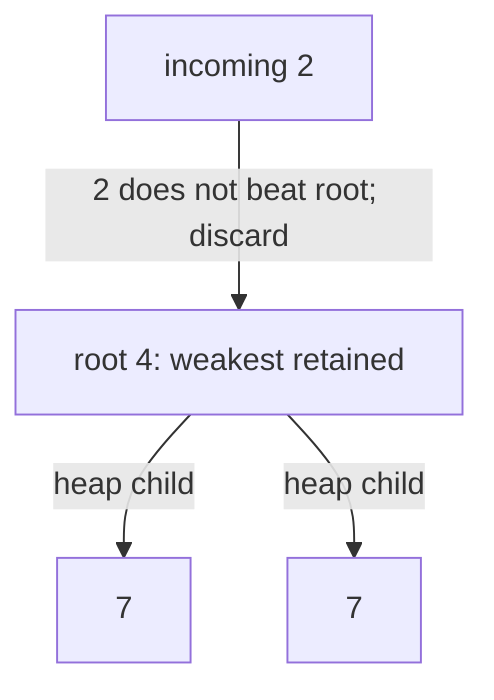
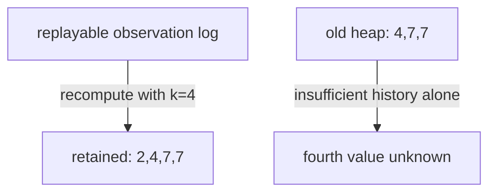

# Top k observations in a stream

[Curriculum](../../../../README.md) · [Data structures and algorithms](../../README.md) · [All coding problems](../../../../../indexes/coding.md)

> “An operations screen receives integer latency samples indefinitely and displays
> the largest k seen so far. Keeping every sample exhausts memory. Preserve exact
> results after every arrival while retaining at most k samples. Do repeated values
> count separately, and what should happen before k arrivals?”

Constructed practice question. Prerequisite: [heaps](../../lessons/06-heaps.md).
A min-heap keeps its smallest member at the root. Its internal array is only
partially ordered; reading that array is not the same as a sorted answer.

| Contract | Required behavior |
|---|---|
| Input | Nonnegative integer k; integer observations through `add(value)` |
| Output | `largest()` returns up to k values in descending order |
| Boundaries | Duplicates count; k=0 retains nothing; negative samples allowed |
| Failure | Negative/noninteger k or noninteger sample raises `ValueError` |
| Scope | All history; fixed k; no deletion, timestamps, or distinct-only semantics |

<!-- interview-rehearsal:start -->

## What the interviewer expects

The opening scenario is the product context; the table above is the callable
contract. Your job is to connect them. Before coding, say what the output means,
walk one normal case and one case that could disprove a tempting shortcut, then
name the invariant your implementation will preserve. Start with a correct
baseline, improve it deliberately, and derive time and space from actual work.

**Done means:** `largest()` returns up to k values in descending order.

Passing the happy path alone is not done; your answer
must make a deliberate decision for every scenario below without mutating input
unless the contract explicitly permits it.

### Test-case scenarios to settle before coding

| Case | Exact input or state | Expected result | What it is testing |
|---|---|---|---|
| No arrivals | fresh `TopK(3)` | `[]` | A query does not invent values. |
| Fewer than k | add 4,1 to k=3 | `[4,1]` | Return only observed values. |
| More than k | add 4,1,7,3 to k=2 | `[7,4]` | Only the retained frontier matters. |
| Duplicates | add 5,5,4 to k=2 | `[5,5]` | Observations are not distinct keys. |
| Zero k | add any values to k=0 | `[]` | Nothing is retained. |
| Invalid/atomic | boolean sample or negative k | `ValueError`; prior snapshot unchanged | Failed input must not corrupt retained state. |

Do not merely list these cases in an interview. For each one, point to the branch,
state transition, or invariant that makes the expected result inevitable. If your
design cannot explain a row, the design is not finished yet.

<!-- interview-rehearsal:end -->

For k=3 and arrivals `[4,1,7,7,2]`, the successive answers are `[4]`, `[4,1]`,
`[7,4,1]`, `[7,7,4]`, `[7,7,4]`. Distinct-only `[7,4,2]` would violate the contract.
After zero arrivals return `[]`; an invalid sample must leave retained state intact.



Before reading the solution, explain why a *min*-heap helps find the largest
values. Implement arrival and presentation as separate operations.

<details>
<summary>Solution, exchange argument, and follow-ups</summary>

The baseline appends to an unbounded list and sorts after every arrival. For n
arrivals it retains O(n) values and costs O(n log n) for one complete snapshot.
Keeping a sorted array of k values bounds memory but requires O(k) shifts on an
insertion. If k is tiny that may be an acceptable, simpler choice.

Use a min-heap of at most k observations. Fill it initially. Once full, compare an
arrival with the smallest retained value: discard anything no larger, or replace
the root and restore the heap. Equal values need no replacement because observation
identity is excluded; the multiset result is unchanged.

**Invariant:** after each arrival, the heap's multiset equals the largest
min(k,n) observations of the processed prefix. An incoming value below the cutoff
cannot displace a winner. A value above it must replace one weakest winner. This
exchange argument proves exactness without sorting historical losers.

| Arrival | Heap as a multiset | Decision |
|---:|---|---|
| 4, 1, 7 | {1,4,7} | Fill three slots |
| 7 | {4,7,7} | Replace cutoff 1 |
| 2 | {4,7,7} | Discard below cutoff 4 |

Each `add` costs O(log(k + 1)) worst case and O(1) for a discarded value. Retained
state is O(k). `largest()` costs O(k log(k + 1)) time and O(k) additional space for
a sorted snapshot; the caller cannot mutate the heap through that snapshot. Across
n adds the bound is O(n log(k + 1)), with the k=0 branch taking O(n) total work.

**Follow-up 1 — k grows from 3 to 4.** Predict the fourth-largest value after the
example. It is 2, already discarded. A larger heap cannot reconstruct lost history.
Retain a declared maximum k, replay an external log, or explicitly reset the query.



**Follow-up 2 — last five minutes only.** Expiration can remove a winner and reveal
a previously discarded sample. Keep a window-aware ordered multiset or two heaps
with delayed deletion and bounded cleanup. Timestamp storage and tie identities
become necessary; attaching timestamps only to the existing k winners is insufficient.

Senior depth separates update/query complexity and proves multiset behavior.
Lead depth defines retention and approximation policies before promising bounded
memory for changing windows or k values.

Reference: [solution.py](solution.py). Tests compare every seeded prefix against
sorting, check k=0/large k, duplicates, negatives, and independent snapshots.

```bash
python -m unittest discover -s curriculum/01-code/02-data-structures-algorithms/problems/26-top-k-stream -p 'test_*.py'
```

</details>
