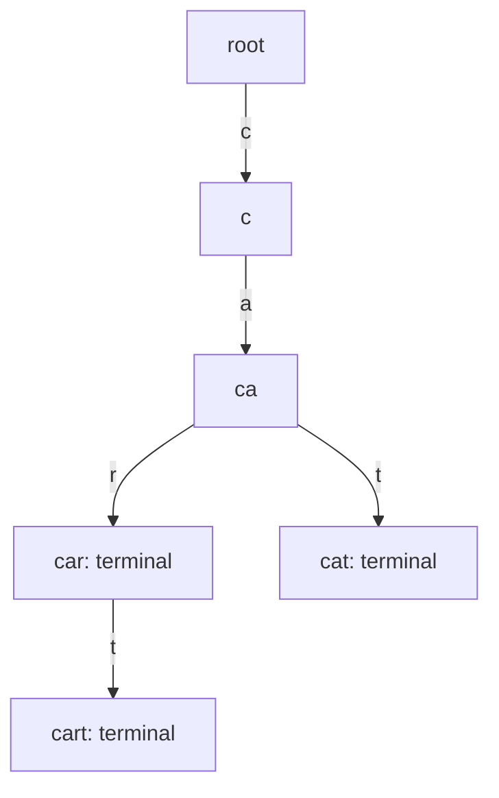
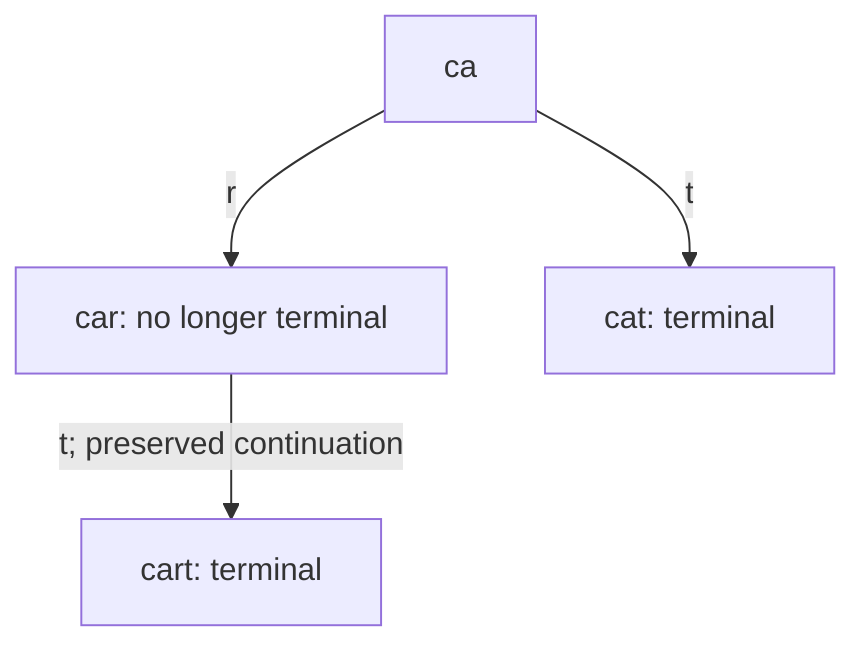

# Prefix autocomplete

[Curriculum](../../../../README.md) · [Data structures and algorithms](../../README.md) · [All coding problems](../../../../../indexes/coding.md)

> “An editor suggests dictionary words after a user types a prefix. Repeatedly
> scanning the whole dictionary wastes work. Build a reusable index that returns
> at most k matching words in lexical order. A word may also be a prefix of another
> word, so how will your structure remember both facts?”

Constructed practice question. Prerequisite: [tries and search](../../lessons/09-search.md).
A trie stores one character per edge; the path from the root spells a prefix.
A terminal marker records a complete word independently of whether children exist.

| Contract | Required behavior |
|---|---|
| Input | Nonempty lowercase ASCII words; `add(word)` and `suggest(prefix,limit)` |
| Output | Up to limit unique matching words, ascending lexicographic order |
| Boundaries | Empty prefix means all words; zero limit/no match gives `[]`; duplicate adds collapse |
| Failure | Invalid characters/empty added word/negative limit raise `ValueError` |
| Scope | Exact prefix, fixed alphabet; no popularity, fuzzy matching, or removal |

<!-- interview-rehearsal:start -->

## What the interviewer expects

The opening scenario is the product context; the table above is the callable
contract. Your job is to connect them. Before coding, say what the output means,
walk one normal case and one case that could disprove a tempting shortcut, then
name the invariant your implementation will preserve. Start with a correct
baseline, improve it deliberately, and derive time and space from actual work.

**Done means:** Up to limit unique matching words, ascending lexicographic order.

Passing the happy path alone is not done; your answer
must make a deliberate decision for every scenario below without mutating input
unless the contract explicitly permits it.

### Test-case scenarios to settle before coding

| Case | Exact input or state | Expected result | What it is testing |
|---|---|---|---|
| Representative | add car,card,cat; suggest `car`, 5 | `["car","card"]` | A terminal prefix word remains a suggestion. |
| Limit | same data; suggest `car`, 1 | `["car"]` | Stop after enough lexicographic results. |
| Empty prefix | suggest `""`, 5 | first five words globally | The root represents all words. |
| Duplicate add | add car twice | car appears once | Dictionary membership is unique. |
| No match/zero limit | prefix z or limit 0 | `[]` | Both are normal results. |
| Invalid | uppercase/empty added word or negative limit | `ValueError` | The fixed alphabet contract is enforced. |

Do not merely list these cases in an interview. For each one, point to the branch,
state transition, or invariant that makes the expected result inevitable. If your
design cannot explain a row, the design is not finished yet.

<!-- interview-rehearsal:end -->

Adding `[cart,cat,car,dog,car]` gives `suggest('ca',5) = [car,cart,cat]` and
`suggest('car',1) = [car]`. `suggest('z',5)` returns `[]`; `'Car'` is rejected rather
than silently lowercased. Ask whether lexical ordering is truly desired: popularity
ranking changes what can be pruned during traversal.



Implement independently. Predict whether clearing car's terminal marker would
remove cart, and explain why that differs from deleting the entire car node.

<details>
<summary>Solution, traversal order, and follow-ups</summary>

The baseline filters all N words with `startswith(prefix)` and sorts matches.
It may be adequate for a small immutable dictionary, but every keystroke revisits
unrelated words. A sorted word array plus binary search is a worthwhile alternative
when updates are rare; a trie makes shared prefixes explicit and supports insertion.

Insertion follows/creates character edges and marks the final node terminal.
Lookup first follows the prefix in O(P) steps. If an edge is missing, return empty.
Otherwise perform depth-first traversal beneath that node, visiting terminal words
before their descendants and child edges in sorted order. Stop after k outputs.

**Invariant:** the current character path exactly spells the current trie node,
and every word in its subtree starts with that path. Sorted child traversal emits
lexicographic order; emitting the terminal first puts car before cart. The explicit
iterator stack restores the character path on return and avoids Python's recursion
limit for long words. No complete prefix string is copied at every intermediate node.

| Visit | Terminal? | Output so far |
|---|---|---|
| ca | no | [] |
| car | yes | [car] |
| cart | yes | [car,cart] |
| cat | yes | [car,cart,cat] |

Let W be total inserted characters, P prefix length, S visited subtree nodes,
L maximum word length, and B total output characters. Build costs O(W) time/space.
Query time is O(P + S + B) for the fixed 26-character alphabet; sorting each node's
at-most-26 children is constant bounded work per visit. Query auxiliary space is
O(L), excluding O(B) output, because only the current path and its iterator frames
are retained. A large alphabet would add child-sorting costs explicitly.

**Follow-up 1 — remove car but retain cart.** Predict the changed trie. Clear the
terminal flag at car; prune a node only when it is nonterminal and childless.
Removing cart afterward allows pruning back until another word or branch survives.



**Follow-up 2 — rank by popularity.** Lexical early stopping no longer finds the
best k. Store/cache ranked candidates at prefix nodes, or explore using subtree
score bounds. Score updates, ties, and deletions determine maintenance cost; merely
sorting the first k lexical results is incorrect.

Senior depth includes terminal-versus-branch reasoning, bounded output traversal,
and an independent filter/sort oracle. Lead depth addresses normalization and
index-update/version contracts before adding international text or live ranking.

Reference: [solution.py](solution.py); tests cover prefix words, duplicate adds,
limits, missing prefixes, dynamic insertion, and a 2,000-character word.

```bash
python -m unittest discover -s curriculum/01-code/02-data-structures-algorithms/problems/30-trie-autocomplete -p 'test_*.py'
```

</details>
