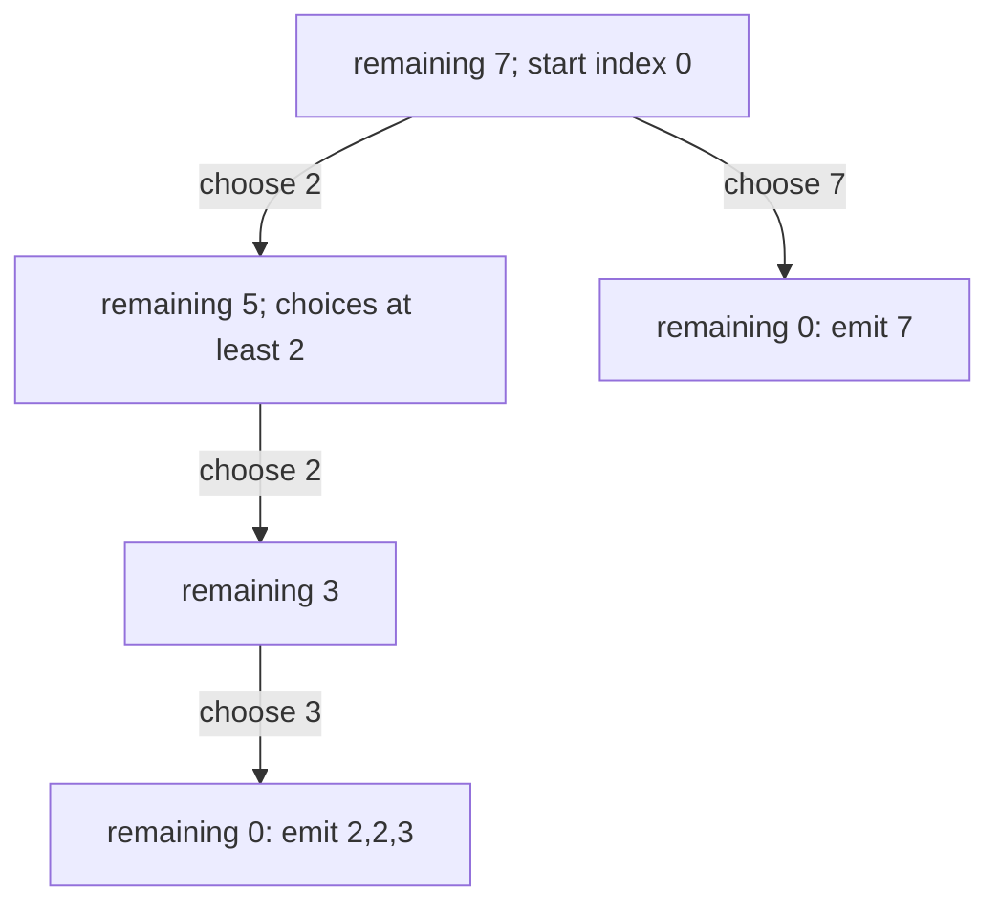
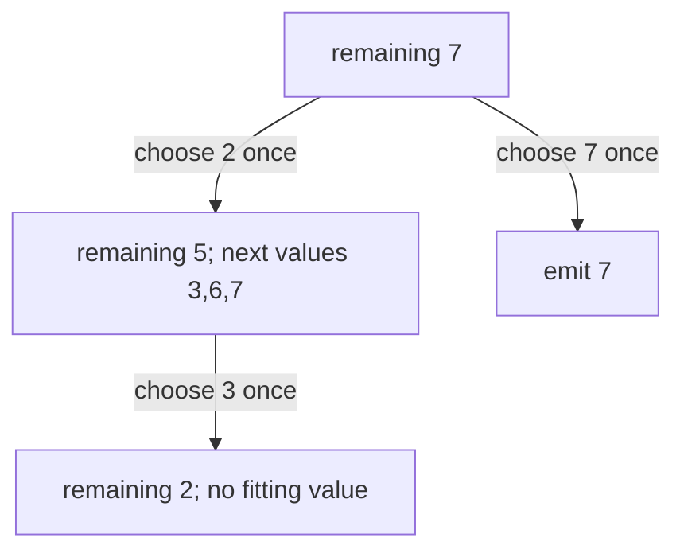

# Search for unique combinations

[Curriculum](../../../../README.md) · [Data structures and algorithms](../../README.md) · [All coding problems](../../../../../indexes/coding.md)

> “A package builder fills an exact capacity using reusable positive-size blocks.
> Users want every distinct combination, not every ordering of the same blocks.
> Produce inspectable answers without returning `[2,3,2]` again when `[2,2,3]`
> already exists. What assumptions make the search terminate?”

Constructed practice question. Prerequisite: [backtracking](../../lessons/09-search.md).
Backtracking extends a partial choice, explores its consequences, and restores
the earlier state before trying a sibling choice. Canonical order avoids duplicate
representations rather than removing duplicates after generating them.

| Contract | Required behavior |
|---|---|
| Input | Positive integer candidate sizes; nonnegative integer target |
| Output | All nondecreasing combinations summing to target, in lexical order |
| Reuse | Unlimited copies; repeated input candidates collapse |
| Boundaries | Target 0 gives `[[]]`; impossible target gives `[]` |
| Failure/scope | Zero/negative/noninteger candidates raise `ValueError`; no negative sizes |

`candidates=[2,3,6,7,2], target=7` returns `[[2,2,3],[7]]`. Target 5 with `[4,6]`
returns `[]`. Zero-sized blocks must be rejected: repeatedly selecting zero would
never reduce remaining capacity. Ask whether each candidate can instead be used
once; that changes the state transition, not merely the output formatting.



Implement before opening the answer. Explain why forbidding smaller subsequent
candidates loses no combination but removes permutations.

<details>
<summary>Solution, restoration, and follow-ups</summary>

A baseline tries every ordered sequence up to the target, sorts each successful
sequence, and deduplicates the results. It repeatedly explores equivalent states:
2+2+3, 2+3+2, and 3+2+2 all consume the same capacity. Memoizing only remaining
capacity also loses the information needed to enforce allowed candidate order.

Sort and deduplicate candidates. A state holds the remaining sum and the first
candidate index allowed next. Choosing index i recurses with the *same* lower
bound i, permitting reuse. Values exceeding the remainder prune all later values
because the array is sorted. Emit a copy of the path only at remainder zero.

**Invariant:** the path is nondecreasing, its sum plus remaining equals target,
and every continuation uses an index at least the last choice. Every multiset has
exactly one sorted representation, so it appears once. Positive values strictly
decrease remaining, proving termination. The reference uses explicit frames and
one mutable path, preserving recursive reasoning without a recursion-depth limit.

| Frame event | Path | Restoration needed |
|---|---|---|
| Choose 2,2,3 | [2,2,3] | Emit a copy |
| Return from zero remainder | [2,2] | Pop last choice |
| Exhaust remaining-3 frame | [2] | Restore parent before trying 3 |

Let m be supplied candidates, k distinct candidates, D=floor(target/minimum),
N explored prefix states, and B total output entries. Time is O(m + k log k + N + B), auxiliary space O(k + D),
and output space O(B). A loose worst-case search bound is O((k + 1)^D); reporting
only O(target × k) would confuse enumeration with a counting DP. Empty candidates
are handled separately without a minimum. Very large outputs remain expensive.

**Follow-up 1 — each distinct size may be selected once.** Predict the example:
`[2,2,3]` disappears and `[7]` remains. Move the lower bound to i+1 after selection.
If repeated input entries represent separate inventory units, do not deduplicate;
instead skip equal sibling choices while retaining their multiplicities.



**Follow-up 2 — return the number only.** Use DP with candidates outside and amounts
inside the loops to count unordered combinations. Reversing loop order counts
ordered sequences. Demonstrate the difference for target 3 with `[1,2]`: two
combinations versus three sequences.

Senior depth derives canonical state and restoration. Lead depth defines result
limits, pagination, and cancellation before exposing exponential enumeration.

Reference: [solution.py](solution.py); tests compare independent count-vector
enumeration, verify duplicates/zero/impossible inputs, and exercise a deep path.

```bash
python -m unittest discover -s curriculum/01-code/02-data-structures-algorithms/problems/31-combination-search -p 'test_*.py'
```

</details>
