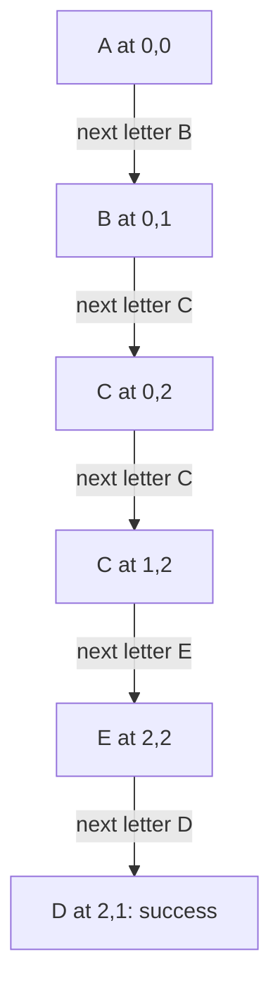
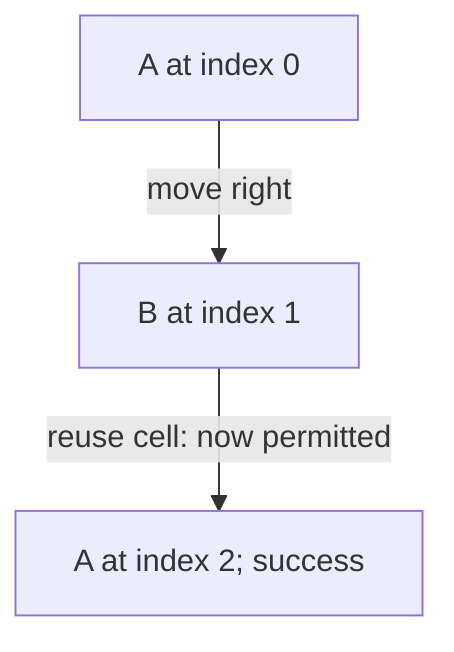

# Find a word without reusing a cell

[Curriculum](../../../../README.md) · [Data structures and algorithms](../../README.md) · [All coding problems](../../../../../indexes/coding.md)

> “A puzzle board contains one character per cell. A word is present if a path of
> horizontal or vertical neighboring cells spells it. A cell cannot appear twice
> in the same path. Return whether any path exists, and leave the board usable for
> another query. Which visited state belongs to one attempt rather than all attempts?”

Constructed practice question. Prerequisite: [backtracking](../../lessons/09-search.md)
and [grid modeling](../24-grid-shortest-path/README.md). Unlike ordinary reachability,
the allowed next moves depend on which cells the current path already consumed.

| Contract | Required behavior |
|---|---|
| Input | Rectangular board of one-character strings; case-sensitive string word |
| Output | Boolean existence of an orthogonal path with no repeated cell |
| Boundaries | Empty word is true even on empty board; nonempty word on empty board is false |
| Failure | Ragged board or invalid cells/word type raise `ValueError` |
| Scope | No diagonal moves, wildcard characters, mutation, or all-path enumeration |

<!-- interview-rehearsal:start -->

## What the interviewer expects

The opening scenario is the product context; the table above is the callable
contract. Your job is to connect them. Before coding, say what the output means,
walk one normal case and one case that could disprove a tempting shortcut, then
name the invariant your implementation will preserve. Start with a correct
baseline, improve it deliberately, and derive time and space from actual work.

**Done means:** Boolean existence of an orthogonal path with no repeated cell.

Passing the happy path alone is not done; your answer
must make a deliberate decision for every scenario below without mutating input
unless the contract explicitly permits it.

### Test-case scenarios to settle before coding

| Case | Exact input or state | Expected result | What it is testing |
|---|---|---|---|
| Representative | board contains an orthogonal spelling | `True` | A path may turn. |
| No cell reuse | word needs the same cell twice | `False` | Visited state belongs to the current path. |
| Backtrack | first matching prefix dead-ends; later start succeeds | `True` | Restore state before exploring alternatives. |
| Empty word | any board, including empty | `True` | No cells are required. |
| Empty board | nonempty word | `False` | Valid but unsatisfiable. |
| Invalid/atomic | ragged board or multi-character cell | `ValueError`; board unchanged | Validation and restoration are observable. |

Do not merely list these cases in an interview. For each one, point to the branch,
state transition, or invariant that makes the expected result inevitable. If your
design cannot explain a row, the design is not finished yet.

<!-- interview-rehearsal:end -->

For rows `ABCE / SFCS / ADEE`, `ABCCED` and `SEE` are present; `ABCB` is absent
because its apparent final B would reuse the earlier B. In a two-cell board `AB`,
`ABA` is false. Ask whether returning one coordinate witness would be more useful;
the supplied API returns only existence.



Implement independently. Explain why a visited set shared permanently across all
starting cells is incorrect, and name the state restored after a failed branch.

<details>
<summary>Solution, path-local state, and follow-ups</summary>

A baseline enumerates all simple board paths and compares their strings afterward.
Most prefixes cannot match the word, so this generates unnecessary work. Ordinary
BFS with a global visited set also does not solve the problem: reaching a cell at
one word position or with one used-cell set does not dominate another attempt.

Start a search at each cell matching the first character. Extend only to an
in-bounds, unused neighbor matching the next character. Add that neighbor to the
path-local visited set; remove it when the branch returns. Stop as soon as path
length equals word length. The explicit stack stores each frame's next direction,
making the restore step visible and avoiding recursion limits.

**Invariant:** stack cells are distinct, spell exactly the consumed word prefix,
and equal the visited set. Popping a failed frame must remove precisely its cell.
The board itself never changes. Because each extension consumes another character,
search terminates after at most L matched cells for word length L.

| Search event | Current prefix | Used-cell rule |
|---|---|---|
| Start at A | A | Only that A is reserved |
| Extend to B then C | ABC | A, B, C unavailable to this branch |
| Try B again | ABCB | Reject: existing B is already used |
| Return from C | AB | C becomes available to sibling branches |

For V board cells and L>0, a loose bound is O(V × 4^L) time; after the first step
at most three directions can extend a path because the immediate predecessor is
used, giving O(V × 3^L) up to constant factors. Validation adds O(V). Auxiliary
space is O(min(V,L)) for stack/set; no full board copy is made. L>V immediately
fails. This remains exponential rather than becoming linear merely by using DFS.

**Follow-up 1 — cells may be reused.** Predict `ABA` on `AB`: it becomes true.
Remove the used-cell constraint; state `(row,column,word_index)` now suffices for
memoization because earlier path history no longer limits legal continuations.



**Follow-up 2 — find many dictionary words.** Carry a trie node rather than one
word index. Missing child edges prune all words sharing that impossible prefix;
terminal markers emit matches. Still retain path-local cell usage, and deduplicate
words reached through multiple board paths. The trie changes prefix work, not the
worst-case combinatorial nature of board paths.

Senior depth distinguishes graph visitation from backtracking state and verifies
restoration. Lead depth defines query budgets for adversarial repeated-letter boards.

Reference: [solution.py](solution.py); tests cover reuse rejection, alternative
branches, unchanged input, diagonal rejection, empties, and a deep iterative path.

```bash
python -m unittest discover -s curriculum/01-code/02-data-structures-algorithms/problems/32-word-search -p 'test_*.py'
```

</details>
