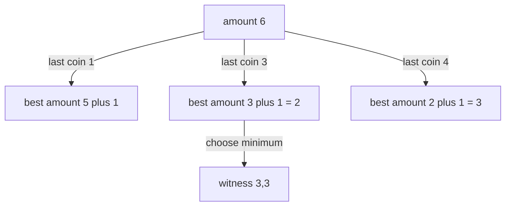
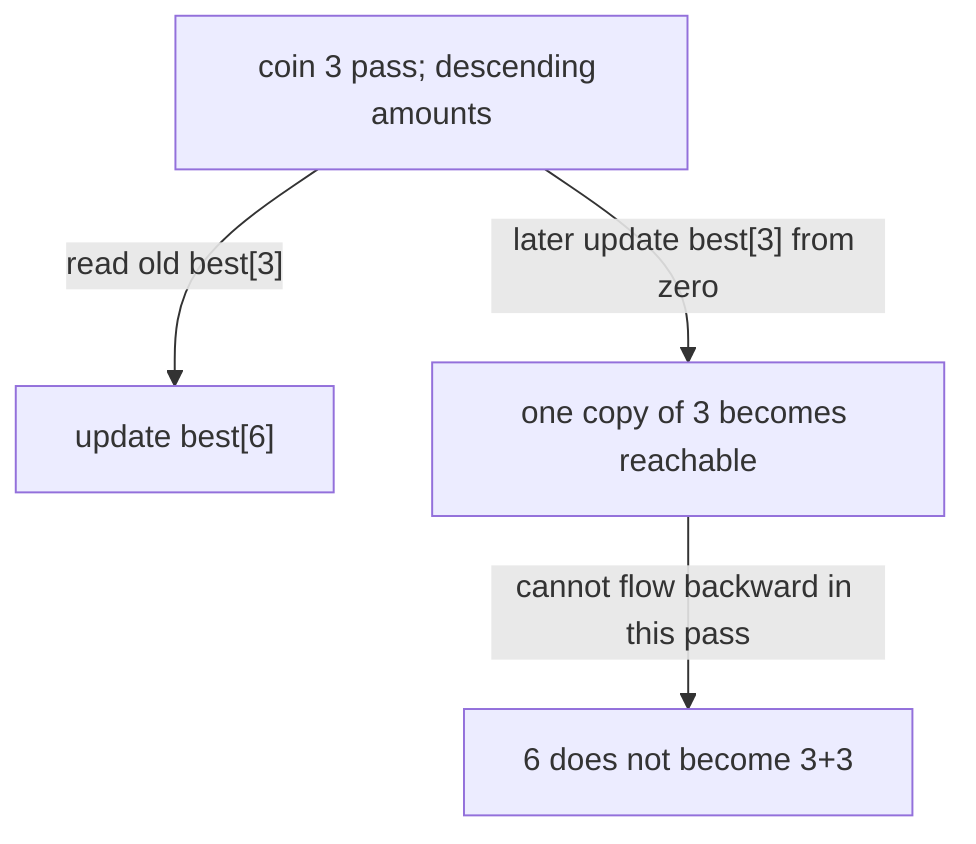

# Minimum coins with a witness

[Curriculum](../../../../README.md) · [Data structures and algorithms](../../README.md) · [All coding problems](../../../../../indexes/coding.md)

> “A kiosk dispenses a requested integer amount using available denominations.
> Each denomination has unlimited supply. Minimize the number of coins and show
> which coins achieve it; report impossible amounts explicitly. Can choosing the
> largest fitting coin ever force a worse answer?”

Constructed practice question. Prerequisite: [dynamic programming](../../lessons/08-dp.md).
Dynamic programming stores answers to overlapping subproblems. Here the useful
subproblem is the minimum coins needed for one smaller amount, not the coins already
selected along a particular search path.

| Contract | Required behavior |
|---|---|
| Input | Positive integer denominations; nonnegative integer amount |
| Output | `(minimum_count, list_of_coins)`; any optimal witness |
| Boundaries | Amount 0 gives `(0,[])`; impossible gives `(-1,[])`; duplicates collapse |
| Failure | Nonpositive/noninteger coin or negative/noninteger amount raises `ValueError` |
| Scope | Unlimited stock, equal per-coin cost; input remains unchanged |

## The tool before the challenge

Dynamic programming saves the best answer for each smaller amount. For coins `[1,3,4]`, amount 6, a greedy `4+1+1` uses three; `3+3` uses two:
```python
best = [float("inf")] * 7
best[0] = 0
best[3] = min(best[3], best[0] + 1)  # one coin makes 3
```
The full contract returns a **witness** as well as count, so save which coin produced each improving state; reconstruct from amount 6.

<!-- interview-rehearsal:start -->

## What the interviewer expects

The interviewer gives you the scenario and the contract above. Explain what a
successful call returns, walk one row from the table below, and name what your
state means *before* choosing a data structure.

**Done means:** `(minimum_count, list_of_coins)`; any optimal witness.

Now predict each output before looking at the reference; invalid input should
leave any existing state unchanged unless the contract says otherwise.

### Test-case scenarios to settle before coding

| Case | Exact input or state | Expected result | What it is testing |
|---|---|---|---|
| Greedy trap | `[1,3,4]`, amount 6 | `(2,[3,3])` | Largest-first is not generally optimal. |
| Zero amount | coins `[1,2]`, amount `0` | `(0,[])` | The empty witness is optimal. |
| Impossible | `[2]`, amount 3 | `(-1,[])` | No witness has a distinct result. |
| Duplicate coins | `[1,1,3]` | same answer as unique denominations | Input duplicates add no choice. |
| Tied optimum | coins `[1,2,3]`, amount `4` | `(2,[1,3])` or `(2,[2,2])` | Two optimal witnesses; tie order is unspecified. |
| Invalid/atomic | nonpositive coin or negative amount | `ValueError`; input unchanged | DP states require positive progress. |

For each row, show which branch or state change produces that result.

<!-- interview-rehearsal:end -->

For `[1,3,4]` and amount 6 return `(2,[3,3])`; greedy chooses 4+1+1 and uses three
coins. For `[2]` and amount 3 return `(-1,[])`. Clarify whether the product needs
minimum count, number of combinations, or one combination: these have different
recurrences despite sharing the same input nouns.



Before opening the solution, fill minimum counts for amounts 0 through 6 and state
what represents an unreachable subtotal.

<details>
<summary>Solution, recurrence, and follow-ups</summary>

The baseline recursively tries each final coin and takes the best result. It
recomputes the same remaining amounts across many paths, potentially exponentially.
Greedy avoids that search but lacks a proof for arbitrary denominations; the
worked example is enough to reject it for this contract.

Define `best[a]` as the minimum number of coins summing exactly to a. Set `best[0]=0`
and other entries to a sentinel larger than any feasible count. For each subtotal
a and coin c≤a, consider `best[a-c]+1`. Save both the improving count and last coin.
Fill amounts upward because every dependency a-c is strictly smaller than a.

**Invariant:** before processing a, all smaller amounts have optimal counts.
Every nonempty solution for a has some last coin c; deleting it leaves a solution
for a-c, which cannot beat `best[a-c]`. Conversely appending c to a reachable best
subproblem constructs a valid candidate. Taking the minimum is therefore optimal.

| Amount | 0 | 1 | 2 | 3 | 4 | 5 | 6 |
|---|---:|---:|---:|---:|---:|---:|---:|
| Best count | 0 | 1 | 2 | 1 | 1 | 2 | 2 |
| Chosen last coin | — | 1 | 1 | 3 | 4 | 1 | 3 |

Reconstruction repeatedly subtracts the stored last coin until zero. With m supplied
coins, k unique coins, and amount A, time is O(m + k log k + A(k+1)), auxiliary space O(A+k), and witness
space O(M) for M returned coins. This is **pseudopolynomial**: A can be much larger
than the number of digits encoding it. O(A) allocation is not acceptable for every
arbitrarily large numeric input even though the recurrence is correct.

**Follow-up 1 — one coin of each type.** Predict amount 6 with `[1,3,4]`: impossible.
Update a one-dimensional table in descending amount order for each coin so the
current coin cannot feed another update in the same pass. Alternatively add an
inventory-position dimension and reconstruct with that state.



**Follow-up 2 — each coin has a handling cost.** Replace +1 with that coin's cost
and define whether the output minimizes cost alone or uses count as a tie-breaker.
The amount dependency remains acyclic for positive denominations. Negative-sized
coins would destroy that ordering and need a different problem model.

Senior depth derives rather than memorizes the state, verifies a witness, and
explains unreachable sentinels. Lead depth adds amount budgets and input contracts.

Reference: [solution.py](solution.py); tests use an independent BFS over amounts
and check optimal count, witness sum, impossible amounts, and invalid coins.

```bash
python -m unittest discover -s curriculum/01-code/02-data-structures-algorithms/problems/33-coin-change -p 'test_*.py'
```

</details>
