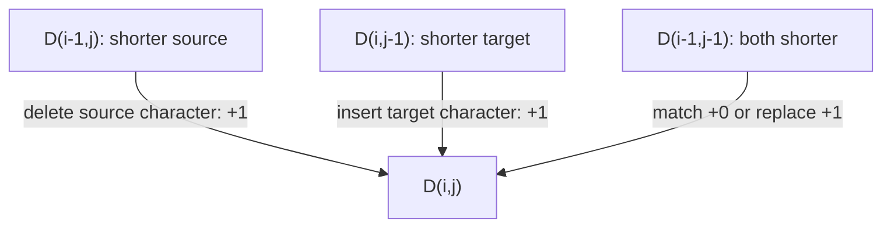
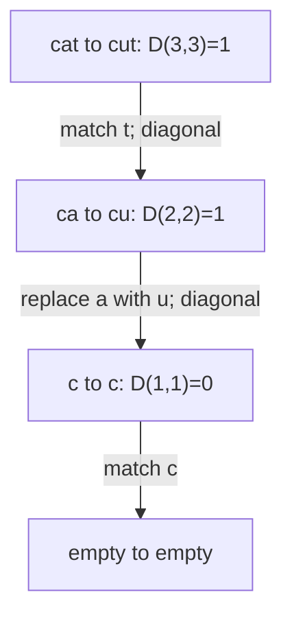

# Edit distance

[Curriculum](../../../../README.md) · [Data structures and algorithms](../../README.md) · [All coding problems](../../../../../indexes/coding.md)

> “A text tool compares a source string with a target. One operation inserts,
> deletes, or replaces one character, each costing one. Return the minimum number
> of operations. Explain which prefixes your state describes before optimizing
> its memory.”

Constructed practice question. Prerequisite: [DP](../../lessons/08-dp.md).
Levenshtein distance counts these three operations; adjacent transposition is not
a separate permitted operation. Python strings here are sequences of Unicode code
points, which may differ from user-perceived characters.

| Contract | Required behavior |
|---|---|
| Input | Two strings, compared case-sensitively by code point |
| Output | Minimum unit-cost insertion/deletion/replacement count |
| Boundaries | Equal strings cost 0; empty versus length n costs n |
| Failure | Nonstrings raise `ValueError` |
| Scope | Distance only; no edit script, normalization, transposition, or weighted costs |

## The tool before the challenge

Edit distance asks the fewest insertions, deletions, or substitutions that transform one string into another. A DP cell `dp[i][j]` summarizes the first `i` source and first `j` target characters:
```python
source, target = "cat", "cut"
same = source[1] == target[1]   # False: a vs u
substitution_cost = 0 if same else 1
```
`"cat" → "cut"` needs one substitution. Empty source to `"cut"` needs three insertions; those empty-prefix cells are base cases, not special patches at the end.

<!-- interview-rehearsal:start -->

## What the interviewer expects

The interviewer gives you the scenario and the contract above. Explain what a
successful call returns, walk one row from the table below, and name what your
state means *before* choosing a data structure.

**Done means:** Minimum unit-cost insertion/deletion/replacement count.

Now predict each output before looking at the reference; invalid input should
leave any existing state unchanged unless the contract says otherwise.

### Test-case scenarios to settle before coding

| Case | Exact input or state | Expected result | What it is testing |
|---|---|---|---|
| Representative | `"kitten"` to `"sitting"` | `3` | Replace, replace, insert is optimal. |
| Equal | same string twice | `0` | No operation is required. |
| Empty side | `""` to length-n text | `n` | Every target symbol must be inserted. |
| Order | `"ab"` to `"ba"` | `2` | Transposition is not a baseline operation. |
| Unicode | strings compared by Python code point | distance over exact code points | No implicit normalization/grapheme logic. |
| Invalid | either input non-string | `ValueError` | The API does not stringify values. |

For each row, show which branch or state change produces that result.

<!-- interview-rehearsal:end -->

`kitten → sitting` costs 3: replace k→s, replace e→i, append g. `ab → ba` costs 2,
not 1, because swapping is excluded. A list of characters raises `ValueError` rather
than silently changing the input contract. Ask whether an actual edit script or
only a threshold decision is required; both affect retained state.



Before reading the answer, fill the boundary row and column for `cat → cut`.
Explain why `D(0,j)=j` is a sequence of real operations rather than a magic constant.

<details>
<summary>Solution, prefix recurrence, and follow-ups</summary>

The baseline branches recursively over insertion, deletion, and replacement. Many
branches revisit the same pair of remaining suffixes; without memoization, work
grows exponentially. A full DP table removes that repetition and makes the state
meaning inspectable before any rolling-row optimization.

Let `D(i,j)` be the minimum cost to convert the first i source characters into
the first j target characters. The final operation either deletes the final source
character, inserts the final target character, or aligns those two characters
with zero/matching or one/replacement cost. Take the minimum of the three pictured
predecessors. Boundary cells consume or produce all characters of one prefix.

**Invariant:** when computing cell `(i,j)`, its upper, left, and diagonal
predecessors already contain optimal prefix costs. Every edit script has one of
these final actions, and every predecessor plus that action is a valid script.
This establishes both a lower bound and a construction attaining the recurrence.

| Source prefix / target prefix | empty | c | cu | cut |
|---|---:|---:|---:|---:|
| empty | 0 | 1 | 2 | 3 |
| c | 1 | 0 | 1 | 2 |
| ca | 2 | 1 | 1 | 2 |
| cat | 3 | 2 | 2 | 1 |

Only the previous row and current row are needed for distance. Put the shorter
string on columns, using symmetry of unit costs. For lengths m,n, time is O(mn)
when both are nonempty, or more generally O((m+1)(n+1)); auxiliary space is
O(min(m,n)+1). Rows are numeric costs, and the returned integer needs constant
word-model output space. Swapping inputs would need reconsideration if insertion
and deletion had different costs.

Follow the three candidate costs into the first focused cell, then watch the
frontier and two-row memory band advance. The full grid preserves teaching history.



[Open motion study](../../../../../assets/learning/dp-edit-frontier.svg) ·
[Read the completed still](../../../../../assets/learning/dp-edit-frontier-still.svg).

**Follow-up 1 — return an edit script.** Predict which information rolling rows
discard. Preserve a full table or backpointers and walk from `(m,n)` to `(0,0)`.
Specify deterministic tie handling. A divide-and-conquer reconstruction can reduce
memory, but it requires additional reasoning rather than reading discarded cells.



**Follow-up 2 — only accept distance ≤k.** If lengths differ by more than k, reject
immediately. Restrict computation to a diagonal band and cap costs above k,
carefully representing cells outside the band as unreachable. This is useful
when k is small; it is not a general shortcut for an unrestricted exact distance.

Senior depth derives state/boundaries and verifies an independent recursive
oracle. Lead depth clarifies Unicode normalization and user-visible edit semantics.

Reference: [solution.py](solution.py); tests cover all short binary strings,
symmetry, empty inputs, transposition exclusion, and code-point behavior.

```bash
python -m unittest discover -s curriculum/01-code/02-data-structures-algorithms/problems/35-edit-distance -p 'test_*.py'
```

</details>
