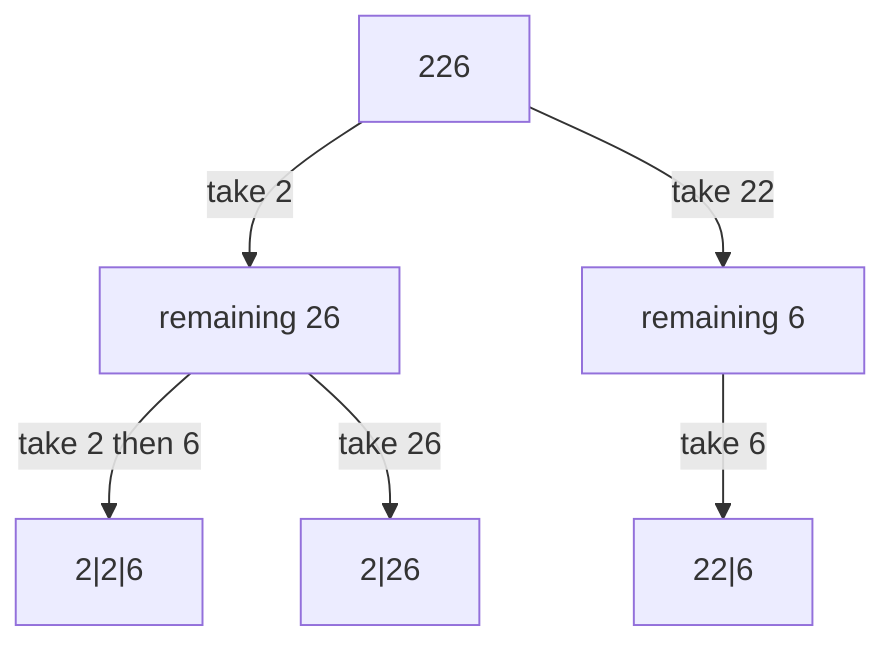
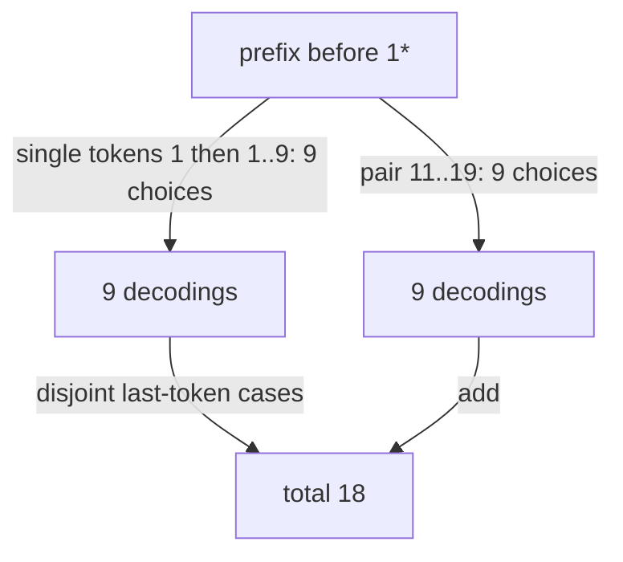

# Count valid digit decodings

[Curriculum](../../../../README.md) · [Data structures and algorithms](../../README.md) · [All coding problems](../../../../../indexes/coding.md)

> “A legacy format encodes letters as decimal integers 1 through 26, then removes
> separators. Count how many letter sequences a digit string could represent.
> Zero is never a standalone letter. What distinguishes `10`, `06`, and an empty
> input before we start writing a recurrence?”

Constructed practice question. Prerequisite: [DP](../../lessons/08-dp.md).
A decoding partitions the digit string into valid one- or two-digit tokens. We
count partitions; we do not need to construct the potentially numerous strings.

| Contract | Required behavior |
|---|---|
| Input | String containing ASCII digits only |
| Output | Exact number of partitions into codes 1..26 |
| Zero rules | `0` invalid alone; `10`/`20` valid; leading-zero pair invalid |
| Boundaries | Empty public input returns 0; impossible nonempty input returns 0 |
| Failure/scope | Other characters/types raise `ValueError`; no wildcard/modulus |

`226` has three decodings: `2|2|6`, `22|6`, `2|26`. `10` has one, `06` has none,
and `100` has none because the last zero cannot stand alone. Reject `'1x'` rather
than returning zero: malformed data and a well-formed but undecodable string are
different outcomes. Ask whether leading zeros are meaningful padding (excluded).



Try the problem independently. Explain why the internal count for an empty prefix
can be one even though the public API returns zero for an empty message.

<details>
<summary>Solution, disjoint cases, and follow-ups</summary>

A baseline enumerates all one/two-digit partitions and validates each. On many
ones, both branches remain legal and the recursion tree grows like Fibonacci
numbers. The two branches repeatedly ask about identical prefixes/suffixes, so
retain counts instead of materialized decodings.

Define `ways[i]` as the number of decodings of the first i digits, with internal
`ways[0]=1`: there is one empty prefix to extend. At each position, add
`ways[i-1]` if the final digit is 1..9; add `ways[i-2]` if the final two digits
form 10..26. The API handles its empty-input policy before this recurrence.

**Invariant:** each valid decoding belongs to exactly one case according to its
last token length. Removing that token leaves a valid counted prefix; appending
the valid token restores a unique full decoding. The cases are disjoint, so add
counts rather than taking a minimum. Two rolling counts suffice because no other
prefix state is referenced.

| Prefix | One-digit contribution | Two-digit contribution | Total |
|---|---:|---:|---:|
| empty, internal | — | — | 1 |
| 2 | 1 | 0 | 1 |
| 22 | 1 | 1 | 2 |
| 226 | 2 | 1 | 3 |

There are O(n) transitions and O(1) integer variables. Under unit-cost arithmetic,
time is O(n) and auxiliary space O(1). Exact counts can have Θ(n) bits, however:
Python big-integer additions make a conservative worst-case bit-time bound O(n²)
and retained numeric space O(n) bits. Calling this literally constant memory for
arbitrarily large exact answers would hide output-number growth.

**Follow-up 1 — allow `*` for any digit 1..9.** Predict `1*`: nine single-token
continuations plus nine pairs 11..19, giving 18. A pair `**` has 15 valid codes
(11..19 and 21..26), so the recurrence needs multiplicities rather than a boolean
pair-valid test. Zeros adjacent to wildcards still require explicit cases.



**Follow-up 2 — return count modulo M.** Reduce after every addition; this bounds
integer sizes for fixed M. It does not let the caller recover the exact count.
If actual decoded strings are requested instead, complexity must include total
output characters, which can be exponential.

Senior depth derives the empty-prefix identity and tests zeros exhaustively.
Lead depth agrees on malformed-input behavior, count limits, and encoding versions.

Reference: [solution.py](solution.py); tests compare explicit partitions for every
short string over a selected digit alphabet and verify large exact integers.

```bash
python -m unittest discover -s curriculum/01-code/02-data-structures-algorithms/problems/36-decode-ways -p 'test_*.py'
```

</details>
