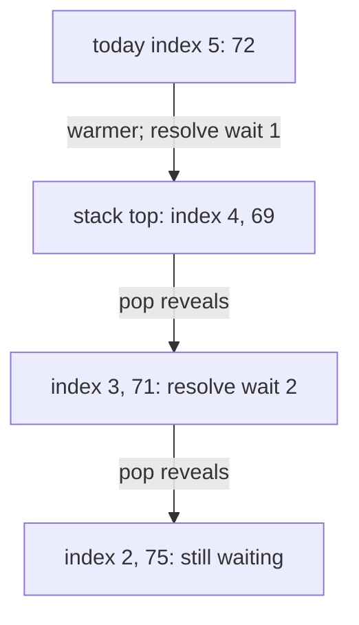
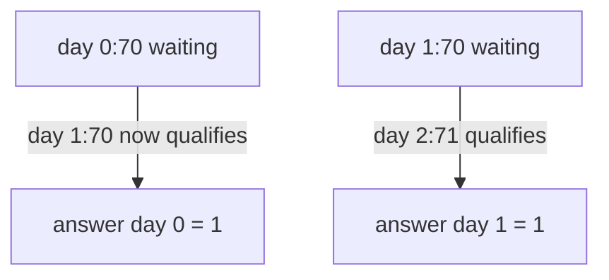

# Days until a warmer temperature

[Curriculum](../../../../README.md) · [Data structures and algorithms](../../README.md) · [All coding problems](../../../../../indexes/coding.md)

> “A weather dashboard shows how many days each observation waits until a strictly
> warmer observation. The current implementation scans the entire future for
> every day. Return all waits in one pass if possible, with zero when no warmer
> future day exists. Do equal temperatures resolve a waiting day?”

Constructed practice question. Prerequisite: [monotonic stacks](../../lessons/07-stack.md).
A monotonic stack keeps unresolved candidates in an order that allows a new value
to settle several answers. Store indices because the answer is an index difference.

| Contract | Required behavior |
|---|---|
| Input | Finite integer temperatures; negative values allowed |
| Output | Same-length list of waits to the first strictly warmer future day |
| Boundaries | No warmer day gives 0; empty input gives `[]`; equals do not count |
| Failure | Noninteger temperatures raise `ValueError`; input unchanged |
| Scope | One complete series; no circular wraparound or minimum-rise threshold |

For `[73,74,75,71,69,72,76,73]`, return `[1,1,4,2,1,1,0,0]`. Day 2 at 75 waits
four days for 76; 72 is warmer than 71 but cannot resolve 75. `[5,5,5]` returns
all zeros. Clarify whether the word “warmer” means `>` or `>=` before testing ties.



Try the quadratic scan first, then name exactly which earlier days must remain
unresolved after today's value is processed. Explain why discarded days never need
to return to the stack.

<details>
<summary>Solution, nearestness proof, and follow-ups</summary>

For each day, the baseline scans forward until it finds a warmer value. A decreasing
series performs about n(n-1)/2 comparisons and resolves nothing. Sorting temperatures
would identify warmer values but lose the nearest-future position required by the
contract.

Scan left to right with a stack of unresolved indices. While today's temperature
is strictly greater than the top's temperature, pop that index and set its answer
to today minus index. Push today after all warmer comparisons are resolved. The
remaining temperatures are nonincreasing from stack bottom to top; equal values
may coexist because neither resolves the other.

**Invariant:** each stack index has seen no warmer day since its insertion.
When today pops it, today is warmer and every intervening day failed to resolve
it, so today is the *first* warmer day. If today cannot pop the top, it cannot pop
any earlier/hotter stack entry either. That order is what turns a future scan
into a local comparison.

| Today | Stack after processing, as index:temperature | Newly fixed waits |
|---:|---|---|
| 2:75 | 2:75 | day 1 waits 1 |
| 3:71 | 2:75, 3:71 | none |
| 4:69 | 2:75, 3:71, 4:69 | none |
| 5:72 | 2:75, 5:72 | day 4 waits 1; day 3 waits 2 |
| 6:76 | 6:76 | day 5 waits 1; day 2 waits 4 |

Although one arrival can pop many indices, each index is pushed once and popped
at most once. Total time is O(n), not O(n²); worst-case auxiliary space is O(n),
plus the O(n) returned answers and the reference's O(n) input copy. This is an
amortized argument about the full scan, not constant worst-case work per arrival.

**Follow-up 1 — warmer or equal.** Predict `[70,70,71]`: original waits `[2,1,0]`
become `[1,1,0]`. Change the pop comparison to `<=`; equal observations now settle
one another, so retained temperatures become strictly decreasing.



**Follow-up 2 — at least five degrees warmer.** Simply changing the pop condition
to `today >= top+5` breaks the stack argument: a top at 72 may block an earlier
70 even when today is 75. Use a structure keyed by required threshold, resolving
all thresholds reached by today, and retain indices for first-resolution distance.

Senior depth includes strict ties, an amortized proof, and a counterexample for an
invalid follow-up adaptation. Lead depth defines when unresolved streaming answers
can be finalized if the series never ends.

Reference: [solution.py](solution.py); tests compare exhaustive short inputs with
the simple forward scan, including equal, negative, and decreasing values.

```bash
python -m unittest discover -s curriculum/01-code/02-data-structures-algorithms/problems/37-daily-temperatures -p 'test_*.py'
```

</details>
