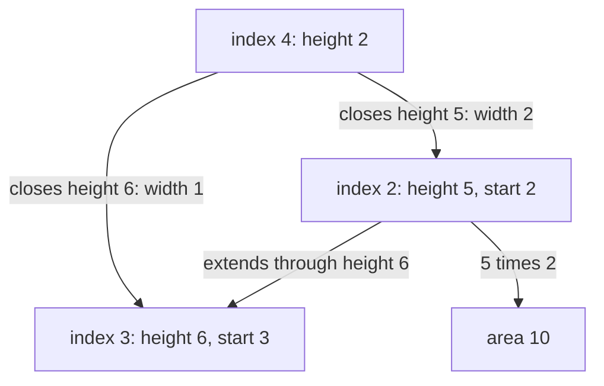
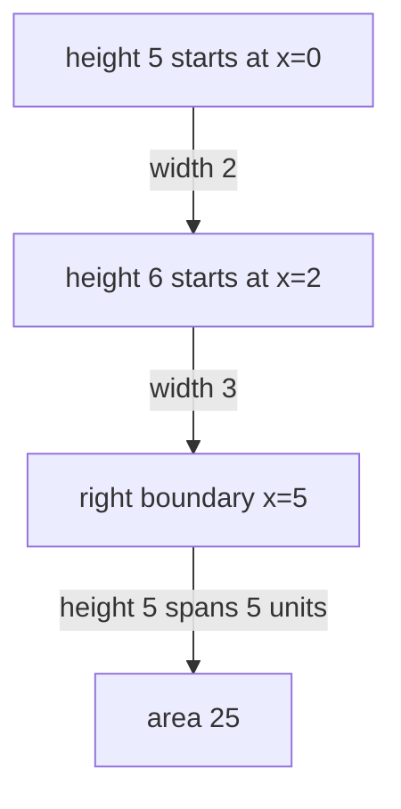

# Largest rectangle in a histogram

[Curriculum](../../../../README.md) · [Choose data structures and reason about algorithms](../../README.md) · [All coding problems](../../../../../indexes/coding.md)

> “A capacity chart has adjacent bars of width one. Find the largest rectangular
> area that fits entirely beneath the bars, spanning a contiguous range. A tall
> bar alone may lose to a wide lower rectangle. When can you know that a candidate
> height cannot extend any farther right?”

Constructed practice question. Prerequisite: [monotonic stacks](../../lessons/07-stack.md).
For a chosen contiguous range, the rectangle height is limited by its shortest
bar. A stack can retain heights whose right boundary has not yet been discovered.

| Contract | Required behavior |
|---|---|
| Input | Finite sequence of nonnegative integer heights; every bar width is one |
| Output | Maximum integer area under a contiguous interval |
| Boundaries | Empty/all-zero gives 0; equal-height bars may form one wider rectangle |
| Failure | Negative/noninteger heights raise `ValueError`; input unchanged |
| Scope | Area only; no witness coordinates or variable widths |

## The tool before the challenge

For a histogram bar, the largest rectangle using that bar's height extends until a **shorter** bar stops it on each side. An increasing-height stack keeps starts unresolved:
```python
heights = [2, 1, 2]
stack = [(0, 2)]  # (start index, height) for unresolved bars
start, height = stack.pop()  # at index 1, height 1 ends the 2-bar
print(height * (1 - start))  # 2: height 2 across width 1
stack.append((start, 1))    # height 1 can reach back to index 0
```
The best rectangle here has area 3 (height 1 across all three bars), not area 4. Flush remaining bars after the final input, often with a sentinel height 0.

### A design choice worth saying aloud

Each stack entry means `(earliest_start, height)` for a bar that has not met a shorter right boundary. When a shorter bar arrives, carry the popped start backward before pushing the new height. A final zero-height sentinel closes all remaining rectangles; without it, increasing inputs leave candidates uncounted.

<!-- interview-rehearsal:start -->

## What the interviewer expects

The interviewer gives you the scenario and the contract above. Explain what a
successful call returns, walk through one example below, and name what your
state means *before* choosing a data structure.

**Done means:** Maximum integer area under a contiguous interval.

Now predict each output before looking at the reference; invalid input should
leave any existing state unchanged unless the contract says otherwise.

### Test-case scenarios to settle before coding

| Case | Exact input or state | Expected result | What it is testing |
|---|---|---|---|
| Representative | `[2,1,5,6,2,3]` | `10` | Height 5 across width 2 is best. |
| Empty/all zero | `[]` / `[0,0]` | `0` / `0` | No positive rectangle exists. |
| Plateau | `[2,2,2]` | `6` | Equal heights must combine across width. |
| Zero split | `[2,0,2]` | `2` | A zero ends positive rectangles. |
| Final flush | `[1,2,3]` | `4` | Remaining bars need a virtual right boundary. |
| Invalid/atomic | negative or noninteger height | `ValueError`; input unchanged | Histogram geometry assumes nonnegative integers. |

For each case, show which branch or state change produces that result.

<!-- interview-rehearsal:end -->

`[2,1,5,6,2,3]` returns 10 from heights 5 and 6 over width two. `[2,2,2]` returns
6. `[2,0,2]` returns 2 because the zero breaks a positive rectangle. Ask whether
the caller needs the left/right boundaries: save them with the winning area if so.



Implement the all-interval baseline if needed. Before reading the answer, determine
which start index a new shorter height must inherit after popping taller bars.

<details>
<summary>Solution, boundaries, and follow-ups</summary>

The baseline considers every left boundary, extends right, and updates the minimum
height; it costs O(n²) time and O(1) working state. Recomputing the minimum from
scratch would unnecessarily increase this to O(n³). The linear solution changes
the question from “what is each interval's minimum?” to “how far can this height
remain the minimum?”

Maintain strictly increasing `(earliest_start,height)` pairs. On a lower incoming
height, pop taller pairs and compute `height × (current_index-start)`. Carry each
popped start leftward so the incoming shorter height inherits the full span it
can cover. Equal heights keep the older start rather than adding redundant pairs.
Process one virtual zero-height bar after the real input to close all pending spans.

**Invariant:** each retained height can cover every processed bar from its saved
start through the previous position, and no smaller bar has yet ended that span.
The first smaller bar fixes its maximal right boundary. Any optimal rectangle has
a limiting minimum height; when that height is closed, the algorithm evaluates a
rectangle at least as wide as the optimal interval.

| Incoming position/height | Popped candidate | Area | Surviving start for incoming 2 |
|---|---|---:|---:|
| 4 / 2 | start 3, height 6 | 6 | 3 |
| 4 / 2 | start 2, height 5 | 10 | 2 |
| End / virtual 0 | pending spans | compare all | no retained positive height |

Each pair is pushed once and popped once, giving O(n) total time and O(n) auxiliary
space including the stack/input copy. A single position may pop O(n) pairs. The
virtual sentinel is supplied by an iterator and never appended to the caller's
list. Returning only area uses constant-size word-model output.

**Follow-up 1 — bars have different widths.** Predict two bars of heights `[5,6]`
and widths `[2,3]`: the shared height-five rectangle has area 25. Replace index
differences with cumulative horizontal coordinates. Keep the same height invariant
but store each candidate's earliest x-coordinate.



**Follow-up 2 — largest all-ones rectangle in a binary matrix.** Treat each row as
a histogram of consecutive ones ending at that row. Update heights (increment on
one, reset on zero), then run this algorithm. Every rectangle has a bottom row,
so O(rows × columns) time covers all possibilities with O(columns) working space.

Senior depth explains inherited start positions, equal-height handling, sentinel
flush, and amortized cost. Lead depth clarifies numeric overflow and coordinate
contracts when the chart becomes weighted or uses large physical dimensions.

Reference: [solution.py](solution.py); tests compare every short histogram over
heights 0..2 with an independent interval oracle and check plateaus/flush behavior.

```bash
python -m unittest discover -s curriculum/01-code/02-data-structures-algorithms/problems/38-largest-histogram-rectangle -p 'test_*.py'
```

</details>
