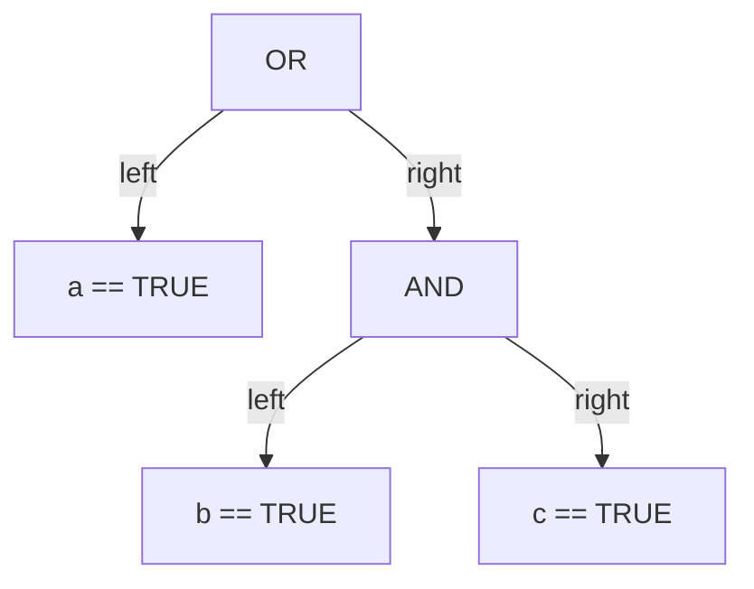
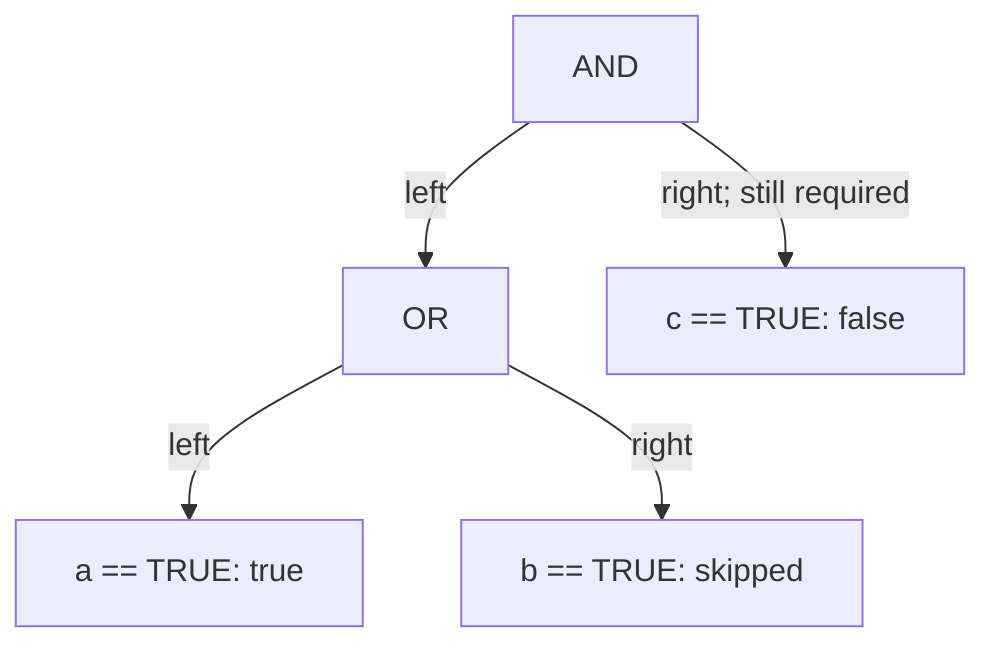

# Parse and evaluate a policy expression

[Curriculum](../../../../README.md) · [Data structures and algorithms](../../README.md) · [All coding problems](../../../../../indexes/coding.md)

> “An admin tool stores small policies such as `role == "admin" OR active == TRUE
> AND tier == 2`. Evaluate them against a record. Parentheses must work, AND must
> bind more tightly than OR, and missing fields must not accidentally grant access.
> Reject malformed policy text even when its first branch would already be true.”

Constructed practice question. Prerequisites: [stack state](../../lessons/07-stack.md)
and [recursive structure](../../lessons/09-search.md). A lexer converts characters
to tokens. A parser assigns grammatical structure. An evaluator computes that
structure's meaning; combining these jobs carelessly hides syntax errors.

| Contract | Required behavior |
|---|---|
| Input | Policy string and field mapping; field names match `[A-Za-z_][A-Za-z0-9_.]*` |
| Literals | JSON double-quoted strings, integers, uppercase TRUE/FALSE |
| Operators | `==`, `!=`, AND, OR, parentheses; AND precedes OR |
| Missing/types | Missing field or mismatched scalar type makes either comparison false |
| Failure | Malformed input raises `ValueError` with location; no host-language evaluation |
| Limits/scope | At most 65,536 characters, 4,096 tokens, 100 nested parentheses; no calls/NOT |

## The tool before the challenge

An expression evaluator has two jobs: turn characters into tokens, then interpret tokens according to precedence and parentheses. Do not call Python `eval` on a user-supplied policy:
```python
expression = 'role == "admin" AND active == TRUE'
tokens = ["role", "==", "admin", "AND", "active", "==", True]
# Illustrative decoded token values; the real lexer also records positions.
```
Ask whether `AND` binds more tightly than `OR`, how missing fields behave, and which operators are permitted. A parser should reject a trailing unexpected token rather than silently accept part of the input.

<!-- interview-rehearsal:start -->

## What the interviewer expects

The interviewer gives you the scenario and the contract above. Explain what a
successful call returns, walk one row from the table below, and name what your
state means *before* choosing a data structure.

**Done means:** Return the exact Boolean value defined by the fully parsed policy, or raise `ValueError` for malformed or over-budget input.

Now predict each output before looking at the reference; invalid input should
leave any existing state unchanged unless the contract says otherwise.

### Test-case scenarios to settle before coding

| Case | Exact input or state | Expected result | What it is testing |
|---|---|---|---|
| Precedence | `a==TRUE OR b==TRUE AND c==TRUE` with T,F,F | `True` | AND binds before OR. |
| Parentheses | `(a==TRUE OR b==TRUE) AND c==TRUE` | `False` | Grouping changes authority. |
| Missing | `missing != "admin"` | `False` | Absence cannot accidentally grant access. |
| Malformed right branch | `a==TRUE OR ???` | `ValueError` | Short-circuit evaluation must not skip parsing. |
| Quoted content | `name == "Ada \"OR\" Lovelace"`, record `{"name": 'Ada "OR" Lovelace'}` | `True` | Escaped quotes and `OR` inside the string are not operators. |
| Type boundary | `tier != 2`, record `{"tier": "2"}` | `False` | Mismatched scalar types make both comparisons false. |
| Token limit | `'a==TRUE OR ' * 2049 + 'a==TRUE'`, record `{"a": True}` | `ValueError` | Exceeds the 4,096-token admission limit before evaluation. |

For each row, show which branch or state change produces that result.

<!-- interview-rehearsal:end -->

Given `{a:True,b:False,c:False}`, `a == TRUE OR b == TRUE AND c == TRUE` is true;
`(a == TRUE OR b == TRUE) AND c == TRUE` is false. `missing != "admin"` is false.
`a == TRUE OR ???` raises, despite the true left branch. Dotted field names are
literal mapping keys, not property traversal. Clarify missing-field behavior first.



Try independently. First write the grammar and tokenize a quoted string containing
an escaped quote; do not start by splitting text on spaces or `AND`.

<details>
<summary>Solution, grammar, and evolving semantics</summary>

Space splitting fails on `name == "Ada Lovelace"`; splitting on OR fails when a
string contains those letters. Left-to-right evaluation gives the wrong precedence.
Passing untrusted text to Python `eval` gives the host language capabilities absent
from this contract. The baseline should instead be a deliberately small language.

```text
expression  := conjunction (OR conjunction)*
conjunction := factor (AND factor)*
factor      := '(' expression ')' | IDENT ('==' | '!=') literal
literal     := STRING | INTEGER | TRUE | FALSE
```

The lexer advances from the current offset, refusing unmatched characters and
decoding strings with JSON's escape rules. Recursive descent follows the grammar:
expression consumes OR groups, conjunction consumes AND groups, and factor handles
parentheses or one comparison. Requiring EOF rejects trailing junk. Parse the
entire policy into an abstract syntax tree before accessing the record.

**Invariant:** each parser routine consumes exactly its grammatical production
and returns a subtree with the declared precedence. The evaluator then uses an
explicit stack and short-circuits AND/OR; skipping a right subtree skips record
access, never syntax validation. Strict scalar types prevent Python's `True == 1`
from leaking into policy semantics. Missing `!=` is false, not accidental permission.

| Phase | Example evidence | Why it matters |
|---|---|---|
| Lex | ID(a), EQ, TRUE, OR, ID(b), EQ, TRUE, AND… | Quoted content remains one token |
| Parse | OR(a, AND(b,c)) | AND grouped first |
| Evaluate | a=true; OR skips right subtree | Short circuit after complete validation |

Watch the same expression's persistent token, syntax-tree, and evaluation states
in the [parser trace](../../../../../assets/learning/parser-precedence.svg), or use
the [still version](../../../../../assets/learning/parser-precedence-still.svg).
Pause before evaluation and predict which fully parsed branch will be skipped.

For C characters and T tokens, scanning/parsing/tree traversal use O(C+T) ordinary
token work and O(C+T) retained text/tree/stack space. Integer conversion/comparison
also depends on literal bit length; resource limits bound admitted work, and Python
may reject extremely long integer literals. No claim of constant-time arbitrary
precision arithmetic is intended. Long operator chains use iterative evaluation;
parenthesis recursion is explicitly bounded.

**Follow-up 1 — parentheses change authority.** Predict the regrouped example's
result before viewing its tree. The final c check now applies even when a is true.



**Follow-up 2 — add NOT or an unknown result.** Adding NOT requires a new precedence
production above comparisons. If missing becomes “unknown,” define three-valued
truth tables: simply negating today's missing=false would turn absent attributes
into true. Agree on authorization semantics and compatibility before extending syntax.

Senior depth tests malformed right branches, quoting, precedence, missing/type
rules, and short-circuit accesses independently. Lead depth adds grammar versions,
resource budgets, and policy migration; this interpreter is a teaching language,
not a complete authorization system.

Reference: [solution.py](solution.py); tests include malformed syntax, escaped
strings, guarded record access, long chains, and depth/token limits.

```bash
python -m unittest discover -s curriculum/01-code/02-data-structures-algorithms/problems/39-policy-expression-evaluator -p 'test_*.py'
```

</details>
