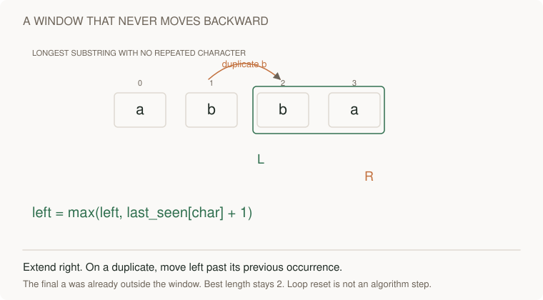

# Compare coding contracts, return values and complexity

[Curriculum](../../README.md) · [Choose data structures and reason about algorithms](README.md)

## Which implementation are you looking at?

The course has complete standalone problem bundles and an older shared helper module. Similar names do not guarantee identical behavior. For example, a longest-window helper returns a length, while the standalone problem returns positions so a UI can highlight the original text.

Use this page to compare contracts and costs after your attempt. Follow a standalone problem’s own reference when checking its exact output and rejection behavior. The tables below describe shared variants explicitly.

A pattern is useful when you can explain its invariant and recognize when it stops applying. Recent reports support studying maps/prefix sums, windows, graphs, caches, and practical implementation. They do **not** establish a global frequency ranking. [Evidence](../../../docs/research/interview-evidence.md).

## Work a problem before opening the solution

For each exercise: restate the contract → show a small example → propose the simple approach → identify repeated work → state the invariant → code → test → analyze complexity → handle a changed constraint.

Use [Python reference implementations](algorithms.py) and [TypeScript implementations](typescript.ts) after attempting the task. These are original teaching exercises, not copies of proprietary interview packets.

Read [why each pattern works](pattern-notes.md) for the invariants, pitfalls, and language-specific costs.

## Shared variants are not the 42 standalone bundles

The [standalone registry](../../../indexes/problem-bank.json) identifies each
bundle's own brief, implementation and isolated tests. This page describes the
separate shared helpers; passing their tests does not validate the bundles.

| Shared helper | Standalone contract |
|---|---|
| `longest_unique` returns a length | Problem 04 returns a window/slice |
| `LRU` uses `None` for a miss | The manual LRU bundle raises `KeyError` |
| `lower_bound` assumes sorted input | Problem 11 validates ordering first: O(n) overall |

Read each bundle's input, empty and invalid-case contract. Python accepting extra
values does not itself prove an algorithm wrong; promised rejection behavior
must still be implemented and tested.

## Python problem set

Hash operations below are expected average O(1). Space includes copied input and working structures, excluding only the caller's original input. `n` is input length; `u` unique items; `V/E` graph vertices/edges; `A` target amount; `m` coin count; `L` word length.

| Problem / function | Contract and example | Baseline → implementation | Time / auxiliary space | Follow-up |
|---|---|---|---|---|
| Two sum · `two_sum` | Two distinct indices for target; `[3,3],6 → (0,1)`; no pair → None | All pairs → complement map | O(n) / O(n) | Return all pairs without duplicates |
| Longest unique substring · `longest_unique` | `abba → 2`; empty → 0 | Enumerate substrings → last-seen window | O(n) / O(u) | User-visible graphemes instead of Python code points |
| Subarray sum K · `subarray_sum` | `[1,-1,1],1 → 3`; contiguous and nonempty | Running sum per start → prefix-frequency map | O(n) / O(n) | Stream input; zeros and negative numbers |
| First element ≥ target · `lower_bound` | Sorted array `[1,2,2,5],2 → 1`; absent returns insertion index | Scan → half-open binary search | O(log n) / O(1) | Search answer space using a monotone feasibility test |
| Merge intervals · `merge_intervals` | Closed intervals; `[1,3],[3,4] → [1,4]` | Repeated comparisons → sort and scan | O(n log n) / O(n) including sorted copy | Half-open calendar events should not merge merely touching endpoints |
| Top K frequent · `top_k_frequent` | Return at most K distinct values; smaller value breaks equal-frequency ties | Sort counts → bounded heap via `nlargest` | O(n + u log(k+1)) when 0<k<u; O(n+u log u) when k≥u / O(u+k) | Buckets use O(n+u) space; streaming needs a memory policy |
| Islands · `islands` | Count 4-connected '1' cells; rectangular grid unchanged | Revisit cells → visited-set BFS | O(rows×cols) / O(rows×cols) | In-place marking changes the contract; diagonal connectivity changes the graph |
| Course order · `course_order` | Pair `(course, prerequisite)`; one valid order; [] on cycle | Try permutations → indegree queue | O(V+E) / O(V+E) | Capacity per semester is a different optimization problem |
| Weighted shortest paths · `shortest_paths` | Directed nonnegative edges; unreachable → infinity | Repeated relaxation → Dijkstra | O(V + E log(E+1)) / O(V+E), lazy heap may hold O(E) entries | Negative edges invalidate this algorithm |
| LRU · `LRU` | Get refreshes recency; capacity 0 stores nothing; None is miss | Scan recency → OrderedDict | Expected O(1) get/put / O(capacity) | Bytes instead of entries, TTL, synchronization |
| Coin change · `min_coins` | Minimum coins, unlimited reuse; `[1,3,4],6 → 2`; impossible → -1 | Enumerate choices → bottom-up DP | O(A×m) / O(A) | Why greedy chooses the wrong result for this example |
| Warmer day · `daily_temperatures` | Distance to next strictly warmer day; none → 0 | Forward scan for every day → monotonic stack | O(n) / O(n) | Equal temperatures must stay unresolved |
| Word search · `word_exists` | 4-neighbor traversal; cannot reuse a cell; empty word → true | Enumerate paths with backtracking and undo | O(rows×cols×4^L) conservative bound / O(L) | Multiple words can share trie prefixes |
| Exact word lookup · `Trie` | Insert/search; a prefix is not automatically a word | Scan dictionary → prefix tree | O(L) per operation / O(total stored characters) | Autocomplete ranking and Unicode normalization |

Inputs are ordinary finite integers/strings; array elements are not runtime-type-validated. Graph endpoints, malformed grids, capacities, and coin domains have explicit checks in code. Python arbitrary-precision integer costs are simplified to unit-cost arithmetic for interview analysis; say so if inputs are huge.

## Worked lesson 1 · prefix sums

Without a memory of earlier prefixes, we repeatedly sum the same elements. Define `prefix[j]` as the sum before index j. A subarray i..j-1 sums to K exactly when `prefix[i] = prefix[j] - K`. Store the **number** of previous occurrences, not just a set. Two equal earlier prefixes represent two different starts.


[Static diagram](../../../assets/learning/prefix-counts-still.svg)


For `[1,-1,1]`, K=1:

| Read | Prefix | Earlier prefix needed | New matches | Map after insertion |
|---|---:|---:|---:|---|
| Start | 0 | — | 0 | `{0:1}` |
| 1 | 1 | 0 | 1 | `{0:1,1:1}` |
| -1 | 0 | -1 | 0 | `{0:2,1:1}` |
| 1 | 1 | 0 | 2 | `{0:2,1:2}` |

```python
counts = {0: 1}
prefix = answer = 0
for value in nums:
    prefix += value
    answer += counts.get(prefix - target, 0)
    counts[prefix] = counts.get(prefix, 0) + 1
```

Look up **before** insertion so target 0 does not count an empty range. Initial `{0:1}` accounts for ranges starting at index 0. Sliding windows that shrink based only on exceeding a target do not generally work with negative values. Remove the initial zero or reverse lookup/insertion and find the smallest failing input.

## Worked lesson 2 · sliding windows

The invariant is that `text[left:right+1]` contains no repeated character. On a repeated character, move left just past its last occurrence—but never backwards. With `abba`, after the second b, left is 2; the last a at index 0 must not move it back to 1. That is why the implementation uses `max(left, last[char]+1)`.


[Static diagram](../../../assets/learning/window-moves-still.svg)


Each right pointer position is visited once. Even though the substring may contain many characters, we do not rescan it. Explain why O(n) time does not imply O(1) space here.


## Worked lesson 3 · graphs and dependencies

BFS explores equal-cost edges by distance layers. Mark on enqueue to avoid repeated frontier entries. Dijkstra uses the smallest tentative *distance*, so it can process a later-discovered cheap route before an earlier expensive one. A stale heap entry is discarded when it no longer matches the best distance.


[Static diagram](../../../assets/learning/bfs-frontier-still.svg)


For `0→1, 0→2, 1→3, 2→3`, initial indegrees are `[0,1,1,2]`. Removing 0 releases 1 and 2; 3 stays blocked until both complete. If the processed count is less than V, a cycle prevents a complete ordering.

A capacity-constrained “minimum semesters” follow-up is not solved merely by adding a heap. A heuristic that prioritizes longest downstream chains needs proof; for small n, model completed courses as a bitmask and search eligible subsets. State the exponential cost rather than claiming greedy is always optimal. This distinction is motivated by an explicitly uncertain candidate report, not adopted from its proposed solution.

## Worked lesson 4 · LRU and interfaces

A hash map locates an item. A recency list tracks eviction order. Get and put both move an item to the most-recent end; eviction removes the least-recent item. Python's OrderedDict exposes these operations; be ready to implement a doubly linked list if the interviewer disallows helpers.

Trace capacity 2: put A, put B, get A, put C. B must be evicted. Updating A must not consume an extra slot. Byte capacity introduces an item-size function and potentially several evictions per write; one insertion is no longer necessarily O(1).

TypeScript's Map preserves insertion order, so delete+set refreshes recency. ECMAScript requires average sublinear access, not a blanket formal O(1) guarantee; expected O(1) hash-map reasoning is the usual implementation model. Distinguish a missing value from a legitimately stored undefined if your API allows it.

## TypeScript and practical rounds

[Practical exercises](../../../indexes/practical-exercises.md) teach bounded concurrency, cancellation, debugging, API integration, and AI review. [Full stack](../../02-applications/03-frontend/full-stack-practice.md) connects those snippets to an application.

Primary references checked 2026-09-22: [Python heapq](https://docs.python.org/3/library/heapq.html), [collections](https://docs.python.org/3/library/collections.html), [ECMAScript Map](https://tc39.es/ecma262/multipage/keyed-collections.html#sec-map-objects).

[Interview home](../../../practice/interview-guide.md)
