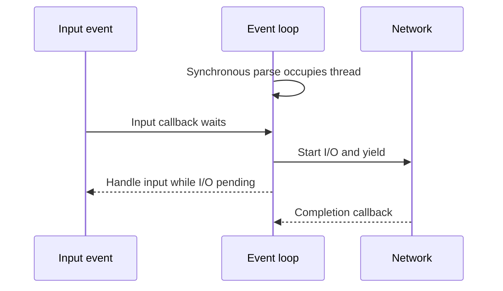
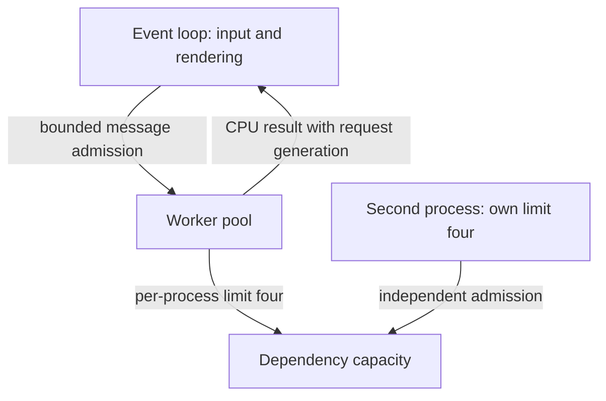

# Distinguish I/O overlap from parallel CPU execution

[Curriculum](../../../../README.md) · [Build HTTP APIs and reliable background work](../../README.md)

## Application and assignment

A browser search box waits for its event handler while another operation parses a large file. Starting more promises does not give the same event-loop thread more CPU cores. Waiting for a remote response is different: other callbacks may run while that I/O is pending.

Draw the timing of four CPU tasks and four waiting tasks using the teaching durations below. This is a reasoning prerequisite, not an application to deploy. Carry your prediction into the linked executor or browser exercise and identify exactly where execution can yield.

## Contract and starting evidence

> “Search feels frozen when one request parses a large file. Another team suggests
> raising `Promise.all` concurrency from four to forty. Explain which resource is
> occupied before changing a limit.”

This constructed prerequisite prepares [the executor lab](README.md) and
[browser editing](../../../03-frontend/labs/bookmark-editor/README.md). The example has one
50 ms CPU calculation followed by 200 ms of network waiting; these are teaching
inputs, not measured runtime benchmarks.

| Mechanism | Can overlap | Cannot establish by itself |
|---|---|---|
| JavaScript event loop / promises | Pending I/O; callback ownership changes at suspension points | Parallel CPU execution on the same event-loop thread |
| Worker threads | CPU work on other threads, with explicit message/shared-memory rules | Safe unsynchronized access to shared state |
| Python threads in conventional CPython | Blocking I/O and code releasing the GIL; lock-coordinated shared state | Parallel speedup for arbitrary pure-Python CPU work; behavior differs for free-threaded builds |
| Separate processes | CPU parallelism and separate heaps | A shared in-process mutex or shared local counter |
| Database conditional write | A storage invariant across clients | Mutual exclusion over unrelated in-process memory |

Predict the baseline: four immediately resolved promises each do 50 ms of synchronous
CPU work before yielding. Their CPU work still totals roughly 200 ms on one event-loop
thread; scheduling promises does not turn it into 50 ms. An event handler waiting for
that thread remains delayed. If four operations are primarily network waits, bounded
overlap can reduce elapsed time, subject to dependency capacity.

Use a reusable diagnosis: measure CPU time versus waiting, identify shared mutable
state, state the unit of a limit (active tasks, requests/second, bytes, connections),
then choose an execution boundary. In JavaScript, a synchronous index increment
before an `await` is not interrupted by another callback on the same event loop.
Moving that counter into shared-memory threads requires synchronization.

**Follow-up:** “A timeout fires after 100 ms; did the 5-second call stop?” Expected:
the waiting caller may stop, but underlying I/O/CPU may continue. Abort is a request;
the underlying operation must honor it. Release a scarce permit when work actually
stops, and protect UI commits with a generation even when abort is ignored.

**Follow-up:** “Twenty replicas each use a four-worker pool; is the fleet capped at
four?” Expected: up to 80 active tasks. Define a fleet admission mechanism or allocate
per-replica budgets with explicit headroom and autoscaling behavior. A QPS budget is
different again: four fast tasks may produce thousands of calls per second.

Senior evidence is naming the occupied resource and implementing the appropriate
boundary. Lead evidence adds per-tenant fairness, cross-process budgets and resource
cleanup ownership. See [the infra assessment](../../../../../practice/candidate/infra.md).
