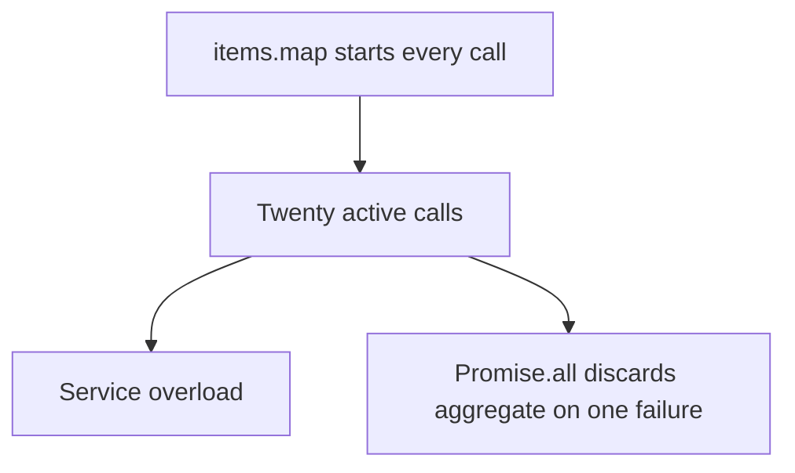
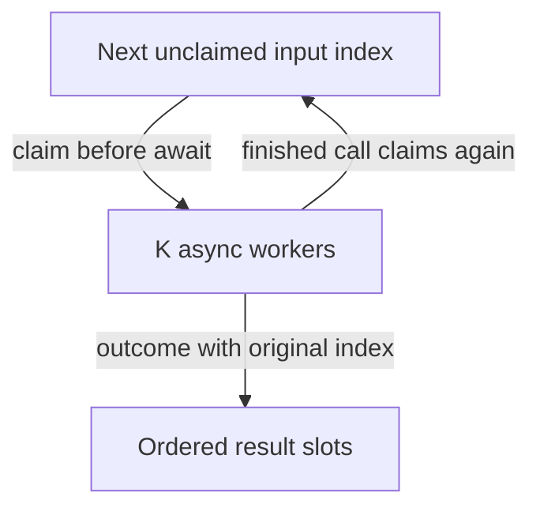

# Bounded fan-out · preserve order under partial failure

[Curriculum](../../../../README.md) · [Backend and APIs](../../README.md)

> “A dashboard loads details for 20 accounts. Starting every request overloads the
> service. Run at most three calls at once, keep input order, and display an error
> for one account without discarding successes. What does failure mean?”

Constructed 35-minute session. Prerequisite: [runtime model](../bounded-executor/runtime.md).
Keep [the reference](../../../../01-code/02-data-structures-algorithms/typescript.ts) closed until the attempt is complete.

Original illustration: [worker slots animation](../../../../../assets/learning/worker-slots.svg)
and [static view](../../../../../assets/learning/worker-slots-still.svg).

| Contract | Expected behavior |
|---|---|
| Inputs | Ordered items, async operation, positive integer K |
| Example | `[a,b,c]`, b fails, c finishes first → `[success(a),failure(b),success(c)]` |
| Boundaries | Empty input → `[]`; K=0 or fractional K → reject; peak active ≤ min(K,n) |
| Excluded | QPS, fleet admission and forced cancellation |



Trace three calls in reverse completion order; assign each input an output slot;
create K workers, each claiming an index synchronously before any await; catch each
item's failure into its own slot. The counter is safe under this event-loop model,
not automatically under threads. Explain every await before running the code.



**Follow-up:** does this enforce 100 calls/second? Expected: no; concurrency and rate
are different. Add clock-based admission for QPS. **Follow-up:** caller aborts but two
calls ignore abort. Expected: define skipped unstarted items, retain active permits
until work stops, and guard UI commits separately. A timeout cannot free a real socket.

Run from the repository root:

```sh
node --test curriculum/01-code/02-data-structures-algorithms/typescript.test.ts
```

Scheduling is O(n), result space O(n), active calls O(min(K,n)); elapsed time depends
on service durations. Senior checks include partial failures, reverse completion and
invalid K. Lead scope adds dependency budgets across replicas. Next:
[the threaded executor](../bounded-executor/README.md).
