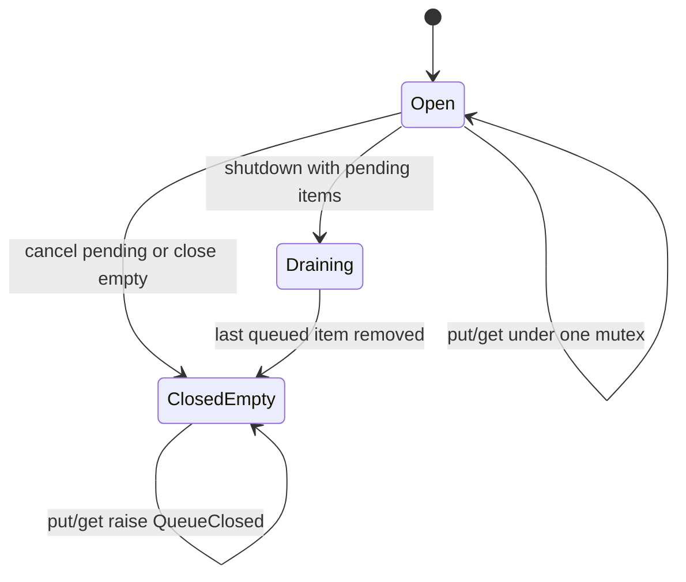
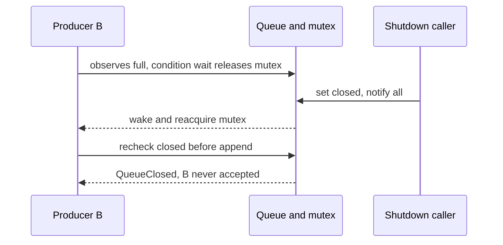
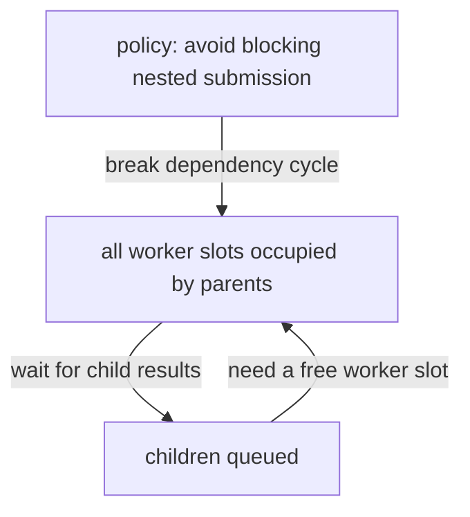

# Bounded blocking queue with shutdown

[Curriculum](../../../../README.md) · [Backend and APIs](../../README.md) · [All coding problems](../../../../../indexes/coding.md)

> “Several producer threads submit items to worker threads. Memory must stay bounded:
> producers wait when the queue is full, consumers wait when empty. Shutdown must
> wake blocked callers and either drain accepted items or cancel queued items.
> Which state change lets a waiting operation proceed, and what if a wake-up does
> not mean that state is still true?”

Constructed practice question; backend/infrastructure extension. Prerequisites:
[explicit mutable state](../../../../04-scale-and-evolution/01-data-at-scale/problems/28-manual-lru-cache/README.md) and
[time boundaries](../../../../04-scale-and-evolution/01-data-at-scale/problems/29-expiring-key-value-store/README.md). Concurrency means
operations overlap; it does not imply parallel CPU execution. A condition variable
lets a thread release a mutex while waiting, then reacquire it before checking state.

| Contract | Required behavior |
|---|---|
| Input | Positive capacity; arbitrary items; `put/get(timeout=None)` |
| Ordering | FIFO removal; successful puts are accepted once; processing order is outside scope |
| Blocking | Full put/empty get wait; zero timeout attempts immediately; expiry raises `TimeoutError` |
| Shutdown | First call selects drain or cancel; rejects future puts and wakes all waiters |
| Drain/cancel | Drain permits existing gets; cancel returns removed items; closed-empty get raises `QueueClosed` |
| Scope | One process; no fairness, task execution, acknowledgement, or cross-replica limit |

## The tool before the challenge

A condition variable lets a thread sleep **while releasing the lock**, then reacquire it to inspect state. Waking does not reserve a slot or item: another thread may have taken it.
```python
with condition:
    while len(items) >= capacity and not closed:
        condition.wait()  # releases and reacquires the mutex
    if closed:
        raise QueueClosed()
```
For capacity 1 containing A, a put(B) blocks until A is removed *or* shutdown rejects it. Use a loop, a single deadline across wakes, and explicit drain/cancel behavior.

### A design choice worth saying aloud

Separate `closed` from `items`: shutdown may reject new puts while still permitting consumers to drain queued work. Recheck capacity and closure in a `while` after every wake; a signal is not a reservation. Use one monotonic deadline for timed operations, or repeated wakes could extend the advertised timeout.

<!-- interview-rehearsal:start -->

## What the interviewer expects

The interviewer gives you the scenario and the contract above. Explain what a
successful call returns, walk one row from the table below, and name what your
state means *before* choosing a data structure.

**Done means:** Preserve FIFO and bounded capacity while giving every put, get, timeout, drain, and cancellation race the documented outcome.

Now predict each output before looking at the reference; invalid input should
leave any existing state unchanged unless the contract says otherwise.

### Test-case scenarios to settle before coding

| Case | Exact input or state | Expected result | What it is testing |
|---|---|---|---|
| FIFO | put A, put B, then two gets | A then B | Acceptance order is preserved. |
| Full producer | capacity 1 contains A; producer puts B | producer waits until A is removed, then succeeds once | Use a condition loop, not one wakeup assumption. |
| Empty consumer | consumer gets from empty queue | waits until item, close, cancel, or deadline | Every wake path rechecks state. |
| Timeout zero | full put or empty get with timeout 0 | immediate `TimeoutError` | Zero is a nonblocking attempt. |
| Drain/cancel | close with items present | drain serves them; cancel returns/removes them | Shutdown policy is explicit and first call wins. |
| Race safety | competing producers/consumers plus spurious wakeups | no loss/duplication; deadline budget not reset | Concurrency tests target schedules, not only values. |

For each row, show which branch or state change produces that result.

<!-- interview-rehearsal:end -->

At capacity 1, put A succeeds; put B waits. Getting A frees B's slot. If shutdown
begins while B waits, B instead raises `QueueClosed`; drain still permits reading A.
Cancel mode returns `[A]` and leaves no item to read. Invalid capacity/timeout raises
`ValueError`. Ask which shutdown policy callers expect before choosing one.



Implement independently. Write the exact put/get predicates and identify the
instant each successful operation becomes visible to other threads.

<details>
<summary>Solution, schedules, and follow-ups</summary>

Checking capacity outside a lock is the baseline race: two producers both see one
free slot and both append. Holding a lock while sleeping blocks the consumer that
could free a slot. A condition's atomic release-and-wait operation solves this
coordination problem, but a notification itself does not reserve an item or slot.

Use one mutex/condition around deque and closed flag. Put waits **while** full and
open, then rejects closed or appends. Get waits **while** empty and open, then removes
an item or rejects closed-empty. Every mutation notifies waiting callers. Shutdown
sets closed and optionally clears queued items while holding that same mutex, then
notifies all. No arbitrary user callback executes under the lock.

**Safety invariant:** `0 <= size <= capacity`; each successful removal takes one
previously accepted item, and no append linearizes after closure. **Liveness
condition:** a waiter can progress when its predicate changes, provided the runtime
eventually schedules it; strict fairness is not promised. Predicate loops tolerate
spurious notifications and another thread consuming the opportunity first.



Compute one monotonic deadline per operation; each repeated wait uses the remaining
budget. A timeout limits waiting while the predicate is false, not OS scheduling,
mutex-acquisition latency, or task execution. The implementation caps individual
waits at the runtime's supported duration. Deque mutation is O(1); `notify_all`
may wake O(w) waiters, so total notification/scheduling work is not constant. Queue
storage is O(capacity), plus O(w) waiting-thread resources; cancellation copies O(q)
queued items. Blocking duration is unbounded without timeout or progress.

**Follow-up 1 — build a worker pool.** Remove items under the queue lock, execute
tasks outside it, and publish one success/failure outcome even when a task raises.
Cancellation can return queued items but cannot forcibly stop arbitrary running
Python code. Track accepted, running, completed, failed, and cancelled work separately.

**Follow-up 2 — a worker submits a child and waits.** Predict deadlock when all
workers do this: parents hold every worker slot while their children wait in the
queue. Queue correctness cannot create an available worker. Prohibit nested waits,
execute children inline under a documented rule, or use a separate scheduling model.



Senior depth is explaining safety, conditional liveness, deadlines, and shutdown
races. Lead depth adds fairness, tenant budgets, and cross-process coordination;
this queue alone does not establish executor or distributed delivery guarantees.

Reference: [solution.py](solution.py). Tests use barriers and condition-entry
events rather than sleeps, explicitly inject a useless wake-up, verify competing
threads lose/duplicate no items, and simulate repeated deadline wake-ups with a
fake clock. Every thread join is bounded and workers are daemonized as a hang guard.

```bash
python -m unittest discover -s curriculum/02-applications/01-backend/problems/42-bounded-blocking-queue -p 'test_*.py'
```

</details>
