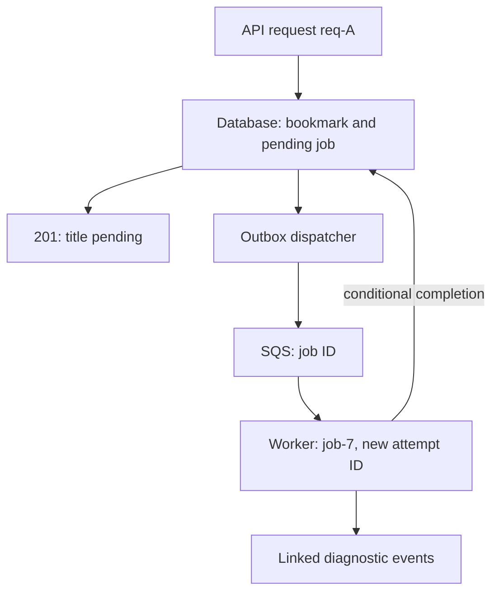
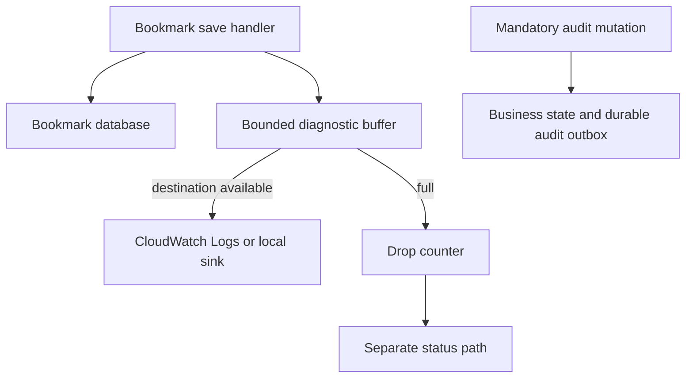

# Trace requests through a bookmark API

## Application background

Alice is collecting articles for her research team. She pastes `https://example.com/docs` into a reading-list app and clicks Save. The browser sends the URL to the app's server. The server stores a bookmark in its database so Alice can find the link again later, even after closing her browser.

The API is the set of server endpoints the app calls. For this save, the request has this shape. `POST /bookmarks` means “create a bookmark,” and the JSON body contains the URL to store:

```http
POST /bookmarks
X-Demo-User: alice
Content-Type: application/json

{"url":"https://example.com/docs"}
```

The app also wants to show a readable name, such as “Database setup guide,” beside the URL. In a deployed version, it would request the linked web page and read its title. If that website is slow, the app should stop waiting after a set time. That is a timeout. Alice's bookmark should still exist, with its title missing for now.

### Example request result

When you run the supplied server later in this page, a normal save returns **201 Created**. That HTTP status means a new record was created. These are the relevant fields from an example response:

```json
{
  "id": 41,
  "url": "https://example.com/docs",
  "title": "Example documentation",
  "title_status": "ready"
}
```

`41` is the saved bookmark's ID. The title is the text the interface can display beside the URL. Your ID will depend on which records are already in your database.

The supplied server simulates title lookup locally, without contacting the website. Its `title_mode: "timeout"` input lets you practice the slow-website case on demand. That save still returns **201**, but with `title: null` and `title_status: "timeout"`. The link exists even though its display title is missing.

### The problem you will solve



While Alice's title lookup is waiting, Bob can save a different URL and receive a title normally. Support needs to explain Alice's result without confusing those overlapping operations.

Request tracing gives one incoming request a unique label and attaches that label to the diagnostic records written during its processing. It lets support distinguish Alice's database save and title lookup from Bob's activity.

Without request IDs, a shared log might contain “bookmark saved,” “bookmark saved,” and “title lookup timed out.” Those lines do not say which save had the missing title. When several requests overlap, their timestamps alone cannot reliably connect each result to the right request.

A **bookmark ID** identifies the saved item. A **request ID** identifies one attempt to call the API. You will add that request ID to the response and to each related diagnostic record so support can ask, “Show me everything that happened during this save.”

## Your assignment

**Deliver:** Add request IDs and diagnostic records to the supplied API. Write a command that takes one response's request ID and shows which steps succeeded, failed or have no recorded outcome.

Use Alice's slow title lookup and Bob's successful lookup as the first scenario. Support should be able to explain Alice's result using her request ID without mixing in Bob's activity. Do not record full URL paths or query strings, which can contain private information or access tokens.

**Required behavior:** The server creates a request ID and returns it even when the operation fails. Write diagnostic events as JSON records containing that ID, the step name and its outcome. Record the identity check, database save and title lookup separately. Measure elapsed time with `time.monotonic()`, a clock intended for durations that is unaffected by adjustments to the system's calendar clock.

The required first milestone is a working local implementation of the behavior above. The numbered implementation steps define the scope. The cloud architecture is a later extension, not something the starter has already provisioned.

## Get the code and run the supplied example

The code is in the public [junior-to-staff repository](https://github.com/Soulful-Iris/junior-to-staff). Install Git and Python 3.12+. No AWS account or Python packages are required for this first run. If you already have a checkout, use it and skip cloning.

```bash
git clone https://github.com/Soulful-Iris/junior-to-staff.git
cd junior-to-staff
python3 examples/architecture-starts/01_the_request_you_can_trace_end_to_end.py
```

**Supplied file:** [`examples/architecture-starts/01_the_request_you_can_trace_end_to_end.py`](https://github.com/Soulful-Iris/junior-to-staff/blob/main/examples/architecture-starts/01_the_request_you_can_trace_end_to_end.py). You can also [read or download the source here](../../../../examples/architecture-starts/01_the_request_you_can_trace_end_to_end.py).

This program is a **mechanism demonstration**: it runs the small scenario in one process and prints the result. It is not an HTTP service, a complete application, or an AWS deployment. A successful run demonstrates this mechanism only. It does not establish the workload or failure guarantees of the application you will build.

**Example output from the supplied run:**

Generated IDs and timestamps may differ. Compare the state transitions and outcomes.

```text
{"request_id": "A", "event": "auth.ok"}
{"request_id": "B", "event": "auth.ok"}
{"request_id": "A", "event": "bookmark.saved"}
{"request_id": "B", "event": "bookmark.saved"}
… (more output follows)
```

### Run the application you will extend

The [reading-list API setup guide](../../../../examples/reading-list-starter/README.md) gives you a real local HTTP server, SQLite database, save/list/edit requests and controlled title success/timeout behavior. Start it in one terminal and send the documented `curl` requests from another. Read that setup before following the implementation steps below. The demo above isolates this lesson's mechanism. The server is where you integrate it.

For a first run, start this in **terminal 1** from the repository root:

```bash
python3 examples/reading-list-starter/app.py --db /tmp/reading-list.sqlite3
```

In **terminal 2**, save one bookmark with a controlled title timeout:

```bash
curl -i http://127.0.0.1:8080/bookmarks \
  -H 'X-Demo-User: alice' -H 'Content-Type: application/json' \
  -d '{"url":"https://example.com/docs","title_mode":"timeout"}'
```

Expect **201 Created**, a bookmark `id` and `title_status: "timeout"`. The URL remains saved in the database even though title lookup failed. This is the supplied baseline. The assignment adds the behavior described above. The lookup is a controlled local simulation, so no external website is contacted. Use `X-Demo-User: bob` for the second person's request. These headers select local demonstration users. They are not a production sign-in mechanism.

Work in your own branch or copy `examples/reading-list-starter/` to `work/01-the-request-you-can-trace-end-to-end/`. `app.py` exists in that directory. Add the modules named below there as you separate HTTP, storage and background work. The server has demo membership, not production authentication.

## Local components and state to implement

This table names the records, interfaces or decision inputs for your deliverable. Unless a name is explicitly linked to supplied source above, it is something you create. Implement the local state transitions first, then connect the HTTP, storage or worker boundaries required by the steps.

| Record / module | Key or interface | Responsibility |
|---|---|---|
| request_context | request_id,subject,started_monotonic | Per-request scope, not a mutable global variable. |
| log_event | event,request_id,operation_id,duration_ms,outcome | Stable JSON schema with bounded safe fields. |
| trace_request.py | request_id plus JSONL input | Prints only the selected request and identifies missing completion evidence. |

## Implement the assignment

### 1. Instrument the actual request boundary

Start in `Handler.dispatch()` in the supplied `app.py`: create a UUID for this request and keep it in request-local context until the response finishes. Update `Handler.reply()` to return it as `X-Request-ID`. If you later accept an upstream ID, validate its length and origin at a trusted edge. Reject control characters. Put the same ID in the JSON error body. Never use a process-global current_request variable.

### 2. Trace each operation

Write a diagnostic event after the demo membership check, after the bookmark is saved in the database, and after `lookup_title()` returns. A database commit is the point where a transaction's changes become saved database state. It is unrelated to a Git source-code commit. Give each operation an ID and measure its elapsed time with `time.monotonic()`. Write one JSON object per line to a local log file. Reserve stdout for a startup message if you need it. Store URL host or a controlled hash only if useful. Omit path/query secrets. A saved bookmark and a failed title lookup are separate outcomes and should not become one misleading request-failed message.

### 3. Build the support command

Create `trace_request.py` beside your modified `app.py`. Make `python3 trace_request.py --request-id <id> --log <path>` filter JSONL by exact request ID and print phase, duration and outcome. The command is a deliverable you write, not a supplied command yet. If a completion event is missing, report unknown/incomplete evidence rather than inventing success. Run two concurrent requests and show each isolated story.

### 4. Optional extension: carry identity into jobs

If you later move title lookup to a background worker, store the new `job_id`, the originating `parent_request_id` and the pending work together. This lets the worker's later activity point back to the request that created it. Each retry gets a new attempt ID under the same job. Bound diagnostic buffering when the log destination fails, and count dropped events without recursive logging.

## Demonstrate the completed local result

After steps 1–3, repeat the `curl -i` request above and copy `X-Request-ID` from its response. Run your new support command with that ID. It should show membership accepted, bookmark saved, and title lookup timed out for that one request. Send another request as `bob` with `title_mode: "ok"`. Its events must have a different ID. A request without `X-Demo-User` should return 401 with its own traceable ID.

| Action | Expected visible result |
|---|---|
| Run the starting program | A and B interleave while every event retains its own request ID. |
| Send a newline-containing client ID | The trusted boundary replaces or rejects it. No forged log line appears. |
| Stop title lookup | The record remains saved and support sees the separate timeout. |

**Handoff:** In your implementation README, include the start command, one successful operation, the failure case above and the resulting stored state or decision. State which dependencies are simulated. Someone with a fresh checkout should be able to reproduce this without your chat history.

## Workload assumptions and capacity decisions

These are constructed exercise assumptions. The stated workload is a design target. The local demonstration does not establish that throughput. Use the [estimation constants](../../../01-code/01-problem-solving/estimation-constants.md) to check units before choosing capacity.

| Input or objective | Calculation / consequence |
|---|---|
| 50 concurrent requests. Three operations/request | At least 150 interleaved operation timelines. Wall-clock sorting alone cannot assign causality. |
| 500 ms title-fetch deadline | Record a title.timeout event while keeping the saved bookmark outcome explicit. |
| 1 KiB/event × six events/request assumption | 6 KiB/request of diagnostics before sampling/retention decisions. |

## Map the local implementation to AWS

**Deployment status: local only.** Running the supplied command creates no AWS resources and configures no cloud connections. The diagram is a proposed deployment of the completed application. Each box needs either a deployed runtime, a provisioned service or an explicitly external dependency.

Read the diagram by following the arrows from the entry point: application code accepts the request or event, the state owner commits it, and any worker produces the later result. The table ties those roles to code and adapter work. Multiple boxes do not imply multiple Python files already exist.


CloudWatch stores structured events, but correct attribution comes from request-local context and explicit propagation. The same schema works with local JSONL before any cloud deployment.

| Local responsibility | Cloud destination and role | Implementation still required |
|---|---|---|
| Local HTTP boundary or the endpoint you will add | Amazon API Gateway: trusted HTTP entry | Create routes and an integration. Translate requests and responses and configure identity validation. |
| Python operation or worker function | AWS Lambda: bookmark request handler | Write a Lambda event adapter, package its dependencies and give its role only the required resource actions. |
| Local dictionary, SQLite records or state model | Amazon DynamoDB: bookmark and job state | Design partition/sort keys and write a storage adapter with conditional updates or transactions. Python state and SQL are not uploaded as a database. |
| Local pending-work collection | Amazon SQS: asynchronous title work | Publish committed job intent, consume messages and persist deduplication/ownership state. Add visibility, retry and dead-letter handling. |
| Python operation or worker function | AWS Lambda: title lookup worker | Write a Lambda event adapter, package its dependencies and give its role only the required resource actions. |
| Local diagnostic events | Amazon CloudWatch Logs: diagnostic event store | Emit structured JSON from the deployed runtime and configure log delivery, retention and query permissions. |

### Provision resources, then connect the application

| Resource or boundary | Initial configuration and reason |
|---|---|
| Log groups | Explicit retention and scoped query access. No raw authorization headers or private URLs. |
| Runtime context | Reset request context after completion. Queue messages carry identity as data. |
| Delivery | Diagnostic logging uses bounded buffering. Durable audit evidence would require a different commit contract. |

Use one disposable AWS environment for the cloud exercise. Put the named resources in `infra/template.yaml` or your existing IaC tool, pass resource IDs through configuration, and scope each runtime role to its own tables, buckets and queues. The diagram is a design to implement. It is not a claim that these resources have been deployed. Record the commands you used to deploy and remove the exercise resources.

For concrete provisioning commands, configuration wiring and cleanup, use the [AWS foundation guide](../../../../examples/architecture-starts/infra/README.md). It includes a deployable table/queue/object-storage foundation and explains which application and service adapters you still implement.

A provisioned queue or table does not make the local program use it. Configure resource IDs in the deployed runtime, replace the local adapter, and replay the same successful and failing operation against that runtime. Record the deployed commit and observable result, then remove the disposable resources using your infrastructure tool.

## Extend the design after the baseline works


Join work across three services with imperfect clocks. Add parent/child span relationships and elapsed durations. Do not infer cross-host causality from timestamps alone.

<details>
<summary>Follow-up scenarios and worked designs</summary>

## Follow-up 1 · The title becomes a queued job

**Changed requirement:** The response finishes before the worker starts. How do support and operations join the story?

<details>
<summary>Worked design and implementation</summary>

Store job ID and parent request ID in the enqueue transaction and propagate them as data. The worker has its own attempt ID. Retries are distinct attempts linked to one job.

Alice now needs the save response immediately, even if the linked website takes several seconds. The existing handler performs title lookup before sending its response. Move that lookup into a separate process so it can continue after the request ends or the API restarts.

| Boundary | Baseline | Revised design |
|---|---|---|
| Save | Store bookmark, then fetch title | Store bookmark and pending job in one database transaction |
| Response | Title is ready or timed out | Return 201 with `title_status: "pending"` |
| Work identity | One request ID | Request ID → stable job ID → separate attempt IDs |
| Recovery | Request ends the work | A dispatcher can rediscover unsent jobs after a restart |

**Implement it locally.** In `Handler.dispatch()`, replace the direct `lookup_title()` call with a transaction that inserts the bookmark and a title-job row. Add `job_id`, `bookmark_id`, `bookmark_version`, `parent_request_id` and status to that row. Create a worker command that claims a pending job, records a fresh attempt ID and calls the existing title fixture. Complete only if its ownership and the bookmark version still match. A later browser read observes the title result. The code for this extension is yours to add.

For AWS, retain the durable job intent in the database and have a dispatcher publish its ID to SQS. This stored intent is an **outbox**: work saved alongside the bookmark so an API crash cannot lose the instruction to fetch its title. Database writes and SQS sends are separate operations. A crash after sending but before marking sent can publish twice, so the worker still needs duplicate-safe completion. The queue message should identify the job, not carry a secret-bearing URL. Load the authorized current URL from storage. The [AWS transactional outbox guide](https://docs.aws.amazon.com/prescriptive-guidance/latest/cloud-design-patterns/transactional-outbox.html) explains the database/message boundary. The [SQS visibility documentation](https://docs.aws.amazon.com/AWSSimpleQueueService/latest/SQSDeveloperGuide/sqs-visibility-timeout.html) explains why visibility does not eliminate duplicate delivery.

**Walk through one interrupted job.** The identifiers below are illustrative:

```json
{"event":"bookmark.saved","request_id":"req-A","bookmark_id":41,"job_id":"job-7"}
{"event":"title.started","parent_request_id":"req-A","job_id":"job-7","attempt_id":"try-1"}
{"event":"title.started","parent_request_id":"req-A","job_id":"job-7","attempt_id":"try-2"}
{"event":"title.completed","parent_request_id":"req-A","job_id":"job-7","attempt_id":"try-2"}
```

Stop attempt 1 after it starts, then let attempt 2 finish. Extend `trace_request.py` to show both attempts under job 7. Report attempt 1 as incomplete, not successful. Keep queue waiting time separate from execution duration. Across hosts, use explicit parent links and local elapsed durations rather than assuming wall clocks perfectly agree. Support should be able to start with Alice's response ID and reach the later title outcome.

**Revised flow.** These are proposed components to implement, not extra services started by the supplied demo.



</details>

## Follow-up 2 · Logging fails

**Changed requirement:** The log destination is temporarily unavailable. Should user work stop?

<details>
<summary>Worked design and implementation</summary>

Choose bounded buffering/drop counters for ordinary diagnostics. Handle audit events according to their stronger contract. Bound memory, alarm on lost evidence, and avoid recursive logging failures.

The bookmark database is healthy, but the diagnostic destination is unreachable. If every save waits indefinitely for a log write, a support tool has become a dependency that can stop the product. If logs simply vanish, support may mistake missing evidence for success.

**Implement two explicit contracts.** Ordinary request diagnostics use a bounded nonblocking buffer and may be dropped when it fills. A mandatory audit event, such as a permission change that must retain evidence, belongs in durable transactional state before that business change is acknowledged. The bookmark tracing exercise needs ordinary diagnostics. Do not turn every trace event into a mandatory audit transaction.

Use an illustrative buffer budget of 1 MiB and a maximum encoded event size of 1 KiB, with both byte and event-count limits. At 100 requests/s and six maximum-sized events per request, an empty buffer fills in about 1.7 seconds without draining. This is a brief outage cushion, not durable retention. Account for object overhead separately when choosing the process memory limit.

Add buffer depth, dropped-event count and last successful delivery time. Update the drop counter without invoking the failing logger. Expose these counters through a separate health or metrics path. If that path shares the same failed destination, the responder may still have no evidence, so report that limitation. Keep a separate local status record for the exercise.

**Demonstrate the result.** Disable diagnostic delivery, continue saving bookmarks and fill the buffer. Saves still return 201, buffer memory stays bounded and the drop counter increases. Restore delivery and show the remaining records drain. The support command must label the missing interval as incomplete evidence. For the optional audit variant, interrupt archive delivery and show the durable outbox retains unsent audit events. State what happens if even that durable store cannot accept a write.

**Revised flow.** These are proposed components to implement, not extra services started by the supplied demo.



</details>

</details>
