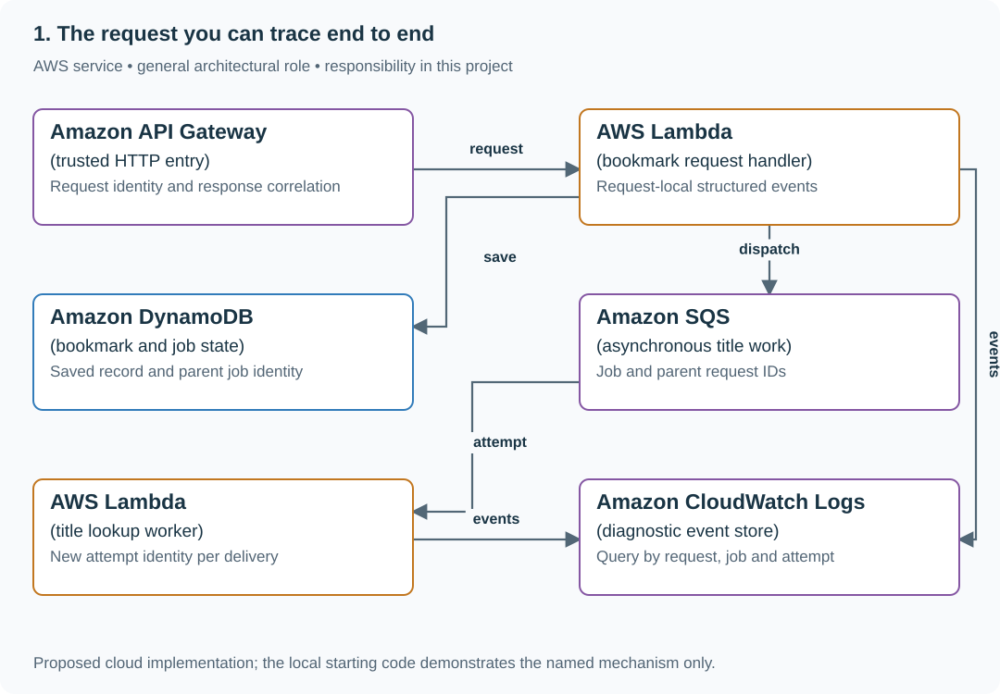

# 1. The request you can trace end to end

## What you are building

> Add request tracing to a bookmark API used by a 50-person research team. At 10:00, Ana’s save succeeds but its title lookup times out while Ben’s request completes normally. Support has only Ana’s response ID and must reconstruct her request without seeing a secret-bearing URL.

**Working contract:** Every response includes a trusted request ID. Structured events carry that ID through authentication, database work and title lookup. Durations use a monotonic clock; logs omit tokens and private URL values.

## Workload and the decisions it changes

These are constructed exercise assumptions. The stated workload is a design target; the local demonstration does not establish that throughput. Use the [estimation constants](../../../01-code/01-problem-solving/estimation-constants.md) to check units before choosing capacity.

| Input or objective | Calculation / consequence |
|---|---|
| 50 concurrent requests; three operations/request | At least 150 interleaved operation timelines; wall-clock sorting alone cannot assign causality. |
| 500 ms title-fetch deadline | Record a title.timeout event while keeping the saved bookmark outcome explicit. |
| 1 KiB/event × six events/request assumption | 6 KiB/request of diagnostics before sampling/retention decisions. |

## Start with one working boundary

Run from the repository root with Python 3.12+:

```bash
python3 examples/architecture-starts/01_the_request_you_can_trace_end_to_end.py
```

[Open the starting code](../../../../examples/architecture-starts/01_the_request_you_can_trace_end_to_end.py). This is a runnable demonstration of the critical state boundary. The API, UI, cloud adapters and operating behavior below are the application you build around it.

| Record / module | Key or interface | Responsibility |
|---|---|---|
| request_context | request_id,subject,started_monotonic | Per-request scope, not a mutable global variable. |
| log_event | event,request_id,operation_id,duration_ms,outcome | Stable JSON schema with bounded safe fields. |
| trace_request.py | request_id plus JSONL input | Prints only the selected request and identifies missing completion evidence. |

## AWS implementation



CloudWatch stores structured events, but correct attribution comes from request-local context and explicit propagation. The same schema works with local JSONL before any cloud deployment.

## Build it in this order

### 1. Instrument the actual request boundary

Add middleware in app.py that creates a UUID or validates a bounded upstream ID from a trusted edge. Reject control characters. Put the ID in a request-local context, response header and error body; never use a process-global current_request variable.

### 2. Trace each operation

Emit auth, database commit and title-fetch events with operation IDs and monotonic elapsed time. Store URL host or a controlled hash only if useful; omit path/query secrets. A saved bookmark and a failed title lookup are separate outcomes and should not become one misleading request-failed message.

### 3. Build the support command

Write trace_request.py to filter JSONL by exact request ID and display phase, duration and outcome. If a completion event is missing, report unknown/incomplete evidence rather than inventing success. Run two concurrent requests and show each isolated story.

### 4. Carry identity into jobs

When title lookup becomes asynchronous, commit job_id and parent_request_id with dispatch intent. Each retry gets a new attempt ID under the same job. Bound diagnostic buffering when the log destination fails, and count dropped events without recursive logging.

## Infrastructure configuration

| Resource or boundary | Initial configuration and reason |
|---|---|
| Log groups | Explicit retention and scoped query access; no raw authorization headers or private URLs. |
| Runtime context | Reset request context after completion; queue messages carry identity as data. |
| Delivery | Diagnostic logging uses bounded buffering; durable audit evidence would require a different commit contract. |

Use one disposable AWS environment for the cloud exercise. Put the named resources in `infra/template.yaml` or your existing IaC tool, pass resource IDs through configuration, and scope each runtime role to its own tables, buckets and queues. The diagram is a design to implement; it is not a claim that these resources have been deployed. Record the commands you used to deploy and remove the exercise resources.

For concrete provisioning commands, configuration wiring and cleanup, use the [AWS foundation guide](../../../../examples/architecture-starts/infra/README.md). It includes a deployable table/queue/object-storage foundation and explains which application and service adapters you still implement.

## Observe the result

| Action | Expected visible result |
|---|---|
| Run the starting program | A and B interleave while every event retains its own request ID. |
| Send a newline-containing client ID | The trusted boundary replaces or rejects it; no forged log line appears. |
| Stop title lookup | The record remains saved and support sees the separate timeout. |

## The next design decision

Join work across three services with imperfect clocks. Add parent/child span relationships and elapsed durations; do not infer cross-host causality from timestamps alone.

<details>
<summary>Further constraints from the original project</summary>

## Follow-up 1 · The title becomes a queued job

**Changed requirement:** The response finishes before the worker starts. How do support and operations join the story? Predict which boundary must change before opening the design.

<details>
<summary>Expected reasoning and changed diagram</summary>

Store job ID and parent request ID in the enqueue transaction and propagate them as data. The worker has its own attempt ID; retries are distinct attempts linked to one job.

</details>

## Follow-up 2 · Logging fails

**Changed requirement:** The log destination is temporarily unavailable. Should user work stop? State what evidence would make you reject your first design.

<details>
<summary>Expected reasoning and changed diagram</summary>

Choose bounded buffering/drop counters for ordinary diagnostics; handle audit events according to their stronger contract. Bound memory, alarm on lost evidence, and avoid recursive logging failures.

</details>

</details>
