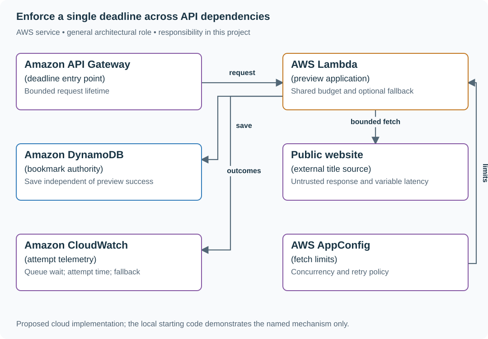

# 2. The three-second budget

## What you are building

> Build a bookmark preview endpoint with a three-second response deadline. Authentication and the database use 300 ms, the response needs 100 ms, and the remote page sometimes times out. The service must decide whether a retry can still finish within the original deadline.

**Working contract:** One request owns one three-second budget. Every attempt, backoff and queue wait consumes it. Return the saved bookmark with an explicit unavailable preview when optional fetching cannot finish in time.

## Workload and the decisions it changes

These are constructed exercise assumptions. The stated workload is a design target; the local demonstration does not establish that throughput. Use the [estimation constants](../../../01-code/01-problem-solving/estimation-constants.md) to check units before choosing capacity.

| Input or objective | Calculation / consequence |
|---|---|
| 3,000 ms total − 300 ms auth/database − 100 ms response | 2,600 ms remain for fetch attempts and backoff. |
| Two 1,200 ms attempts plus 200 ms backoff | Exactly 2,600 ms; any additional delay requires shortening or skipping the second attempt. |
| 100 concurrent requests × two possible attempts | Up to 200 calls over their lifetimes, but instantaneous outbound concurrency must remain bounded. |

## Start with one working boundary

Run from the repository root with Python 3.12+:

```bash
python3 examples/architecture-starts/02_the_three_second_budget.py
```

[Open the starting code](../../../../examples/architecture-starts/02_the_three_second_budget.py). This is a runnable demonstration of the critical state boundary. The API, UI, cloud adapters and operating behavior below are the application you build around it.

| Record / module | Key or interface | Responsibility |
|---|---|---|
| deadline | monotonic_start,total_budget | Remaining time decreases across every phase. |
| fetch_attempt | request_id,attempt,timeout_ms,outcome | Distinct attempt evidence under one operation. |
| preview_result | available,title or reason | Optional failure does not erase committed bookmark state. |

## AWS implementation



The application owns the end-to-end budget. Gateway and runtime timeouts are outer limits, not a substitute for carrying remaining time into each dependency call.

## Build it in this order

### 1. Pass a deadline through the call graph

Create it once at ingress using a monotonic clock. Helpers accept remaining time or a deadline object rather than independent default timeouts. Include semaphore/pool acquisition time; waiting for a socket is still request time.

### 2. Classify retryable outcomes

Retry a transient connect failure or selected 5xx only when the operation is safe and the remaining budget covers another useful attempt. Respect a bounded Retry-After. Do not repeat a non-idempotent effect because a response was lost.

### 3. Bound the outbound path

Set connect/read/total deadlines, response byte limit and a concurrency semaphore. Release resources on cancellation. If a timed-out task continues running in the background, its resource use still counts against the service.

### 4. Make the user-visible fallback explicit

Return the saved bookmark and preview_status unavailable with a reason safe for users. Record attempts and remaining budget for operators. Re-run with an extra 100 ms of queue waiting and show that the second attempt shrinks or disappears.

## Infrastructure configuration

| Resource or boundary | Initial configuration and reason |
|---|---|
| Timeouts | Configure infrastructure timeouts above the application’s three-second response contract; the app stops useful work earlier. |
| Outbound limits | Fixed concurrency and response-size cap; retries share the original admission budget. |
| Metrics | Count logical requests and attempts separately so a retry storm cannot masquerade as increased demand. |

Use one disposable AWS environment for the cloud exercise. Put the named resources in `infra/template.yaml` or your existing IaC tool, pass resource IDs through configuration, and scope each runtime role to its own tables, buckets and queues. The diagram is a design to implement; it is not a claim that these resources have been deployed. Record the commands you used to deploy and remove the exercise resources.

For concrete provisioning commands, configuration wiring and cleanup, use the [AWS foundation guide](../../../../examples/architecture-starts/infra/README.md). It includes a deployable table/queue/object-storage foundation and explains which application and service adapters you still implement.

## Observe the result

| Action | Expected visible result |
|---|---|
| Run the starting program | Two attempts plus backoff fit exactly inside 3,000 ms with the response reserve. |
| Add queue waiting | The later attempt loses time rather than extending the request deadline. |
| Make preview unavailable | The bookmark is still returned with a truthful preview state. |

## The next design decision

Add parallel metadata providers. Cancel losing requests, cap total fan-out and decide whether one successful provider is enough to finish the request.

<details>
<summary>Further constraints from the original project</summary>

## Follow-up 1 · The response is lost

**Changed requirement:** The create committed but the connection broke. The same key is retried concurrently. What is atomic? Predict which boundary must change before opening the design.

<details>
<summary>Expected reasoning and changed diagram</summary>

The deduplication record and stored item/result must commit together. Replays return the recorded result; key reuse with different content returns conflict. A separate marker before an external side effect is not enough.

</details>

## Follow-up 2 · Several layers retry

**Changed requirement:** Client, API and SDK each permit three attempts. How many leaf calls can occur? State what evidence would make you reject your first design.

<details>
<summary>Expected reasoning and changed diagram</summary>

The maximum is 3×3×3=27; three retries after the initial attempt would be 4×4×4=64. Disable redundant retry layers, then assert the actual dependency call count and remaining deadline.

</details>

</details>
