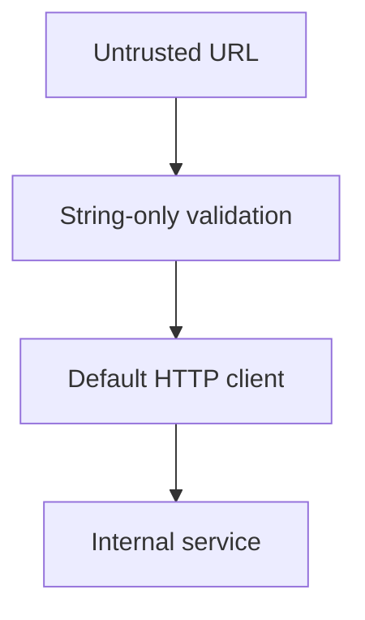
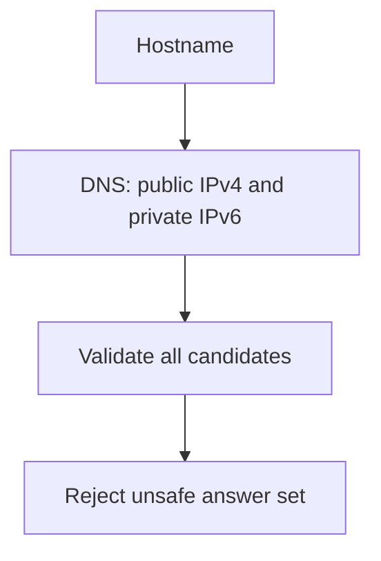
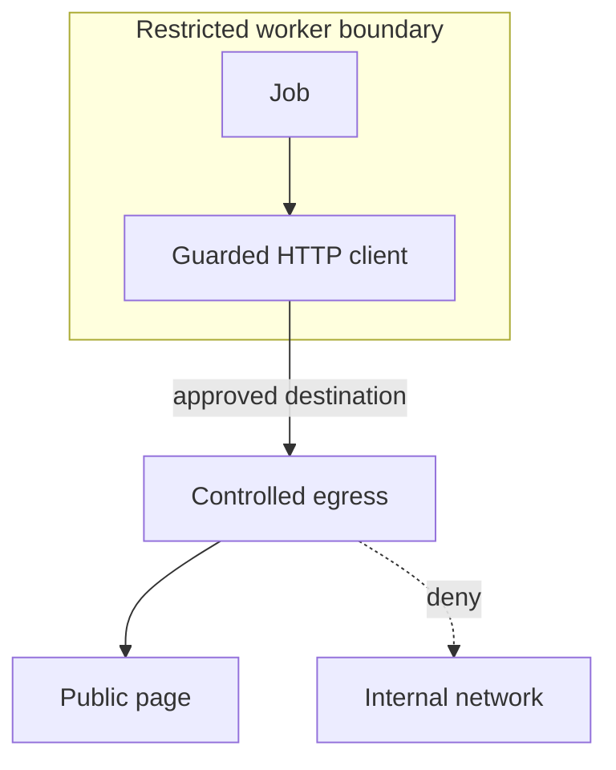

# 3. The fetch that cannot be aimed inward

[Curriculum](../../../README.md) · [Backend and APIs](../README.md) · [Project index](../../../../indexes/projects.md)

## The reviewer's brief

> A user can submit a public page for title extraction. Your service also has network access to internal systems. Prevent a crafted URL from turning that feature into an internal network client. Which address does your validation actually authorize?

This is a **constructed practice brief**, not an attributed company question.
Prerequisites: [the section](../request-lifecycle.md). This page is a build brief; it does not ship a runnable application. The original build and prompt sequence below defines the implementation checkpoints.

| Case | Exact input or workload | Expected outcome |
|---|---|---|
| Small example | Public HTTPS URL redirects to `http://127.0.0.1:8080/admin`. | First hop may connect; redirect is rejected before any local listener accepts a connection. |
| Boundary / failure | Hostname resolves publicly during checking but privately during connection. | Connect only to the vetted address while preserving the hostname for Host and TLS verification. |
| Scope | HTTP/HTTPS, at most three redirects, one-megabyte response, inherited total deadline. | Explain any additional assumption before implementing it. |

## See the first reviewable result

**First slice:** Try a public HTTPS URL that redirects to `http://127.0.0.1:8080/admin`. **Show:** the first allowed hop and an explicit rejection before the loopback listener sees a connection. Then make DNS change between validation and connection; a capture of the actual connected IP must prove it was the vetted public address while Host/TLS still use the original hostname.

<!-- project-expectation:start -->

## What you are expected to hand over

**The finished artifact:** One guarded HTTP client that everything in P1 fetches through: scheme allowlist, resolve-then-connect to the exact address that was vetted, refusals for private, loopback, link-local and metadata addresses, every redirect re-vetted, plus project 2's deadline and a size cap. Refusals are coded 4xxs, and the item still saves with…

Bring a runnable slice or decision artifact, its normal output, and a captured
failure from the examples above. Include one check that turns red when the guarantee
breaks, the state owner, and the first operational limit. For each follow-up,
change the diagram **and** the evidence before claiming the design still works.

### How the review conversation gets harder

| Review gate | The interviewer changes | Expected response |
|---|---|---|
| Baseline | Run the small example from the cases above. | Demonstrate the observable outcome end to end and identify which boundary owns it. |
| Failure | Reproduce the boundary/failure case above. | Show the failure before the fix, then prove the protected behavior without hiding the error. |
| Senior · DNS returns mixed addresses | One hostname returns both a public IPv4 and private IPv6 address. What does your policy do? Predict which boundary must change before opening the design. | For this exercise reject mixed unsafe answers rather than relying on client selection order. Test IPv4-mapped IPv6 and redirects with the same canonical address policy. |
| Lead · A future worker reuses fetching | The queued worker gains new credentials and network routes. Is the guard enough? State what evidence would make you reject your first design. | Reuse the same client and add restricted egress and least-privilege credentials. Application validation and network isolation protect different boundaries; neither proves the other. |
| Evidence | A reviewer asks, “How do you know?” | Build in three stops: reproduce the small case and baseline failure; implement the protected boundary; then replay both changed requirements with captured outputs. |
| Handoff | The author is unavailable and the environment is new. | Another engineer can run, observe, break, and recover the artifact from the repository evidence. |

Before implementation, say the baseline invariant, the owner of each piece of
state, and what the user sees when the named dependency or assumption fails. That
five-minute explanation is part of the project: if it is vague, the build is not
ready to begin.

<!-- project-expectation:end -->

Before looking at the guidance, state the invariant in one sentence and trace the example. In interview practice, implement or sketch independently, then reveal the reasoning. During AI-assisted practice, use the prompts below and verify each checkpoint before the next request.

## Baseline and the failure to explain



A public-looking hostname and an initially safe redirect do not constrain the later socket. The connection must use the address that passed policy.

<details>
<summary>Reveal the approach and decisions</summary>

Centralize the guarded client, parse strictly, vet all resolved address families, and bind the connection without weakening TLS hostname verification. Recheck each redirect and cap both transmitted and decompressed bytes. The invariant is no connection outside the approved public-address policy.

</details>

## Follow-up 1 · DNS returns mixed addresses

**Changed requirement:** One hostname returns both a public IPv4 and private IPv6 address. What does your policy do? Predict which boundary must change before opening the design.

<details>
<summary>Expected reasoning and changed diagram</summary>

For this exercise reject mixed unsafe answers rather than relying on client selection order. Test IPv4-mapped IPv6 and redirects with the same canonical address policy.



</details>

## Follow-up 2 · A future worker reuses fetching

**Changed requirement:** The queued worker gains new credentials and network routes. Is the guard enough? State what evidence would make you reject your first design.

<details>
<summary>Expected reasoning and changed diagram</summary>

Reuse the same client and add restricted egress and least-privilege credentials. Application validation and network isolation protect different boundaries; neither proves the other.



</details>

## Evidence to bring to review

Build in three stops: reproduce the small case and baseline failure; implement the protected boundary; then replay both changed requirements with captured outputs. Record commands, fixtures, and observed results in your implementation README. A diagram is a prediction until those checks run.

**Senior expectation:** Prove refusal using connection counts, not only error text. **Additional lead scope:** Own egress policy updates and shared-client adoption across services. Completion demonstrates practice evidence; it does not establish interview readiness or multi-team delivery experience.

## Build and prompt sequence

*You end up with a title fetcher that can be handed any URL and can only ever
reach the public internet — with a test that proves each refusal.*

**Build**

One guarded HTTP client that everything in P1 fetches through: scheme
allowlist, resolve-then-connect to the exact address that was vetted, refusals
for private, loopback, link-local and metadata addresses, every redirect
re-vetted, plus project 2's deadline and a size cap. Refusals are coded 4xxs,
and the item still saves with the failure visible.

**The thought process**

Start from the job description, not the threat list. The fetcher exists to
read public web pages, so the posture is deny by default: http and https, to
public addresses, everything else refused because it was never the job. The
section explained the stakes — your server stands somewhere privileged, and a
user-supplied URL is a request made from *its* position.

The decision that makes the project: a check must bind to the connection it
protects. A URL is indirection — the name you inspect is not the place you
connect — so the guard resolves the name, vets the resolved address, and
connects to exactly that. Inspecting the string and then connecting to
whatever it resolves to a moment later is inspecting a costume.

A redirect is a new fetch; approval does not survive it. Each hop gets the
whole check again, capped, because the classic hole is a public URL
redirecting somewhere internal, followed obediently by code that finished its
checking a hop ago. And the guard lives in one place — the client — so
project 5's worker inherits safety without anyone remembering to add it.

**How to organise the prompts**

**1. The map of what could reach you.**

```
Here is the code that fetches user-submitted URLs. Assume any URL. List
every way this fetch could be made to reach something inside my network
or my cloud account, hang forever, swallow something enormous, or be
re-aimed after a check has passed. Rank the list by how likely I am to
have missed each one. No code.
```

If redirects and re-resolution are missing, the list is not finished — push
back. What survives is the client's specification.

**2. The one guarded client.**

```
Build a single guarded fetch client and route every fetch in this
codebase through it: allow only http and https, resolve the hostname,
refuse private, loopback, link-local and metadata ranges, connect to the
exact address that passed, re-run the whole check on every redirect
(maximum three), enforce the deadline and a 1 MB response cap. Every
refusal is a distinct 4xx with a code.
```

Before moving on, grep for any fetch that bypasses the client. One bypass and
the guard is a suggestion.

**3. The refusals, proven.**

```
Write the refusal tests: one per promise, each able to fail. Include a
test that starts a listener on a local port and proves the fetcher never
opened a connection to it, and one where a public URL redirects to an
internal address. Then remove the guard on a branch and show me every
one of these tests going red.
```

The remove-the-guard run is the instrument check: a safety suite that stays
green without the safety has measured nothing.

**On AWS**

Why the position is privileged, concretely: on **EC2** the machine's own
credentials are served over plain HTTP from the metadata service the section
named — require the session-based **IMDSv2** so a bare forged GET gets
nothing. A **Fargate** task holds its role credentials at a link-local
endpoint too. **Lambda** is the odd one out — no metadata endpoint reachable
from code — so moving just the fetcher into its own Lambda with a role that
can do almost nothing is real defence in depth: whatever is tricked arrives in
a room with nothing in it. Whichever you run, add the network layer: the
fetcher gets a route to the internet and to nothing internal. Estimate invocations, duration, transfer and any egress infrastructure; a
small request count does not imply every attached service is free.

**What productionising it means**

Refusals are logged with the request id from project 1 and rate-limited per
account — a burst of them from one user is information about intent, better
seen than inferred later. The blocked ranges live as data with a source
comment, not folklore in a regex. And every future URL-shaped feature —
webhooks, imports, avatars — goes through the same client or does not ship.

**The learning**

"Validated" is a statement about a moment, and the connection happens after
it: safety binds to what the code does, not what it once checked. The other
half is that position is privilege — the same GET is harmless from your laptop
and a live wire from inside your network, and your server lives inside.

**How you would know it is wrong**

- The canary listener records a connection for an address the fetcher claims it refused.
- A public URL redirecting to an internal address is followed instead of refused at the hop.
- A hostname that looks public but resolves to a private address — a hosts-file entry reproduces this locally — gets through.
- With the guard removed on a branch, any refusal test stays green.

---

[Back to the ordered project index](../projects.md)
