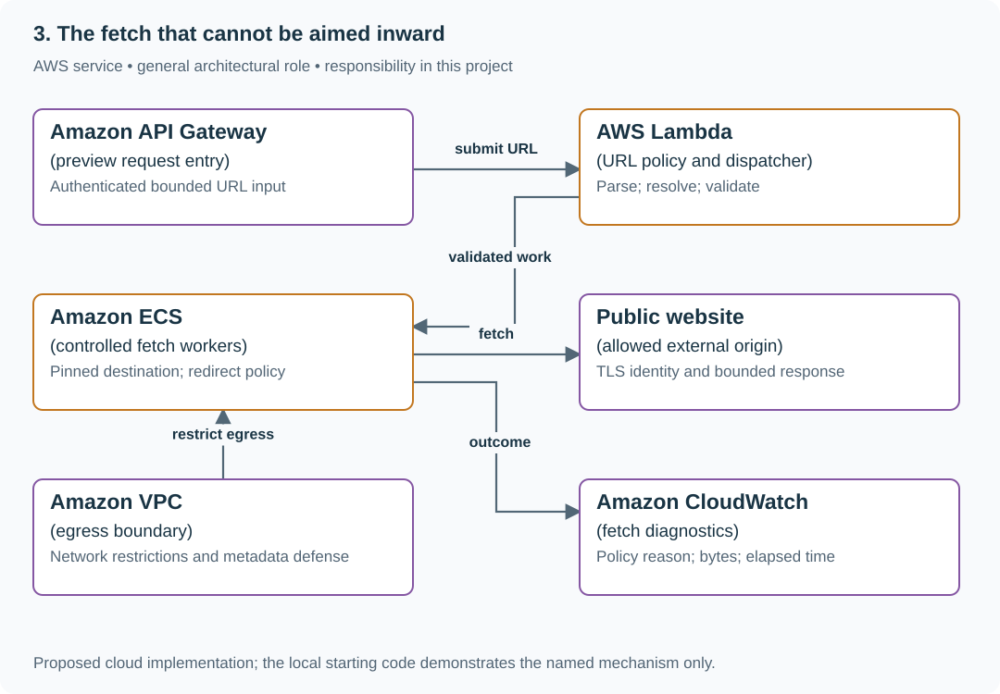

# Build an SSRF-resistant link preview fetcher

## Application background

Alice pastes a public article URL into a reading list. To display its title, the application's server makes an HTTP request to that URL. This is a server-side fetch, separate from the browser request that saved Alice's bookmark.

An attacker can submit a URL too. They might point it at a private company service, or use a public address that redirects there. If the preview server fetches anything it is given, it becomes a way to reach systems the attacker cannot access directly.

### A request that exposes the boundary

These are outputs from the supplied address-policy model. It uses controlled resolved-address inputs and makes no network request:

```text
https://example.com True
http://metadata.invalid False
https://mixed.invalid False
```

The first input resolves only to a public address. The second uses `169.254.169.254`, a link-local address. The third includes both a public address and `127.0.0.1`, the local machine. Rejecting the mixed result matters too. Your real fetcher still needs to connect to the validated address and recheck redirects.

SSRF means server-side request forgery. The attacker tricks your server into making an unintended request. Validation must apply to the address actually contacted, including each redirect.

## Your assignment

**Deliver:** Replace simulated title lookup with a public-URL fetcher. Validate the address actually contacted, repeat the check for redirects and limit time, response size and other work.

**Required behavior:** Only explicitly supported public HTTP(S) destinations may be fetched. Validate the resolved addresses used by the actual connection and repeat the policy for every redirect. Bound all response work.

The required first milestone is a working local implementation of the behavior above. The numbered implementation steps define the scope. The cloud architecture is a later extension, not something the starter has already provisioned.

## Get the code and run the supplied example

The code is in the public [junior-to-staff repository](https://github.com/Soulful-Iris/junior-to-staff). Install Git and Python 3.12+. No AWS account or Python packages are required for this first run. If you already have a checkout, use it and skip cloning.

```bash
git clone https://github.com/Soulful-Iris/junior-to-staff.git
cd junior-to-staff
python3 examples/architecture-starts/03_the_fetch_that_cannot_be_aimed_inward.py
```

**Supplied file:** [`examples/architecture-starts/03_the_fetch_that_cannot_be_aimed_inward.py`](https://github.com/Soulful-Iris/junior-to-staff/blob/main/examples/architecture-starts/03_the_fetch_that_cannot_be_aimed_inward.py). You can also [read or download the source here](../../../../examples/architecture-starts/03_the_fetch_that_cannot_be_aimed_inward.py).

This program is a **mechanism demonstration**: it runs the small scenario in one process and prints the result. It is not an HTTP service, a complete application, or an AWS deployment. A successful run demonstrates this mechanism only. It does not establish the workload or failure guarantees of the application you will build.

**Example output from the supplied run:**

Generated IDs and timestamps may differ. Compare the state transitions and outcomes.

```text
https://example.com True
http://metadata.invalid False
https://mixed.invalid False
Policy demonstration only; the network adapter must pin the validated IP.
```

### Run the application you will extend

The [reading-list API setup guide](../../../../examples/reading-list-starter/README.md) gives you a real local HTTP server, SQLite database, save/list/edit requests and controlled title success/timeout behavior. Start it in one terminal and send the documented `curl` requests from another. Read that setup before following the implementation steps below. The demo above isolates this lesson's mechanism. The server is where you integrate it.

For a first run, start this in **terminal 1** from the repository root:

```bash
python3 examples/reading-list-starter/app.py --db /tmp/reading-list.sqlite3
```

In **terminal 2**, save one bookmark with a controlled title timeout:

```bash
curl -i http://127.0.0.1:8080/bookmarks \
  -H 'X-Demo-User: alice' -H 'Content-Type: application/json' \
  -d '{"url":"https://example.com/docs","title_mode":"timeout"}'
```

Expect **201 Created**, a bookmark `id` and `title_status: "timeout"`. The URL is persisted despite the title failure. This is the supplied baseline. The assignment adds the behavior described above. The lookup is a fixture, so no external website is contacted. For members Bob or Ben in a scenario, use the starter's second demo identity `bob`. Alice or Ana corresponds to `alice`.

Work in your own branch or copy `examples/reading-list-starter/` to `work/03-the-fetch-that-cannot-be-aimed-inward/`. `app.py` exists in that directory. Add the modules named below there as you separate HTTP, storage and background work. The server has demo membership, not production authentication.

## Local components and state to implement

This table names the records, interfaces or decision inputs for your deliverable. Unless a name is explicitly linked to supplied source above, it is something you create. Implement the local state transitions first, then connect the HTTP, storage or worker boundaries required by the steps.

| Record / module | Key or interface | Responsibility |
|---|---|---|
| url_policy | scheme,port,hostname,address_set | Reject credentials and non-public destinations. |
| fetch_plan | normalized_url,validated_ip,hostname,deadline | Connect to the validated address while preserving TLS hostname verification. |
| fetch_result | final_url,status,bytes,reason | Bounded metadata and explicit policy denial. |

## Implement the assignment

### 1. Parse and reject before resolving

Use a standard URL parser, reject embedded credentials, unsupported schemes and unexpected ports, and normalize the host deliberately. Handle IPv4, IPv6 and mapped-address forms consistently. Do not rely on a substring blacklist such as localhost.

### 2. Bind validation to connection

Resolve the hostname, reject disallowed addresses and connect through an adapter that uses the validated IP while preserving Host and TLS SNI/certificate checks for the original hostname. Disable implicit environment proxies unless explicitly configured under the same policy.

### 3. Control every redirect and body

Disable automatic redirects in the HTTP client. Parse each Location, resolve and validate again, and stop after three redirects. Enforce a total deadline, decompressed byte limit and bounded content parsing. A tiny compressed response can expand into a large body.

### 4. Add network defense and diagnostics

Restrict worker egress and metadata access independently of application checks. Return a generic unavailable preview to the user while recording a safe policy reason. Use local controlled public/private-address fixtures to observe denials. Do not probe real internal services.

## Demonstrate the completed local result

| Action | Expected visible result |
|---|---|
| Run the starting program | Public fixture address passes. Metadata and mixed public/private resolutions fail. |
| Return a redirect to loopback | The second hop is denied before a connection. |
| Send an oversized compressed page | The worker stops at the decompressed byte limit. |

**Handoff:** In your implementation README, include the start command, one successful operation, the failure case above and the resulting stored state or decision. State which dependencies are simulated. Someone with a fresh checkout should be able to reproduce this without your chat history.

## Workload assumptions and capacity decisions

These are constructed exercise assumptions. The stated workload is a design target. The local demonstration does not establish that throughput. Use the [estimation constants](../../../01-code/01-problem-solving/estimation-constants.md) to check units before choosing capacity.

| Input or objective | Calculation / consequence |
|---|---|
| 100 previews/s. Two-second total deadline | About 200 in-flight calls at full two-second occupancy unless admission caps it lower. |
| 1 MiB maximum response. Three redirects | At most 100 MiB/s body transfer at the stated rate. Rejected oversized pages stop early. |
| DNS may change between checks | Resolving once for validation and again for connection creates a bypass window. |

## Map the local implementation to AWS

**Deployment status: local only.** Running the supplied command creates no AWS resources and configures no cloud connections. The diagram is a proposed deployment of the completed application. Each box needs either a deployed runtime, a provisioned service or an explicitly external dependency.

Read the diagram by following the arrows from the entry point: application code accepts the request or event, the state owner commits it, and any worker produces the later result. The table ties those roles to code and adapter work. Multiple boxes do not imply multiple Python files already exist.



Network controls reduce exposure, while the HTTP adapter enforces which public destination was actually approved. A URL regex or a DNS check disconnected from the socket is insufficient.

| Local responsibility | Cloud destination and role | Implementation still required |
|---|---|---|
| Local HTTP boundary or the endpoint you will add | Amazon API Gateway: preview request entry | Create routes and an integration. Translate requests and responses and configure identity validation. |
| Python operation or worker function | AWS Lambda: URL policy and dispatcher | Write a Lambda event adapter, package its dependencies and give its role only the required resource actions. |
| Application or worker process | Amazon ECS: controlled fetch workers | Build a container and task definition. Supply configuration, task roles and graceful shutdown behavior. |
| Controlled title/page fixture | Public website: allowed external origin | Implement an outbound HTTP adapter with address/redirect validation, bounded work and explicit observation outcomes. |
| Local network boundary assumed by the fixture | Amazon VPC: egress boundary | Configure subnets, routes and egress controls. Application URL validation remains necessary. |
| Local counters, timestamps and diagnostic output | Amazon CloudWatch: fetch diagnostics | Emit bounded metrics and logs, build the named operational view and configure retention and access. |

### Provision resources, then connect the application

| Resource or boundary | Initial configuration and reason |
|---|---|
| Worker placement | Use a network boundary that cannot reach sensitive internal services. Do not attach broad cloud credentials to fetch workers. |
| HTTP adapter | Verify destination pinning, TLS hostname handling, redirects and proxy behavior in the selected client library. |
| Resource limits | Total deadline, concurrency, redirect count and decompressed body cap are independent controls. |

Use one disposable AWS environment for the cloud exercise. Put the named resources in `infra/template.yaml` or your existing IaC tool, pass resource IDs through configuration, and scope each runtime role to its own tables, buckets and queues. The diagram is a design to implement. It is not a claim that these resources have been deployed. Record the commands you used to deploy and remove the exercise resources.

For concrete provisioning commands, configuration wiring and cleanup, use the [AWS foundation guide](../../../../examples/architecture-starts/infra/README.md). It includes a deployable table/queue/object-storage foundation and explains which application and service adapters you still implement.

A provisioned queue or table does not make the local program use it. Configure resource IDs in the deployed runtime, replace the local adapter, and replay the same successful and failing operation against that runtime. Record the deployed commit and observable result, then remove the disposable resources using your infrastructure tool.

## Extend the design after the baseline works


Allow customer-managed authenticated previews. Keep credentials scoped to approved origins and strip them on redirects. Define whether cross-origin redirects are allowed at all.

<details>
<summary>Additional design reasoning and requirement changes</summary>

## Follow-up 1 · DNS returns mixed addresses

**Changed requirement:** One hostname returns both a public IPv4 and private IPv6 address. What does your policy do? Predict which boundary must change before opening the design.

<details>
<summary>Expected reasoning and changed diagram</summary>

For this exercise reject mixed unsafe answers rather than relying on client selection order. Test IPv4-mapped IPv6 and redirects with the same canonical address policy.

</details>

## Follow-up 2 · A future worker reuses fetching

**Changed requirement:** The queued worker gains new credentials and network routes. Is the guard enough? State what evidence would make you reject your first design.

<details>
<summary>Expected reasoning and changed diagram</summary>

Reuse the same client and add restricted egress and least-privilege credentials. Application validation and network isolation protect different boundaries. Neither proves the other.

</details>

</details>
