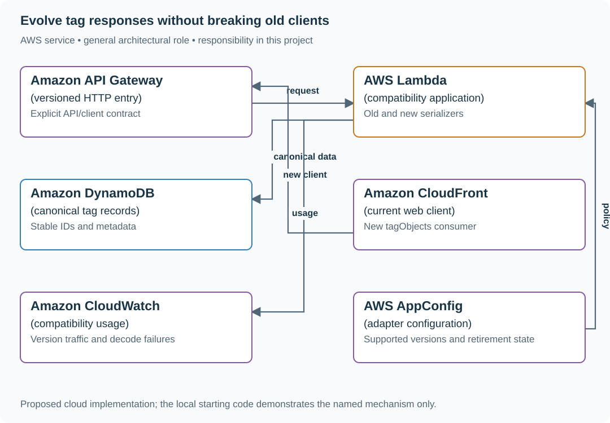

# 4. The API that does not break its callers

## What you are building

> Evolve a reading-list API whose mobile clients expect tags as strings. The new web UI needs tag IDs and display colors. Some mobile clients will not update for ninety days, so replacing tags with objects in place would break supported callers.

**Working contract:** Keep tags as string[] for the supported old contract and add a separately named tagObjects field or explicit API version. Reject incompatible input clearly. Both representations derive from one canonical stored model.

## Workload and the decisions it changes

These are constructed exercise assumptions. The stated workload is a design target; the local demonstration does not establish that throughput. Use the [estimation constants](../../../01-code/01-problem-solving/estimation-constants.md) to check units before choosing capacity.

| Input or objective | Calculation / consequence |
|---|---|
| 90-day old-client support window | Keep compatibility until observed usage and policy allow retirement, not merely until the new UI ships. |
| 10,000 active clients; 15% old-version assumption | 1,500 clients would be affected by an in-place type change. |
| Two response shapes, one stored tag identity | Avoid independently mutable parallel fields that drift. |

## Start with one working boundary

Run from the repository root with Python 3.12+:

```bash
python3 examples/architecture-starts/04_the_api_that_does_not_break_its_callers.py
```

[Open the starting code](../../../../examples/architecture-starts/04_the_api_that_does_not_break_its_callers.py). This is a runnable demonstration of the critical state boundary. The API, UI, cloud adapters and operating behavior below are the application you build around it.

| Record / module | Key or interface | Responsibility |
|---|---|---|
| canonical_tags | tag_id,label,color,version | Single source of tag meaning. |
| legacy_adapter | canonical tags → string[] | Preserves field type and legacy ordering. |
| current_adapter | canonical tags → tagObjects[] | Explicit richer representation without reusing the old field type. |

## AWS implementation



Compatibility belongs at the application boundary. A managed gateway can route versions, but it cannot infer the meaning of tags or repair a changed JSON type for old callers.

## Build it in this order

### 1. Capture actual caller behavior

Write down request/response examples used by supported clients, including nulls, empty lists, unknown fields and error shapes. Do not assume every client ignores additional fields; use an explicit version if strict decoders require it.

### 2. Add a canonical model and adapters

Store tag IDs and metadata once. Build response serializers for the old and new contracts. Keep legacy tags as strings; do not overload the same field with mixed types. Decide how old clients create or rename tags without stable IDs.

### 3. Run both client paths

Use a small old-client script that joins tag strings and a new-client script that reads IDs. Send both through the same application state. Check a real error response too; compatible success bodies do not protect callers from changed error semantics.

### 4. Retire deliberately

Measure requests by explicit client/API version, publish the support window and keep an owner for the adapter. Remove it only after the agreed condition; database migration and API retirement are separate steps.

## Infrastructure configuration

| Resource or boundary | Initial configuration and reason |
|---|---|
| Routing | Keep version selection explicit and observable; do not infer a contract from incidental user-agent text. |
| Data | One canonical tag representation; adapters cannot independently overwrite competing copies. |
| Retirement | Record supported versions and usage evidence; deployment remains independent of this curriculum exercise. |

Use one disposable AWS environment for the cloud exercise. Put the named resources in `infra/template.yaml` or your existing IaC tool, pass resource IDs through configuration, and scope each runtime role to its own tables, buckets and queues. The diagram is a design to implement; it is not a claim that these resources have been deployed. Record the commands you used to deploy and remove the exercise resources.

For concrete provisioning commands, configuration wiring and cleanup, use the [AWS foundation guide](../../../../examples/architecture-starts/infra/README.md). It includes a deployable table/queue/object-storage foundation and explains which application and service adapters you still implement.

## Observe the result

| Action | Expected visible result |
|---|---|
| Run the starting program | The old string-joining client and new ID-reading client both work. |
| Send an old tag-create request | The canonical model is updated through a defined adapter. |
| Remove tagObjects from a legacy response | The old client remains unaffected; tags still has the same type. |

## The next design decision

Change units from milliseconds to seconds. Use a new field name or version and explicit conversion; keeping a JSON number type does not preserve its semantic contract.

<details>
<summary>Further constraints from the original project</summary>

## Follow-up 1 · Usage cannot be seen

**Changed requirement:** Both clients call the same URL, and the server cannot tell which JSON field they read. How do you measure retirement? Predict which boundary must change before opening the design.

<details>
<summary>Expected reasoning and changed diagram</summary>

Use explicit version/capability telemetry where feasible, client inventories and owner acknowledgments. Endpoint traffic alone cannot reveal field access; the removal decision must name uninstrumented and offline clients.

</details>

## Follow-up 2 · A team misses the sunset

**Changed requirement:** One consumer cannot migrate before the announced date. Must the compatibility test turn green on removal anyway? State what evidence would make you reject your first design.

<details>
<summary>Expected reasoning and changed diagram</summary>

No. A date is a policy input, not evidence of safety. Choose extended support, a versioned endpoint, or explicit accepted breakage with an owner; revise the go/no-go gate accordingly.

</details>

</details>
