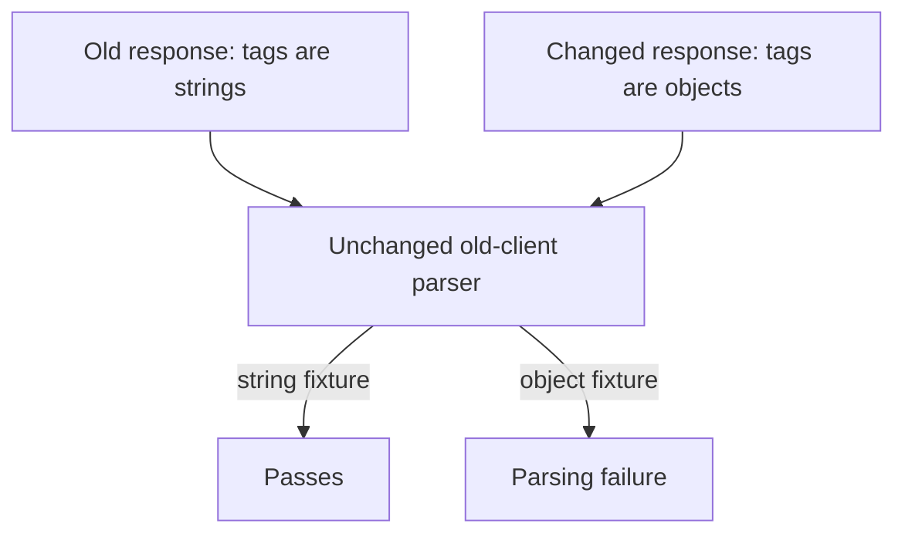
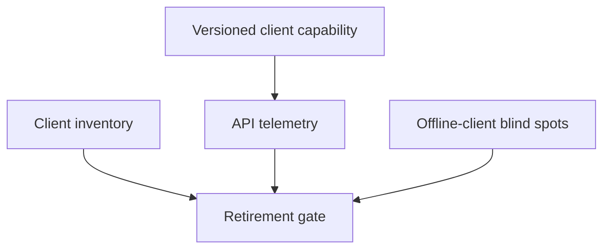
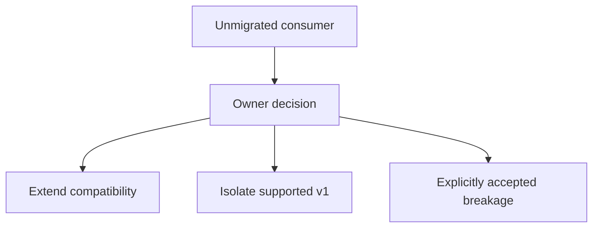

# 4. The API that does not break its callers

[Curriculum](../../../README.md) · [Backend and APIs](../README.md) · [Project index](../../../../indexes/projects.md)

## The reviewer's brief

> Your API returns `tags: ["work"]`; new clients need tag IDs. Old mobile clients will remain deployed for ninety days. Change the API without silently changing their behavior. Which client populations can you actually observe?

This is a **constructed practice brief**, not an attributed company question.
Prerequisites: [the section](../request-lifecycle.md). This page is a build brief; it does not ship a runnable application. The original build and prompt sequence below defines the implementation checkpoints.

| Case | Exact input or workload | Expected outcome |
|---|---|---|
| Small example | Old response `tags:["work"]`; new data adds `tagObjects:[{id:7,name:"work"}]`. | Old reader still receives strings; new reader receives objects derived from the same authoritative tag data. |
| Boundary / failure | Old field is replaced by objects before clients migrate. | The saved old-client fixture fails; do not infer compatibility from provider unit tests. |
| Scope | An additive example; new enum values and strict consumers still need compatibility tests. | Explain any additional assumption before implementing it. |

Before looking at the guidance, state the invariant in one sentence and trace the example. In interview practice, implement or sketch independently, then reveal the reasoning. During AI-assisted practice, use the prompts below and verify each checkpoint before the next request.

## Baseline and the failure to explain



A source-compatible provider change can still break a deployed consumer. The baseline changes an existing field’s type rather than adding a new promise.

<details>
<summary>Reveal the approach and decisions</summary>

Inventory observed promises and create the old-client test first. Derive both representations from one source instead of independent unsynchronized writes. The invariant is unchanged old behavior until the agreed retirement gate, with usage evidence and a documented blind spot.

</details>

## Follow-up 1 · Usage cannot be seen

**Changed requirement:** Both clients call the same URL, and the server cannot tell which JSON field they read. How do you measure retirement? Predict which boundary must change before opening the design.

<details>
<summary>Expected reasoning and changed diagram</summary>

Use explicit version/capability telemetry where feasible, client inventories and owner acknowledgments. Endpoint traffic alone cannot reveal field access; the removal decision must name uninstrumented and offline clients.



</details>

## Follow-up 2 · A team misses the sunset

**Changed requirement:** One consumer cannot migrate before the announced date. Must the compatibility test turn green on removal anyway? State what evidence would make you reject your first design.

<details>
<summary>Expected reasoning and changed diagram</summary>

No. A date is a policy input, not evidence of safety. Choose extended support, a versioned endpoint, or explicit accepted breakage with an owner; revise the go/no-go gate accordingly.



</details>

## Evidence to bring to review

Build in three stops: reproduce the small case and baseline failure; implement the protected boundary; then replay both changed requirements with captured outputs. Record commands, fixtures, and observed results in your implementation README. A diagram is a prediction until those checks run.

**Senior expectation:** Run old/new client fixtures and describe telemetry limits. **Additional lead scope:** Negotiate retirement and compatibility ownership across teams. Completion demonstrates practice evidence; it does not establish interview readiness or multi-team delivery experience.

## Build and prompt sequence

*You end up able to change P1's API underneath a frontend you are not allowed
to touch — with a dated, tested path to removing what you replaced.*

**Build**

Yesterday's client, recorded and turned into a compatibility test. One real
change made additively — the new shape beside the old. The old shape marked
with `Deprecation` and `Sunset` headers and a real date, and telemetry plus a consumer inventory that
state what old usage can and cannot be observed.

**The thought process**

Decide what breaking means before touching anything. Not "the schema changed"
— "a promise changed": a field removed or renamed, a type tightened, a meaning
shifted, required become optional. Then the honest third column, ambiguous:
field order, an enum value nobody has seen. Callers depend on everything
observable, promised or not, and the ambiguous column is where incidents are
born.

The additive rule and its price: you may add; you may not remove or repurpose.
So wrong turns accumulate forever unless retirement is a process — announce,
measure, remove — and only the measuring makes the date honest. Version only
when additive fails, when the shape itself was the mistake, and version in the
path: `/v2/` shows up in logs, curls and screenshots. Header versioning is
tidier and invisible, and invisible is the wrong property while you are
learning to debug.

There are standard words for retirement: `Deprecation` (RFC 9745, published
March 2025) announces it, `Sunset` (RFC 8594) names the date after which it
may stop answering, and the sunset must not be earlier than the deprecation
(checked 2026-09-22). Machine-readable retirement reaches callers a changelog
never will.

**How to organise the prompts**

**1. The promises, then the classification.**

```
Read the API and its callers. Write down every promise a caller could
currently rely on: fields, types, optionality, meanings, status codes,
orderings. Then sort possible changes into three lists — safe to make
silently, breaking, and ambiguous — with one line of why per entry.
```

Argue with the ambiguous list before moving on. It is the whole lesson wearing
a table.

**2. The additive change, guarded by yesterday.**

```
Tags need to become structured objects instead of bare strings. Do it
additively: new field beside the old, both written on every change, old
callers unaffected. Derive both representations from one authoritative tag
model or update them in one transaction; do not add unsynchronized dual writes. Before changing anything, record today's real
responses and turn them into a test that yesterday's client still
passes.
```

The recorded-yesterday test must be green before and after. That pair of runs
is the deliverable.

**3. The retirement, dated and enforced.**

```
Mark the old field's endpoints with Deprecation and Sunset headers,
sunset ninety days out. Use explicit client version/capability signals and a consumer inventory
to estimate old usage; ordinary response logs cannot reveal which JSON field
a client reads. Make removal depend on the agreed date AND the compatibility
review, naming offline and uninstrumented clients. A date alone does not
make a breaking removal safe.
```

Check with `curl -i` that both headers arrive with a real date, and that the
usage query returns a number rather than a shrug.

**On AWS**

This is where **API Gateway** earns its keep over an **ALB**: stages and
base-path mappings make `/v1` and `/v2` separately deployed, separately
measured things, per-stage **CloudWatch** metrics answer "is anyone still on
v1" without instrumenting a line, and canary settings shift a percentage of a
stage to new code first. An ALB can route paths to target groups, but the
bookkeeping — per-version metrics, the gradual shift, the mapping — is yours
to build. Pin `/v1` to a **Lambda** alias so the retired surface is served by
code that no longer changes. Estimate gateway, function, logging and retained version costs for the
actual account; retire obsolete versions deliberately.

**What productionising it means**

The sunset date gets an owner and a calendar entry, because a date nobody owns
is a wish. Removal day is a deploy with a decided behaviour — a 410 and a
pointer at the new shape, chosen in advance. The second deprecation should be
cheaper than the first; that is what writing the policy down buys. The date
opens the conversation; the caller count closes it, at zero.

**The learning**

An API is a promise with an audience. You can widen it silently; narrowing it
needs consent and a calendar. Compatibility is not refusing to change — it is
changing in a fixed order: add, migrate, measure, and only then remove.

**How you would know it is wrong**

- Replaying yesterday's recorded traffic fails against today's API.
- Deleting the old field on a branch leaves the compatibility test green — a guard that cannot fail.
- `curl -i` shows a Sunset earlier than the Deprecation, or no date at all.
- A brand-new optional field trips an alarm — a guard that blocks safe changes teaches people to route around it.

---

[Back to the ordered project index](../projects.md)
