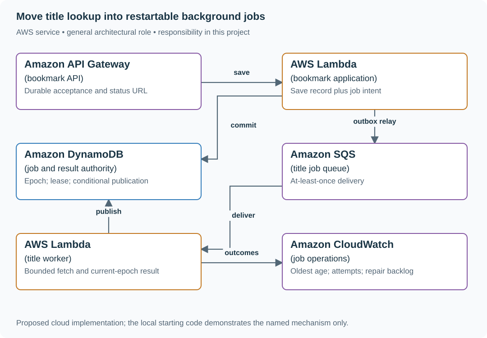
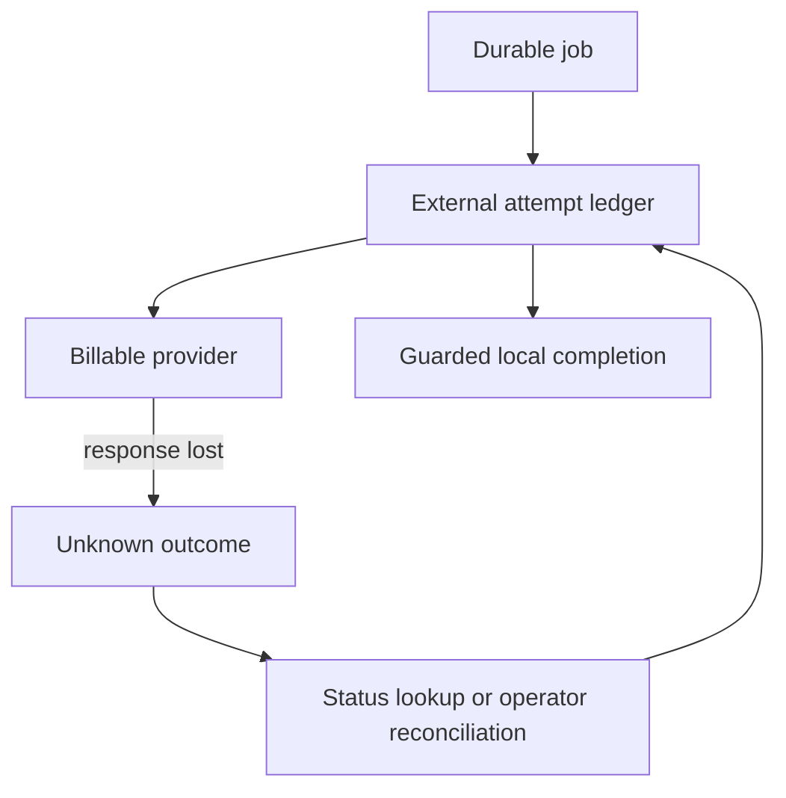

# Move title lookup into restartable background jobs

## Application background

Alice saves a URL and wants to continue reading her list. Waiting for the linked website to supply a title slows that interaction down. Instead, the API can store the URL, respond immediately and leave a separate task to fill in the title later.

That task is a background job. A worker process picks it up and fetches the title. If the worker stops, the job should remain available. If an old worker resumes after a replacement has finished, its stale result must not win.

### Example walkthrough

| Action | Expected behavior |
|---|---|
| Alice saves bookmark 41 | Store the bookmark and pending title work together. |
| The worker stops before completing the job | Let another worker take over after the ownership period expires. |
| The original worker later returns a title | Reject its result if its ownership is no longer current. |

A durable job is recorded outside the worker's memory. A lease grants temporary ownership, and a fencing value identifies which owner is allowed to save the result.

## Your assignment

**Deliver:** Save pending title work together with the bookmark, then build a separate worker that can claim, retry and finish the job only while it is the current owner.

**Required behavior:** Save the bookmark, its identified title job and the pending dispatch record together in one database transaction. Jobs expose accepted, running, succeeded and failed states. Only the worker with the current ownership number may publish a result. Remove the message from the queue only after the outcome is saved durably.

The required first milestone is a working local implementation of the behavior above. The numbered implementation steps define the scope. The cloud architecture is a later extension, not something the starter has already provisioned.

## Get the code and run the supplied example

The code is in the public [junior-to-staff repository](https://github.com/Soulful-Iris/junior-to-staff). Install Git and Python 3.12+. No AWS account or Python packages are required for this first run. If you already have a checkout, use it and skip cloning.

```bash
git clone https://github.com/Soulful-Iris/junior-to-staff.git
cd junior-to-staff
python3 examples/architecture-starts/05_the_job_that_survives_a_restart.py
```

**Supplied file:** [`examples/architecture-starts/05_the_job_that_survives_a_restart.py`](https://github.com/Soulful-Iris/junior-to-staff/blob/main/examples/architecture-starts/05_the_job_that_survives_a_restart.py). You can also [read or download the source here](../../../../examples/architecture-starts/05_the_job_that_survives_a_restart.py).

This program is a **mechanism demonstration**: it runs the small scenario in one process and prints the result. It is not an HTTP service, a complete application, or an AWS deployment. A successful run demonstrates this mechanism only. It does not establish the workload or failure guarantees of the application you will build.

**Example output from the supplied run:**

Generated IDs and timestamps may differ. Compare the state transitions and outcomes.

```text
saved
stale worker rejected
{'epoch': 2, 'state': 'succeeded', 'title': 'Current title'}
```

### Run the application you will extend

The [reading-list API setup guide](../../../../examples/reading-list-starter/README.md) gives you a real local HTTP server, SQLite database, save/list/edit requests and controlled title success/timeout behavior. Start it in one terminal and send the documented `curl` requests from another. Read that setup before following the implementation steps below. The demo above isolates this lesson's mechanism. The server is where you integrate it.

For a first run, start this in **terminal 1** from the repository root:

```bash
python3 examples/reading-list-starter/app.py --db /tmp/reading-list.sqlite3
```

In **terminal 2**, save one bookmark with a controlled title timeout:

```bash
curl -i http://127.0.0.1:8080/bookmarks \
  -H 'X-Demo-User: alice' -H 'Content-Type: application/json' \
  -d '{"url":"https://example.com/docs","title_mode":"timeout"}'
```

Expect **201 Created**, a bookmark `id` and `title_status: "timeout"`. The URL is persisted despite the title failure. This is the supplied baseline. The assignment adds the behavior described above. The lookup is a fixture, so no external website is contacted. For members Bob or Ben in a scenario, use the starter's second demo identity `bob`. Alice or Ana corresponds to `alice`.

Work in your own branch or copy `examples/reading-list-starter/` to `work/05-the-job-that-survives-a-restart/`. `app.py` exists in that directory. Add the modules named below there as you separate HTTP, storage and background work. The server has demo membership, not production authentication.

## Local components and state to implement

This table names the records, interfaces or decision inputs for your deliverable. Unless a name is explicitly linked to supplied source above, it is something you create. Implement the local state transitions first, then connect the HTTP, storage or worker boundaries required by the steps.

| Record / module | Key or interface | Responsibility |
|---|---|---|
| jobs | bookmark_id,request_id,state,epoch,lease_until | Logical identity and ownership. |
| attempts | job_id,epoch,started,outcome | Separate retries under one job. |
| bookmark_title | bookmark_id,title,title_version | Updated conditionally by the winning job/source version. |

## Implement the assignment

### 1. Create a durable job transaction

In store.py, save the bookmark and job/outbox record together. Return a stable status URL after commit. A duplicate create request reuses the job identity. It does not schedule another logical fetch.

### 2. Implement worker ownership

In worker.py, claim due work using a conditional epoch increment and lease timestamp. Store attempt evidence. A queue’s visibility period only limits delivery overlap. The job-store condition decides who may publish.

### 3. Publish and acknowledge in order

Recheck bookmark source version and worker epoch before writing the title and succeeded state. Acknowledge after commit. On redelivery, a completed job is recognized and acknowledged without another visible result. Handle deleted bookmarks as cancellation rather than recreating them.

### 4. Add an operator repair path

Show oldest accepted job, attempt count, last error and next retry. After bounded attempts, move to failed/DLQ and allow an authorized replay retaining logical identity. A replay is evidence, not deletion of the previous failure history.

## Demonstrate the completed local result

| Action | Expected visible result |
|---|---|
| Run the starting program | Epoch 2 wins. Epoch 1 cannot replace the title. |
| Restart after result commit but before acknowledgement | Redelivery observes succeeded and finishes without another result. |
| Delete the bookmark while work waits | The worker records cancellation and does not recreate it. |

**Handoff:** In your implementation README, include the start command, one successful operation, the failure case above and the resulting stored state or decision. State which dependencies are simulated. Someone with a fresh checkout should be able to reproduce this without your chat history.

## Workload assumptions and capacity decisions

These are constructed exercise assumptions. The stated workload is a design target. The local demonstration does not establish that throughput. Use the [estimation constants](../../../01-code/01-problem-solving/estimation-constants.md) to check units before choosing capacity.

| Input or objective | Calculation / consequence |
|---|---|
| 100 saves/minute. Two-second mean fetch | About 3.3 occupied worker slots at steady state. Start with a small bounded pool. |
| Thirty-second lease | Renew only while the same epoch owns the job. A paused worker can lose ownership before it notices. |
| Five delivery attempts | Exhaustion becomes a visible failed/repair state, not an endlessly hidden queue retry. |

## Map the local implementation to AWS

**Deployment status: local only.** Running the supplied command creates no AWS resources and configures no cloud connections. The diagram is a proposed deployment of the completed application. Each box needs either a deployed runtime, a provisioned service or an explicitly external dependency.

Read the diagram by following the arrows from the entry point: application code accepts the request or event, the state owner commits it, and any worker produces the later result. The table ties those roles to code and adapter work. Multiple boxes do not imply multiple Python files already exist.



The queue wakes workers. The job record owns lifecycle and publication. Keeping those roles separate makes duplicate delivery and restarts understandable.

| Local responsibility | Cloud destination and role | Implementation still required |
|---|---|---|
| Local HTTP boundary or the endpoint you will add | Amazon API Gateway: bookmark API | Create routes and an integration. Translate requests and responses and configure identity validation. |
| Python operation or worker function | AWS Lambda: bookmark application | Write a Lambda event adapter, package its dependencies and give its role only the required resource actions. |
| Local dictionary, SQLite records or state model | Amazon DynamoDB: job and result authority | Design partition/sort keys and write a storage adapter with conditional updates or transactions. Python state and SQL are not uploaded as a database. |
| Local pending-work collection | Amazon SQS: title job queue | Publish committed job intent, consume messages and persist deduplication/ownership state. Add visibility, retry and dead-letter handling. |
| Python operation or worker function | AWS Lambda: title worker | Write a Lambda event adapter, package its dependencies and give its role only the required resource actions. |
| Local counters, timestamps and diagnostic output | Amazon CloudWatch: job operations | Emit bounded metrics and logs, build the named operational view and configure retention and access. |

### Provision resources, then connect the application

| Resource or boundary | Initial configuration and reason |
|---|---|
| SQS | Visibility greater than ordinary work duration, bounded redrive and a documented repair action. |
| DynamoDB | Conditional claims and result writes. TTL cleanup never substitutes for lease/expiry checks. |
| Worker | Outbound URL policy, total deadline and reserved concurrency protecting source/database capacity. |

Use one disposable AWS environment for the cloud exercise. Put the named resources in `infra/template.yaml` or your existing IaC tool, pass resource IDs through configuration, and scope each runtime role to its own tables, buckets and queues. The diagram is a design to implement. It is not a claim that these resources have been deployed. Record the commands you used to deploy and remove the exercise resources.

For concrete provisioning commands, configuration wiring and cleanup, use the [AWS foundation guide](../../../../examples/architecture-starts/infra/README.md). It includes a deployable table/queue/object-storage foundation and explains which application and service adapters you still implement.

A provisioned queue or table does not make the local program use it. Configure resource IDs in the deployed runtime, replace the local adapter, and replay the same successful and failing operation against that runtime. Record the deployed commit and observable result, then remove the disposable resources using your infrastructure tool.

## Extend the design after the baseline works


Let users edit the URL while an old fetch runs. Add a source URL version to the job and reject results for an earlier source even if the worker still owns its lease.

<details>
<summary>Follow-up scenarios and worked designs</summary>

## Follow-up 1 · A expires during work

**Changed requirement:** A resumes after expiry but before B claims. May it still commit?

<details>
<summary>Worked design and implementation</summary>

Under this exercise’s strict policy, no: the commit checks both generation and lease validity using authoritative time. A must reacquire a new generation. This closes the gap where “owner matches” alone accepts an expired owner.

**Follow the exact race.** A owns generation 7 until time 100. It resumes at time 101, before B has claimed. An ownership check alone still sees A and would accept an expired worker. Put job state, generation and lease-expiry predicates in the same storage transaction that records completion. Use the storage authority's time policy.

Show A rejected at 101, A reacquiring generation 8 if the job remains available, and completion succeeding only under 8. Then let B acquire 8 first and demonstrate A cannot overwrite it. Queue visibility and local timers are not the final write authority.

</details>

## Follow-up 2 · The provider charges per operation

**Changed requirement:** Replace the read with a billable enrichment API that succeeds but loses its response. Can you safely repeat?

<details>
<summary>Worked design and implementation</summary>

Use a provider-supported idempotency key or status lookup tied to the same operation identity. Otherwise record outcome unknown and reconcile before retrying a non-idempotent effect. Local fencing protects your store, not an external provider.

**Add a durable external-attempt ledger.** Save operation ID, provider key, payload fingerprint and submitted state before making the billable call. On a lost response, mark the outcome unknown and query the provider with that identity. A new worker must recover this attempt rather than generate a fresh charge key.

Demonstrate provider success followed by a worker crash before local completion. The restarted worker records the existing receipt. If the provider supports neither safe idempotency nor status lookup, stop automatic replay and hand the unresolved attempt to an operator. Local fencing only decides which worker may publish local state.

**Revised flow.** These are proposed components to implement, not extra services started by the supplied demo.



</details>

## Supplied mechanism practice

- [Lease and provider recovery lab](../../../04-scale-and-evolution/04-migrations/labs/recovery-migration/README.md) — includes its own run command, fixtures and validation limits.

These exercises verify specific boundaries. Completing their reference tests does not implement or assess the full project.

</details>
