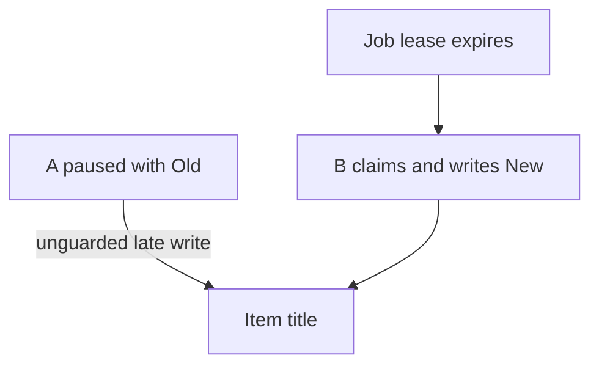
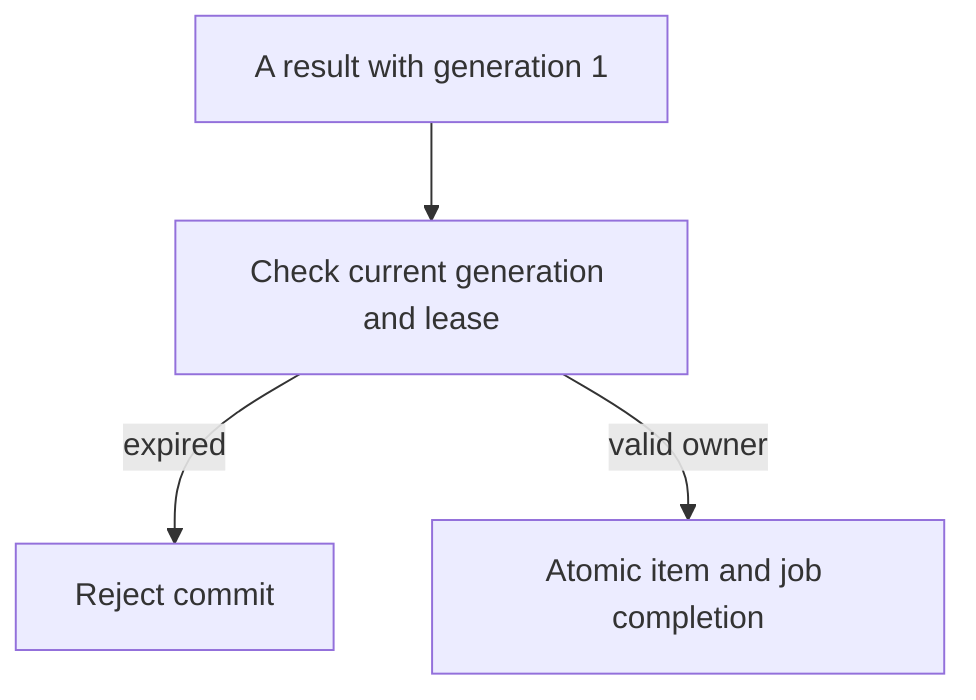
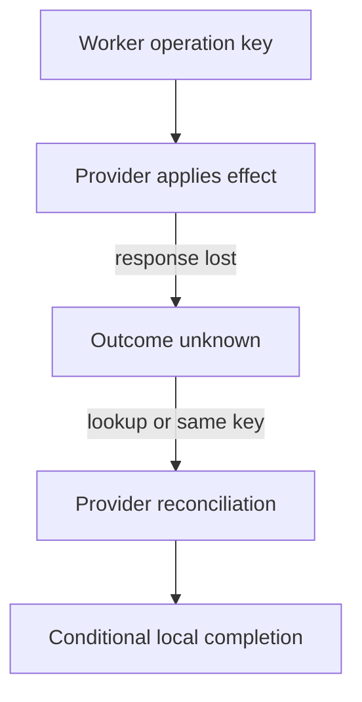

# 5. The job that survives a restart

[Curriculum](../../../README.md) · [Backend and APIs](../README.md) · [Project index](../../../../indexes/projects.md)

## The reviewer's brief

> Title fetching moves into a worker so bookmark creation can return immediately. Worker A pauses after fetching an old title; its lease expires, B completes a new title, and A resumes. Keep A from overwriting B. What does lease expiry actually stop?

This is a **constructed practice brief**, not an attributed company question.
Prerequisites: [the section](../request-lifecycle.md). This page is a build brief; it does not ship a runnable application. The original build and prompt sequence below defines the implementation checkpoints.

| Case | Exact input or workload | Expected outcome |
|---|---|---|
| Small example | A claims generation 1 and fetches `Old`; B reclaims generation 2 after expiry and commits `New`; A then commits. | B’s conditional commit succeeds; A’s generation-1 commit affects zero rows; stored title remains `New`. |
| Boundary / failure | Worker crashes after remote fetch but before any durable result record. | A later owner may fetch again; guarantee one current stored result, not one remote fetch. |
| Scope | One job identity and payload hash; immutable generation per claim; no external exactly-once guarantee. | Explain any additional assumption before implementing it. |

Before looking at the guidance, state the invariant in one sentence and trace the example. In interview practice, implement or sketch independently, then reveal the reasoning. During AI-assisted practice, use the prompts below and verify each checkpoint before the next request.

## Baseline and the failure to explain



A lease coordinates admission but cannot stop a suspended process. Writing a fetched title twice is not automatically convergent because the remote page can change.

<details>
<summary>Reveal the approach and decisions</summary>

Atomically save item and job, claim with an incrementing generation, and condition the result transaction on current owner/generation and valid lease. Couple item/result and terminal job state in that transaction. Retry transient failures with a cap; reject conflicting payload identity and retain visible failures.

</details>

## Follow-up 1 · A expires during work

**Changed requirement:** A resumes after expiry but before B claims. May it still commit? Predict which boundary must change before opening the design.

<details>
<summary>Expected reasoning and changed diagram</summary>

Under this exercise’s strict policy, no: the commit checks both generation and lease validity using authoritative time. A must reacquire a new generation. This closes the gap where “owner matches” alone accepts an expired owner.



</details>

## Follow-up 2 · The provider charges per operation

**Changed requirement:** Replace the read with a billable enrichment API that succeeds but loses its response. Can you safely repeat? State what evidence would make you reject your first design.

<details>
<summary>Expected reasoning and changed diagram</summary>

Use a provider-supported idempotency key or status lookup tied to the same operation identity. Otherwise record outcome unknown and reconcile before retrying a non-idempotent effect. Local fencing protects your store, not an external provider.



</details>

## Evidence to bring to review

Build in three stops: reproduce the small case and baseline failure; implement the protected boundary; then replay both changed requirements with captured outputs. Record commands, fixtures, and observed results in your implementation README. A diagram is a prediction until those checks run.

**Senior expectation:** Replay pause, crash, duplicate and conflicting-payload schedules. **Additional lead scope:** Define reconciliation ownership, replay retention and recovery objectives. Completion demonstrates practice evidence; it does not establish interview readiness or multi-team delivery experience.

## Supplied mechanism practice

- [Lease and provider recovery lab](../../../04-scale-and-evolution/04-migrations/labs/recovery-migration/README.md) — includes its own run command, fixtures and validation limits.

These exercises verify specific boundaries; completing their reference tests does not implement or assess the full project.

## Build and prompt sequence

*You end up with the title fetch off the request path, and a worker you can
kill mid-job without losing the work or doing it twice where it shows.*

**Build**

A jobs table in the database P1 already has — pending, claimed with an expiry,
done, failed with a reason — and a worker loop that claims atomically and runs
the guarded fetch inside the budget. The add-URL endpoint returns at once with
the title pending. At-least-once delivery, idempotent handling.

**The thought process**

Start with what the user gets now. The request has to end on time — project 2
— so the honest answer is the saved item with its title pending. P1's decision
list called this the honest version of a queue; note the response gains a
status field, an additive change under project 4's rules.

Then the guarantee arithmetic. The worker claims, fetches, and records. A
crash after the fetch but before recording can require another fetch. A lease
permits another worker to reclaim work; it does not stop a suspended old worker.
A remote page can change, so repeating a title write is not necessarily harmless.

Protect the actual write: each claim increments a generation. The transaction
that updates the item and terminal job result must require the current generation,
owner, expected item refresh version, and an unexpired lease under the chosen
clock policy. A stale owner changes zero rows. Retain the job identity and payload
hash for the deduplication horizon. This gives a scoped current stored-result
guarantee, not one execution, one fetch, or exactly-once external effects.

The claim itself is the section's lost update wearing overalls: two workers,
one job, and read-then-write hands it to both. It must be one atomic statement
— update where still pending, returning the row — never a select followed by
an update. And failure is a state, not an exception: attempts counted, capped,
ending in failed with the reason stored where a person can see it. A fetch
that can never succeed must end somewhere visible, not loop forever, and not
vanish.

**How to organise the prompts**

**1. The design, and the crash map.**

```
Move the title fetch out of the request. Design first, no code: the jobs
table with its states, the exact atomic statement by which one of two
competing workers claims a job, how a claim expires if its worker dies,
and a list of every moment where a crash loses work or repeats it.
```

If the crash list does not include "after the fetch, before recording it," the
design has not understood the problem. No code yet.

**2. The worker, counted honestly.**

```
Implement it: the endpoint saves the item and the job and returns the
title as pending. The worker claims with the atomic statement, claims
expire after 60 seconds; each claim increments a fencing generation.
Commit the item and job result atomically only while the owner, generation,
refresh version and lease are current. Three failed attempts end visibly.
First run two workers against ten jobs without crashes and record ten
initial claims. Then permit reclaims in the crash drills and prove that
stale completions cannot overwrite newer results.
```

From the tables, not the logs' general mood — a count of claims is a number
that can be wrong.

**3. The two deaths.**

```
Two demonstrations. One: kill -9 the worker mid-fetch, restart it, and
show the job re-claimed after the expiry and finished. Two: crash
between the fetch finishing and the outcome being recorded, and show the
fetch running twice while the item still ends correct. Save both stories
with their job ids.
```

The second demonstration proves that execution can repeat. Add the pause
schedule from the opening: A fetches Old, B reclaims and stores New, A resumes.
Only the conditional result boundary makes the late duplicate harmless to
stored state. Record the rejected generation and retained New title.

**On AWS**

**SQS** is this project as a managed service, and everything you built has a
name there: the claim expiry is the visibility timeout — 30 seconds by
default, extendable to 12 hours (checked 2026-09-22) — the attempts cap is a
dead-letter queue, and standard queues promise exactly the at-least-once you
designed for (checked 2026-09-22). **EventBridge** is the neighbour that looks
similar and is not: it routes events to many listeners — announcements, not a
work list. **Kinesis** is an ordered, replayable stream for many readers, the
wrong shape for "do this once". For the consumer, **Lambda** triggered from
SQS wires batching, retries and the DLQ with almost no code, under a
15-minute ceiling per invocation (checked 2026-09-22) — vast for a title
fetch; a **Fargate** worker is for jobs that outgrow it. Keeping the table
version instead: the claim is `SKIP LOCKED` on **RDS** Postgres, a conditional
write on **DynamoDB** — the same idea in two spellings. Estimate queue requests, worker duration, database access and retention;
use the existing local database first when cloud deployment adds no learning.

**What productionising it means**

The alarms are depth and age, not errors: a dead worker emits no errors at
all, and its silence photographs exactly like health, so alarm when the oldest
pending job passes an age you chose. On SIGTERM the worker stops claiming, drains within its shutdown budget, and
releases or lets unfinished leases expire; it cannot assume shutdown always
allows the in-flight work to finish. The attempts cap stands between one poison job and a
worker that dies in a loop, and the failed state needs an owner — a
dead-letter queue nobody reads is a landfill with an SLA.

**The learning**

Delivery, execution and committed effect are different guarantees. A crash can
repeat a remote read while an atomic conditional result stays correct. The hard
parts are the claim/completion state machine, its protected write boundary, and
the recovery protocol for effects outside your database.

**How you would know it is wrong**

- `kill -9` mid-fetch: with the database and upstream healthy, completion occurs after lease expiry, a poll and the bounded fetch/commit time. Measure each term; expiry alone does not bound completion.
- Two workers, ten jobs with no faults: ten initial claims. Under injected crashes, reclaims may increase this count; accepted current results remain one per operation identity.
- A poison job: three attempts, a failed state with the reason, a worker still alive.
- Stop the worker for an hour: the age check goes red. If nothing notices, silence means nothing.
- Kill the database mid-claim: the worker survives and resumes when it returns.

---

[Back to the ordered project index](../projects.md)

Technical behavior checked 2026-09-22: [SQS visibility timeout](https://docs.aws.amazon.com/AWSSimpleQueueService/latest/SQSDeveloperGuide/sqs-visibility-timeout.html) and [Lambda with SQS](https://docs.aws.amazon.com/lambda/latest/dg/with-sqs.html). Visibility and at-least-once delivery do not fence the result store. Configure partial-batch failure reporting and redrive deliberately.
