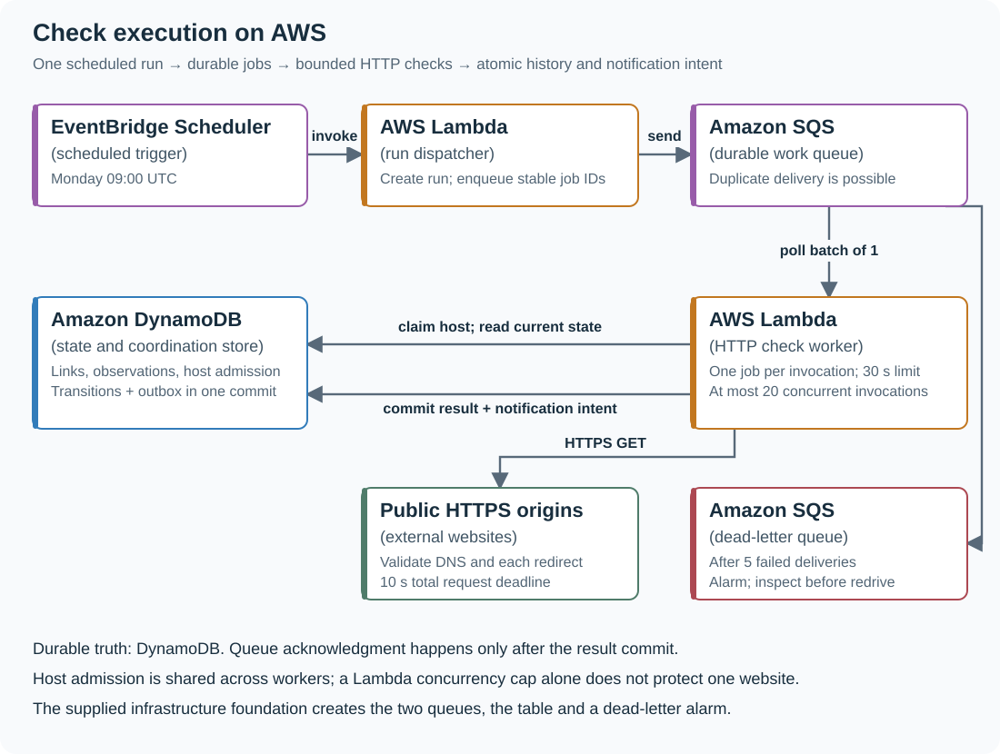
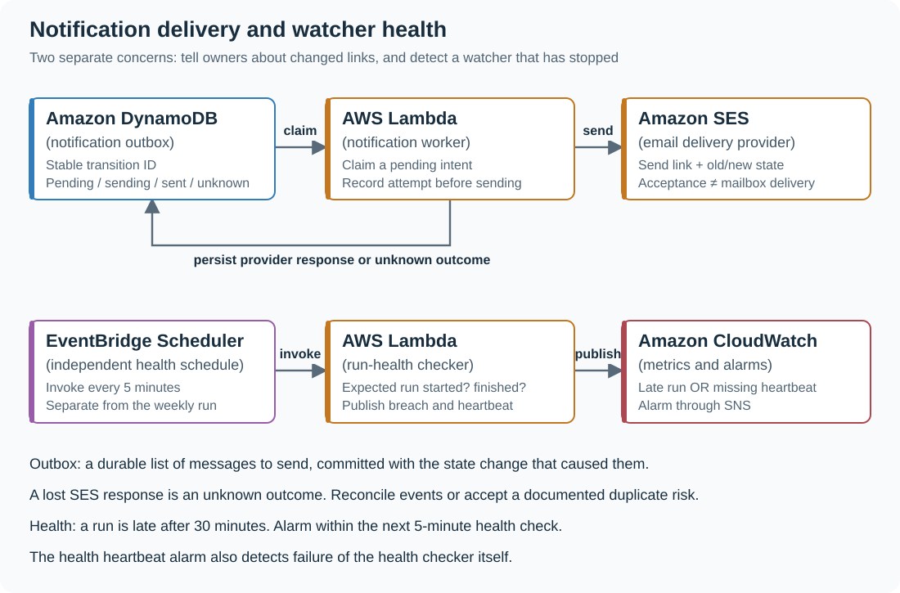
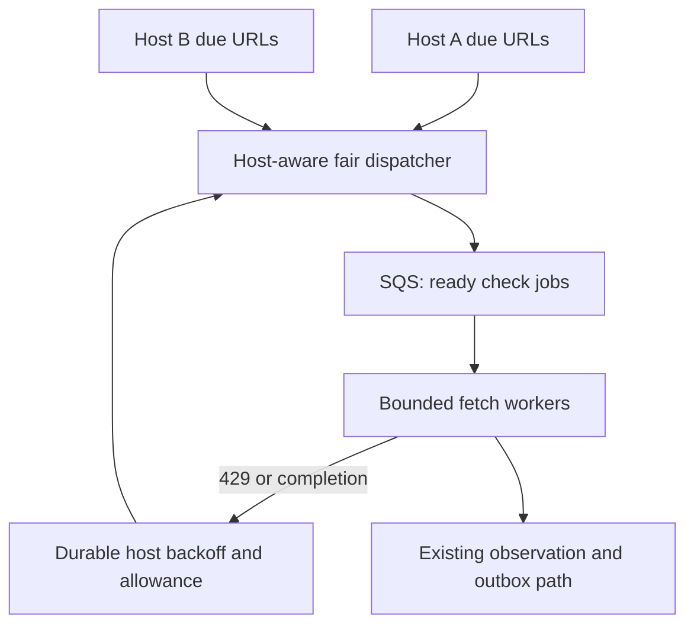

# Build a link monitor with durable history and change alerts

[Curriculum](../../../README.md) · [APIs and background work](../README.md) · [Project index](../../../../indexes/projects.md)

## Application background

Your team keeps an engineering handbook full of links to vendor documentation and setup guides. An engineer follows one during an incident and finds that the page has disappeared. Instead of waiting for people to discover broken links, you want a service to check the handbook's URLs each week.

The service makes an HTTP request to each URL and records the response it observed. If a link has become unavailable, its owner should hear about the change. Sending the same email every week would create noise, so the service also needs the previous observation.

### Example walkthrough

| Action | Expected behavior |
|---|---|
| A documentation page responds successfully | Record that the link is reachable. |
| The next weekly check receives 404 | Record the failure and prepare one broken-link notice. |
| Another check still receives 404, then a later one succeeds | Avoid a repeat failure notice and prepare a recovery notice when it returns. |

A 404 response means the server reports that the requested page was not found. A timeout means no answer arrived before your waiting limit. Those are different observations and should not automatically produce the same conclusion.

## Your assignment

**Deliver:** Build a command-line service that remembers link observations and prepares notices when availability changes. Then add the scheduled AWS version with notification delivery and visible evidence that each run completed.

The supplied Python/SQLite reference already implements response classification, observation history, state changes and pending notification records. You add scheduled work, notification delivery and run monitoring. The cloud foundation supplies queues, storage and one alarm. It does not deploy the application workers or wire them to those resources.

## Get the code and run the supplied reference

Install Git and Python 3.12+. No AWS account or Python packages are needed locally. The complete source is in [examples/link-watcher on GitHub](https://github.com/Soulful-Iris/junior-to-staff/tree/main/examples/link-watcher), with [local run instructions](../../../../examples/link-watcher/README.md).

```bash
git clone https://github.com/Soulful-Iris/junior-to-staff.git
cd junior-to-staff
python3 examples/link-watcher/watcher.py --db /tmp/link-watcher-demo.sqlite3 demo
```

Look for four observations, two transitions and two pending notification entries. Running the command again does not add duplicates. Continue with Checkpoint 1 below to inspect the persisted state. The command sends no email and creates no AWS resources.

## Workload assumptions and capacity decisions

These are **invented workload inputs for this exercise**, not measured traffic
from a real company. Keep them in your design so the service choices have a reason.

| Requirement | Concrete target | Engineering consequence |
|---|---|---|
| Inventory | 6,000 URLs across 1,000 hosts. At most 100 URLs on one host | Model both total work and a busy host. |
| Schedule | Monday 09:00 UTC. Finish the normal run by 09:30 | Store expected, started and completed times. |
| HTTP workload | Assume 2 seconds mean request duration. Enforce a 10-second total deadline in the cloud worker | At concurrency 20, ideal drain time is `6,000 × 2 / 20 = 600 seconds`, or 10 minutes. Retries and host limits use the remaining margin. |
| Host protection | One active request per host. Wait at least 1 second after completion before starting another | For 100 URLs averaging 2 seconds, one host takes about `100 × (2 + 1) = 300 seconds`. Global concurrency alone cannot enforce this. |
| Response limit | Read at most 64 KiB. Follow at most 3 redirects in the cloud adapter | Bound memory, network work and redirect loops. Larger pages receive an incomplete-content observation. |
| Notification timing | Queue the change with its observation. Normally submit email within 5 minutes | Email failure must not erase the observation. |
| Retention | 90 days of observations. Preserve current state | About `6,000 × 13 = 78,000` weekly observations. At 1 KiB each, about 76 MiB of payload before indexes and overhead. |
| Detection limit | Weekly sampling | A link can fail for almost a week before discovery. A 30-minute run target is not a 30-minute breakage-detection guarantee. |

A run in which every request takes the full 10 seconds needs at least 50 minutes
at concurrency 20, even before retries. Report it as late. Do not promise the
normal completion target under that failure load. If 30 minutes becomes a hard
requirement, revisit inventory distribution, deadlines and capacity together.

## Define observation states and notification rules

The service can report what it saw. It cannot prove that a web page is permanently
dead or that a successful response still contains the intended documentation.

| Observed result | Stored outcome | Update the last known state? | Notify? |
|---|---|---|---|
| 2xx and expected content marker present | `reachable` | Yes | Recovery only if previously broken |
| 404 or 410 | `broken` | Yes | Once on entering broken, including the first observation |
| 429 | `throttled` | No | No broken-link email. Schedule later using bounded Retry-After |
| Timeout, DNS/TLS error, 5xx, 401 or 403 | `uncertain` | No | Record for review. Repeated uncertainty belongs in an operational report |
| 2xx but expected marker missing | `content_changed` | No | Review the content. Do not call it recovered |

For this baseline, a single 404 changes the state. Requiring two consecutive 404s
is a valid product change, but with weekly checks it delays confirmation by a
week. Implement that only after deciding whether the delay is acceptable.

```mermaid
stateDiagram-v2
    [*] --> Unknown
    Unknown --> Reachable: first matching 2xx; no email
    Unknown --> Broken: first 404 or 410; broken email
    Reachable --> Broken: 404 or 410; broken email
    Broken --> Reachable: matching 2xx; recovery email
    Broken --> Broken: repeated 404; no new email
```



Throttled, uncertain and content-changed observations preserve the last known
state. Thus `200 → 429 → 200` must not manufacture a recovery notification.

| Case | Input / starting state | Expected result |
|---|---|---|
| A link fails and recovers | `200 → 404 → 404 → 200` for the same URL | Four observations, one broken transition, one recovery transition. |
| The queue repeats a job | Deliver the same committed job ID again | No new observation, transition or notification intention. |
| A website throttles checks | Reachable link returns `429`, then `200` | Record throttled, preserve reachable state, produce no false recovery email. |

## Checkpoint 1 — run the durable core

From the repository root:

```bash
python3 examples/link-watcher/watcher.py --db /tmp/link-watcher-demo.sqlite3 demo
```

This feeds `200 → 404 → 404 → 200` to the same URL and prints the stored records.
Look for **four observations, two transitions, and two pending outbox entries**.
The final link state is `reachable`. Run the same command again: the counts must
stay the same. Close the process and inspect the database with a new process:

```bash
python3 examples/link-watcher/watcher.py --db /tmp/link-watcher-demo.sqlite3 inspect
```

An **outbox** is a durable list of messages waiting to be sent. These entries are
notification intentions, not evidence that an email reached someone's inbox.

Read `classify()` and `record()` in
[watcher.py](../../../../examples/link-watcher/watcher.py). The key transaction is:

```text
BEGIN
  reject conflicting reuse of a job ID
  append observation once
  if this observation is newer than the last applied sequence:
    advance the last-applied sequence
    if the meaningful state changed:
      update current state and version
      insert transition and pending notification together
COMMIT
```

The database transaction makes these writes succeed together. A crash must not
leave the current state changed with its notification missing. `BEGIN IMMEDIATE`
serializes writers in this SQLite reference. The DynamoDB version instead uses
conditional writes inside a transaction.

| Local table | Identity and important fields | Why it exists |
|---|---|---|
| `links` | `id`, `url`, `state`, `version`, `last_sequence` | Current summary. Prevents an old result from overwriting a newer one. |
| `observations` | Unique `job_id`. Unique `(link_id, sequence)`. Timestamp, status, outcome, content hash | Durable evidence of each logical check. |
| `transitions` | `link_id:state_version`, previous/new states | Stable identity for each meaningful change. |
| `outbox` | Unique transition ID, delivery status, attempts | Separates committing a change from contacting an email provider. |

A hash only detects different bytes. Timestamps, ads and navigation can change a
hash without changing the documentation. The local fixture uses an explicit
`guide-v1` content marker so you can see the difference between HTTP reachability
and content validation. Content extraction for arbitrary sites is a later feature.

## Checkpoint 2 — check a real HTTP response

In terminal A, start the controlled website:

```bash
cd examples/link-watcher
python3 fixture_server.py
```

In terminal B, from the repository root:

```bash
python3 examples/link-watcher/watcher.py --db /tmp/link-watcher-http.sqlite3 check \
  --id handbook --url http://127.0.0.1:8765/guide --sequence 1
```

The default response is `200` with `guide-v1` in its body. You should see one
reachable observation and no notification. Make that same URL fail:

```bash
python3 -c 'from pathlib import Path; Path("examples/link-watcher/state.json").write_text("{\"status\": 404}")'
python3 examples/link-watcher/watcher.py --db /tmp/link-watcher-http.sqlite3 check \
  --id handbook --url http://127.0.0.1:8765/guide --sequence 2
```

You should now see a broken transition and one pending notification. Repeat the
check with sequence 3: the observation count grows, the notification count does
not. Write `{"status": 200}` to `state.json` and check sequence 4: a recovery adds
the second notification. Use a fresh database filename if you want to repeat
this exercise from the beginning.

Try `{"status": 429}`, `{"status": 200, "body": "Domain for sale"}`, or
`{"delay_seconds": 3}` next. Inspect the outcomes and confirm they preserve the
last known state. The fixture is a real local HTTP server. No external website is
needed to reproduce these cases.

**Work to add:** a registration command that accepts `link_id`, `url`, owner team,
notification address and optional expected marker. Validate the fields, keep
recipients in trusted configuration, and list links by owner. Keep registration
separate from checking: a user submitting a URL should not make your API fetch it
inside the incoming request.

The supplied HTTP adapter only accepts this fixture address, disables redirects
and proxies, and bounds response bytes. Its two-second socket timeout handles the
slow fixture. A cloud adapter also needs a total deadline against trickled bytes.
Do not remove the fixture restriction and assume the adapter is ready to fetch
untrusted internet URLs. The public-fetch boundary is specified below.

## Checkpoint 3 — move scheduled work onto AWS



Follow one URL through the drawing:

1. **EventBridge Scheduler** invokes the dispatcher with a scheduled time. Derive
   `run_id` from that intended time so a duplicate trigger identifies the same run.
2. **Dispatcher Lambda** records the run and creates one stable job per link.
   Reuse the job ID if enqueueing is retried. Record expected job count and dispatch
   completion. A partially enqueued run must be resumed or reported incomplete.
3. **SQS** stores jobs until workers can process them. Queue redelivery is normal.
   the application's operation identity prevents a second state change.
4. **Checker Lambda** checks whether the job is already committed, acquires host
   admission, performs bounded HTTP work and commits the result.
5. **DynamoDB** stores the observation and any transition/outbox item atomically.
   Only then does the worker succeed so Lambda can acknowledge the queue message.
   A failure after commit is safe to replay because the next worker finds the job.

Use this message contract. `sequence` is allocated monotonically for each link
when the run is created. Receiving a message does not allocate a new sequence.

```json
{
  "job_id": "2026-09-28T09:00:00Z:handbook",
  "run_id": "2026-09-28T09:00:00Z",
  "link_id": "handbook",
  "sequence": 42,
  "config_version": 3
}
```

Read the registered URL and recipient from trusted configuration, rather than
allowing a queue message to select an arbitrary destination or recipient.
If configuration changed, define whether the old job is cancelled or uses its
stored version. Do not silently check a different URL under the same job ID.

**Files to implement next:** `dispatcher.py` for run creation/enqueueing,
`aws_store.py` for DynamoDB transactions, `checker.py` for SQS handling and safe
HTTP fetching, and `notify.py` for outbox delivery. Keep `classify()` as a small
function that both the local and cloud paths use.

### Map the local data to DynamoDB

Use the foundation table's `pk` and `sk` keys:

| Record | Partition key | Sort key | Access pattern |
|---|---|---|---|
| Link state | `LINK#handbook` | `STATE` | Read current state and configuration |
| Observation | `LINK#handbook` | `OBS#0000000042` | Query a link's ordered history |
| Transition | `LINK#handbook` | `CHANGE#0000000003` | Retrieve a specific state change |
| Pending notification | `OUTBOX#2026-09-28` | Transition ID | Query that day's pending delivery work |
| Host admission | `HOST#docs.example.com` | `LEASE` | Conditional claim with owner token and `next_allowed_at` |
| Run summary | `RUN#2026-09-28T09:00:00Z` | `META` | Expected/dispatched/completed counts and deadline |
| Run job result | `RUN#2026-09-28T09:00:00Z` | `JOB#handbook` | Unique completion marker. Enables reconciliation |

For an actionable result, condition the state update on the version you read and
commit it with the observation, transition, outbox item and unique run-job result.
Increment run completion only with the first job result. On a conditional conflict,
reread before deciding whether this is a replay, an older result or new work.
An old sequence stays in history but does not reverse current state. That policy
tracks the newest sample. It does not reconstruct every transition missed between
samples or during out-of-order processing.

Query outbox date partitions for the full retry window, including prior days.
otherwise yesterday's failures disappear from the worker's view. At this small
scale, a paginated scan of the link registry once weekly is acceptable. Larger
inventories need an explicit due-time index and partition plan.

### Configure the infrastructure deliberately

The supplied [CloudFormation foundation](../../../../examples/link-watcher/infra-foundation.json)
creates the table, work queue, dead-letter queue and dead-letter alarm. A
**dead-letter queue** holds jobs that exhausted their delivery attempts so they
can be inspected and replayed. It does not repair them.

| Setting | Initial value | Reason |
|---|---|---|
| Check worker timeout | 30 seconds | Includes a 10-second total HTTP deadline and time to commit the result. |
| SQS visibility timeout | 180 seconds | Six times the Lambda timeout. A zero batching window keeps the calculation simple. |
| Batch size / batching window | 1 / 0 seconds | One slow website does not delay unrelated jobs in the same invocation. |
| Worker concurrency | Event source maximum 20. Reserved concurrency at least 20 | Caps total active checks. Host admission is an additional constraint. |
| Redrive | After 5 receives. Work retention 4 days. Dead-letter retention 14 days | Failed work stays visible long enough to investigate. |
| History cleanup | `expires_at` TTL on observation items only | TTL removes old data eventually. Never use deletion timing to decide lease expiry. |
| Logs | Structured fields. 14-day retention for the exercise | Include run/job/link IDs, duration, outcome and retry reason. Omit response bodies and URL secrets. |

Create separate IAM roles. The dispatcher needs access to its run/registry table
and `sqs:SendMessage` on the work queue. The checker needs queue consumption and
access to the state table. The notifier needs outbox access and permission to send
from the configured SES identity. Each function needs its own log permissions.
none needs an administrator policy. Add event-source mapping and scheduler invoke
permissions only for their intended targets.

**Host admission:** store a conditional lease with an owner token. Use a 60-second
lease while the worker has a 30-second hard lifetime, and release it only if the
owner token still matches. Store a one-second cooldown after release. Compare
`lease_until` explicitly. DynamoDB TTL is asynchronous cleanup. If the lease is
held, delay/requeue the job rather than spending the invocation sleeping. Account
for bounded clock skew and never let an HTTP operation continue past its worker
lifetime. Otherwise an expired lease can allow overlapping requests.

**429 behavior:** parse Retry-After as seconds or an HTTP date. Clamp it to
1–900 seconds for this exercise. Without a usable value, use capped exponential
backoff with jitter. Persist the host's next allowed time. Commit the throttled sample once. Schedule a follow-up check with a new job ID
and per-link sequence, plus `retry_of` pointing to the original job. Count it in a
separate retry run so the original run's completion arithmetic stays stable. Cap
that retry window. A normal throttle should not be retried immediately until it
reaches the DLQ.

**Public-fetch boundary:** permit only HTTP/HTTPS with approved ports, reject
credentials and private/reserved addresses, check every DNS answer and redirect,
and connect to the validated address while preserving TLS hostname verification.
A preflight DNS check followed by an unrestricted hostname fetch leaves a DNS
rebinding gap. Apply egress restrictions as a second boundary. Do not send cookies
or credentials, execute JavaScript, or store full page bodies. Start cloud work
against domains you control, then expand the allowed inventory.

Use the foundation's [deploy and cleanup commands](../../../../examples/link-watcher/README.md).
After wiring your handlers, enqueue a controlled job, inspect its DynamoDB records
and queue removal, then deliberately fail a job and inspect the DLQ alarm.
The supplied local core and infrastructure foundation are not a completed cloud deployment.

## Checkpoint 4 — deliver useful notifications and detect silence



Build an email containing the link, owner, old/new state, observed status, check
time and transition ID. Claim the outbox item conditionally, record an attempt,
then call SES. Persist the returned provider message ID and mark it `sent` to mean
**accepted by the provider**. Use delivery/bounce events for mailbox outcomes.

If SES accepts the email but the response is lost, your worker cannot know whether
sending again will create a duplicate. SES SendEmail has no application idempotency
token in its documented request contract. Preserve `unknown` status. Reconcile
provider events tagged with your transition ID, or use a documented retry policy
that accepts possible duplicates. One transition in your database does not imply
exactly one email in a mailbox.

An independent five-minute health schedule must ask:

- Was the expected weekly run created and fully dispatched?
- Did all expected jobs reach a recorded terminal result by 09:30?
- Are retries, unknown deliveries or dead-letter jobs accumulating?

Publish `RunLate` and a health-check heartbeat to CloudWatch. Alarm on a late run
and on a missing heartbeat so failure of the health checker is visible too.
A completed run with 6,000 timeout observations is operationally complete but has
poor coverage: report the outcome distribution, not just a green completion flag.
Route these operational alarms to the team's configured SNS destination, separately
from link-owner emails.

## Why this architecture, and when to simplify it

**Why start with SQLite?** You can inspect a transaction and restart the process
without learning five AWS APIs first. It proves local persistence behavior, not
fleet coordination or cloud delivery.

**Why SQS?** A durable backlog lets you process checks at a controlled rate and
recover after a worker crash. A dispatcher directly invoking thousands of workers
makes backpressure and redrive harder to inspect.

**Why DynamoDB?** The main reads are one link's state/history and conditional job
or lease claims. Those fit keyed access. PostgreSQL is also a sound choice,
especially if your application already uses it. Preserve the same transaction
boundary rather than adding another database for its own sake.

**Why Lambda?** The workload is short and weekly. Persistent ECS workers become
more attractive when checks run continuously or require a carefully managed
outbound proxy. Do not add a load balancer to a system with no incoming user API.

**What drives cost?** Request count, worker duration, logs and retries. The normal
assumption is 12,000 worker-seconds per run. At 256 MiB that is about 3,000 GB-seconds,
before overhead. Price the actual region and usage when deploying. A continuously
running NAT gateway or container can dominate a small weekly workload. The diagram
does not imply either is required.

## Deliver the local and cloud implementations

Bring the runnable local program, a short observed run, your AWS configuration,
and the diagrams updated to match what you actually built. State which checkpoints
are local-only and which you have exercised in your AWS account.

### Extend the failure and recovery requirements

| Review gate | Action to demonstrate | Evidence to show |
|---|---|---|
| State changes | Return `200 → 404 → 404 → 200` for the same URL. | Four observations and two pending notifications. |
| Restart and replay | Restart the process and redeliver a committed job. | The stored transition IDs and counts remain unchanged. |
| Ambiguous responses | Return a timeout, 429, and a page missing its marker. | Distinct outcomes. No false recovery notification. |
| Cloud recovery | Redeliver a job after its DynamoDB commit but before queue acknowledgment. | The worker finds the committed result and acknowledges without another transition. |
| Host coordination | Queue multiple URLs on one host and another URL on a different host. | Same-host HTTP intervals do not overlap. The other host still progresses. |
| Missed schedule | Pause weekly dispatch, then restore it. | Independent late-run alarm, followed by a documented resume of incomplete work. |

**First extension:** require two failing observations before alerting. Show the
new state machine and the resulting detection delay. **Second extension:** scale
to 600,000 URLs, including 50,000 on one host. Calculate that host's minimum check
time before increasing total concurrency. **Third extension:** accept user-submitted
URLs and explain how your URL, DNS, redirect and egress controls prevent requests
to internal services.

## Extend the watcher with host-aware scheduling

### Worked follow-up: Isolate hosts when the watched URL set grows

Adding workers alone can make the slow host receive more concurrent requests while unrelated hosts wait behind its backlog. The new scheduling unit is the destination host as well as the URL.

| Starting design | Changed requirement |
|---|---|
| One weekly job set checks a modest handbook with bounded fetching. | Many teams register URLs, and one host begins throttling or hanging. |

**Revised architecture.** Follow the changed responsibility and failure path below. This is a design to implement. The supplied local example does not provision these components.



**What to implement.** Keep durable due work per host and a host policy record with next allowed attempt time, in-flight allowance and observed backoff. A fair dispatcher selects eligible hosts and places only bounded ready work on the existing check queue. Each check still uses the established job generation and observation identity. Keep deadlines, redirect validation and byte limits in the fetch adapter. On AWS, DynamoDB can hold due/host state and SQS can carry ready jobs, but the application must implement fair selection and recovery of abandoned host reservations.

**Walk through the result.** Give host A 10,000 pending URLs and host B ten. Make A return 429 with a retry delay. B should continue making progress while A pauses according to policy. Restart the dispatcher and show A does not lose its backoff state. Deliver per-host oldest-due age, active requests and a dispatch transcript. Treat this as an extension after the existing watcher checkpoints, not code already supplied.


## Service references

- [Lambda with SQS: visibility, batching and concurrency](https://docs.aws.amazon.com/lambda/latest/dg/services-sqs-configure.html)
- [SQS/Lambda failure and replay behavior](https://docs.aws.amazon.com/lambda/latest/dg/services-sqs-errorhandling.html)
- [DynamoDB transaction semantics](https://docs.aws.amazon.com/amazondynamodb/latest/developerguide/transaction-apis.html)
- [DynamoDB TTL is asynchronous](https://docs.aws.amazon.com/amazondynamodb/latest/developerguide/TTL.html)
- [SES SendEmail request and response contract](https://docs.aws.amazon.com/ses/latest/APIReference-V2/API_SendEmail.html)

The scenario, workload and architecture are original practice material. The links
above document the AWS mechanisms. They do not certify this design's deployment.
