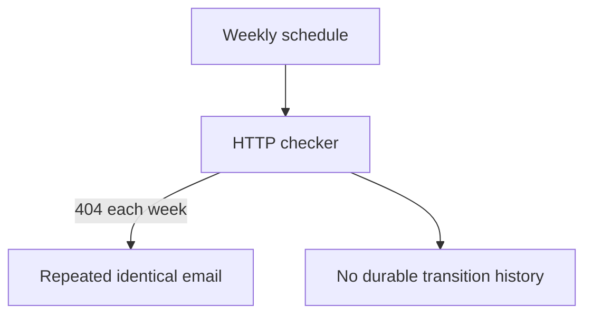
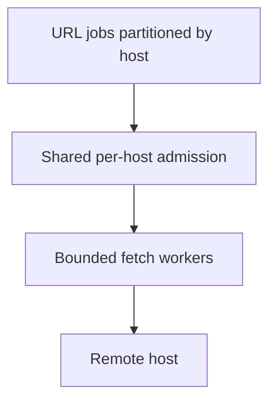
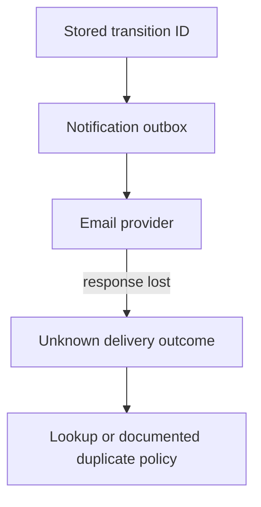
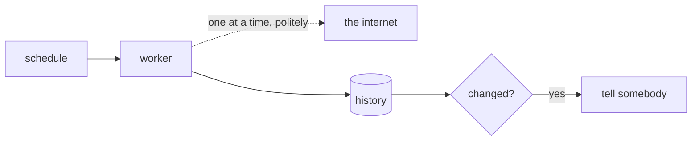

# 4. A link-rot watcher

[Curriculum](../../../README.md) · [Backend and APIs](../README.md) · [Project index](../../../../indexes/projects.md)

## The reviewer's brief

> A weekly link checker emails the same broken URL every week and silently stops when its scheduler fails. Make the alert useful and expose the watcher’s own failure. What observation really proves a link is dead?

This is a **constructed practice brief**, not an attributed company question.
Prerequisites: [project index](../../../../indexes/projects.md) and [prerequisite lesson](../../../01-code/01-problem-solving/change-loop.md). This page is a build brief; it does not ship a runnable application. The original build and prompt sequence below defines the implementation checkpoints.

| Case | Exact input or workload | Expected outcome |
|---|---|---|
| Small example | Check history for URL U: 200, 404, 404, 200. | Record four observations; emit one broken transition and one recovery, not two identical broken alerts. |
| Boundary / failure | HTTP 200 contains a parked-domain page, or 429 asks for backoff. | Record uncertain/content-changed or throttled state; HTTP success alone is not proof the original content survives. |
| Scope | Controlled URLs for load/failure drills; respectful per-host concurrency and deadlines. | Explain any additional assumption before implementing it. |

## See the first reviewable result

**First slice:** For URL U feed the checker status history `200 → 404 → 404 → 200`. **Show:** four timestamped observations and exactly two user-facing transitions: broken and recovered. Feed a 200 parked-domain response and a 429 too; label those uncertain/throttled, never “content is healthy” solely because the HTTP status is 200.

<!-- project-expectation:start -->

## What you are expected to hand over

**The finished artifact:** A list of URLs, a weekly check of each, a record of what changed, and a message when something breaks.

Bring a runnable slice or decision artifact, its normal output, and a captured
failure from the examples above. Include one check that turns red when the guarantee
breaks, the state owner, and the first operational limit. For each follow-up,
change the diagram **and** the evidence before claiming the design still works.

### How the review conversation gets harder

| Review gate | The interviewer changes | Expected response |
|---|---|---|
| Baseline | Run the small example from the cases above. | Demonstrate the observable outcome end to end and identify which boundary owns it. |
| Failure | Reproduce the boundary/failure case above. | Show the failure before the fix, then prove the protected behavior without hiding the error. |
| Senior · Many URLs share one host | Ten workers each apply a local one-request limit. Can the host receive ten simultaneous requests? Predict which boundary must change before opening the design. | Yes. Coordinate per-host admission across the active workers or partition host ownership with explicit leases; local concurrency is not a fleet guarantee. Honor bounded Retry-After and revalidate redirects. |
| Lead · Email succeeded but acknowledgment vanished | The notification worker retries after losing its provider response. Can you promise one email? State what evidence would make you reject your first design. | Only with provider-supported deduplication or equivalent protocol. Persist notification state and key; otherwise expose the possible duplicate and reconcile unknown outcomes instead of equating one stored transition with one delivery. |
| Evidence | A reviewer asks, “How do you know?” | Build in three stops: reproduce the small case and baseline failure; implement the protected boundary; then replay both changed requirements with captured outputs. |
| Handoff | The author is unavailable and the environment is new. | Another engineer can run, observe, break, and recover the artifact from the repository evidence. |

Before implementation, say the baseline invariant, the owner of each piece of
state, and what the user sees when the named dependency or assumption fails. That
five-minute explanation is part of the project: if it is vague, the build is not
ready to begin.

<!-- project-expectation:end -->

Before looking at the guidance, state the invariant in one sentence and trace the example. In interview practice, implement or sketch independently, then reveal the reasoning. During AI-assisted practice, use the prompts below and verify each checkpoint before the next request.

## Baseline and the failure to explain



An alert is a change in observed state, not a dump of every observation. Content hashes can reveal change but cannot alone decide its meaning.

<details>
<summary>Reveal the approach and decisions</summary>

Persist append-only observations, compare against the last meaningful state, and allocate stable transition IDs. The invariant is one stored transition per observed state change, with notification retries scoped separately. A missing run must be monitored independently.

</details>

## Follow-up 1 · Many URLs share one host

**Changed requirement:** Ten workers each apply a local one-request limit. Can the host receive ten simultaneous requests? Predict which boundary must change before opening the design.

<details>
<summary>Expected reasoning and changed diagram</summary>

Yes. Coordinate per-host admission across the active workers or partition host ownership with explicit leases; local concurrency is not a fleet guarantee. Honor bounded Retry-After and revalidate redirects.



</details>

## Follow-up 2 · Email succeeded but acknowledgment vanished

**Changed requirement:** The notification worker retries after losing its provider response. Can you promise one email? State what evidence would make you reject your first design.

<details>
<summary>Expected reasoning and changed diagram</summary>

Only with provider-supported deduplication or equivalent protocol. Persist notification state and key; otherwise expose the possible duplicate and reconcile unknown outcomes instead of equating one stored transition with one delivery.



</details>

## Evidence to bring to review

Build in three stops: reproduce the small case and baseline failure; implement the protected boundary; then replay both changed requirements with captured outputs. Record commands, fixtures, and observed results in your implementation README. A diagram is a prediction until those checks run.

**Senior expectation:** Test repeated status, scheduler silence, host concurrency and delivery ambiguity. **Additional lead scope:** Define notification semantics, recipient ownership and history retention. Completion demonstrates practice evidence; it does not establish interview readiness or multi-team delivery experience.

## Build and prompt sequence

*Give it URLs, and it tells you when one dies.*

**Build**

A list of URLs, a weekly check of each, a record of what changed, and a message
when something breaks.



**The thought process**

The first decision is **what counts as dead**. A 404 is easy. A 200 returning a
parked-domain page is the hard case, and the honest answer involves comparing to
what the page looked like last time. Which means this project is really about
*history*, not about checking — you are building a record of states, and the
alert is a diff.

Then **being a good citizen**. You are making automated requests to other
people's servers. One at a time per host, a real user agent that says who you
are, honour a 429, and back off. The engineering and the manners are the same
work here.

Third: **the alert is the product.** Nobody wants a weekly email listing 200
working links. They want to hear when something broke, once, with enough context
to act. A watcher that emails every run gets filtered within a fortnight and then
it is not a watcher.

**How to organise the prompts**

```
I am building a link-rot watcher. Before code: what states can a URL be
in beyond up and down? For each, say how I would distinguish it from the
others using only what an HTTP response gives me.

Be honest about the ones I cannot reliably distinguish.
```

The last line is the important one, and the answer shapes the whole design.

```
Implement the checker for ONE url: fetch with a timeout I chose, record
status, final URL after redirects, response size, and a hash of the
main content. Store it as a new row, never an update.
```

Append-only is the design decision. It is what makes the diff possible later.

```
Now the diff: given two consecutive checks of the same URL, decide
whether something meaningful changed. Distinguish a real change from
noise — a tracking parameter, a timestamp on the page, an ad.
```

```
Rate limiting: one request per host at a time, honour 429 with backoff,
and a user agent that identifies the tool. Show me the code path that
runs when a host returns 429.
```

**On AWS**

This is the best fit for serverless among these application projects, and worth doing that way to feel
the difference. **EventBridge Scheduler** fires weekly, a **Lambda** fans the
URLs out onto **SQS**, and a second Lambda consumes the queue with a
concurrency limit set deliberately low. Add the shared per-host admission
mechanism from the follow-up: a global worker limit alone does not prove
one active request per host across replicas. SQS supplies durable delivery and configurable redrive/DLQ mechanisms;
you still configure them, bound work, and pay for the relevant usage.

Why SQS and not EventBridge for the fan-out: EventBridge routes *events* to
*targets* and does not hold a backlog you can drain at your own pace, which is
exactly what you want when the work is polite by design. Why not Step Functions:
it is the right answer when the workflow has branches and human steps, and here
the workflow is "do this for each one".

**DynamoDB** suits the history well — partition by URL, sort by timestamp, and
"the last two checks for this URL" becomes one cheap query. Set a TTL so history
does not grow for ever. Delivery by **SES** if you want email you control, or a
webhook if you want it in a chat.

**What productionising it means**

It runs whether or not you remember, and **its own failure is visible** — a
watcher that silently stops looks exactly like a watcher reporting nothing wrong,
which is the most repeated failure mode there is. Alarm on the absence of a run.
Politeness is enforced in code rather than intended. Alerts are deduplicated so
one dead link is one message, not one a week for ever.

**The learning**

Anything that watches needs something watching it, and the alert design is the
product. Both of those generalise to every monitoring system you will ever touch,
including the ones in the operating concepts.

**How you would know it is wrong**

- Point it at a URL you control and break it on purpose. Time how long until you are told.
- Stop the schedule. Something must notice within a run or two.
- Point it at a page with a live timestamp. It must not report a change every week.
- Make a host return 429 and confirm it backs off rather than retrying immediately.

**Stage it**

1. One URL, checked by hand, history appended.
2. The diff, with the noise cases.
3. The schedule and the queue, with politeness enforced.
4. Alerts, deduplicated, plus an alarm on the run not happening.

---

[Back to the ordered project index](../../../../indexes/projects.md)
