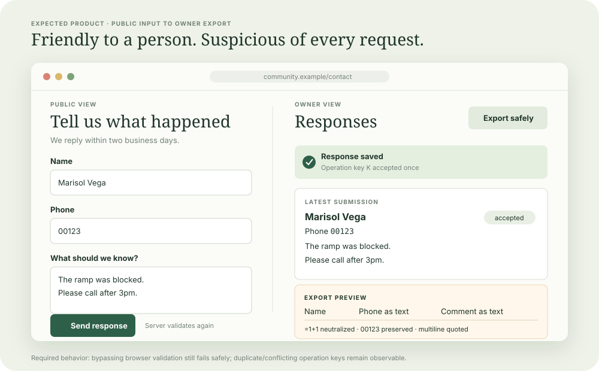
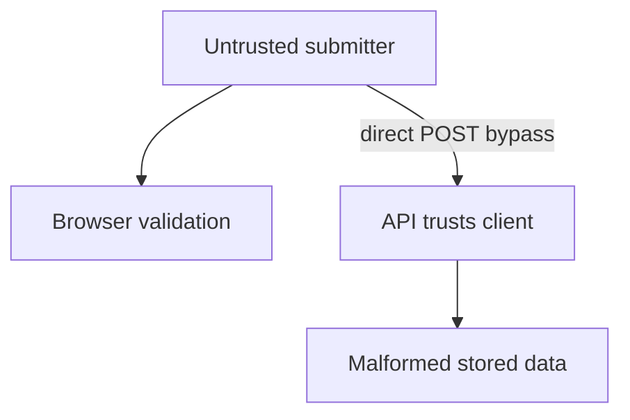
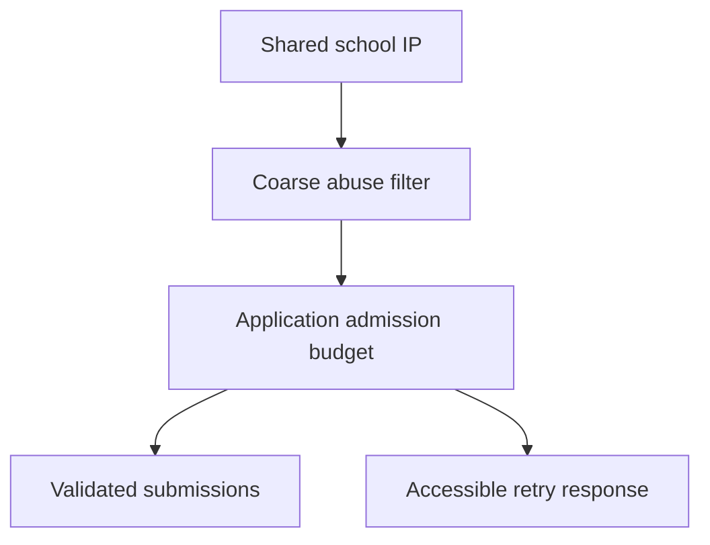
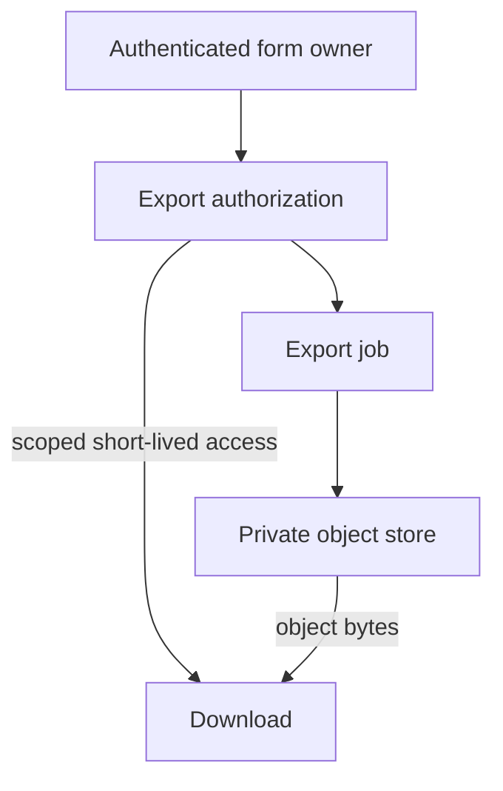
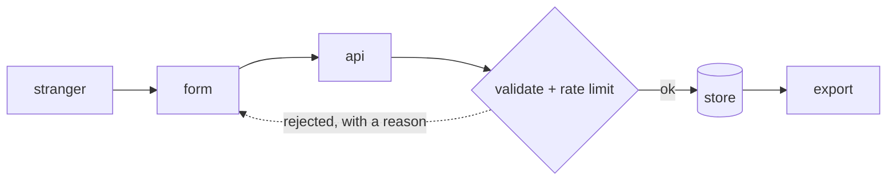

# 5. A public form

[Curriculum](../../../README.md) · [Backend and APIs](../README.md) · [Project index](../../../../indexes/projects.md)

## The reviewer's brief

> Strangers submit a registration form. One sends a 40,000-character field directly to the API; another enters a phone number with leading zeros and a name beginning `=`. Preserve valid data and make the export safe to open. Which behaviors can CSV alone guarantee?

This is a **constructed practice brief**, not an attributed company question.
Prerequisites: [project index](../../../../indexes/projects.md) and [prerequisite lesson](../../../01-code/01-problem-solving/change-loop.md). This page is a build brief; it does not ship a runnable application. The original build and prompt sequence below defines the implementation checkpoints.

| Case | Exact input or workload | Expected outcome |
|---|---|---|
| Small example | Submission has name `=1+1`, phone `00123`, and a multiline comment; duplicate operation key K. | Server validates length/type, stores one accepted submission for K, and export treats user content as text with documented import behavior. |
| Boundary / failure | Client-side validation is bypassed; K is reused with a different payload. | Reject malformed input and conflicting key reuse at the server; no new row. |
| Scope | CSV import behavior varies by spreadsheet; use typed XLSX or explicit text-import instructions when exact text preservation is required. | Explain any additional assumption before implementing it. |

## See the first reviewable result

**First slice:** Render the form and submit `name="=1+1"`, `phone="00123"`, and a comment containing a newline with operation key K. **Show:** accessible field-level errors for malformed input, one accepted record despite an exact retry, and the owner's export opened in the named spreadsheet/import mode with text preserved. Reuse K with a different payload and capture a server-side conflict with no new row.

| Action the reviewer takes | Visible result | Server or export proof |
|---|---|---|
| Submit `name="=1+1"`, `phone="00123"`, `comment="line 1\nline 2"`, key `K` | Success and the submitted values display as text | One row; the phone is still the string `00123` when reopened using the documented import mode. |
| Repeat the identical request with `K` | Same accepted result, no duplicate card | Exactly one stored submission. |
| Submit a different body with `K` | Conflict that tells the user what happened | No second row; the first row is unchanged. |
| Send a 40,000-character field directly to the API | Accessible validation message | Bounded server-side rejection, with no persisted row. |

**Export review:** State the target reader and import mode. Quoting CSV fields alone does not promise that a spreadsheet will treat `=1+1` or a zero-prefixed phone as text. If the importer cannot enforce text typing, supply a typed XLSX export or explicit text-import instructions and verify both fields after opening the file.

<!-- project-expectation:start -->

## What you are expected to hand over

**The finished artifact:** A public, accessible form that validates on both sides, survives duplicate submission, makes rejection useful, and gives its authenticated owner a safe export.



Bring a runnable slice or decision artifact, its normal output, and a captured
failure from the examples above. Include one check that turns red when the guarantee
breaks, the state owner, and the first operational limit. For each follow-up,
change the diagram **and** the evidence before claiming the design still works.

### How the review conversation gets harder

| Review gate | The interviewer changes | Expected response |
|---|---|---|
| Baseline | Run the small example from the cases above. | Demonstrate the observable outcome end to end and identify which boundary owns it. |
| Failure | Reproduce the boundary/failure case above. | Show the failure before the fix, then prove the protected behavior without hiding the error. |
| Senior · A school shares one IP | Two hundred legitimate users submit behind the same NAT. What does per-IP throttling do? Predict which boundary must change before opening the design. | It can block the school. Combine coarse abuse limits with fairer account/session or challenge policies where possible, and measure legitimate rejection. Managed throttles reduce load but are not exact hard spending caps. |
| Lead · The export contains private data | A download link is forwarded to another person. What authorizes access? State what evidence would make you reject your first design. | Check owner authorization before issuing a short-lived private object URL, or authorize every delivery for stricter revocation. Record that a signed URL remains usable until expiry unless an additional revocation mechanism exists. |
| Evidence | A reviewer asks, “How do you know?” | Build in three stops: reproduce the small case and baseline failure; implement the protected boundary; then replay both changed requirements with captured outputs. |
| Handoff | The author is unavailable and the environment is new. | Another engineer can run, observe, break, and recover the artifact from the repository evidence. |

Before implementation, say the baseline invariant, the owner of each piece of
state, and what the user sees when the named dependency or assumption fails. That
five-minute explanation is part of the project: if it is vague, the build is not
ready to begin.

<!-- project-expectation:end -->

Before looking at the guidance, state the invariant in one sentence and trace the example. In interview practice, implement or sketch independently, then reveal the reasoning. During AI-assisted practice, use the prompts below and verify each checkpoint before the next request.

## Baseline and the failure to explain



Browser validation improves feedback but cannot enforce a server contract. CSV quoting preserves field boundaries, not universal text typing or formula safety.

<details>
<summary>Reveal the approach and decisions</summary>

Validate and bound input at the server, define duplicate semantics, then test export in the actual target reader. The invariant is owner-authorized access to valid stored submissions, with unsafe spreadsheet interpretations prevented by a stated export policy.

</details>

## Follow-up 1 · A school shares one IP

**Changed requirement:** Two hundred legitimate users submit behind the same NAT. What does per-IP throttling do? Predict which boundary must change before opening the design.

<details>
<summary>Expected reasoning and changed diagram</summary>

It can block the school. Combine coarse abuse limits with fairer account/session or challenge policies where possible, and measure legitimate rejection. Managed throttles reduce load but are not exact hard spending caps.



</details>

## Follow-up 2 · The export contains private data

**Changed requirement:** A download link is forwarded to another person. What authorizes access? State what evidence would make you reject your first design.

<details>
<summary>Expected reasoning and changed diagram</summary>

Check owner authorization before issuing a short-lived private object URL, or authorize every delivery for stricter revocation. Record that a signed URL remains usable until expiry unless an additional revocation mechanism exists.



</details>

## Evidence to bring to review

Build in three stops: reproduce the small case and baseline failure; implement the protected boundary; then replay both changed requirements with captured outputs. Record commands, fixtures, and observed results in your implementation README. A diagram is a prediction until those checks run.

**Senior expectation:** Test direct POST, duplicate conflict, target spreadsheet and cross-owner export. **Additional lead scope:** Own abuse trade-offs, export retention and spending alarms. Completion demonstrates practice evidence; it does not establish interview readiness or multi-team delivery experience.

## Build and prompt sequence

*Strangers submit structured data, and what arrives is usable.*

**Build**

A public form, validation on both sides, spam resistance, and an export the
person who owns it can actually use.



**The thought process**

Everything here follows from one fact: **the input is hostile and you do not
control the client.** So client-side validation is a courtesy to honest people,
and server-side validation is the only validation. Say that out loud before you
build, because the temptation to trust a validated form is strong when you wrote
the form.

Then the tension that makes this interesting: **every anti-spam measure costs a
real person something.** A captcha costs everybody a few seconds and costs some
people access entirely. A honeypot field costs nothing and catches less. Rate
limiting by IP punishes offices and universities behind one address. There is no
free option, and picking is the work.

Third: **the export is the product.** The person who owns this form does not want
a database, they want a file that opens. Which means thinking about how a
spreadsheet mangles things — a leading zero, a long number, a date, a field
starting with `=`.

**How to organise the prompts**

```
I am building a public form that strangers submit. List every way the
input can be hostile or malformed, including the ones that are not
attacks: pasted formatting, emoji, a 40,000 character answer, a
submission sent twice by a double-tap.

Do not write code yet.
```

```
Implement server-side validation against a schema. Then show me the
same submission being rejected when I bypass the form entirely and post
directly to the endpoint.
```

That second half is the whole point: prove the server does not trust the client.

```
Anti-spam: implement a honeypot and per-IP rate limiting. Tell me
exactly which real users each one inconveniences, and what a
determined submitter would do to get past both.
```

```
The export: CSV that survives a spreadsheet. Handle a value starting
with = or +, a leading zero, a number long enough to become scientific
notation, and a newline inside a field. Show me each case opening
correctly.
```

**On AWS**

The form itself is static: **S3** plus **CloudFront** and it costs almost
nothing. The submit endpoint is the one place that needs care, and **API
Gateway** in front of a **Lambda** is the natural shape — API Gateway gives you
throttling and request validation as configuration, before your code runs,
which is exactly where you want a flood to stop.

**WAF** on the CloudFront distribution is the managed answer to abusive traffic,
with rate-based rules that act before anything of yours executes. It bills per
month plus per request, so it is a real decision rather than a default.

Storage: **DynamoDB** for append-only submissions, which is what these are.
For the export, generate the file into **S3** and hand out a presigned URL that
expires, rather than streaming it from your API — the same move as the receipt
uploads, in the other direction.

**What productionising it means**

Admission and concurrency limits reduce expensive work. Managed throttling
and WAF rules are not exact dollar caps, and rejected requests, logging and
storage can still cost money. Set explicit work limits, budget alerts and a
shutdown procedure; measure the residual cost of rejected traffic. Every rejection tells the honest person what
to fix. The export is verified in the stated spreadsheet/import configuration;
choose typed XLSX when CSV cannot preserve text types and formula safety. And you know
what one submission costs, because a public endpoint is a public invitation to
find out the hard way.

**The learning**

Anything reachable by strangers is a cost you have handed to other people's
discretion, and the defences all have a price paid by somebody legitimate.
Deciding who pays it is engineering, not configuration.

**How you would know it is wrong**

- Post directly to the endpoint, bypassing the form. Validation must still hold.
- Submit a field starting with `=` and open the export in a spreadsheet.
- Submit the same thing twice quickly. Decide what should happen, then check it did.
- In your own controlled environment, send a bounded burst and confirm the throttle fires. Measure accepted/rejected work and its costs; do not infer that rejected traffic is unbilled.
- Read a rejection message as an honest person would. Does it say what to fix?

**Stage it**

1. Form and server-side validation, proved by bypassing the client.
2. Anti-spam, with the cost to real people written down.
3. The export, with the four spreadsheet cases.
4. Throttling in front of the compute, and a measured cost per submission.

---

[Back to the ordered project index](../../../../indexes/projects.md)
