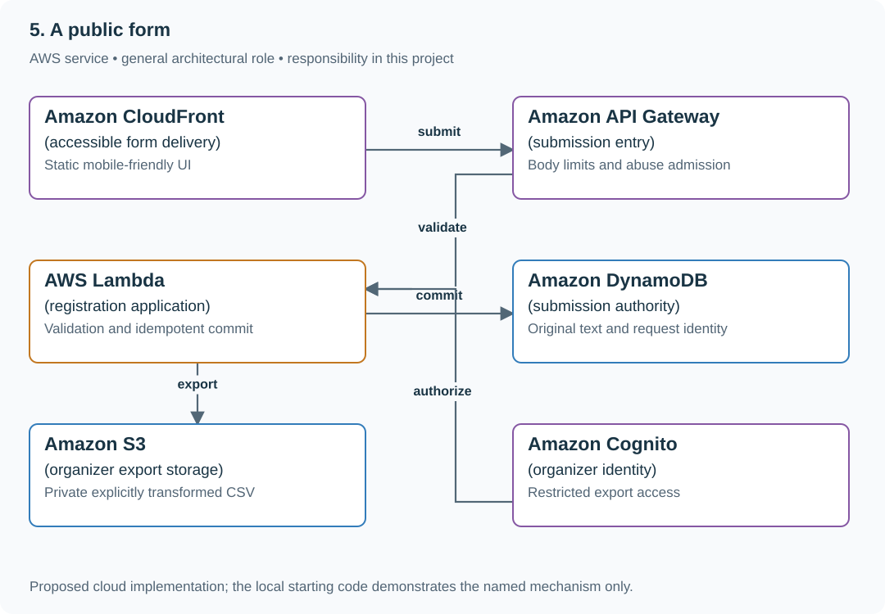

# 5. A public form

## What you are building

> Build a volunteer-registration form for a community event. People submit names, phone numbers and notes from mobile browsers; organizers download a spreadsheet. A double tap must not create two registrations, and notes such as =1+1 must remain text when exported.

**Working contract:** The form has labeled accessible fields, server-side validation and a stable submission request ID. Store original text faithfully. Provide a deliberate spreadsheet-safe export without changing the stored source values.

## Workload and the decisions it changes

These are constructed exercise assumptions. The stated workload is a design target; the local demonstration does not establish that throughput. Use the [estimation constants](../../../01-code/01-problem-solving/estimation-constants.md) to check units before choosing capacity.

| Input or objective | Calculation / consequence |
|---|---|
| 500 registrations/day; 20 submissions/s event-opening burst | Small storage volume but burst admission and duplicate handling still matter. |
| Phone value 00123 | Treat it as text; numeric conversion loses meaningful leading zeros. |
| Notes up to 2,000 characters | Bound input size and preserve intentional newlines with correct CSV quoting. |

## Start with one working boundary

Run from the repository root with Python 3.12+:

```bash
python3 examples/architecture-starts/a_public_form.py
```

[Open the starting code](../../../../examples/architecture-starts/a_public_form.py). This is a runnable demonstration of the critical state boundary. The API, UI, cloud adapters and operating behavior below are the application you build around it.

| Record / module | Key or interface | Responsibility |
|---|---|---|
| submissions | submission_id,request_id,payload_hash | One logical form submission and replay result. |
| contact_fields | name,phone,notes | Validated original text, not spreadsheet formulas or numeric phone data. |
| export_view | submission_id,escaped_cells | Explicit export transformation with a documented text policy. |

## AWS implementation



The static UI handles usability; Lambda enforces validation and duplicate identity. Export formatting is a separate transformation so spreadsheet safety does not corrupt the original submission.

## Build it in this order

### 1. Build the usable form

Add explicit labels, input hints, keyboard-accessible errors and a submit state that preserves entered values. Validate again on the server. Return field-specific errors without clearing the entire form; allow a user to correct only the invalid field.

### 2. Commit one submission

Generate a stable client request ID per attempted form submission and store its payload hash with the result. Exact replay returns the same registration. Reusing the ID with changed data returns a conflict so a failed response cannot silently replace another submission.

### 3. Store and export separately

Keep phone and notes as text, including leading zeros and newlines. Use a real CSV writer for quoting. Offer an explicitly spreadsheet-safe view that neutralizes formula-leading text and preserves phone representation for the chosen target; document that CSV cannot carry universal cell typing across every spreadsheet importer.

### 4. Operate a public endpoint

Add body-size and rate limits, CSRF protection where cookie authentication is involved, and bounded abuse controls. Keep organizer access authenticated and auditable. Show a success receipt only after durable storage, not merely after disabling the button.

## Infrastructure configuration

| Resource or boundary | Initial configuration and reason |
|---|---|
| Public endpoint | Limit payload bytes and request rate; keep abuse decisions separate from valid-field errors. |
| Storage | Restrict organizer reads and export generation; avoid logging contact data. |
| Exports | Private bucket, short-lived authorized downloads and retention appropriate to the event. |

Use one disposable AWS environment for the cloud exercise. Put the named resources in `infra/template.yaml` or your existing IaC tool, pass resource IDs through configuration, and scope each runtime role to its own tables, buckets and queues. The diagram is a design to implement; it is not a claim that these resources have been deployed. Record the commands you used to deploy and remove the exercise resources.

For concrete provisioning commands, configuration wiring and cleanup, use the [AWS foundation guide](../../../../examples/architecture-starts/infra/README.md). It includes a deployable table/queue/object-storage foundation and explains which application and service adapters you still implement.

## Observe the result

| Action | Expected visible result |
|---|---|
| Run the starting program | The export preserves text intent and quotes multiline notes; stored originals remain unchanged. |
| Double-submit the same request ID | One registration and the same receipt return. |
| Submit one invalid field | The form keeps the other entered values and points to the correction. |

## The next design decision

Add a second export for a machine consumer that needs exact original strings. Name the two export contracts clearly and avoid making spreadsheet-oriented escaping part of the canonical data.

<details>
<summary>Further constraints from the original project</summary>

## Follow-up 1 · A school shares one IP

**Changed requirement:** Two hundred legitimate users submit behind the same NAT. What does per-IP throttling do? Predict which boundary must change before opening the design.

<details>
<summary>Expected reasoning and changed diagram</summary>

It can block the school. Combine coarse abuse limits with fairer account/session or challenge policies where possible, and measure legitimate rejection. Managed throttles reduce load but are not exact hard spending caps.

</details>

## Follow-up 2 · The export contains private data

**Changed requirement:** A download link is forwarded to another person. What authorizes access? State what evidence would make you reject your first design.

<details>
<summary>Expected reasoning and changed diagram</summary>

Check owner authorization before issuing a short-lived private object URL, or authorize every delivery for stricter revocation. Record that a signed URL remains usable until expiry unless an additional revocation mechanism exists.

</details>

</details>
