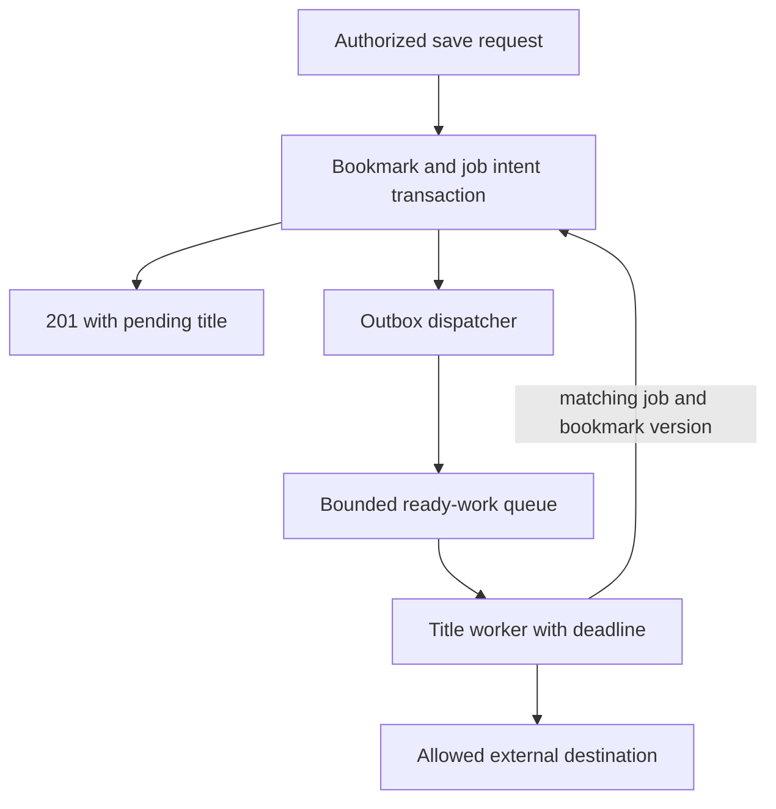

# Follow an HTTP request from validation to durable state

Alice pastes a documentation URL into her team's reading list and presses Save. The browser sends a request to an API, a server interface that accepts operations such as creating or listing bookmarks. The API needs to identify Alice, validate the request, store the bookmark and return a result the browser can understand.

The app also wants a display title from the linked page. That website can be slow or unavailable. Saving Alice's link and obtaining its title are different operations, with different failure consequences. This lesson follows the request and shows where to put authority, time limits and recovery state.

## Start with one request and its result

The [supplied reading-list API](../../../examples/reading-list-starter/README.md) runs locally with SQLite. This is an actual supported request after following that README's start command:

```sh
curl -i http://127.0.0.1:8080/bookmarks \
  -H 'X-Demo-User: alice' \
  -H 'Content-Type: application/json' \
  -d '{"url":"https://example.com/docs","title_mode":"timeout"}'
```

The server returns **201 Created** with a saved bookmark ID, `title: null` and `title_status: "timeout"`. The title lookup is a local fixture. It does not contact that website. `X-Demo-User` selects a demonstration identity and is not production authentication.

| Part of the call | Meaning |
|---|---|
| `POST /bookmarks` | Request creation of a bookmark |
| JSON `url` | The link to store |
| Response status 201 | A new bookmark record was created |
| Bookmark ID | Identity of the stored item, reused on later operations |
| Missing title | Optional enrichment did not produce a title |

A successful HTTP read can return an object whose domain status is failed. For example, a proposed `GET /jobs/7` may successfully return `200 {"state":"failed"}`. That is different from claiming a failed create operation succeeded.

## Follow the boundaries in order


The browser resolves the hostname and establishes the required connection. Routing selects a handler. The application authenticates the caller, validates input, authorizes the specific operation and changes state. Frameworks arrange some of these steps differently, but every boundary still has a responsibility.

**Authentication** establishes who is calling. **Authorization** decides whether that caller may act on this item. A caller-supplied `owner_id` is not evidence of ownership. An input validator can establish that a URL is a string without proving that it is safe for the server to fetch.

A **database commit** makes a transaction's changes stored database state under the database's durability configuration. It is unrelated to a Git commit. A response sent after the database commit can still be lost on the network. “The client did not receive success” therefore does not mean “the record does not exist.”

## Protect the state change at its actual owner

Suppose two browser tabs read bookmark version 3 and edit it independently. Both should not silently overwrite each other. A proposed relational update has this shape:

```sql
UPDATE bookmarks
SET note = :note, version = version + 1
WHERE id = :id
  AND owner = :authenticated_owner
  AND version = :expected_version;
```

Parameters are supplied through the database driver, not string concatenation. The owner comes from trusted identity. Check how many rows changed. Zero rows means the operation did not satisfy the full condition, so apply the documented unavailable/conflict response policy.

| Request order | Result |
|---|---|
| A updates expected version 3 | One row becomes version 4 |
| B also updates expected version 3 | No row matches, so B retains its draft and resolves a conflict |
| Bob names Alice's item | Owner condition prevents Bob's update |

A transaction groups local changes, but `BEGIN` alone does not make every read-then-write algorithm safe. Use a conditional update, suitable locking or the required isolation protocol to protect the particular rule.

## Put one deadline around the whole operation

A timeout limits one wait. An end-to-end deadline limits all work for the request, including time already spent. Giving every downstream call a fresh full timeout can exceed the user's budget.


Use a constructed 500 ms request budget. If parsing and database work already consumed 120 ms, at most 380 ms remain for everything else. Reserve response overhead before starting optional work. A 400 ms title attempt no longer fits. Record a timeout or pending state according to the product contract.

Parallel calls help only when their results are independent and capacity permits them. Two independent waits of 80 ms and 140 ms can overlap, but that does not prove an end-to-end p99 of 140 ms. Pool waiting, network variability and other work remain.

## Move optional work to a durable job when the requirement changes

The simple reference performs a bounded title fixture during the request. If the product requires titles to keep retrying after restarts, add durable background work deliberately:



An outbox stores the instruction to publish work alongside the bookmark. Sending a queue message is a separate operation, so duplicate publication remains possible. The worker needs a stable job identity and guarded completion. The [tracing project](projects/01-the-request-you-can-trace-end-to-end.md) explains the extension and shows its changed design.

A queue absorbs a temporary gap between arrivals and completions. With 50 new jobs/s and 30 completed jobs/s, it grows by 20 jobs/s. Bound pending work, measure oldest job age and choose an admission policy. More queued work does not create processing capacity.

## Treat errors as part of the API contract

A proposed error response might include `code`, a safe human message and a request ID. The request ID identifies one attempt through its diagnostic events. It is different from the bookmark ID or a stable operation key used across retries.

| Failure | Application behavior to define |
|---|---|
| Invalid body | Reject before changing data |
| Unauthenticated caller | Require a valid identity without exposing protected data |
| Version conflict | Preserve current state and tell the client to resolve its draft |
| Database unavailable | Report failure or uncertainty according to the actual commit evidence |
| Optional title timeout | Keep the saved bookmark and expose the separate enrichment outcome |

Do not catch every exception and return a fabricated success value. Also avoid leaking credentials, private URL queries or stack traces into user responses. Diagnostic records should make the failure explainable without copying sensitive request bodies.

For user-supplied URLs, validate destinations and redirects and constrain network access. A syntax-valid URL can still target an internal service. The [restricted-fetch project](projects/03-the-fetch-that-cannot-be-aimed-inward.md) handles that separate boundary.

## Run a useful first exercise

Run the local API and compare a normal title result with `title_mode: "timeout"`. Query the saved list afterward to establish which state persisted. Then follow the [deadline project](projects/02-the-three-second-budget.md) or [request tracing project](projects/01-the-request-you-can-trace-end-to-end.md).

Be able to explain the request, caller identity, stored record, time budget and returned result without naming an AWS service. For deployment, API Gateway or a load balancer can accept traffic, Lambda or a service runtime can run the handler, and a database owns durable state. Those products implement responsibilities. They do not decide the application's ownership or retry contract for you.
