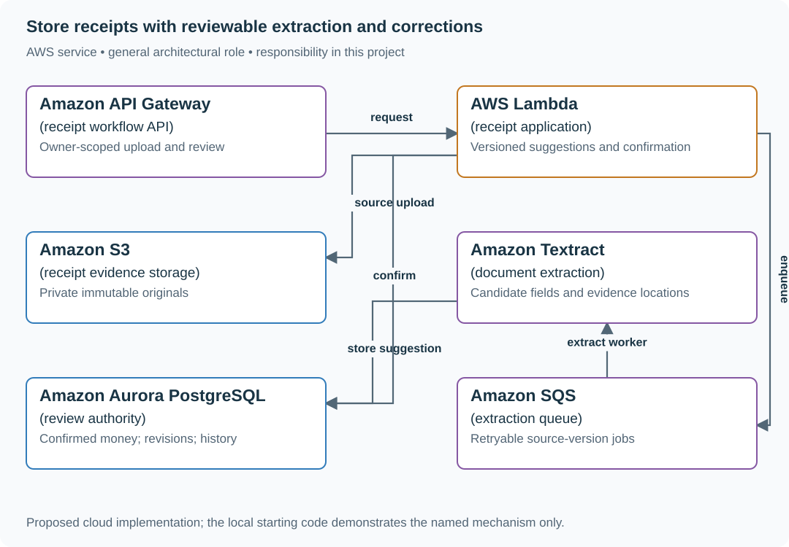

# 2. A receipt tracker

## What you are building

> Build a receipt tracker for a small business. An employee uploads a receipt for 19.99, but extraction reads 199.90. The accountant corrects it, and a later extraction retry must not overwrite the confirmed amount.

**Working contract:** Keep source evidence, extracted suggestions and human-confirmed values as distinct records. Money is stored in integer minor units with currency. Reports use confirmed values or clearly label unreviewed entries.

## Workload and the decisions it changes

These are constructed exercise assumptions. The stated workload is a design target; the local demonstration does not establish that throughput. Use the [estimation constants](../../../01-code/01-problem-solving/estimation-constants.md) to check units before choosing capacity.

| Input or objective | Calculation / consequence |
|---|---|
| 1,000 receipts/month; 2 MB average image | About 2 GB/month of source objects before versions and backups. |
| OCR suggests 199.90; human confirms 19.99 | Suggested 19,990 minor units must not replace confirmed 1,999 minor units. |
| Two reviewers may edit simultaneously | Require expected revision and preserve an audit trail of corrections. |

## Start with one working boundary

Run from the repository root with Python 3.12+:

```bash
python3 examples/architecture-starts/a_receipt_tracker.py
```

[Open the starting code](../../../../examples/architecture-starts/a_receipt_tracker.py). This is a runnable demonstration of the critical state boundary. The API, UI, cloud adapters and operating behavior below are the application you build around it.

| Record / module | Key or interface | Responsibility |
|---|---|---|
| receipts | receipt_id,owner,source_key,source_hash | Immutable original evidence. |
| extraction_attempts | receipt_id,attempt,model,fields | Versioned machine suggestions and provenance. |
| confirmed_fields | receipt_id,revision,amount_minor,currency,actor | Human-approved reporting authority. |

## AWS implementation



Textract supplies candidate data; the review transaction establishes the confirmed financial record. Keeping those authorities separate makes correction durable across retries.

## Build it in this order

### 1. Store one receipt with evidence

Save the private original image and checksum, then create a receipt record with owner and upload time. Keep object identity immutable so an accountant can inspect exactly what supported a correction.

### 2. Add extraction as a suggestion

Record each extractor/model version, raw suggested fields and confidence/evidence location. Validate currency and decimal conversion explicitly. Low confidence, inconsistent totals or missing fields route to review rather than becoming silently accepted financial data.

### 3. Implement conditional human review

Display image, suggestion and editable confirmed fields side by side. Save against expected revision and record actor plus previous/new values. An extraction retry appends a new suggestion; it has no authority to overwrite confirmed fields.

### 4. Build useful reports and recovery

Filter reports by owner/date/currency and distinguish reviewed from pending amounts. Export integer-money-derived decimal strings without binary floating-point rounding. Restore a database backup together with referenced object versions and show that every confirmed record still has source evidence.

## Infrastructure configuration

| Resource or boundary | Initial configuration and reason |
|---|---|
| Evidence bucket | Private access, versioning and owner-authorized download; avoid receipt content in logs. |
| Database | Currency plus integer minor units, optimistic revision updates and immutable correction history. |
| Extraction | Bounded document size/pages, stable source identity and explicit review state after provider failure. |

Use one disposable AWS environment for the cloud exercise. Put the named resources in `infra/template.yaml` or your existing IaC tool, pass resource IDs through configuration, and scope each runtime role to its own tables, buckets and queues. The diagram is a design to implement; it is not a claim that these resources have been deployed. Record the commands you used to deploy and remove the exercise resources.

For concrete provisioning commands, configuration wiring and cleanup, use the [AWS foundation guide](../../../../examples/architecture-starts/infra/README.md). It includes a deployable table/queue/object-storage foundation and explains which application and service adapters you still implement.

## Observe the result

| Action | Expected visible result |
|---|---|
| Run the starting program | Reporting stays at 1,999 minor units after another 19,990-unit suggestion. |
| Two reviewers save the same revision | One succeeds; the other sees a conflict with their draft preserved. |
| Restore the data | Confirmed values remain linked to the original receipt evidence. |

## The next design decision

Add currencies with different minor-unit conventions and tax-line reconciliation. Make the currency exponent part of the conversion policy instead of multiplying every amount by 100.

<details>
<summary>Further constraints from the original project</summary>

## Follow-up 1 · The upload is retried

**Changed requirement:** The phone loses the completion response and submits the same upload ID twice. What is counted? Predict which boundary must change before opening the design.

<details>
<summary>Expected reasoning and changed diagram</summary>

Use an owner-scoped upload identity, verify object metadata and finalize idempotently. A repeated completion must not create another receipt or queue an unbounded duplicate extraction.

</details>

## Follow-up 2 · Several currencies

**Changed requirement:** The month contains USD 19.99 and JPY 500. What does the summary show? State what evidence would make you reject your first design.

<details>
<summary>Expected reasoning and changed diagram</summary>

Group totals by currency unless conversion is explicitly requested. Conversion needs rate source, rate date, rounding and audit trail; adding 1999 and 500 would combine different units.

</details>

</details>
