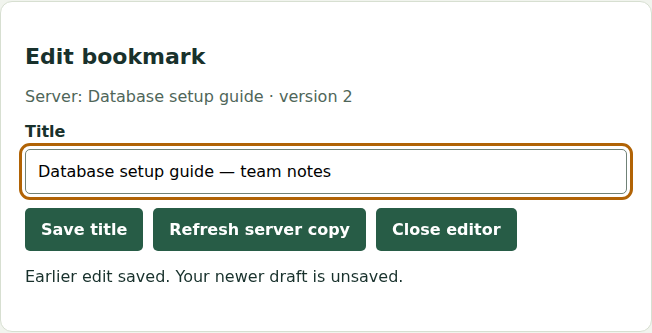

# Connect a usable interface to an API

Preserve user intent across browser, API, and persisted state.

<section class="chapter-context" markdown="1">

## Preserve the user’s next edit while the network catches up

Ana saves a bookmark title, then immediately keeps typing. The first response must confirm the submitted title without overwriting her newer draft. The same distinction between user intent and arriving data matters for search, loading, errors, focus, and navigation.

Open the supplied bookmark editor to see a real browser talking to an HTTP API and SQLite. Inspect its visible states, then work through the response ordering and version boundaries. The editor begins with seeded records and supports editing. Adding new bookmarks is a separate feature.

The confirmed title and editable draft are deliberately different. The browser preserves the newer typing after the earlier save completes.

</section>

[Curriculum](../../README.md) · [About this part](../README.md)

## Prerequisites

[Model data and enforce transactional rules](../02-databases/README.md)

Testing and ownership checks are part of each implementation. The dedicated testing and security chapters deepen those checks; do not postpone them until those chapters.

## Concepts and worked examples

| Step | Existing lesson or exercise |
|---|---|
| 1 | [Keep browser drafts, saved data and search results consistent](browser-state.md) |
| 2 | [Search race · the latest user intent wins](labs/search-race/README.md) |
| 3 | [Full stack · one user action across every boundary](full-stack-practice.md) |
| 4 | [Bookmark editor · preserve the user's next edit](labs/bookmark-editor/README.md) |

## Explore failures and changed requirements

Read the brief and contract first. Attempt the baseline before opening its answer. Continue to the existing changed-requirement questions and redraw or retest the same system. Senior follow-ups emphasize failure behavior and operating constraints; staff/lead follow-ups add scope, compatibility and ownership where the supplied problem supports them. Later-topic dependencies are linked below; return after learning them.

Related prerequisites for deeper follow-ups: [Build HTTP APIs and reliable background work](../01-backend/README.md) · [Model data and enforce transactional rules](../02-databases/README.md) · [Enforce identity, ownership and tenant boundaries](../05-security/README.md).

## Build a project

Each project explains its application, names the deliverable, links the supplied code and gives ordered implementation steps. Run the local example first; use the AWS mapping after the local behavior works.

- [Build a shared reading-list UI with private reading state](projects/a-shared-reading-list.md)

[Choose an independent assessment](../../../practice/README.md) · [Assessment depth](../../../practice/depth.md)

Next chapter: [Find defects and evaluate engineering evidence](../04-testing/README.md).
