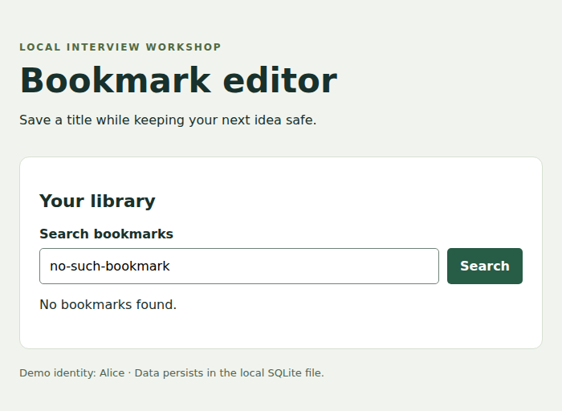
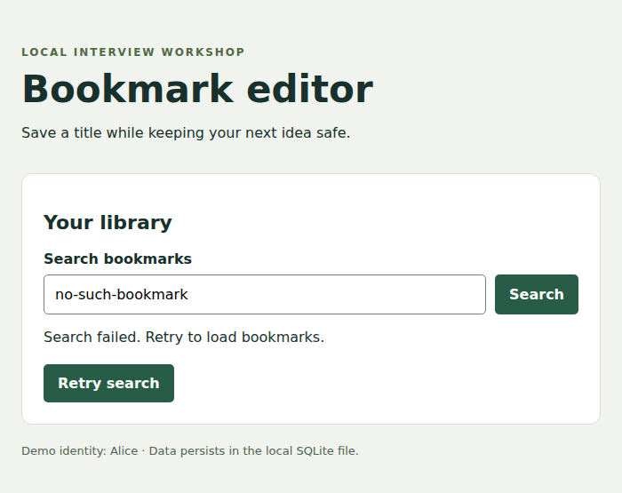
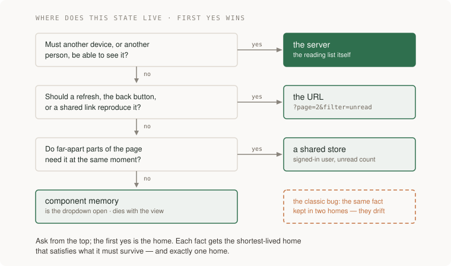

# Keep browser drafts, saved data and search results consistent

Alice uses a reading-list app to save documentation links for her team. The browser shows bookmarks returned by an HTTP API. Alice can search the list and edit a bookmark's display title. The database stores accepted changes, while the browser also holds text she has typed but has not saved yet.

Those two versions can differ legitimately. Alice saves “Database setup guide,” then keeps typing “— team notes” while the response is delayed. The server has accepted the earlier title. The text field must still contain her newer draft.

This lesson explains how to represent that situation, handle responses arriving out of order, and make the state understandable through the interface. You can follow the examples first, then run the [supplied bookmark editor](labs/bookmark-editor/README.md). It includes the HTML, TypeScript, HTTP server and SQLite storage. Its demo identity is local-only. You do not need an AWS account for this lesson.

## See the interface and the state it represents

This is a screenshot of the supplied editor after the earlier save completed:


Read the screen as three separate facts. **Server** describes the confirmed database record. **Title** contains Alice's current draft. The status sentence explains why they differ. “Saved” alone would be misleading because the visible text has not all been saved.

| Fact | Example | Who may change it? |
|---|---|---|
| Confirmed record | `Database setup guide`, version 2 | A successful authorized server operation |
| Current draft | `Database setup guide — team notes` | Alice's typing or an explicit discard/replace action |
| Pending save | Snapshot of the title sent with its expected version and mutation key | The save coordinator, until the operation resolves |
| Editor lifetime | Which bookmark is currently open | Selecting or closing the editor |

A **mutation** is an operation that changes server data. Its key identifies this particular save, so retrying a lost response can refer to the same operation. A **version** identifies the server record being edited. These are different identities.

## Follow a save while the user keeps typing

| Event | Confirmed title | Browser draft | Visible status |
|---|---|---|---|
| Open the bookmark | Original title, v1 | Original title | Ready to edit |
| Type A and press Save | Original title, v1 | A | Saving |
| Type B while A is in flight | Original title, v1 | B | Saving the earlier edit. Newer draft retained |
| Server confirms A/v2 | A, v2 | B | Earlier edit saved. Newer draft is unsaved |

The implementation captures a draft revision when sending the request. A revision is a counter incremented on each local edit. When the save returns, it replaces the draft only if no newer local edit exists.

This excerpt from the [supplied TypeScript](labs/bookmark-editor/web/app.ts) shows that decision. The surrounding handler also checks editor lifetime, mutation identity and response validity:

```typescript
if (current.version >= confirmed.version) confirmed = current;
if (revision === mutation.revision) draft = confirmed.title;
pending = null;
saving = false;
paintEditor(draft === confirmed.title
  ? 'Saved.'
  : 'Earlier edit saved. Your newer draft is unsaved.');
```

Do not copy only the final assignment into an unrelated component. The guard depends on capturing `mutation.revision` when sending the save and incrementing `revision` when the user types.

**Try it:** run the editor, open a bookmark, change its title and save. Use the browser's network throttling to make the pending state visible, then type another suffix before the response returns. Inspect the server label, input and status separately. The screenshot above was captured with the actual server response deliberately held after its database write, so the ordering was controlled rather than inferred from a fast click.

The supplied editor keeps drafts in memory. Closing the editor or reloading discards unsaved text. Adding a navigation warning or durable local drafts is a separate requirement. Server persistence does not automatically preserve an unsent browser draft.

## Let the latest search intent own the results

Alice searches for `cat`, then corrects it to `car`. The car response arrives first. The older cat response must not replace it afterward.


Give each search intent a **generation**, an increasing counter. Capture the generation before awaiting the request, then compare it with the current generation before displaying either results or an error.

```typescript
let generation = 0;

async function runSearch(query: string) {
  const mine = ++generation;
  showLoading(query);
  try {
    const results = await loadResults(query);
    if (mine !== generation) return;
    showResults(results);
  } catch {
    if (mine !== generation) return;
    showError(query);
  }
}
```

This is explanatory pseudocode with UI helpers, not another supplied application. The [search-race lab](labs/search-race/README.md) supplies the focused exercise. Abort obsolete requests where supported to save work, but keep the generation check because cancellation can arrive too late or be ignored. Closing a view must also invalidate outstanding work.

The guard applies to errors too. An old successful request must not clear the error from the current search, and an old error must not replace current results.

## Distinguish empty results from unavailable results

An empty result means the API answered successfully and found no matches. An error means the browser could not obtain a trustworthy answer. They need different messages and actions.



The query above has no matching rows. The user's next action is to change or clear the query. That is different from the controlled API failure below:



The failure screenshot uses the real interface with an intentionally unavailable API response. It demonstrates presentation behavior, not a deployed outage.

| State | What is known | Useful next action |
|---|---|---|
| Loading | A request is pending | Wait briefly or cancel where supported |
| Empty | A successful response contains no matching rows | Clear the filter or create an item if supported |
| Failed | The requested result is unknown | Retry or retain an explicitly labeled previous result |
| Loaded | A current response contains rows | Read, edit or paginate |

Choose whether previous results remain visible during refresh. If they do, label them as previous data. Do not silently treat them as the answer to a different query. Bound waiting with a deadline or a clear recovery action.

## Put each kind of state where its lifetime belongs

A shared bookmark belongs on the server because other people and devices need it. A shareable search filter can belong in the URL. An unsaved draft belongs to the editing interaction, with a persistence policy chosen deliberately. A tooltip's open state can remain in component memory.



A cache is a reconstructible copy. It may be evicted or refreshed. A draft is new user input that may exist nowhere else. Treating them as interchangeable is how a refresh erases unsaved work.

For a filter stored in the URL, demonstrate refresh, Back and opening the same URL in another tab. For private data, the server still checks the requesting user's permissions. A URL carrying an item ID is not authorization to read that item.

## Make the flow usable with a keyboard and assistive technology

Use a real `<label>` for each input and native buttons for actions. Keep focus visible. When a conflict needs a decision, move focus to a useful control without erasing the draft. Announce asynchronous status through an appropriate live region. The supplied editor uses `role="status"` for save and search outcomes.

Walk the actual task using Tab, Shift+Tab and Enter. Open an editor, type, save, encounter a conflict, resolve it and close the editor. Focus should return to a sensible place. Keyboard operation is one part of accessibility, not proof of complete conformance.

Measure contrast against the applicable [WCAG contrast criteria](https://www.w3.org/WAI/WCAG22/Understanding/contrast-minimum.html). Ordinary text generally needs 4.5:1 at level AA, while qualifying large text uses 3:1, with stated exceptions. Inspect labels, focus, status announcements and targets as separate requirements. A generic checklist cannot establish every product's legal obligations.

## Choose rendering and performance work from the user journey

| Rendering choice | Where the HTML is produced | A useful fit |
|---|---|---|
| Static | During the build | Guides and other content published with a release |
| Server-rendered | For a request | Pages needing current server data before display |
| Browser-rendered | By JavaScript on the device | Interactive state after the initial load |
| Streamed | In pieces as work becomes ready | A page where useful sections can arrive independently |

These can coexist. Rendering on the server does not eliminate browser state, and browser rendering does not move authorization out of the server.

Measure loading, responsiveness and visual stability on representative devices. [Core Web Vitals](https://web.dev/articles/vitals) use LCP, INP and CLS, with good thresholds of 2.5 seconds, 200 milliseconds and 0.1 respectively at the 75th percentile. Those page-level measures do not answer whether an edit was lost. Keep correctness and performance evidence separate.

Before adding virtualization or another state library, identify a measured problem: too many rendered rows, an expensive event handler, repeated requests or unclear ownership. Use a bounded list first and record the improvement under the same workload.

## Apply the lesson to your reading-list UI

Start with the [real bookmark editor](labs/bookmark-editor/README.md) to inspect draft and response behavior. For the continuing reading-list project, use its [HTTP API starter](../../../examples/reading-list-starter/README.md) and build your own list and form. These are two different supplied applications. The editor reference edits seeded bookmarks. The reading-list starter supports creating bookmarks, notes and member reading state but does not include a browser UI.

Your result should show loading, empty, failed and loaded states, preserve newer drafts after an earlier save, and reject obsolete search completions. Keep server validation and ownership checks even when the browser disables a button. A raw HTTP caller can bypass the UI.

Explain one complete save using the browser draft, pending request and confirmed database row. Then change the requirement: the user reloads before saving. Choose a discard warning or durable draft design, state its privacy and expiry behavior, and show what appears on return.
