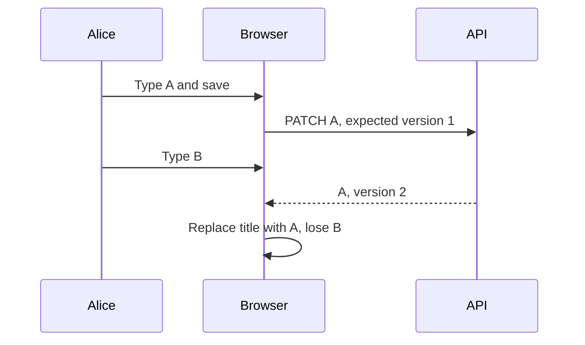
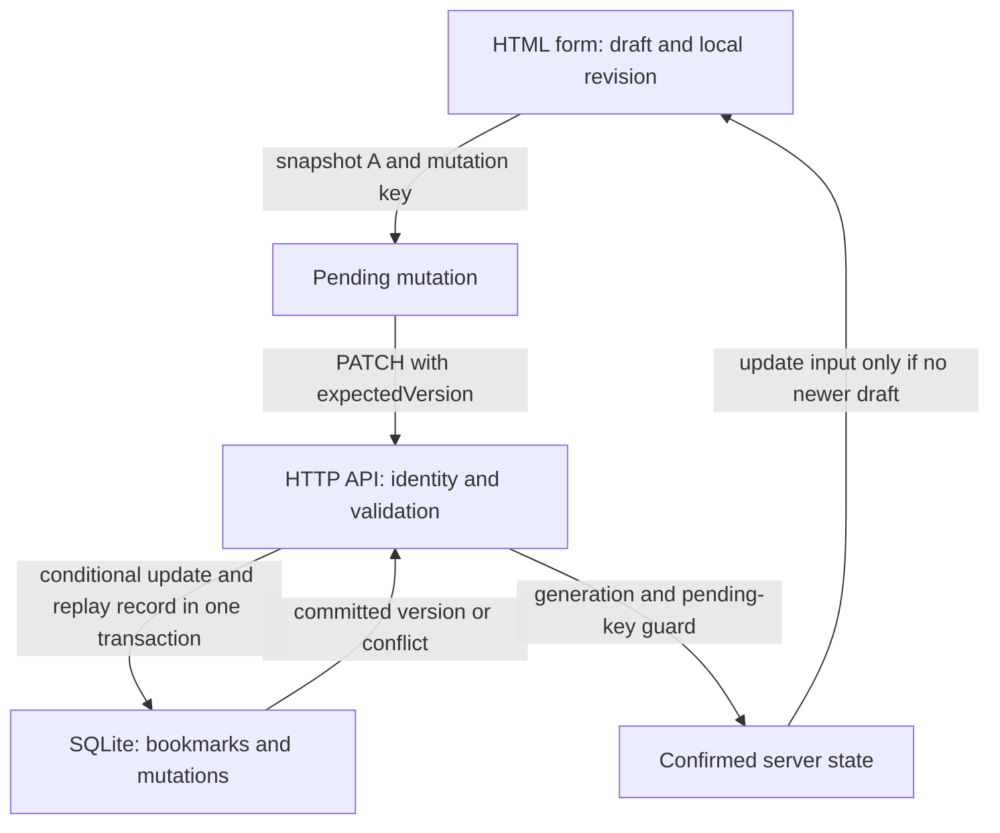
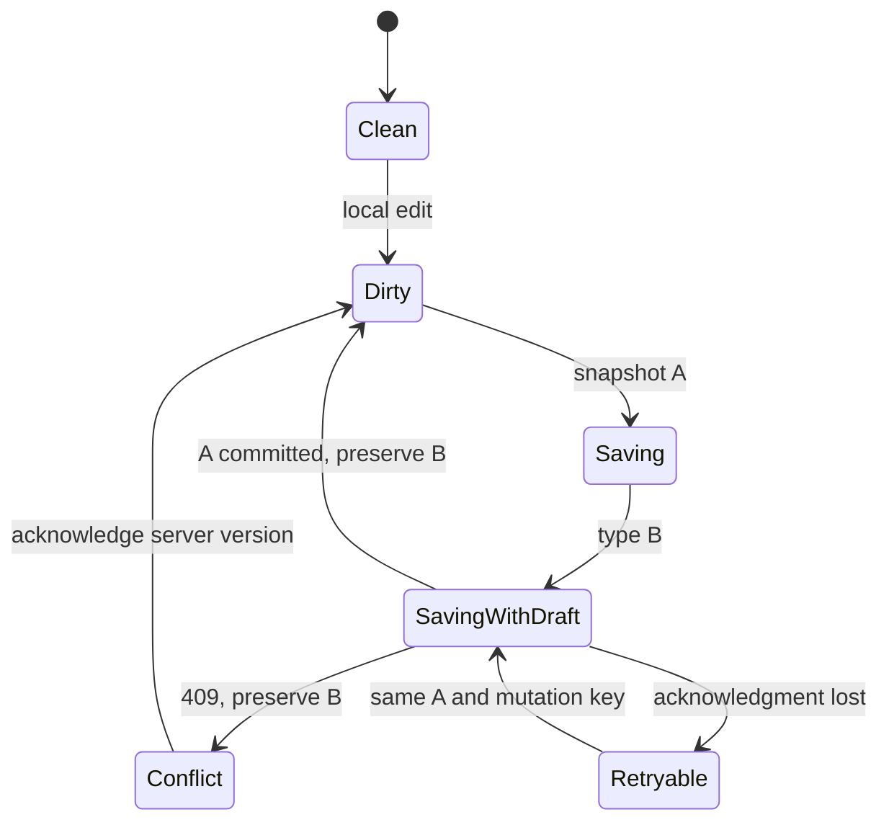

# Bookmark editor · preserve the user's next edit

[Curriculum](../../../../README.md) · [Frontend and full-stack integration](../../README.md)

> “Alice saves title A, then types B before the response arrives. Our current editor
> replaces B with A and says ‘Saved.’ Repair that promise across the browser, HTTP
> API and durable database. Which state belongs to the user, and which to the server?”

This is a **constructed runnable reference vertical slice**, not an AWS deployment.
For an independent attempt, start with [the candidate brief](../../../../../practice/candidate/full-stack.md)
and keep [the assessor sheet](../../../../../practice/assessor/full-stack.md) and source closed.
Prerequisites: [search generations](../search-race/README.md),
[runtime boundaries](../../../01-backend/labs/bounded-executor/runtime.md), and the
[full-stack route](../../full-stack-practice.md).

| Contract | Worked behavior |
|---|---|
| Input | Alice edits bookmark `b`, server version 1; save A, then type B |
| Output | On success: confirmed `A/v2`, draft `B`, status “Earlier edit saved. Your newer draft is unsaved.” |
| Conflict | Another write wins first: HTTP 409 includes current server version; B stays editable and requires explicit conflict acknowledgement |
| Retry | Lost save acknowledgment reuses the same mutation key and exact A payload; one version increment |
| Pagination | Order descending `(created_at,id)`; initial tied rows `b@100,a@100` then `c@99` |
| Ownership | Alice cannot read or change Bob's `secret`; return 404 for unavailable objects |
| Scope | Edit/search/paginate existing bookmarks; no create/delete, enrichment, multi-device offline sync, or production authentication |

**Draft lifetime:** save responses, stale refetches, failures and conflict
acknowledgment preserve the current draft. This reference keeps drafts only in
memory: closing the editor, selecting another row or reloading discards unsaved
text. Those are explicit scope limits, not a promise of reload/offline durability.
A production editor must add a discard warning or durable draft storage before
promising that navigation loses nothing.

## Run locally

Python 3.10+ and Node 24+ are enough for the application. No npm dependency is required
to build the browser JavaScript; the Node build strips TypeScript syntax. From the
repository root:

```sh
cd curriculum/02-applications/03-frontend/labs/bookmark-editor
node build.mjs
python server.py --db bookmarks.sqlite3 --port 8765
```

Open `http://127.0.0.1:8765`. Stop with Ctrl+C; the SQLite file preserves edits across
server restarts. Use a different `--db` path for a fresh seeded fixture. Demonstration
tokens map to Alice/Bob on the loopback server; the visible Alice token is **not a
production authentication design**. Production login/session/CSRF/TLS and mutation-key
retention policy require a separate design. Owner/version checks are real server-side
checks; neither the browser nor a supplied owner field controls record ownership.

```sh
python -m unittest discover -s tests -p 'test_*.py' -v
python measure.py
# Browser test dependency, if not already installed:
npm install --no-save playwright
npx playwright install chromium
node tests/browser.mjs
# Optional separate strict type check, with TypeScript installed:
tsc -p tsconfig.json
```

Node syntax stripping is not a TypeScript type check. [Validation evidence](VALIDATION.md)
states exactly which checks ran. The browser tests start their own loopback server and
temporary real SQLite file. Fixtures pause responses at explicit promises, complete
them in a chosen order, or discard an acknowledgment after its actual API commit;
there are no sleep-only race assertions.

## Trace the baseline, then split state by authority

The naive baseline has one `title` variable. It cannot tell a pending server operation
from the next local revision:



Use this method on any editor: enumerate user intent, draw a two-request schedule,
name who owns each state, and move the conditional write to the authority that can
enforce it. Only then add optimistic feedback and retries. A strong candidate says,
“An acknowledgment confirms the snapshot sent, not every edit currently in the field.”

| State | Authority and purpose |
|---|---|
| `draft`, `revision` | Current local text and monotonically increasing local-edit count |
| `confirmed` | Last accepted server record and its version |
| `pending` | Exact mutation key, title snapshot, revision sent and expected server version |
| `generation` | Editor lifetime; select/close invalidates prior asynchronous work |
| `searchGeneration` | Search request ordering; unrelated to bookmark versions |



[HTML](web/index.html) supplies named controls, a live status region and explicit focus
destinations. [TypeScript](web/app.ts) owns view state and request generations.
[HTTP router](server.py) validates runtime JSON and resolves demonstration identity.
[Schema](schema.sql) defines the durable authority: primary bookmark ID, owner, positive
version, bounded title, and owner/mutation-key uniqueness. A conditional SQL update
and idempotency response commit in one transaction, so the same successful request
can return its original response without incrementing twice. Every response,
including conflicts and replays, is sent **after** the transaction closes.

Titles accept 1–200 Unicode code points, including accented text and emoji;
whitespace-only titles, C0/C1 controls (including NUL/newline), and lone surrogates
return structured 400 before SQL. This is not a byte or grapheme count. Unsupported
input changes neither bookmarks nor replay rows. Other database faults are not
all mislabeled as retryable lock contention. The schema is for fresh lab databases;
existing files need an explicit migration to adopt its additional NUL constraint.

## Follow-up 1 · B exists when A conflicts

Predict the field, server copy and keyboard focus after another client writes version 2
before A. **Expected answer:** field B remains; server copy becomes the conflict's
current version; focus moves to “Keep draft and use server version.” Enter acknowledges
the conflict and returns focus to the title; the next save creates a new mutation at
the displayed version. A 409 is a business outcome, not a transport retry of the stale
expected version. Unsaved text is never replaced merely because it has a lower version.



## Follow-up 2 · old refetch, duplicate response, or disposal

An old GET at v1 arrives after save v2. **Expected:** it cannot lower confirmed state
or overwrite an unsaved draft. A lost PATCH acknowledgment is retried with the original
key and payload; duplicate success confirms the original operation once. Closing the
editor invalidates its generation, aborts requests, hides the form and returns focus
to its opening row. Tests also use a transport that ignores abort: cancellation saves
work when honored, while generation checks protect correctness regardless.

Search has independent loading/empty/error/retry states, a generation guard, and
stable tied-cursor pagination. Error and conflict flows can be completed by keyboard.
The browser checks verify labels, live-region attributes and focus, not a claim of a
complete screen-reader usability audit. Changing lists may remove the original opener;
close then returns focus to search.

## Follow-up 3 · measure before adding a cache

The [measurement program](measure.py) seeds 100,000 real SQLite rows, 90% under Alice,
with ten rows per timestamp. It compares the exact same page result before and after
the schema's `(owner_id,created_at DESC,id DESC)` index. On the recorded local run,
median of 15 warm queries fell from 19.855 ms (scan plus temporary sort) to 0.030 ms
(index seek). This justifies one specific improvement: the composite index. These
numbers are not end-to-end latency or a production SLO. Index storage and write work
increase; `%substring%`-style title search still examines candidate rows and may
need a separate full-text search design at larger scale. No gratuitous memoization
or cache is claimed as an optimization.

Senior evidence: independently reproduce and repair one race, explain server owner and
version enforcement, and demonstrate keyboard/error recovery. Lead scope adds old/new
client contract compatibility, idempotency-key retention, conflict/error metrics and
rollout ownership. Complete a changed, held-back version on another day before claiming
the curriculum gate. Reference tests prove reference behavior, not learner mastery.
